## 流处理模型
DataSource --> Transformation --> Sink
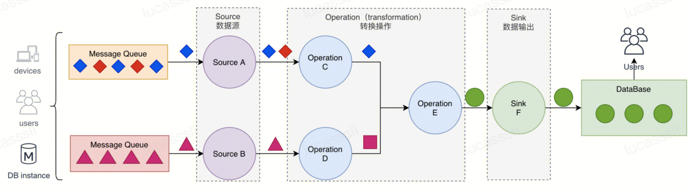

## 分布式流处理模型
将Opetator分布式部署，多个operator并行处理数据
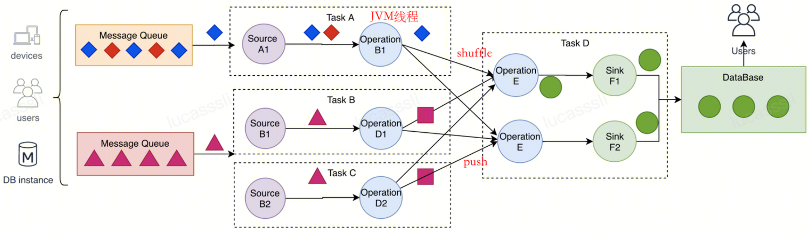
数据从上一个operator直接push到下一个operator中。通过指定物理分组操作来规定数据在上下游间传递的方式。
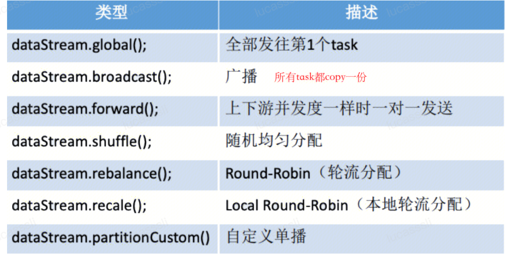


## DataStream API
## 层次
DataStream API基于Stateful Stream Processing进行了一层封装，提供了例如Aggregation等现成API调用。
且位于Table API和SQL API的下层。Table和SQL API高度封装，屏蔽Flink编程细节。
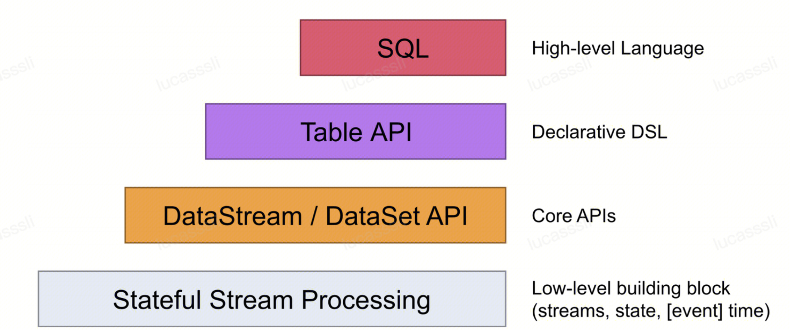
## API Language Support
- Python
- Java
- Scala
## DataSource
### 基本数据源
- fromCollection, 基于Java Collection作为数据源
- socketTextStream，读取socket数据作为数据源
- readFile，读取文件作为数据源
...
### 数据源连接器
首先创建连接器实例，设置好schema方法和连接参数后，通过addSource添加到Flink数据源，通过addSink添加到Flink数据输出
`schema`方法的使用：可以直接在创建连接器实例的时候，指定schema方法，该方法主要实现序列化和反序列化。例如把kafka输入的string反序列化为JsonObject或者Java类作为数据源，把Java类序列化成byte切片输出到kafka。schema需要实现DeserializationSchema，SerializationSchema两个接口方法。
已经实现的数据源连接器，区分source和sink
- Kafka（source/sink）
- Es（sink）
....

## 时间属性
setStreamTimeCharacteristic设置事件属性
默认processTime，可以显示的设置为eventTime

## Transformation
DataStream API中的Transformation主要分为五类。并且随着Transformation的发生，DataStream也将发生类型变化
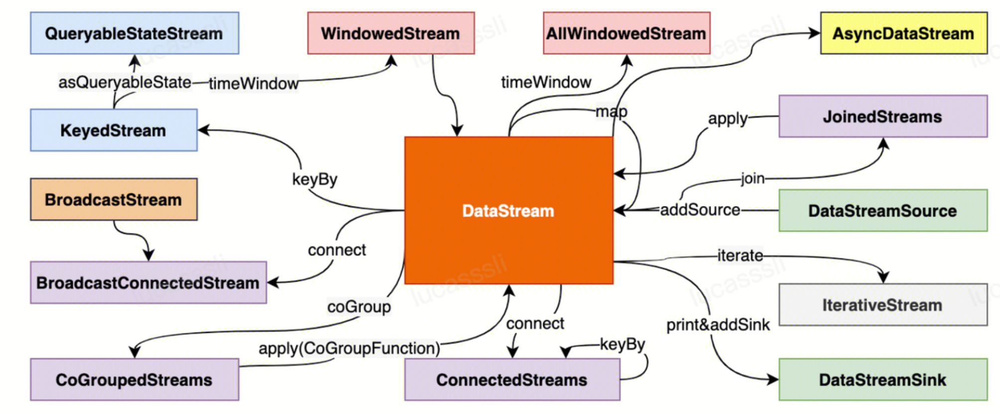
### 基于单条记录的处理
**DataStream ---> DataStream**
#### map
`map` 算子对一个 `DataStream` 中的每个元素使用用户自定义的map函数进行处理，每个输入元素对应一个输出元素
#### filter
`filter` 算子对每个元素进行过滤，过滤的过程使用一个filter函数进行逻辑判断。对于输入的每个元素，如果filter函数返回True，则保留，如果返回False，则丢弃。
#### flatmap
`flatMap` 算子和 `map` 相似，输入都是数据流中的每个元素，与之不同的是， `flatMap` 的输出可以是零个、一个或多个元素。
### 基于Key的处理
**DataStream ---> KeyedStream**

#### keyBy
按指定的Key对数据重分区。将同一Key的数据放到同一个分区，中间存在shuffle过程。每个分区对应一个下游operator。
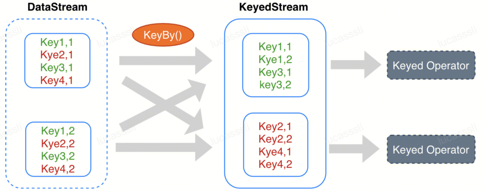

### 基于window的处理
**DataStream ---> AllWindowedStream**

**KeyedStream --> WindowedStream**

在没有边界的流式数据中，进行全局计算是不现实的，因此基于窗口的计算必不可少。
#### 时间的概念
Flink中有三种时间的概念，分别是eventTime, ingressTime, processTime
基于eventTime的情况下，事件到达的顺序可能会和事件发生的顺序不一致。Flink允许延迟统计迟到的事件，该功能是通过WaterMark实现的。当WaterMark大于窗口的边界时，才将窗口内的统计结果输出（增量模型）或者才开始统计该窗口内的事件（processFunction）。
当新事件的eventTime - maxOutOfOrder >= 上一个waterMark时，会产生新的waterMark。当waterMark大于窗口的边界时，触发计算或输出。
`waterMark允许乱序（迟到）的事件在一个窗口的进行统计`，但是当eventTime < waterMark时，表示该事件到来太晚，将被丢弃。
#### 应用场景
- 聚合统计
- 记录合并
- 双流join
#### 窗口计算细节
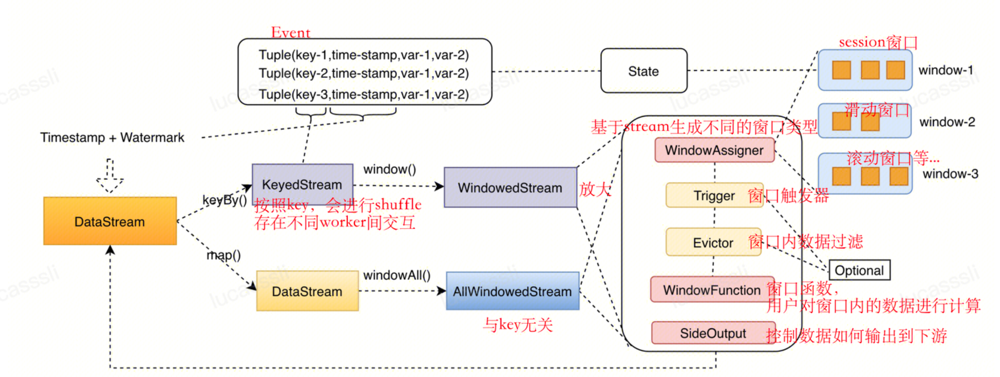
窗口计算包含了windowAssigner , Trigger , Evictor , WindowFunction , SideOutPut 组件XQQ
##### windowAssigner
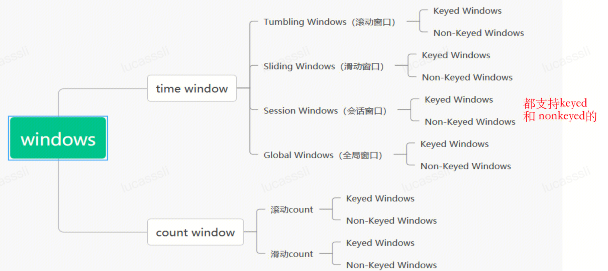
##### Trigger
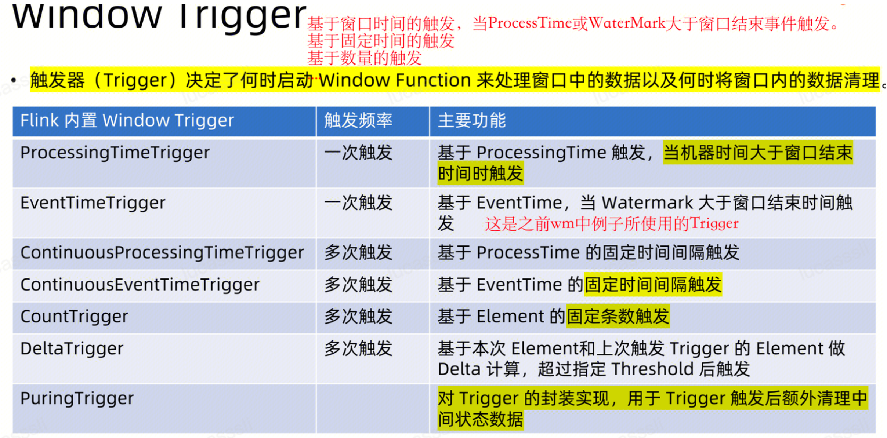
##### Evictor
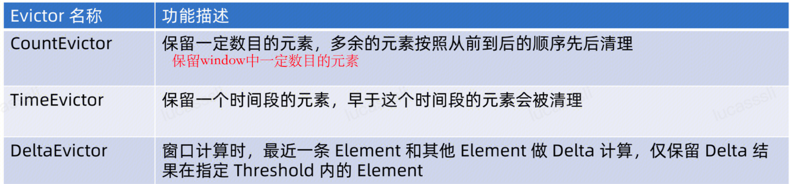
##### WindowFunction
- **增量聚合** 

	reduce: RedceFunction的算子是reduce()，使用reduce算子时，我们要重写一个Reduce Function。ReduceFunction用于指明如何将输入流中的两个元素组合在一起来生成一个相同类型的输出元素。Flink使用ReduceFunction增量地聚合窗口中的元素。可以用于计算SUM/MIN/MAX等函数

	aggregation：维护一个中间状态，可以用于计算AVG函数

	fold : 带初始值的reduce

- **全量聚合** 


	process : 自定义窗口处理函数，将在下面细讲。

**增量聚合和全量聚合对比：**
1、增量聚合执行非常高效，因为Flink可以在每个元素到达窗口时增量的聚合这些元素。
但是增量聚合缺少窗口 的meta元数据信息。
2、全量聚合执行效率很低，因为在调用函数之前Flink必须在内部缓存窗口中的所有元素。
但是ProcessWindowFunction持有一个窗口中包含的所有元素的Iterable对象，以及元素所属窗口的附加meta信息。【可以实现对窗口内的数据进行排序等需求】

**增量+全量聚合函数结合：（推荐，也常用）**
我们可以将ProcessWindowFunction和ReduceFunction,AggregateFunction, 或者FoldFunction函数结合来缓解这个问题，从而可以让窗口增量聚合以及获取ProcessWindowFunction接收的窗口meta数据。
### 多流关联
用于合并两天流的数据，以达到互相补充的目的。类似SQL中的Join函数。分为window join和interval join两种不同类型的join方式。
#### window join
基于窗口的合并，将处于同个窗口内的两个流事件组合
#### interval join
当前流事件的时间范围内另一条流事件进行组合

### process function
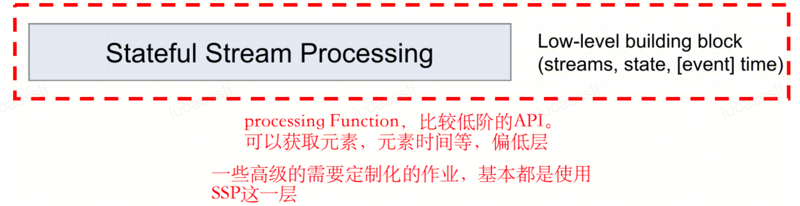
process function是全量聚合函数，相比于增量聚合函数，process function维护了窗口元数据，保存了窗口内的事件元素。process function主要提供了三个接口功能：1.事件流中，对每个事件的处理方法。2.定时器，定时触发函数。3.状态维护，维护state状态，保证一致性和容错性。

- 事件处理方法 processElement 定义对单个事件的处理方法
- 定时器 onTimer 定义定时器到达的处理方法
- 状态 open 定义从context中读取state的方法

#### 实例：

- 需求：
记录每个传入的Key的counts数量，如果指定的Key在最近100ms没有接收到任何Element，则输出ket/count键值对
- DataStream API
```java

// 存储到state的data type
public class CountWithTimestamp{
    public String key;
    public long conut;
    public long lastModified;
}

// 对一个keyedStream使用processfunction，processfunction为：CountWithTimeoutFunction
DataStream<Tuple2<string,long>> result = stream.keyBy(0).process(new CountWithTimeoutFunction())
```


- ProcessFunction : CountWithTimeoutFunction

	1.定义state变量 并重写open函数
	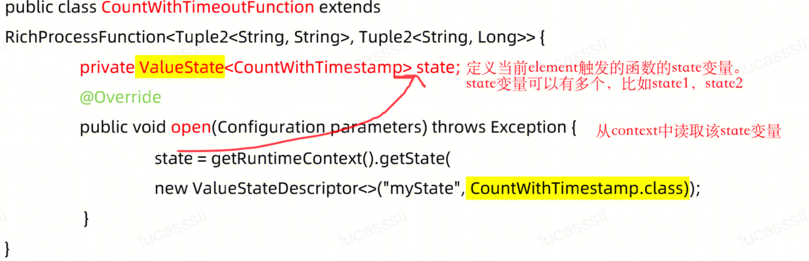


	2.重新processElement函数
	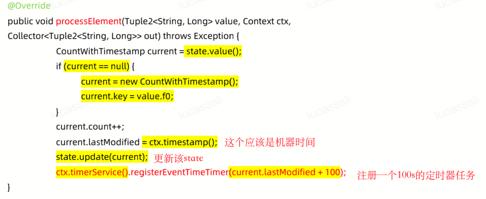

	3.注册定时任务
	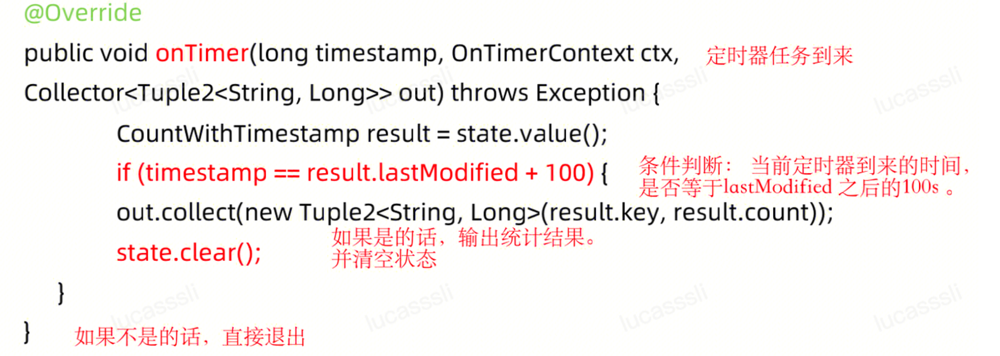
