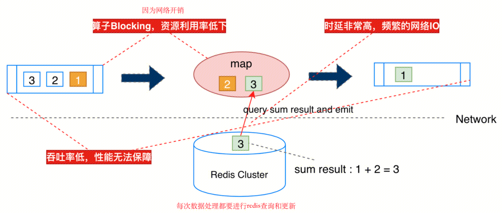
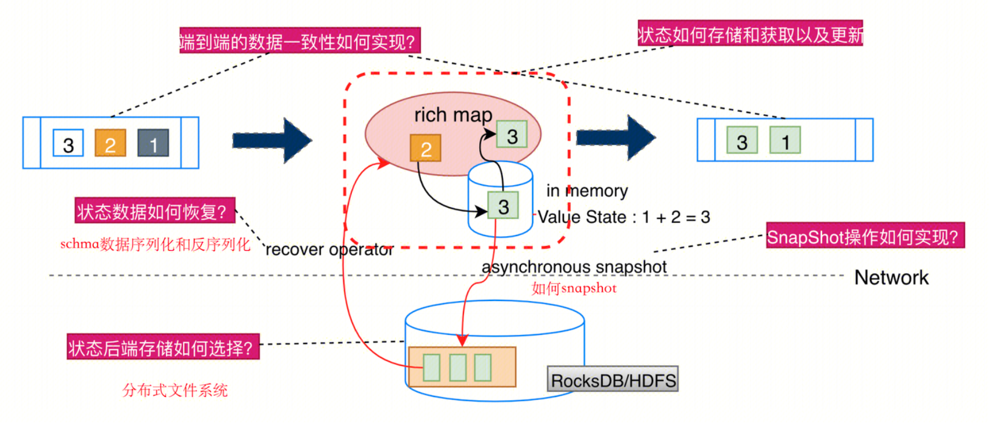
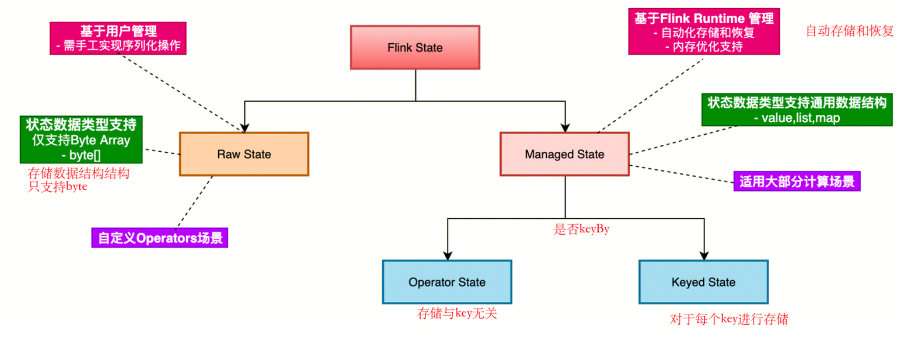
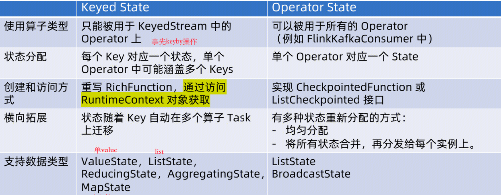
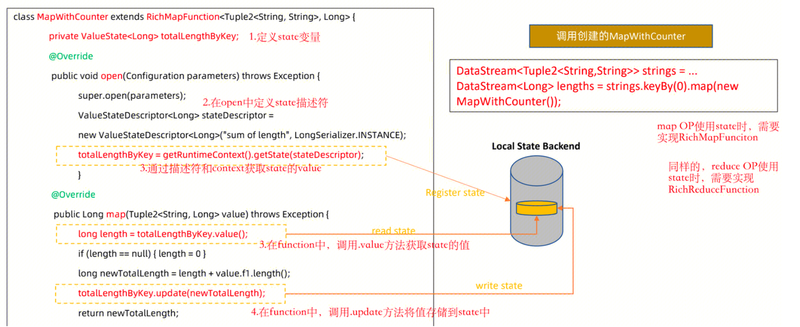
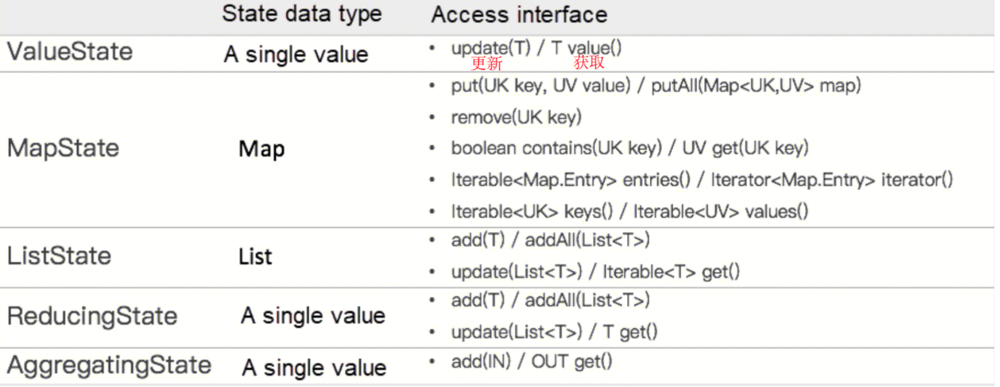

## 有状态计算
传统的流计算框架，采用计算和存储分离，并通过网络互通的方式来保存中间状态。触发窗口计算时，针对每个事件，都需要通过网络访问外部存储来获取之前的计算状态，这可能导致大量的网络开销，阻塞了算子的运算效率。

Flink通过在内存中保存state，并进行checkpoint持久化的方式来存储。触发窗口计算时，针对每个事件，只需要读取内存保存的state就可以得到算子的中间计算状态。减少了网络开销，提高了中间状态读取的效率。但是也带来了一些棘手的问题，比如一致性如何实现？状态如何存储获取更新恢复？snapshot如何实现？状态存储方式如何选择？下面的文章将回答这些问题。

## 状态类型
状态类型分为Raw State和Managed State
Raw State需要用户自行管理State
Managed State由Flink自动管理，并进行了一些内存优化。本文主要介绍Managed State

### Manged State
Manged State分为Keyed State 和 Operator State
Keyed State指，在算子中为每个key维护一个state。Keyed State要重写RichFunction，并通过RuntimeContext来获取state。比如增量算子map，需要重写mapRichFunction，并重写open和map两个方法。
Operator State指，算子不区分key来保存state。Operator state要重写checkpointedfunction。方法重写将在后续的部分详细讲解。

### keyed state

keyed state提供的state类型和方法如下：

## checkpoint和savepoint
### checkpoint过程
checkpoint通过`env.enableCheckPoint(interval)`来执行每次自动保存checkpoint的时间间隔。
checkpoint采用异步屏障快照算法来保存state到文件系统。算法细节如下：
1.Job Manager的CheckPoint Coordinator发起持久化过程
2.CheckPoint Coordinator向所有的source节点发起RPC调用，触发checkpoint持久化
3.source节点收到RPC调用，一是需要生成并向下游广播barrier(屏障)。二是需要将自己的state异步写入到持久化存储。三是需要将持久化数据的地址返回给JM的CheckPoint Coordinator。
4.下游节点受到barrier事件时，和source一样。传递barrier、持久化存储state、返回地址给JM。
5.直到sink节点收到barrier事件并持久化后，JM的checkpoint会将本次completed checkpoint meta也持久化。
### checkpoint barrier aligen
- barrier aligen : 当当前节点有两个输入的时候，需要得到两个输入的barrie都到达才能开始持久化等后续操作。这将导致算子无法消费当前流的数据，阻塞算子计算。等到barrier到来的过程，称之为barrier aligen。
- barrier unaligen : 缓存迟来的barrier之前的数据。来实现不阻塞算子。
