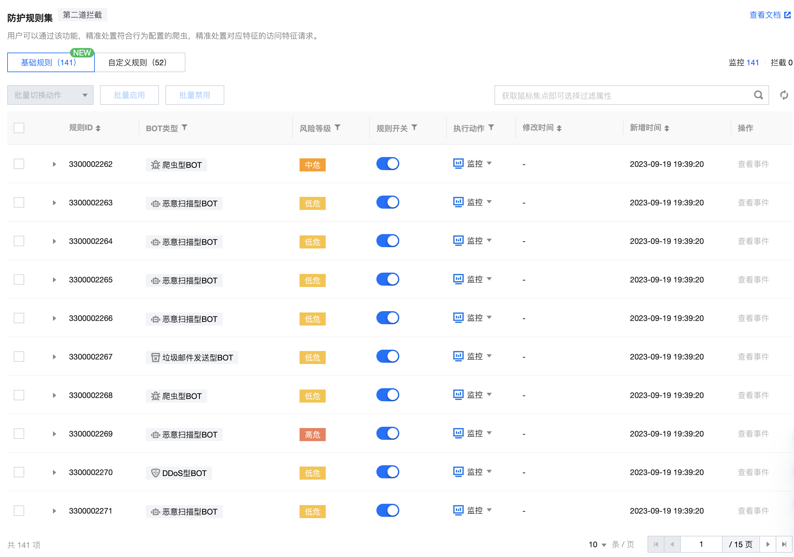

# BOT规则引擎

## 规则内容




## 代码阅读
### 重要的对象
- feature
```golang

type CelFeatures struct {
	state         protoimpl.MessageState
	sizeCache     protoimpl.SizeCache
	unknownFields protoimpl.UnknownFields

	Appid     uint64                         `protobuf:"fixed64,1,opt,name=appid,proto3" json:"appid,omitempty"`
	Host      string                         `protobuf:"bytes,2,opt,name=host,proto3" json:"host,omitempty"`
	Url       string                         `protobuf:"bytes,3,opt,name=url,proto3" json:"url,omitempty"`
	UserAgent string                         `protobuf:"bytes,4,opt,name=user_agent,json=userAgent,proto3" json:"user_agent,omitempty"`
	// headers头部参数，统一放在这里
    Headers   map[string]string              `protobuf:"bytes,5,rep,name=headers,proto3" json:"headers,omitempty" protobuf_key:"bytes,1,opt,name=key,proto3" protobuf_val:"bytes,2,opt,name=value,proto3"` 
	// 特征提取工程生成的规则
    Features  *executor_aistatistic.Features `protobuf:"bytes,6,opt,name=features,proto3" json:"features,omitempty"`                                                                                       
}

type Features struct {
	state         protoimpl.MessageState
	sizeCache     protoimpl.SizeCache
	unknownFields protoimpl.UnknownFields

	CookieRepeat      float32          `protobuf:"fixed32,1,opt,name=cookie_repeat,json=cookieRepeat,proto3" json:"cookie_repeat,omitempty" structs:"cookie_repeat"`                                                             //COOKIE：COOKIE重复比
	CookieMaxItemRate float32          `protobuf:"fixed32,2,opt,name=cookie_max_item_rate,json=cookieMaxItemRate,proto3" json:"cookie_max_item_rate,omitempty" structs:"cookie_max_item_rate"`                                          //COOKIE：COOKIE最大值占比
	CookieKindNums    int32            `protobuf:"varint,3,opt,name=cookie_kind_nums,json=cookieKindNums,proto3" json:"cookie_kind_nums,omitempty" structs:"cookie_kind_nums"`                                                      //COOKIE：COOKIE种类
	CookieAbuse       bool             `protobuf:"varint,4,opt,name=cookie_abuse,json=cookieAbuse,proto3" json:"cookie_abuse,omitempty" structs:"cookie_abuse"`                                                                 //COOKIE：COOKIE滥用
	CookieValidRate   float32          `protobuf:"fixed32,5,opt,name=cookie_valid_rate,json=cookieValidRate,proto3" json:"cookie_valid_rate,omitempty" structs:"cookie_valid_rate"`                                                  //COOKIE：COOKIE存在比
	CookieCount       int32            `protobuf:"varint,6,opt,name=cookie_count,json=cookieCount,proto3" json:"cookie_count,omitempty" structs:"cookie_count"`                                                                 //COOKIE：新增
	UaRepeat          float32          `protobuf:"fixed32,7,opt,name=ua_repeat,json=uaRepeat,proto3" json:"ua_repeat,omitempty" structs:"ua_repeat"`                                                                         //UA：UA重复比
	UaKindNums        int32            `protobuf:"varint,8,opt,name=ua_kind_nums,json=uaKindNums,proto3" json:"ua_kind_nums,omitempty" structs:"ua_kind_nums"`                                                                  //UA：UA种类
	UaValidRate       float32          `protobuf:"fixed32,9,opt,name=ua_valid_rate,json=uaValidRate,proto3" json:"ua_valid_rate,omitempty" structs:"ua_valid_rate"`                                                              //UA：UA存在比
	UaKindRandomRate  float32          `protobuf:"fixed32,10,opt,name=ua_kind_random_rate,json=uaKindRandomRate,proto3" json:"ua_kind_random_rate,omitempty" structs:"ua_kind_random_rate"`                                            //UA：UA随机性指数
	UaMaxItemRate     float32          `protobuf:"fixed32,11,opt,name=ua_max_item_rate,json=uaMaxItemRate,proto3" json:"ua_max_item_rate,omitempty" structs:"ua_max_item_rate"`                                                     //UA：新增
	AvgSpeed          float32          `protobuf:"fixed32,12,opt,name=avg_speed,json=avgSpeed,proto3" json:"avg_speed,omitempty" structs:"avg_speed"`                                                                        //会话特征：会话平均速度，动态特征
	RobotsExist       bool             `protobuf:"varint,13,opt,name=robots_exist,json=robotsExist,proto3" json:"robots_exist,omitempty" structs:"robots_exist"`                                                                //会话特征：会话存在Robots.txt
	ReqUrlRepeat      float32          `protobuf:"fixed32,14,opt,name=req_url_repeat,json=reqUrlRepeat,proto3" json:"req_url_repeat,omitempty" structs:"req_url_repeat"`                                                          //请求特征：URL重复比
	ReqUrlKind        int32            `protobuf:"varint,15,opt,name=req_url_kind,json=reqUrlKind,proto3" json:"req_url_kind,omitempty" structs:"req_url_kind"`                                                                 //请求特征：URL种类
	UrlMaxLevel       int32            `protobuf:"varint,16,opt,name=url_max_level,json=urlMaxLevel,proto3" json:"url_max_level,omitempty" structs:"url_max_level"`                                                              //请求特征：URL最大深度
	UrlMinLevel       int32            `protobuf:"varint,17,opt,name=url_min_level,json=urlMinLevel,proto3" json:"url_min_level,omitempty" structs:"url_min_level"`                                                              //请求特征：URL最小深度
	ReqQueryRepeat    float32          `protobuf:"fixed32,18,opt,name=req_query_repeat,json=reqQueryRepeat,proto3" json:"req_query_repeat,omitempty" structs:"req_query_repeat"`                                                    //请求特征：参数重复比
	QueryKind         int32            `protobuf:"varint,19,opt,name=query_kind,json=queryKind,proto3" json:"query_kind,omitempty" structs:"query_kind"`                                                                      //请求特征：参数种类，注意后续key是否会变化
	QueryCount        int32            `protobuf:"varint,20,opt,name=query_count,json=queryCount,proto3" json:"query_count,omitempty" structs:"query_count"`                                                                   //请求特征：参数个数，注意后续key是否会变化
	ReferRepeat       float32          `protobuf:"fixed32,21,opt,name=refer_repeat,json=referRepeat,proto3" json:"refer_repeat,omitempty" structs:"refer_repeat"`                                                               //Referer：重复比
	ReferAbuse        bool             `protobuf:"varint,22,opt,name=refer_abuse,json=referAbuse,proto3" json:"refer_abuse,omitempty" structs:"refer_abuse"`                                                                   //Referer：是否滥用
	ReferKindNums     int32            `protobuf:"varint,23,opt,name=refer_kind_nums,json=referKindNums,proto3" json:"refer_kind_nums,omitempty" structs:"refer_kind_nums"`                                                        //Referer：种类
	ReferCount        int32            `protobuf:"varint,24,opt,name=refer_count,json=referCount,proto3" json:"refer_count,omitempty" structs:"refer_count"`                                                                   //Referer：新增
	ReferValidRate    float32          `protobuf:"fixed32,25,opt,name=refer_valid_rate,json=referValidRate,proto3" json:"refer_valid_rate,omitempty" structs:"refer_valid_rate"`                                                    //Referer：存在比
	ReferMaxItemRate  float32          `protobuf:"fixed32,26,opt,name=refer_max_item_rate,json=referMaxItemRate,proto3" json:"refer_max_item_rate,omitempty" structs:"refer_max_item_rate"`                                            //Referer：最大值占比
	Nums              int32            `protobuf:"varint,27,opt,name=nums,proto3" json:"nums,omitempty" structs:"nums"`                                                                                                 //会话特征：会话总次数，动态特征
	SessionDuration   float32          `protobuf:"fixed32,28,opt,name=session_duration,json=sessionDuration,proto3" json:"session_duration,omitempty" structs:"session_duration"`                                                   //会话特征：会话持续时间
	Status            map[string]int32 `protobuf:"bytes,29,rep,name=status,proto3" json:"status,omitempty" protobuf_key:"bytes,1,opt,name=key,proto3" protobuf_val:"varint,2,opt,name=value,proto3" structs:"status"`     //状态码，类似200、404，还有一个特殊的状态码total代表所有的状态码
	Method            map[string]int32 `protobuf:"bytes,30,rep,name=method,proto3" json:"method,omitempty" protobuf_key:"bytes,1,opt,name=key,proto3" protobuf_val:"varint,2,opt,name=value,proto3" structs:"method"`     //请求方法，类似GET、POST，还有一个特殊的状态码total代表所有的方法
	Protocal          map[string]int32 `protobuf:"bytes,31,rep,name=protocal,proto3" json:"protocal,omitempty" protobuf_key:"bytes,1,opt,name=key,proto3" protobuf_val:"varint,2,opt,name=value,proto3" structs:"protocal"` //请求协议，类似1.0、1.1，还有一个特殊的状态码total代表所有的协议
	CompanionIp       int32            `protobuf:"varint,32,opt,name=companion_ip,json=companionIp,proto3" json:"companion_ip,omitempty" structs:"companion_ip"`                                                                //会话ID下的IP个数
	ReferMaxItem      string           `protobuf:"bytes,33,opt,name=refer_max_item,json=referMaxItem,proto3" json:"refer_max_item,omitempty" structs:"refer_match"`                                                            //请求最多的referer
	UrlMaxItem        string           `protobuf:"bytes,34,opt,name=url_max_item,json=urlMaxItem,proto3" json:"url_max_item,omitempty" structs:"url_match"`                                                                  //请求最多的URL
	UaMaxItem         string           `protobuf:"bytes,35,opt,name=ua_max_item,json=uaMaxItem,proto3" json:"ua_max_item,omitempty" structs:"ua_match"`                                                                     //请求最多的UA
	ParamMaxItem      string           `protobuf:"bytes,36,opt,name=param_max_item,json=paramMaxItem,proto3" json:"param_max_item,omitempty" structs:"param_match"`                                                            //请求最多的参数
}
```

- Server
```golang

type BotIdRequestServiceImpl struct {
	RuleSvr CustomRuleSvr
	Pool    *ants.PoolWithFunc
}

type CustomRuleSvr struct {
	CelSvr *CelSvr
	req    *pb.BOTIDRequest
}

type CelSvr struct {
	Lock           sync.RWMutex
	RuleScript     map[string]cel.Program
	ExcludeMap     map[string][]string             // <bot_id - 互斥bot_id列表>
	FeatureMap     map[string][]repo.CombineEntity // <必备特征 - bot_id>
	BotIdRules     map[string]repo.BotIdRuleEntry
	SortedRules    map[string]repo.BotIdSortedSlice // bot_id的排序
	FeatureFilters FeatureFilter
}


type BotIdRuleEntry struct {
	Id        string `json:"id"`
	Name      string `json:"name"`
	BiocsId   string `json:"biocs_id"`
	Rule      string `json:"rule"`
	RiskLevel int64  `json:"risk_level"`
	BotIdType string `json:"bot_id_type"`
	State     string `json:"state"`
	Timestamp int64  `json:"timestamp"`
	Region    string `json:"region"` //逗号分隔，用于灰度控制；all-表示全灰
	AppId     string `json:"appid"`  //逗号分隔，用于灰度控制；all-表示全灰
}

```

- Task
```golang
type Task struct {
    // fmt.Sprintf("%d_%s_%s", req.Appid, req.Host, req.SceneId)
	Key     string
	Handler *CelSvr
	Feature *pb.CelFeatures
	Rsp     *pb.BOTIDReply
	Wg      *sync.WaitGroup
}


```


- BotIdCheck 检测主体
