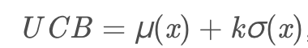

## 理论
在一个量化策略中，止盈比例、止损比例、指标参数等都可以看作是超参数。如何寻找最优的参数，是一个超参数调优的问题。

超参数调优，Grid search和Random search比较普通和效果的方法，尤其是单epoll执行较为耗时的情况下，这两种方法的复杂度比较高。
策略回测，往往是一个比较消耗计算资源的过程，利用Bayesian Optimization调参是更智能的方法。

首先贝叶斯优化用到了贝叶斯公式，它要求已经存在几个样本点，并且通过高斯过程回归（假设超参数间符合联合高斯分布）计算前面n个点的后验概率分布，得到每一个超参数在每一个取值点的期望均值和方差，其中均值代表这个点最终的期望效果，均值越大表示模型最终指标越大，方差表示这个点的效果不确定性，方差越大表示这个点不确定是否可能取得最大值非常值得去探索。


从曲线可以看出，中间的点均值较大，而且方差也比较大，很有可能这个点的超参数可以训练得到一个效果指标好的模型。

那为什么要选均值大和方差大的点呢？因为前面提到均值代表期望的最终结果，当然是越大越好，但我们不能每次都挑选均值最大的，因为有的点方差很大也有可能存在全局最优解，因此选择均值大的点我们成为exploritation（开发），选择方差大的点我们称为exploration（探索）

那么究竟什么时候开发什么时候探索，并且开发和探索各占多少比例呢？不同的场景其实是可以有不同的策略的，例如我们的模型训练非常慢，只能再跑1组超参数了，那应该选择均值较大的比较有把握，如果我们计算力还能可以跑1000次，那么就不能放弃探索的机会应该选择方差大的，而至于均值和方差比例如何把握，这就是我们要定义的acquisition function(采集函数)了。acquisition function是一个权衡exploritation和exploration的函数.
最简单的acquisition function就是均值加上n倍方差（Upper condence bound算法），这个n可以是整数、小数或者是正数、负数，更复杂的acquisition function还有Expected improvement、Entropy search等等。



在原来的图上加上acquisition function曲线，`然后我们求得acquisition function的最大值，这是的参数值就是贝叶斯优化算法推荐的超参数值`，是根据超参数间的联合概率分布求出来、并且均衡了开发和探索后得到的结果。


因此如果我们使用贝叶斯优化，那么我们下一个点就取中间偏左的点，使用这个点代表的超参数来训练模型，并且得到这个模型在这住超参数组合下的效果指标。有了新的指标，贝叶斯优化模型的样本就从3个变成了4个，这样可以重新计算超参数之间的后验概率分布(GP高斯回归过程)和acquisition function，效果如下图。


从均值和方差曲线看出，目前右边的点均值不低，并且方差是比较大，直观上我们认为探索右边区域的超参数是“很可能”有价值的。从acquisition function曲线我们也可以看出，右边的点在考虑了开发和探索的情况下有更高的值，因此我们下一个超参数推荐就是右边星号的点。然后我们使用推荐的超参数继续训练，得到新的模型效果指标，加入到高斯过程回归模型里面，得到新的均值-方差曲线和acquisition function曲线。


总结起来，beyasian优化的过程如下：


## 实践
在freqtrade中，通过skopt.Optimizer进行bayesain优化 止盈止损技术指标 超参数。

### 1.定义搜索空间

```python
minimal_roi = {
        "0": 0.1
    }
stoploss =  -0.1
n1 = IntParameter(5, 15, default=10, space="buy")
n2 = IntParameter(15, 25, default=21, space="buy")
rollWindow = IntParameter(2, 6, default=4, space="buy")
adxWindow = IntParameter(7, 21, default=24, space="buy")
adxThr = IntParameter(15, 35, default=25, space="buy")
emaThr = IntParameter(5, 55, default=24, space="buy")


self.dimensions = (self.buy_space + self.sell_space + self.protection_space
                    + self.roi_space + self.stoploss_space + self.trailing_space
                    + self.max_open_trades_space)
logger.info(f"Hyperopt dimensions: {self.dimensions}")

Hyperopt dimensions: [Integer(low=15, high=35, prior='uniform', transform='identity'), Integer(low=7, high=21, prior='uniform', transform='identity'), Integer(low=5, high=55, prior='uniform', transform='identity'), Integer(low=5, high=15, prior='uniform', transform='identity'), Integer(low=15, high=25, prior='uniform', transform='identity'), Integer(low=2, high=6, prior='uniform', transform='identity'), Integer(low=480, high=5760, prior='uniform', transform='identity'), Integer(low=480, high=2880, prior='uniform', transform='identity'), Integer(low=480, high=1920, prior='uniform', transform='identity'), Decimal(low=0.03, high=0.122, decimals=3, prior='uniform', transform='identity'), Decimal(low=0.03, high=0.214, decimals=3, prior='uniform', transform='identity'), Decimal(low=0.03, high=0.612, decimals=3, prior='uniform', transform='identity'), Decimal(low=-0.35, high=-0.02, decimals=3, prior='uniform', transform='identity')]
```


### 2.定义优化器

```python
def get_optimizer(self, dimensions: List[Dimension], cpu_count) -> Optimizer:
    estimator =  "GP"
    acq_optimizer = "sampling"
    return Optimizer(
        dimensions, # 输入空间
        base_estimator=estimator, # beyasian估计器（联合高斯概率分布）
        acq_optimizer=acq_optimizer, # 采集函数
        n_initial_points=INITIAL_POINTS, # 初始高斯回归过程使用的点
        acq_optimizer_kwargs={'n_jobs': cpu_count},
        random_state=self.random_state,
        model_queue_size=SKOPT_MODEL_QUEUE_SIZE,
    )

```


### 3.定义损失函数
```python
self.calculate_loss = self.custom_hyperoptloss.hyperopt_loss_function


def hyperopt_loss_function(results: DataFrame, trade_count: int,
                            *args, **kwargs) -> float:

## 获取最大profit
    """
    Objective function, returns smaller number for better results.
    """
    total_profit = results['profit_abs'].sum()
    return -1 * total_profit

## 获取最大sharpe
    total_profit = trades['profit_abs'] / starting_balance
    days_period = max(1, (max_date - min_date).days)

    expected_returns_mean = total_profit.sum() / days_period
    up_stdev = np.std(total_profit)

    sharp_ratio = expected_returns_mean / up_stdev * np.sqrt(365)
    return sharp_ratio

## 支持自定义损失函数...
```

### 4.优化过程

```python
asked, is_random = self.get_asked_points(n_points=1) # 通过opt.ask获取推荐值
f_val0 = self.generate_optimizer(asked[0]) # 通过推荐值计算损失函数值
self.opt.tell(asked, [f_val0['loss']]) # 输入推荐值和损失函数值，重新进行高斯过程
self.evaluate_result(f_val0, 1, is_random[0]) # 记录当前获得的最好结果
```

## 参考

- https://www.zhihu.com/search?type=content&q=%E8%B4%9D%E5%8F%B6%E6%96%AF%E8%B6%85%E5%8F%82%E6%95%B0%E4%BC%98%E5%8C%96
- https://www.cnblogs.com/marsggbo/p/9866764.html