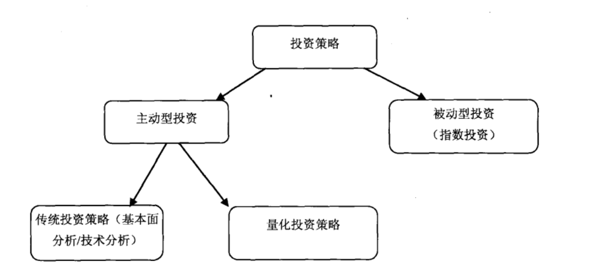
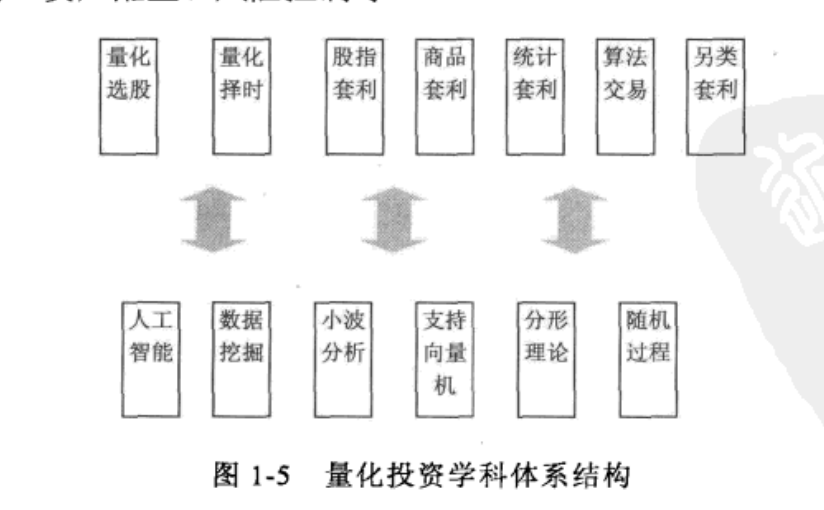

## 量化投资定义

投资策略定位：



量化投资  = 通过(计算机技术+数学模型)实现投资的目的。


相比传统投资策略，量化投资，优势在于: 

- 可回测：基于回测数据评估策略优劣
- 纪律性：计算机交易避免主观情绪
- 分散投资：相比人力，计算机可以同时交易更多的交易标的


相比量化投资，传统投资策略，劣势在于:

- 基金经理处理信息量的限制，例如处理股票数量的限制
- 认知偏差或者主观情绪作祟，难以按照计划做出决策

## 量化投资技术

### 方式

- 量化选股
- 量化择时
- 无风险套利
- 统计套利
- 算法交易
- 资产配置


### 方法

- 有效市场理论
- 机器学习/深度学习
- 随机过程
- 分型理论
- 数据挖掘
- 小波分析
- SVM




### 市场收益来源

```
Total Return = Alpha + Beta * [Market Return]
```

Market Return 市场收益

Alpha 表示投资组合相对于基准指数的超额收益，反映了模型的盈利能力。

Beta 表示投资组合收益相对于市场收益的敏感度，衡量系统性风险。如果Beta等于1，表示投资组合的收益将与市场同步波动；如果Beta大于1，表示投资组合的波动性更大；如果Beta小于1，表示投资组合的波动性更小。


### 量化选股

#### 前提 -- 因子有效性理论
市场上的投资者，不论是价值投资者还是投机者，或者短线交易，都会根据某些因子来判断股票的涨跌。当有一群交易者同时采用某个因子的时候，就会造成该因子有效。例如，当很多投资者认为底PE的价值型的股票是好的投资标的时，他们纷纷冒入低PE的股票，会使得该股票出现上涨，这样就是使得低PE这个因子的有效性得到体现。

因此因子具有时效性，部分因子长期有效，部分因子短期有效。

#### 选股

基于数据和模型挖掘有效因子。通过因子对股票评分，满足条件的股票放入股票池，不满足条件的股票剔除股票池，还可以选择通过因子评分超配或者低配股票。主流的的方法是多因子选股，涉及因子挖掘和组合优化。代表策略有股票多因子多空对冲策略。追求放大因子Alpha收益，对冲减小Beta系数。因此在市场长期下跌的情况下，也能够获取不错利润。


### 量化择时

#### 前提 -- 有效市场理论

- 弱有效市场理论： 股票价格反应了过去的交易和价格信息。包括价格、成交量、做空量、融资量。此时，技术分析失效，基本分析有效。（量价数据全市场透明，量价信息已经反映在当前的股价中了，无法通过量化分析获得超额收益。只能通过基本分析，通过分析公开财务信息获取超额收益）

- 半强有效市场理论：在弱有效理论基础上，股票价格还反应了`已公开`的公司的营收情况。包括公开财务信息、公开盈利资料、公开公司管理情况。此时，技术分析和基本分析失效，内幕交易有效。（公开财务情况对市场透明，无法通过分析公开财务信息获取超额收益，只能通过未公开的内幕消息获取收益）

- 强有效市场理论：在半强有效市场理论基础上，股票价格反映了`所有`关于公司营运的信息，包括已公开的或内部未公开的信息。此时，只能跟随市场，没有获取超额收益的方式。


#### 择时

研究表明，中国证券市场还未达到弱有效市场，历史数据对未来股票价格形成起到一定的作用。通过技术和基本分析，能够构建在一定误差之内的股票价格预测模型。基于模型预测，通过高抛低吸择时策略获取超额收益。代表策略有指数增强。追求Beta收益的同时，获取Alpha收益。


### 无风险套利

#### 前提 -- 不合理价格形成

相关的投资标的在不同地点、不同时间都应该对应一个合理的价格差价。但是由于价格的波动性，价格差价可能会超出合理区间，落入不合理范围。假设价格差价从是从不合理范围会到合理范围，此时不合理范围价格和合理范围价格就是无风险套利空间。

#### 套利

- 期现套利：利用期货和现货之间的不合理价差进行套利。
- 商品套利：利用商品间的不合理价差进行套利。

无风险套利的关键在于挖掘价格合理区间，需要对历史数据、技术、基本进行大量分析，总结规律。才能识别出不同标的间的合理价差。当超出合理价差的时候，进行无风险套利行为。


### 统计套利

#### 前提 -- 历史规律有效

统计套利是一种基于历史数据和市场统计规律进行的套利策略。它通过分析资产价格的历史数据，寻找价格关系中的统计规律，并在这些规律出现异常时进行交易，以期价格关系回归均衡时获利。


#### 套利

统计套利是有风险的套利，风险在于历史规律在未来失效。

- 协整策略：基于历史数据对股价进行建模，当股价一定程度上偏离模型时进行套利行为。
- 配对交易：找出相关性好的若干对股票，买入相对低估的股票，卖出相对高估的股票。


### 资产配置

通过量化分析，决定配置的标的和标的的权重。并对资产比例进行实时平衡。

- 行业轮动配置：配置不同行业资产，并进行平衡。
- 全球资产配置：配置全球市场资产，并进行平衡。


### 算法交易

通过计算机发出指令实现自动化交易，包括交易的时间、价格、数量等。

被动算法交易：

- 拆单交易：大额交易时，通过程序拆单，减少市场冲击和意图暴露。例如TWAP和VWAP。TWAP是等时间间隔下等量的单。VWAP是统计过去一段时间成交量分布，按照分布下单。
- 动态追踪止盈单
- 限价止盈止损单
- 网格交易订单
- DCA交易订单
- 定投交易订单

主动算法交易：

- 利用机器学习、深度学习、统计等方法构建模型，通过历史交易数据，对当前交易进行智能决策和行动。例如，通过统计历史期望，来调整交易金额。

