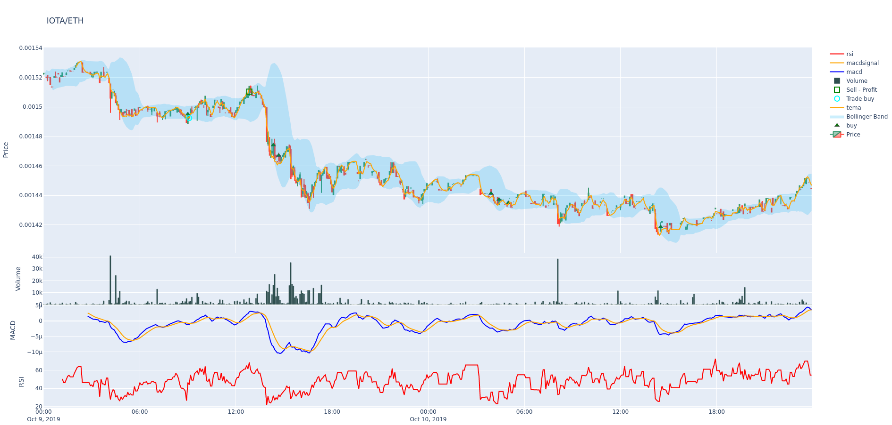

# 金三角
1. 短均上穿中均
2. 短均上穿长均
3. 中均上穿长均

2023.10.08

## 现货
### 现货交易代码
```python
# --- Do not remove these libs ---
from functools import reduce
from freqtrade.strategy import IStrategy
from freqtrade.strategy import CategoricalParameter, DecimalParameter, IntParameter
from pandas import DataFrame
# --------------------------------


#freqtrade backtesting --strategy ThreeMAStrategy --config user_data/config_backtest.json  --timerange 20220101-

import talib.abstract as ta
import freqtrade.vendor.qtpylib.indicators as qtpylib


class ThreeMAStrategy(IStrategy):
    """

    author@: Gert Wohlgemuth

    idea:
        buys and sells on crossovers - doesn't really perfom that well and its just a proof of concept
    """

    INTERFACE_VERSION: int = 3
    # Minimal ROI designed for the strategy.
    # This attribute will be overridden if the config file contains "minimal_roi"
    minimal_roi = {
        "0": 0.3
    }

    # Optimal stoploss designed for the strategy
    # This attribute will be overridden if the config file contains "stoploss"
    stoploss = -0.2

    # Optimal timeframe for the strategy
    timeframe = '4h'
    
    startup_candle_count: int = 55

    buy_range_short = IntParameter(5, 20, default=5)
    buy_range_mid = IntParameter(5, 20, default=10)
    buy_range_long = IntParameter(20, 120, default=55)
    
    plot_config = {
        'main_plot': {
            'ema1': {},
            'ema2': {},
            'ema3': {}, 
        },
     
    }

    def populate_indicators(self, dataframe: DataFrame, metadata: dict) -> DataFrame:

       
        dataframe['ema1'] = ta.EMA(dataframe, timeperiod=self.buy_range_short.value)
        dataframe['ema2'] = ta.EMA(dataframe, timeperiod=self.buy_range_mid.value)
        dataframe['ema3'] = ta.EMA(dataframe, timeperiod=self.buy_range_long.value)

        return dataframe

    def populate_entry_trend(self, dataframe: DataFrame, metadata: dict) -> DataFrame:
        """
        Based on TA indicators, populates the buy signal for the given dataframe
        :param dataframe: DataFrame
        :return: DataFrame with buy column
        """
        dataframe.loc[
            (
                qtpylib.crossed_above(
                    dataframe['ema2'],
                    dataframe['ema3']
                ) &
                (dataframe['ema1'] > dataframe['ema2'])
            ),
            'enter_long'] = 1

        return dataframe

    def populate_exit_trend(self, dataframe: DataFrame, metadata: dict) -> DataFrame:
        """
        Based on TA indicators, populates the sell signal for the given dataframe
        :param dataframe: DataFrame
        :return: DataFrame with buy column
        """
        dataframe.loc[
            (
                qtpylib.crossed_below(
                    dataframe['ema2'],
                    dataframe['ema3']
                ) &
                (dataframe['ema1'] < dataframe['ema2'])
            ),
            'exit_long'] = 1
        return dataframe

```


### 现货交易配置
```json
{
    "max_open_trades": -1,
    "stake_currency": "USDT",
    "stake_amount": 1000,
    "tradable_balance_ratio": 0.99,
    "fiat_display_currency": "USD",
    "dry_run": true,
    "dry_run_wallet": 30000,
    "cancel_open_orders_on_exit": false,
    "trading_mode": "spot",
    "margin_mode": "",
    "unfilledtimeout": {
        "entry": 10,
        "exit": 10,
        "exit_timeout_count": 0,
        "unit": "minutes"
    },
    "entry_pricing": {
        "price_side": "other",
        "use_order_book": true,
        "order_book_top": 1,
        "price_last_balance": 0.0,
        "check_depth_of_market": {
            "enabled": false,
            "bids_to_ask_delta": 1
        }
    },
    "exit_pricing":{
        "price_side": "other",
        "use_order_book": true,
        "order_book_top": 1
    },
    "exchange": {
        "name": "binance",
        "key": "",
        "secret": "",
        "ccxt_config": {},
        "ccxt_async_config": {},
        "pair_whitelist": [
            "BTC/USDT"
        ],
        "pair_blacklist": [
            "BNB/.*"
        ]
    },
    "pairlists": [
        {
            "method": "StaticPairList"
        }
    ],
    "telegram": {
        "enabled": false,
        "token": "",
        "chat_id": ""
    },
    "api_server": {
        "enabled": true,
        "listen_ip_address": "0.0.0.0",
        "listen_port": 8080,
        "verbosity": "error",
        "enable_openapi": false,
        "jwt_secret_key": "c2f52a7654042c4a18116e0b36f6f71a4c065bb3d2f741cbc165d78b45b48779",
        "ws_token": "lFqsGnoneowgkSCmUx0kJadxLNXeTnqQFw",
        "CORS_origins": [],
        "username": "",
        "password": ""
    },
    "bot_name": "freqtrade",
    "initial_state": "running",
    "force_entry_enable": false,
    "internals": {
        "process_throttle_secs": 5
    }
}

```


### 回测
