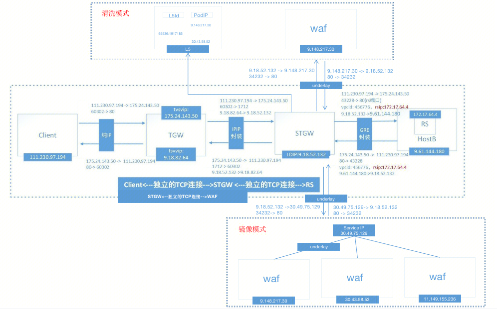

## 一、公网STGW + CLBWAF
### 1.1 清洗模式
#### STGW转发配置
``` 
---- 业务server配置 ----
server {
	...
    cc_waf_enable on; 
    cc_max_overtimes 10; # 转发给waf节点超时、错误次数超过10次则暂定转发
    cc_disable_time 30; # 暂停转发时间，和cc_max_overtimes配合使用
    cc_guard_location stgw_guard_location; 
    location stgw_guard_location{
        proxy_pass http://stgw_guard_server/;
        proxy_set_header stgw-orgreq $request;
        proxy_set_header stgw-srcip $remote_addr;
        proxy_set_header stgw-dstip $vip;
        proxy_set_header Host $http_host;
        proxy_connect_timeout 20ms;
        proxy_set_header stgw-orgservername $server_name;
        proxy_read_timeout 60ms; # 门神节点超过60ms未响应则透传
    }
}
```

```
---- 集群配置(区分地域，不同地域的l5配置不同) ----
upstream stgw_guard_server {
    hash $request_uri consistent; # 负载均衡 根据URI的一致性hash算法
    l5 sid=1917185 cid=65536 key="/" mode=0 timeout=10; # WAF提供的L5
    keepalive 16;
}
```
#### STGW NGINX代码
基于第三方模块ngx_http_cc_guard_module，发起子请求。
##### ngx_http_cc_guard_module
``` 
----- ngx_http_module_t -----
static ngx_http_module_t  ngx_http_cc_guard_module_ctx = {
    NULL,                                  /* preconfiguration */
    ngx_http_cc_guard_init,            /* postconfiguration */
    NULL,                                  /* create main configuration */
    NULL,                                  /* init main configuration */
    NULL,                                  /* create server configuration */
    NULL,                                  /* merge server configuration */
    ngx_http_cc_guard_create_conf,     /* create location configuration */
    ngx_http_cc_guard_merge_conf       /* merge location configuration */
};
```
##### ngx_http_cc_guard_init
在ngx_http_block函数中，会依次调用所有的HTTP模块的postconfiguration回调函数。
ngx_http_cc_guard_module注册的回调函数为`ngx_http_cc_guard_init`
ngx_http_cc_guard_init函数中，HTTP处理的access阶段，加入了handler：`ngx_http_cc_guard_handler`
``` 
----- ngx_http_cc_guard_init -----
static ngx_int_t ngx_http_cc_guard_init(ngx_conf_t *cf) {
	cf = ngx_http_conf_get_module_main_conf(cf, ngx_http_core_module);
	h = ngx_array_push(&cmcf->phases[NGX_HTTP_ACCESS_PHASE].handlers);
	*h = ngx_http_cc_guard_handler;
}
```

##### ngx_http_cc_guard_handler
ngx_http_cc_guard_handler在access阶段，调用ngx_http_subrequest，发起子请求。
```
ngx_http_subrequest(r,&crcf->uri,NULL,&sr,ps,NGX_HTTP_SUBREQUEST_WAITED|NGX_HTTP_SUBREQUEST_IN_MEMORY)
```

- **r** – 主请求
- **crcf->uri** – 转发URL，cc_guard_location配置的url（stgw_guard_location）。URL指向内部location，在location中使用proxy_pass将子请求发往WAF
- **sr** – 指向新请求
- **ps** – 当子请求完成后触发的回调（ngx_http_cc_guard_done），处理waf返回的结果
- **flags** – NGX_HTTP_SUBREQUEST_IN_MEMORY 在子请求完成后将子请求结果保存在内存中；


#### STGW OSS接口
接口 ：set_l7_rule.cgi

POST BODY（示例） ： 
``` 
data={"operator":"normalliu"
"set_list":["set_cc_guard_enable"] //操作对象
"service_list":[{"biz_id":"100000005395" //UIN
"biz_type":"COMMON"
"vip_list":["139.155.195.222"] // 当前CLB的VIP
"domain":"lucas0803-2.qcloudwaf.com" //域名
"vport":80
"vpcid":-1 //公网CLB VIP使用-1 
"support_net":0
"cc_guard_enable":2}]} //2 清洗模式
```
注意点: BODY里面没有L5的信息，因为提前和STGW约定好了。STGW每个地域的upstream stgw_guard_server是相同的。


### 1.2 镜像模式
#### STGW转发配置
```
upstream 697397 {
     server 30.49.72.106:80 weight=10 max_fails=3 fail_timeout=10  rs_id=1764278;
	  ...
	 server  30.47.178.169:80 weight=10 max_fails=3 fail_timeout=10  rs_id=1764278;
}
server {
	 ...
	 mirror /w4f_mirr0r_aut0_ur1l.l0cation.tencentcloudwaf;
	 mirror_request_body on;
     location /w4f_mirr0r_aut0_ur1l.l0cation.tencentcloudwaf {
          internal;
          proxy_connect_timeout 20ms;
          proxy_read_timeout 40ms;
          proxy_send_timeout 40ms;
          proxy_pass http://697397$request_uri;
     }
}
```
#### STGW NGINX代码
基于原生的ngx_http_mirror_module模块，发起镜像流量。
在precontent阶段，生成子请求，发往WAF，并且对子请求的返回值不做处理。

#### STGW OSS接口
接口 ：set_l7_rule.cgi
POST BODY :
``` 
data={"operator":"normalliu"
"set_list":["add_location"]
"service_list":[{"biz_id":"100005604621"
"biz_type":"COMMON"
"vip_list":["120.232.28.198"]
"domain":"clb-gz.testwaf.com"
"vport":80
"vpcid":-1 //公网VIP，VPCID为-1
"support_net":1
"cc_guard_enable":0
"location_list":[{"url":"/w4f_mirr0r_aut0_ur1l.l0cation.tencentcloudwaf"
"loc_type":1 //0:普通，1:mirror
"rs_list":[{"rs_ip":"30.49.72.106" "rs_port":80}...{"rs_ip":"30.47.178.169" "rs_port":80}] //clbwaf集群的内网四层代理IP
"location_customized_conf":"proxy_connect_timeout+20ms;\nproxy_read_timeout+40ms;\nproxy_send_timeout+40ms;"}]
"cdc_id":""}]}
```

### 1.3 网络通信
#### 公网应用型七层CLB
##### 网络拓扑


Client: 公网IP:111.230.97.194
VIP: vip: 175.24.143.50（公网IP） vport:80
WAF:
- 清洗模式 L5ID :  65536:1917185
- 镜像模式 vip :  30.49.75.129（内网IP） vport:80

RS：RSIP (172.17.64.4) ; 母机IP (9.61.144.180) ; VPCID(456776)


##### 通信细节

1.CLIENT发送报文到TGW，公网网络转发。
2.TGW到STGW是母机内网通信，且不涉及虚拟机，没有VPCID的概念。通过ipip封装。
3.STGW根据NGINX配置进行下一步动作。

- MIRROR（镜像模式）根据Upstream中的IP直接发送子请求到WAF。
- GUARD（清洗模式）根据L5ID解析出IP后，发送子请求到WAF。

STGW和WAF之间通信是underlay物理网络通信，使用IP直连。

4.SGTW查看转发规则，知道要转向的母机IP和VPCID之后，通过OVERLAY GRE封装（加上VPCID和RSIP）。
5.RS所在的母机收到报文，GRE解封，拿到VPCID和RSIP，查找NEIGH_TABLE，找到该RSIP对应的MAC地址后。发给该RS。

注意点：WAF的POD IP是物理网络IP（11.149.155.236，可以underlay直接通信），而非VPC网络的私有IP（需要借助overlay封装，并借助母机IP通信）。


## 二、内网STGW + CLBWAF
`与公网STGW + CLBWAF的差异点`
### 2.1. STGW OSS接口
POST BODY中，需要指定VPCID，通过VPCID + 内网CLBIP作为唯一键。
"vpcid":xxx //内网CLB所在的VPCID

### 2.2 网络通信
相比公网STGW网络拓扑，多了VPCGW。子机访问内网CLB的时候需要用到VPCGW网关。
内网或者公网STGW和WAF的通信没有差别。
#### 网络拓扑


Client: RSIP (172.17.64.14) ; 母机IP (9.52.150.112) ; VPCID(456776)
VIP: vip: 172.17.217.8（VPC内网IP） vport:80
WAF:

- 清洗模式 L5ID :  65536:1917185
- 镜像模式 vip :  30.49.75.129（内网IP） vport:80

RS：RSIP (172.17.64.4) ; 母机IP (9.61.144.180) ; VPCID(456776)

#### 通信细节


- 1. client母机 cat route_table | grep 172.17.217.8 
172.17.217.8   9.30.216.10（VPCGW母机IP）456776
告诉client母机VPCko，查询出172.17.217.8的母机为9.30.216.10。并通过GRE封装，发往VPCGW。
- 2. VPCGW收到之后，发送到TGW。
- 3.TGW继续把报文转发到STGW。GRE封装IP为TGW的内网IP（物理网路）和STGW的内网IP（物理网络）
- 4.STGW根据NGINX配置进行下一步动作。（STGW和WAF之间通信是underlay物理网络通信，使用IP直连。）
	- MIRROR（镜像模式）根据Upstream中的IP直接发送子请求到WAF。
	- GUARD（清洗模式）根据L5ID解析出IP后，发送子请求到WAF。
- 5.SGTW查看转发规则，知道要转向的母机IP和VPCID之后，通过OVERLAY GRE封装（加上VPCID和RSIP）。
- 6.RS所在的母机收到报文，GRE解封，拿到VPCID和RSIP，查找NEIGH_TABLE，找到该RSIP对应的MAC地址后。发给该RS。