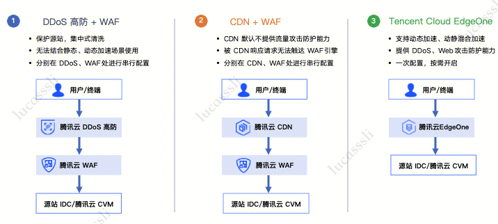

## EdgeOne
腾讯云**EdgeOne**主打 “安全 + 网络加速” 能力。属于网络安全产品。
腾讯云**WAF**主打 “安全 + 动态接入转发” 能力。属于应用安全产品。
EdgeOne作为一站式整合服务，基本包含了WAF能力。

## 需求背景

- 1. 业务出海的网络加速需求：当前中国互联网时长已经进入存量时代。中国互联网企业在中国市场的厮杀愈渐惨烈。因此，存在大量的“企业将业务放到国际上搏上一搏，向外谋求新的蛋糕”需求场景。在这种需求背景下，网络加速产品有很巨大的售卖市场。
- 2. 网络安全需求：“没有网络安全就没有国家安全”。这是中国网络安全周的宣传标语。网络安全产品仍然是抵御黑客复杂网络攻击的坚实利器。
- 3. 产品整合需求：同时购买网络加速产品和网络安全产品将给用户的网络架构增加复杂度和风险。例如腾讯云DDos、腾讯云WAF、腾讯云CDN串行在整个网络架构中，一方面增加了网络复杂度，另一方面任何一个产品出现故障都将可能增加用户服务不可用的分险。

除此之外，多产品还增加用户对这些产品的学习和运维成本。如果将这些产品整合为一站式平台，则更能提升客户体验，提升单品附加值。

