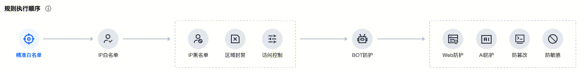
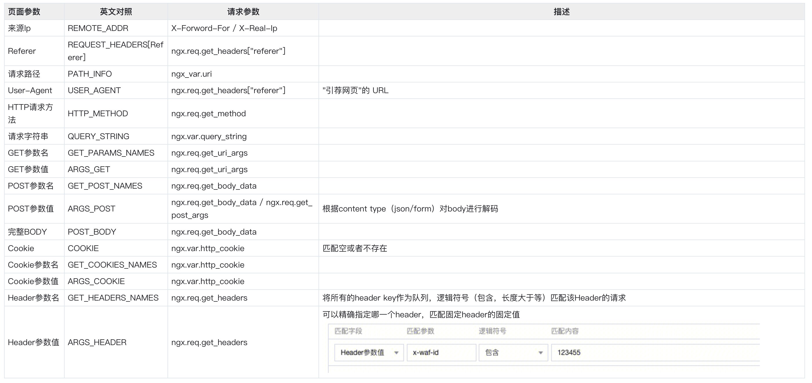
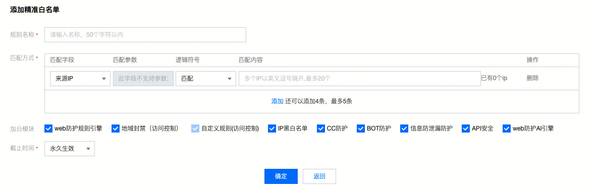
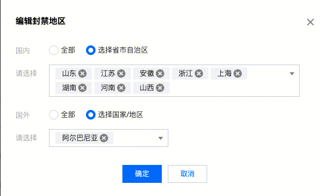

## access阶段判断了请求的合法性


## 步骤
### 1-4
```
# -----1.判断waf和bypass开关，可以直接退出access阶段
# -----2.设置header 【X-WAF-UUID】
# -----3.clbwaf且，url为/WafCaptcha时，人机识别，验证验证码
captcha.verify_captcha_request()
# -----4.获取客户端真实ip
会根据isCdn来判断是从XFF头还是X-Real-IP中获取真实Ip
```
### 5 clb default server的特殊处理
```
# -----5.对于clb default server（使用vip访问clb的请求），判断是走不走规则引擎。
通过则直接返回clb pass，不通过则将拦截页面返回给CLB。
规则引擎分为两种：分别是本地的正则匹配规则和远程的门神引擎
local mode = waf_status.get_menshen_mode() or 0
if mode == 0 or user_policy.force_local_owasp == 1 then
  -- 走本地规则引擎，force_local_owasp，部分cdn请求强制走本地规则
elseif mode == 1 then
  -- 走门神引擎
```

### 6.判断精准白名单，从多种维度判断请求是否命中了精准白名单
- 精准白名单支持的请求匹配项


- 精准白名单支持的白名单匹配项

```
主要目的：从user_policy.white_set中读取数据并设置bypass选项
local result, action, rule = custom.check(req_obj, user_policy, false) -- 这里是false
for _, v in ipairs(rule.bypass) do
    if v == "geoip" then -- 地域封禁防护
        ngx.ctx.bypass_geoip = true
    elseif v == "cc" then -- cc防护
        ngx.ctx.bypass_cc = true
    elseif v == "owasp" then -- web防护规则引擎
        ngx.ctx.bypass_owasp = true
    elseif v == "ai" then -- web防护AI引擎
        ngx.ctx.bypass_ai = true
    elseif v == "antileakage" then -- 信息防泄漏防护
        ngx.ctx.bypass_antileakage = true
    elseif v == "botrpc" then -- bot防护
        ngx.ctx.bypass_botrpc = true
    elseif v == "bwip" then  -- ip黑白名单
        ngx.ctx.bypass_bwip = true
    elseif v == "api" then -- API安全
        ngx.ctx.bypass_api = true
    --精准白名单从自定义规则提出，允许命中精准白名单的流量继续走自定义规则
    elseif v == "acl" then
        ngx.ctx.bypass_custom = true -- 自定义规则（访问控制模块中定义的）
    end
```

### 7.ip黑白名单检测
```
# ------7.ip黑白名单检测
比较XFF/X-Real-Ip/remote-addr等ip是否命中了bwlist的policy（先appid全局policy，后appid+host的policy），如果命中白名单，则直接结束access阶段，不仅过其他检测。如果命中黑名单，则直接deny。都没有命中则继续执行。
```

### 8.旁路引擎
旁路引擎检测类型
- bw-list （黑白名单以前在旁路引擎，但是现在在engine，所以这里有一个bw-list，但其实没有用）
- autodeny
- api
- bot
- ai
- business-risk
- threaten
```
请求：
action=0&&data=xxxxx(关于req的编码)
响应：
-- result ： true - 旁路检测成功
-- action ： action - log /captcha / deny / redirect
-- token ： r_token - 只有bot 和 业务风向 有这个字段
-- type_flag ； detect_typpe 拦截类型  bw-list / autodeny / api-sec / bot / ai / business-risk / threaten

响应有四种：
log - 记录日志
captcha - 人机交互
deny - 拒绝
redirect - 重定向
```

### 9.地域封禁

```
使用ipdb解析client ip为地域，后查看是否命中user_policy.areaban_set
命中则拦截，没有命中则放行
```

### 10.用户规则
```
主要目的是，从user_policy.custom_set中读取信息并查看当前请求是否符合这些规则。
local result, action, rule = custom.check(req_obj, user_policy, true) -- 这里是true
支持的规则设置，同精准白名单中的规则一致
```
### 11.web防护
```
主要是使用规则引擎对请求进行正则匹配
规则引擎分为两种：分别是本地的正则匹配规则和远程的门神引擎
local mode = waf_status.get_menshen_mode() or 0
if mode == 0 or user_policy.force_local_owasp == 1 then
  -- 走本地规则引擎，force_local_owasp，部分cdn请求强制走本地规则
elseif mode == 1 then
  -- 走门神引擎
else
  -- 两个都走，并且比对结果
如果被规则引擎匹配上，观察模式则记录日志，拦截模式则deny请求
```

### 12.webshell检测
```
使用fChecklib.so对文件进行检测
检测为webshell攻击，则deny
```


### 13.设置防泄露检测，防泄露是在filter阶段完成的
```
ngx.ctx.antileakage_set = user_policy.antileakage_set
```