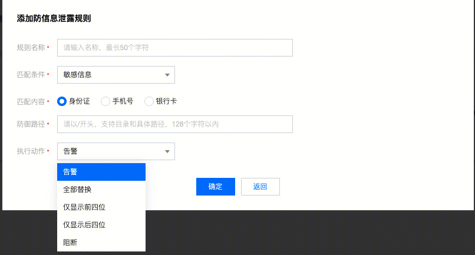

### 适用性
对于CLB-WAF而言，WAF作为CLB的mirror或者upstream，因此不存在filter的阶段。只有Saas-Waf将通过了access阶段的请求，代理到源站并针对源站响应进行filter操作。

### Header - filter
如果访问路径req.url命中了防篡改配置的路径，那么将header的content-length置空

### body - filter

- inner detect 特殊需求 给安全研究组定制功能   抓取oday攻击的request和response
```
rules : rules = waf.config.innerdetect_rules
正则匹配rsp body和rules，匹配则上报
因为在filter阶段，已经没有拦截的能力了
```

- 信息防泄露 正则匹配用户规则，从而处理防止关键信息外泄

```
匹配条件：敏感信息，响应码，关键字

敏感信息：
身份证： local regex_pattern_idcard = "\\D([1-9]\\d{5}(18|19|([23]\\d))\\d{2}((0[1-9])|(10|11|12))(([0-2][1-9])|10|20|30|31)\\d{3}[0-9Xx])\\D|\\D([1-9]\\d{5}\\d{2}((0[1-9])|(10|11|12))(([0-2][1-9])|10|20|30|31)\\d{2}[0-9Xx])\\D"
手机号local regex_pattern_phone = "(\\D)((13[0-9]|14[5679]|15[0-3,5-9]|16[2567]|17[01235678]|18[0-9]|19[1389])\\d{8})(\\D)"
银行卡local regex_pattern_bankcard = "\\D([1-9]{1})(\\d{15}|\\d{16}|\\d{17}|\\d{18}|\\d{19})\\D"
处理方式： 替换（全部，头，尾） / 拦截 / 告警

关键字：
处理方式： 替换 / 拦截 / 告警

响应码 4xx 5xx
处理方式： 拦截 / 告警


```