## 一、项目概览
目前RS性能存在性能偏低，CPU占用率高等问题。这次优化我们着重从引擎的LUA部分入手，通过提高LUA代码的执行效率，降低LUA代码占用CPU的比重，最终达到提高RS处理性能的目标。

## 二、性能摸底
我们可以从两个渠道获取目前版本的性能数据：压测环境和现网部分高负载集群。

### 现网集群
现网高负载集群使用saas集群作为参考，不使用clb集群的原因有二：目前tke存在多个工作负载共享cpu的问题，导致clb集群工作负载无法完全占有cpu；也是这个原因，目前现网clb集群的自动扩缩容策略里面cpu的阈值都定得很低，触发扩容阈值后集群扩容，导致单pod流量无法压上去。综上所述，我们选择招商证券独享集群作为参考。这个集群是saas独享集群，流量比较单一。另外在周一到周五的早九点半股票开市时稳定有一波峰值流量。

从监控可以看出，现网集群qps峰值发生在九点三十分，峰值qps为7.31k，峰值cpu接近92%。
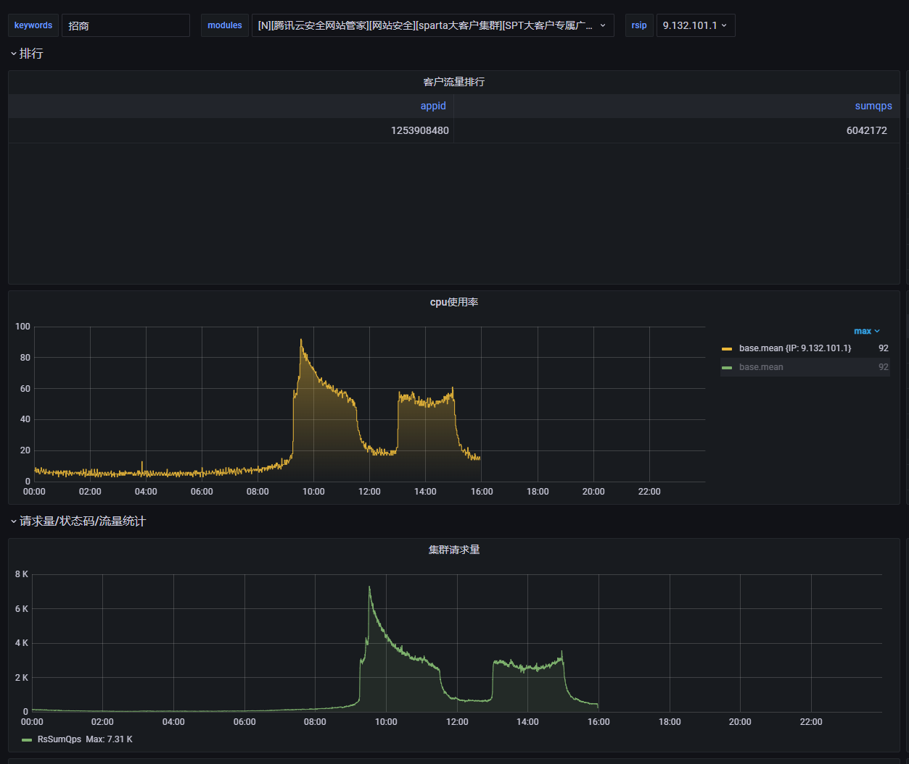

### 压测环境
包括一台压测机，一台源站服务器作为请求和响应端。中间是一台RS、一台旁路以及一个由一台虚拟机组成的门神测试集群。网络拓扑如下所示
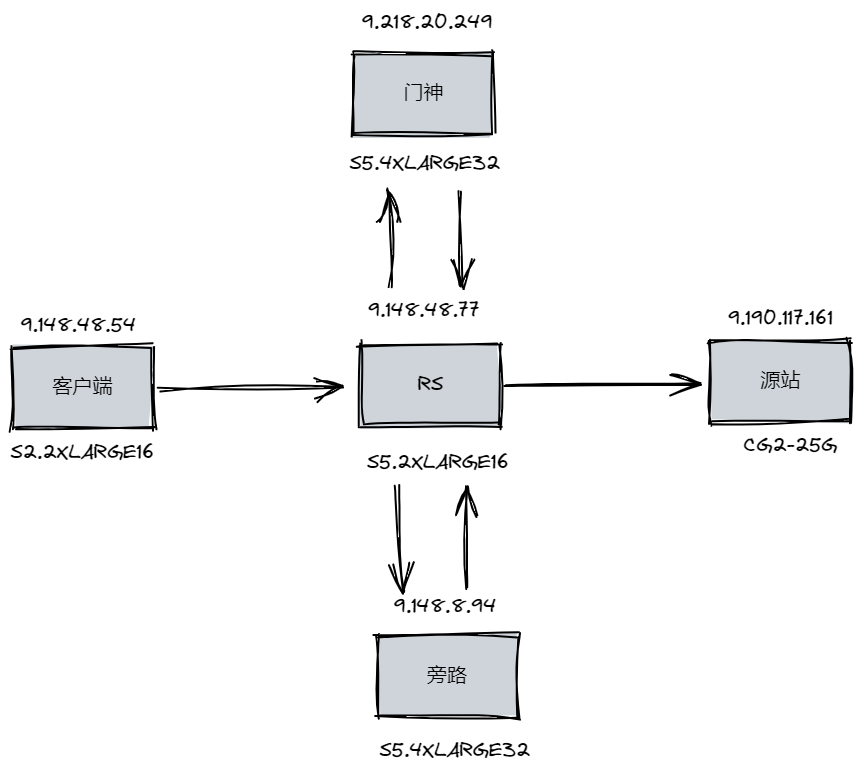
         
其中压测的客户端和源站服务器均可以保证不存在性能瓶颈。压测对象为包括两侧RPC调用（门神+旁路）的RS整体性能。旁路之前单独进行过性能专项测试，相对RS性能来说也形成不了瓶颈。门神集群因为区域是广州，而我们的测试集群都在成都，网络延迟会对性能有一定影响。

### 摸底结论
测试性能如下：
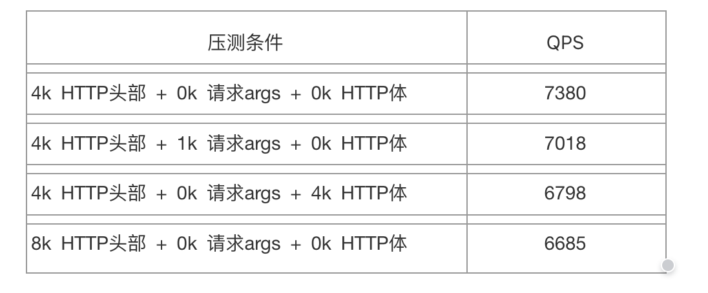

和现网对比，机器总体的cpu大致相当，现网集群是2.6G*16，压测环境是5G*8。现网流量包括一部分https的流量，通过perf可以统计出nginx处理SSL流量大约损耗了10%的cpu，这部分在压测环境是没有的。

由此可以得出目前RS的性能大致在7000到8000之间，并且瓶颈是CPU计算资源。

## 三、性能瓶颈定位
### cpu瓶颈定位 	
首先通过perf命令查找热点函数和热点代码。
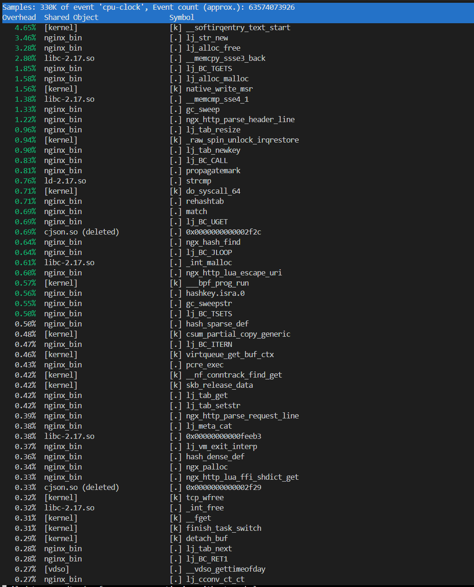

上图是压测环境7500qps下的perf截图，这时候cpu占用率为100%。从图中可以得出：

- 1.总体没有占用cpu特别高的热点函数，所有函数占比都在5%以下。没有明显的因为锁互斥导致的性能瓶颈。
- 2.其中非内核空间占比最多的是lua中的lj_str_new。这个函数主要与OpenResty内部C和LUA之间的参数传递有关。OpenResty通过lua_nginx_module接口，从nginx内部提取对应的协议变量，然后以lua string形式返回。所以我们在使用OpenResty接口的时候会大量新建lua string。
- 3.还有一系列涉及内存申请释放和拷贝的函数，lj_alloc_free, lj_alloc_malloc, __memcpy_ssse3_bak，__memcmp_sse4_1，gc_sweep等。这些函数主要涉及OpenResty内部使用内存的申请和释放。
- 4.另外一系列的lua函数是lj_tab_resize，lj_tab_newkey，。这部分和OpenResty使用lua table有关。

由于没有明显的热点函数，单独优化某一个函数带来的性能优化幅度都不会很高，所以我们的优化方向定在减少代码路径，尽量复用资源上。

### 热点模块定位
虽然不存在明显的热点函数，但是我们需要找出代码路径里面是否存在消耗特别大的代码逻辑块，这样有助于进一步确定优化的目标。通过逐一注释关注的模块，对比注释前后qps的变化，我们可以得出各模块占用整体cpu比例，从而找出热点模块。我们分别对三个主要钩子点的代码路径进行了一次梳理。
#### 1.access钩子点
access钩子点是我们绝大多数功能模块生效的钩子点，钩子点内部有自定义规则、黑白名单、地域封禁、旁路rpc调用、门神rpc调用、webshell等功能。这个也是我们重点关注的钩子点，性能评估只保留rewrite钩子点和access钩子点，其他钩子点全部注释，从而放大access钩子点各代码段的影响，更容易找出瓶颈区。下表是注释掉各个模块后的性能统计：

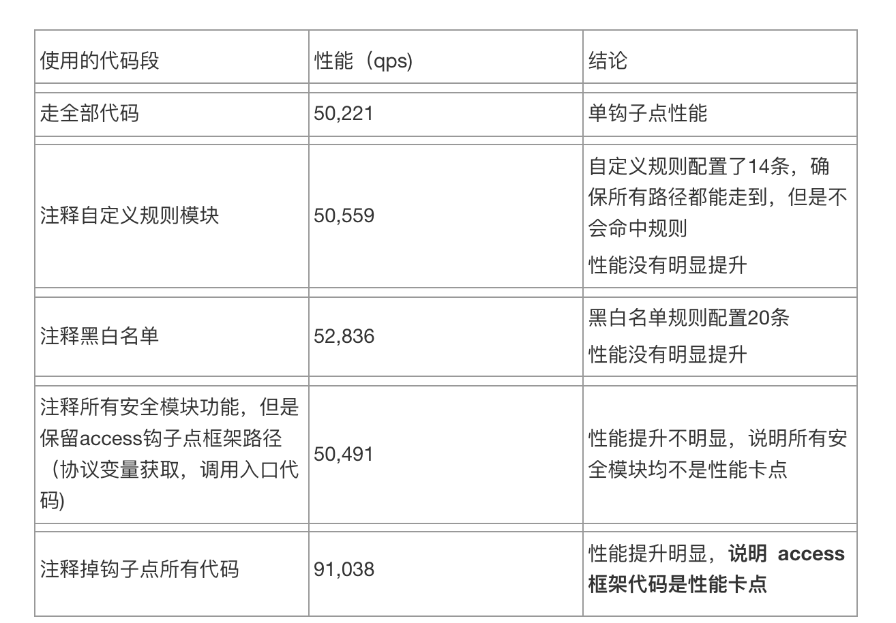

我们的安全模块的实现可以分成两个部分：一个提取安全模块关心的协议特征，作为后续安全模块的输入，这一部分主要是通过OpenResty提供的接口，从nginx中提取对应的协议变量，在access钩子点的主框架中实现；另一部分是各安全模块自己的规则匹配逻辑，这各实现在各个安全模块自己的module中。
通过上面的实验，我们可以发现对性能影响最大的是提取协议特征部分，主框架流程本身占用了整个access钩子点90%以上的CPU资源。
针对主框架路径，我们找到了框架中对性能影响最大的函数:
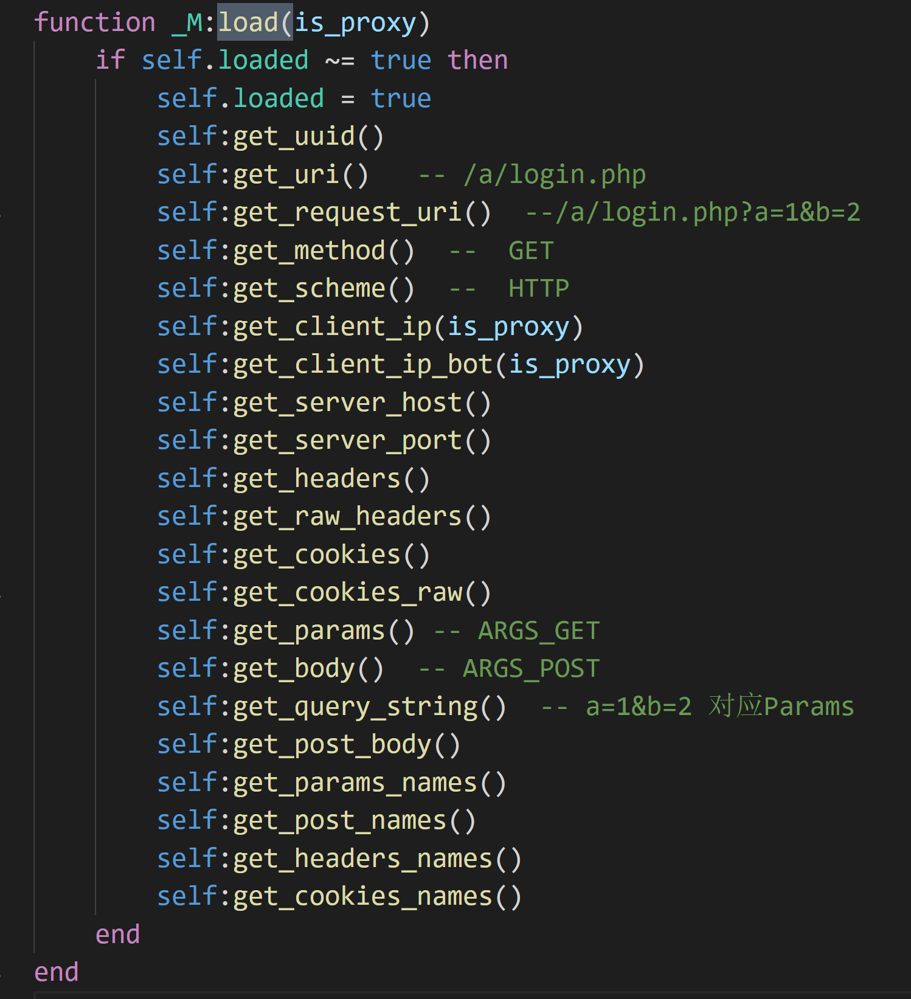
这个函数是一个协议变量预加载函数，在access钩子点中被调用，作用是预先从nginx中获取协议变量并缓存，用于后续安全模块的规则匹配。这个提取的动作又拆分为两步，第一步调用OpenResty的接口，从nginx拷贝变量到LUA；第二步处理这些协议变量，按需求存成table或者raw string。整个加载函数，绝大部分的性能都是损耗在OpenResty接口里面，因为这里需要把大量的协议变量从nginx的C空间拷贝到LUA空间，造成大量的string new操作和memcpy操作。

#### 2.log钩子点
log钩子点主要是记录攻击日志、心跳日志和访问日志。其中访问日志是占用最多的逻辑块，目前我们每条连接的访问日志需要记录三十多个字段。这里每个字段的获取同access钩子点的获取协议变量类似，所以在这个钩子点我们同样可以观察到提取协议变量带来的巨大的性能损耗：
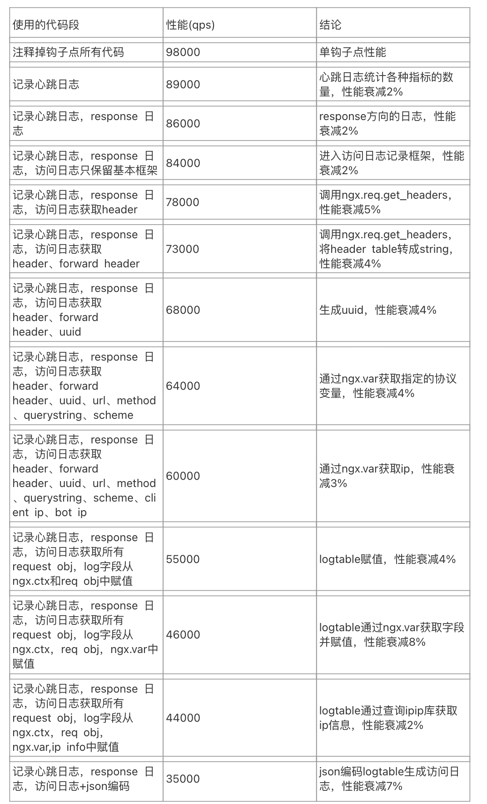
log钩子点进一步表明，从nginx提取协议变量会降低性能。访问日志这个函数没有复杂的逻辑，就是把协议变量从nginx获取出来赋值到logtable，最后编码成json格式并发送出去。但是就是在logtable赋值阶段，随着记录的协议变量的增多，性能逐渐下降，最终在log还没有编码发送前性能就衰减了50%。
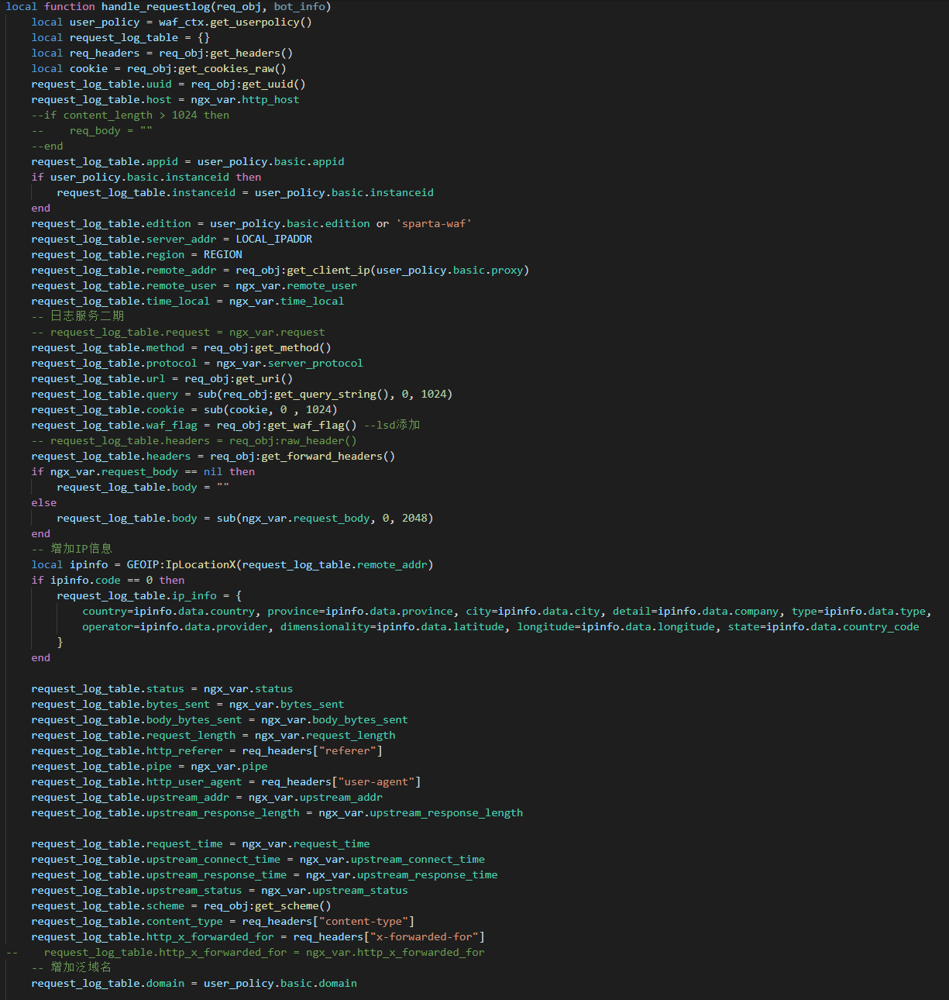
*请求日志需要大量获取协议字段，单单获取然后赋值就损耗了50%的性能

#### 3.其他钩子点
其他钩子点包括rewrite、headerfilter和bodyfilter三个钩子点。由于这三个钩子点逻辑比较简单，而且大部分流量不会进入headerfilter和bodyfilter钩子点的模块逻辑。我们主要针对rewrite钩子点进行了测试。测试结果发现rewrite钩子点整体占用CPU都比较低：
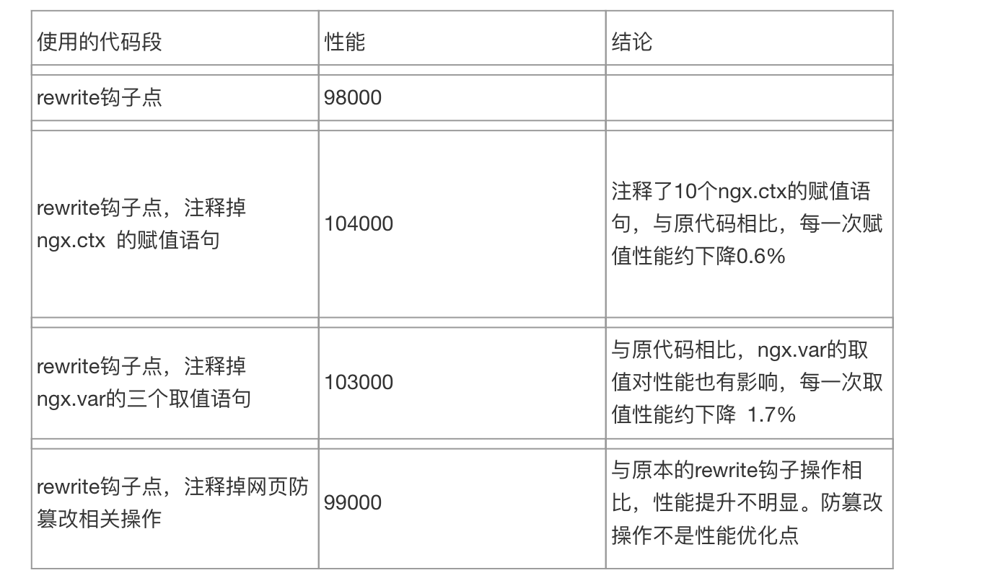
#### 4.结论
通过对各个钩子点内部模块的拆解分析，可以得出以下的结论：

- 1.access和log两个钩子点是性能的主要卡点
- 2.自定义规则，黑白名单等安全模块的规则匹配部分对性能影响小
- 3.大量性能损耗在获取协议变量的过程中
- 4.对旁路和对门神的rpc调用对性能有一定影响，但是集中在IO方面

## 四、优化措施
根据上面的实验结果，我们的性能优化方向重点放在以下几个方面：

- 1.针对热点函数lj_str_new的优化

尽量减少在LUA中新建string的次数，控制LUA中全局string hash表的大小，减少lj_str_new创建字符串时查重的损耗。
具体到代码优化层面，减少字符串连接符..的使用。Lua中用..链接两个字符串，当前引擎rs中有大量的log打印，或信息处理都使用了..链接符。
Lua 中实现字符串的方式和大多数其他脚本语言有很重要的区别。Lua 的字符串都是内化的（internalized）；这意味着字符串在 Lua 中都只有一份拷贝。每当申请一个新字符串时，Lua 会先调用lj_str_new检查这个字符串是否已经有一份拷贝，如果有，就重用这份拷贝，没有的话便再创建新串。内化（internalization）使字符串比较及查找这样的操作更快，但是字符串的创建会变慢。所以每一次..都相当于新增一个字符串，如果操作很频繁，就会对性能有非常大的影响。
我们将字符串链接符改为table.concat，来避免这一影响。但要注意的是，table.concat并不能对所有的字符串链接都有改善，只有链接的字符串较多时，性能改善才比较明显。

- 2.针对热点函数lua table部分的优化

尽量减少lua table申请、释放和resize的次数，减少lua table的自动扩容。
引擎中表的使用非常频繁，但代码走查发现引擎代码中表的初始化语句为table{}，其中有部分table大小是可预知的，修改这部分table表的初始化为table.new()，通过table.new()预分配表内存，可以避免表的rehash操作从而提升性能。原因为lua table包含两部分，数组和哈希。数组table以整数为键，哈希table则使用hash算法进行寻址。不管是数组table还是哈希table在执行table的insert操作时，若table已满，会触发一次table的rehash以及内容移动。Rehash时，lua会遍历这个表，分类表的数组部分和哈希部分，重新计算arraysize和lsizenode，这会导致大量的lj_tab_resize和rehashtab操作。若能提前预知table大小，定义table时，通过table.new()预分配。可以避免table的rehash操作，从而提升性能。

- 3.针对热点函数内存部分的优化

引擎内存申请和拷贝消耗主要在几个方面：nginx自己本身的内存申请和拷贝，这个暂时不在优化范围内；LUA内部的内存拷贝，由于LUA string和LUA table都是引用，所以这部分占比很少；nginx到LUA的内存拷贝，主要涉及协议变量从nginx的C空间拷贝到LUA空间，这块目前看是不可避免的，业务本身的实现依赖nginx提供协议变量；LUA到nginx的内存拷贝，比如LUA的log函数，我们需要把LUA string拷贝回nginx，由nginx的log模块记录log，这个是我们的优化点。
引擎中的log打印函数为logger.info/logger.debug/logger.trace/logger.warn/logger.err, 进到logger函数后，判断引擎的日志等级，若等级比当前日志函数的打印等级低则退出，否则再进到nginx的日志打印函数。当前引擎的日志等级较高为INFO级别，且是代码中写死的，配置不方便。所以就出现一些打印信息，虽然最终不需要打印，但实际已经生成log字符串，造成性能浪费。该项目修改了引擎log打印的级别为通过配置文件配置，测试性能及线上机器可以设置为低级别，避免无谓的函数调用及性能浪费。

- 4.尽量使用local变量取代global变量和ngx.ctx变量

local变量是存放在栈中的，而global变量是全局的。操作global变量会比操作local变量多一次全局变量查找的过程。而LUA中留给local变量的空间特别大，我们要充分利用这个特性，在代码中尽量使用local变量和local function。
在 OpenResty 的体系中，可以通过ngx.ctx表完成单个请求内不同阶段的数据共享。我们可以对ngx.ctx 表进行添加、修改，用来存储一些基于请求的数据。其生存周期与当前请求相同 (类似 Nginx 变量)。它有一个最重要的特性：单个请求内的 rewrite钩子，access 钩子，和 log钩子 等各处理阶段其数据是保持一致的。但通过大量的压测测试发现，ngx.ctx 表的添加和查询是比较耗费性能的，比通过local变量传递数据要慢。分析可能是ngx.ctx表的添加查询需要元方法调用，所以比较慢。通过走查代码发现，引擎代码中有大量数据都存储在ngx.ctx表。而其中一些数据没有必要存储在ngx.ctx表，是可以在钩子点中独自获取的，没必要共享到整个请求的流程中。基于此，我们去掉了这部分变量，改为钩子点中的local变量，从而提高性能。

- 5.针对缓存协议变量的优化

通过对各个log钩子点的性能实验我们可以得出，协议变量的获取是我们的热点路径，每条连接都需要从nginx中通过OpenResty接口获取大量的协议变量。目前我们有通过httpRequest这个模块来对常用的协议变量做缓存，利用ngx.ctx在钩子点之间缓存协议变量，减少重复获取协议变量的性能损耗。我们扩充了这个模块缓存的范围，尽量减少针对同一个协议变量的重复获取。
另外在缓存协议变量时做到尽量“夹带”，如果我们需要获取一个table格式的post_body，那么在我们调用OpenResty接口获取body后，同样缓存一份string格式的body。从而降低调用协议接口的频率。

- 6.删除不需要的代码分支

走查代码的时候发现，access钩子点存在一些无用的代码，尤其是通过OpenResty接口调用到nginx的代码，比如获取一些不用的协议变量(get_server_port)等。我们直接删除了这部分无用代码，从而提高性能。

- 7.修改UUID的生成方式

引擎中每个trans都需要获取一次uuid，格式为MD5(IP + worderpid + 时间戳)-request_id, 测试中发现，获取uuid的过程因为涉及md5的计算，其构造比较耗费性能。因此我们将uuid的获取过程修改为OpenResty的juuid库，在满足uuid的唯一性的同时也能兼顾性能。

- 8.针对LUA语法的一些优化

代码中，数组table insert时，一般用#获取table长度，然后依次在table末尾插入数据，但#实际调用了lj_tab_len来获取长度，这个操作的时间复杂度为O(logn)。通过测试，修改了代码中用#计算数组table的地方，进而提升性能。

Lua的require语句用来加载指定的module，执行require语句后，可以使用这个模块中定义的全局变量和全局函数。Require语句会将对应模块的全局函数和全局变量放到全局表_G中。加载的模块越多，全局表负担越重。该项目移除了一些只有极特殊的分支才会用到的模块加载，改为在分支内自行加载，从而提升性能

- 9.针对网络IO的优化

引擎检测过程有三次rpc过程，其中一次是webshell的本地rpc，还有两次是远程rpc，分别往门神和旁路集群发送请求。原来的代码是顺序调用的，这样带来的延迟增大的问题，因为一条连接我们需要等待两次rpc返回，如果门神和旁路均超时，这样会导致我们的延时在等待rpc这块就大于160毫秒。我们利用thread spawn，并行发送两次rpc请求，这样我们的延时降低到最大延时的那次rpc上。有效地减少延迟，提高性能。

- 10.针对旁路rpc的优化

我们的旁路引擎实现了WAF功能中的CC检测、AI检测、业务安全、bot等功能。这部分功能使用的客户占比并不大。对于没有配置相关功能的流量而言，旁路的rpc其实是在空跑，不仅增大了延迟，还降低了旁路和RS的性能。我们修改了旁路rpc发起的条件，只在客户配置了旁路相关规则的情况下，流量才会发起旁路rpc。这样既可以减轻旁路压力，对RS的性能也有很大的提升。

## 五、优化成果
优化后的引擎在压测环境的数据如下，Bypass旁路指流量进入旁路检测的百分比，目前现网有50%以上的流量不需要进入旁路，我们分别选取50%和100%作为测试条件：
Bypass 50% 旁路：
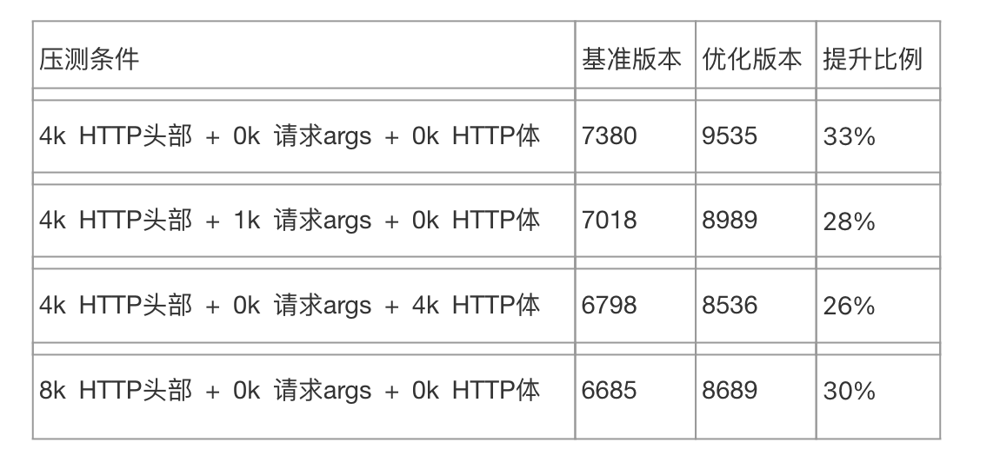

Bypass 100% 旁路：
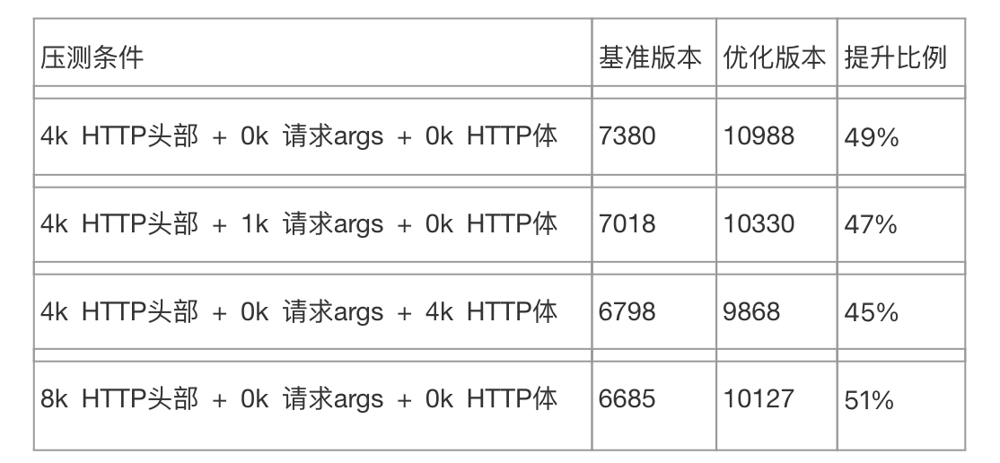
代码优化后，RS引擎的qps会有大约30%到50%的性能提升。

