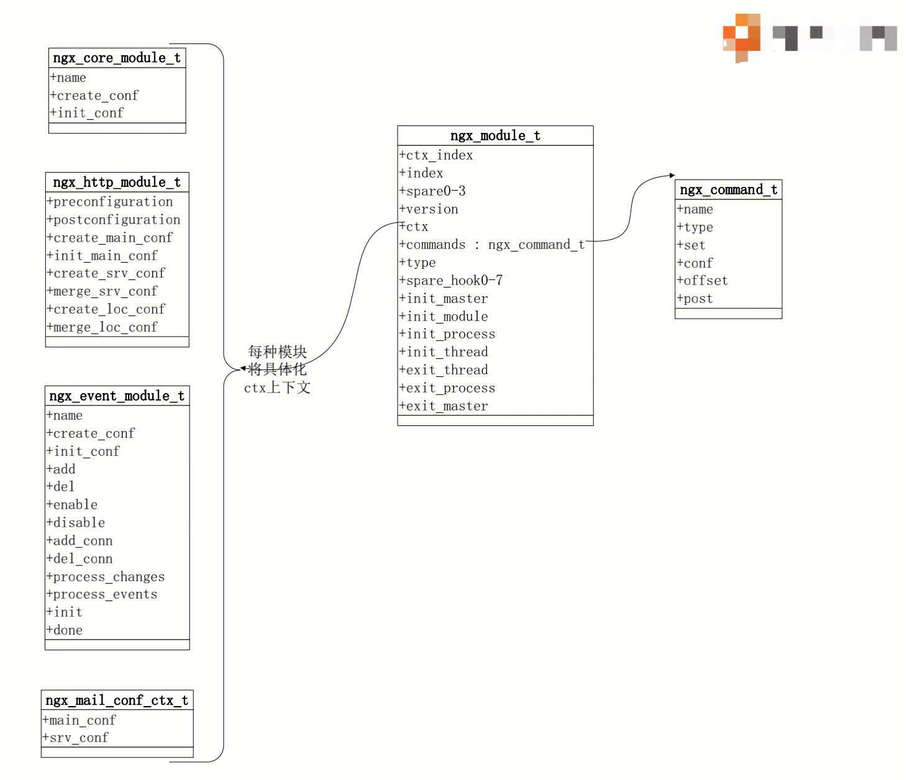
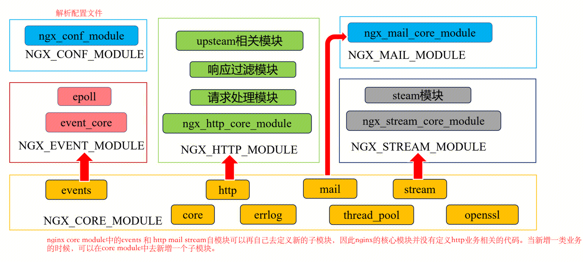

## 基本知识

- 为什么nginx采用多进程而非多线程？ 线程共享地址空间
- master进程中不加载第三方模块
- cache manager （缓存管理）/ load （缓存载入）
- worker和cpu绑定，从而利用cpu缓存
- worker进程退出后，会向mater发送sigchild信号，从而master知道一个worker退出了，拉起一个新的worker。master会监控child信号
- work进程也能接受信号，但是一般直接通知worker，使用master管理woker。
- 配置文件中新的端口由master打开，worker是master的子进程，linux子进程会继承父进程打开的端口。
- 老worker关闭监听句柄socket，之后就不会再接受任何请求。即使是keep-alive 也会关闭连接。
- worker shutdown timeout配置可以控制旧worker推出的时间
- 新的master进程是旧的master的子进程，但是使用的新的bin文件来开启进程。
- 新老master都监听相同端口，新master自动继承旧master的。 监听端口 https://www.zhihu.com/question/360939266
- 优雅退出worker主要针对http ， websocket / 四层流量不行
- work退出过程： 1.定时器 2.关闭监听socket，不再accept()请求 3.清理空闲连接 4.循环等待连接退出 
- nginx 处理网络事件：每一个小于mss长度的tcp报文，都是一个事件。
```
	- MTU / MSS ： https://www.jianshu.com/p/3be7582ddf78 
	- http数据流向
	- tcp报文封装
```
- tcp第二次握手时，nginx是无感知的。因为tcp处于半连接的状态，nginx accept方法无法得到调用。
- Nginx， epoll事件循环
```
	- epoll-create 绑定端口。
	- epoll-wait 阻塞调用，等待端口的事件来临，nginx work处于sleep状态。
	- 当操作系统完成了tcp三次握手，会通知epoll调用返回，worker开始工作。
	- 操作系统会维护一个事件处理队列，worker在epoll调用用返回后读取操作系统内核准备的事件队列，并且开始处理。
	- worker在处理事件的时候，可能会新建事件。（例如设置超时事件等等）
	- 事件处理完毕，返回epoll-wait状态。
	- 因为事件是一个队列模型，如果事件处理的事件较长的话，会导致队列后面的事件得不到处理而超时。因此ngxin严格的限制了第三方模块占用cpu的时间。
```
- epoll poll select kqueue
```
	-	为什么epoll优于select。 例如，nginx出了100万个链接，此时打开100万个文件描述符。但是通常，在某一刻，只有几十个活跃的连接（只有几十个文件描述符存在事件来临），但是select模型为了找出这几十个文件描述符，需要遍历所有的文件描述符。效率是很低的。而epoll维护了一个rdlist队列，记录了准备好的文件描述符。
```
- 请求切换
```
	- 传统apach服务器，一个进程或者线程处理一个请求连接。利用操作系统进程间切换实现高并发。操作系统会浪费大量的时间在进程间切换上面，并且，进程越多，进程间切换的时间越大，指数级别增长。操作系统进程间切换适用于百和千级别。
	- nginx一个worker进程处理多个请求连接。只有在当前worker进程时间片用完的时候，才会进程切换。有请求阻塞时，在用户态完成请求切换，减少了进程切换。所以在nginx配置上，会将nginx进程的优先级调高，使用更多的时间。
```
- 阻塞与非阻塞 同步与异步
```
	- 阻塞与非阻塞 ：调用方法，会不会导致进程切换
		- 阻塞：使用操作系统或者一些c库的系统调用的时候，会导致进程进入sleep状态，cpu被切换。  
		- 非阻塞：永远不会在时间片未用完之前，调用方法导致进程被切换。
	- 同步与异步：调用方法的方式
		- 等待调用方法执行完毕之后，才能继续执行接下来的程序代码。一般需要设置一个方法调用的超时事件。
		- 调用之后理解返回，马上开始执行接下来的代码。例如，waf中创建clb的接口，调用creatclb之后立即返回vipid，但是由clb后台继续分配资源。然后再在另一个方法中利用vipid去查询分配状态。 判断成功和失败的后续处理。
```
## nginx模块
#### obj/ngx_moudle.c数组中可以查看编译进入ngxin的模块。每个模块都使用ngx_module_t结构体来表示。
``` 
extern ngx_module_t  ngx_core_module;
extern ngx_module_t  ngx_errlog_module;
extern ngx_module_t  ngx_conf_module;
extern ngx_module_t  ngx_openssl_module;
extern ngx_module_t  ngx_regex_module;
extern ngx_module_t  ngx_events_module;
extern ngx_module_t  ngx_event_core_module;
extern ngx_module_t  ngx_epoll_module;
extern ngx_module_t  ngx_http_module;
extern ngx_module_t  ngx_http_core_module;
extern ngx_module_t  ngx_http_upstream_hash_module;
...
```

#### 每个模块的数据结构为ngx_module_t。


- 包含了ngx_command_t数组，每个ngx_command_t有name等成员，name为指令名称。在模块源码.c中找到nginx_command_t数组中，可以找到支持的配置项和参数（比官网更加准确）
- 每个ngx_module_t有归属的上下文，定义在ctx中。
- init_master等等成员，允许改模块在nginx start， stop，reload，quit等等方法执行时，定义自己的操作。

#### 以GZIPmodule为例

- ngx_module_t 模块数据结构 ： ngx_http_gzip_filter_module
``` 
ngx_module_t  ngx_http_gzip_filter_module = {
    NGX_MODULE_V1,
    &ngx_http_gzip_filter_module_ctx,      /* module context */     ctx上下文
    ngx_http_gzip_filter_commands,         /* module directives */  ngx_command_t指令
    NGX_HTTP_MODULE,                       /* module type */        type：http模块
    NULL,                                  /* init master */
    NULL,                                  /* init module */
    NULL,                                  /* init process */
    NULL,                                  /* init thread */
    NULL,                                  /* exit thread */
    NULL,                                  /* exit process */
    NULL,                                  /* exit master */
    NGX_MODULE_V1_PADDING
};
```
- ctx上下文 ： ngx_http_gzip_filter_module_ctx，这是一个属于HTTP模块的字模块
``` 
static ngx_http_module_t  ngx_http_gzip_filter_module_ctx = {
    ngx_http_gzip_add_variables,           /* preconfiguration */
    ngx_http_gzip_filter_init,             /* postconfiguration */

    NULL,                                  /* create main configuration */
    NULL,                                  /* init main configuration */

    NULL,                                  /* create server configuration */
    NULL,                                  /* merge server configuration */

    ngx_http_gzip_create_conf,             /* create location configuration */
    ngx_http_gzip_merge_conf               /* merge location configuration */
};
```
- ngx_command_t支持的指令和配置数组 ： ngx_http_gzip_filter_commands
``` 
static ngx_command_t  ngx_http_gzip_filter_commands[] = {
    { ngx_string("gzip"),       
      NGX_HTTP_MAIN_CONF|NGX_HTTP_SRV_CONF|NGX_HTTP_LOC_CONF|NGX_HTTP_LIF_CONF
                        |NGX_CONF_FLAG,
      ngx_conf_set_flag_slot,
      NGX_HTTP_LOC_CONF_OFFSET,
      offsetof(ngx_http_gzip_conf_t, enable),
      NULL },

    { ngx_string("gzip_buffers"),
      NGX_HTTP_MAIN_CONF|NGX_HTTP_SRV_CONF|NGX_HTTP_LOC_CONF|NGX_CONF_TAKE2,
      ngx_conf_set_bufs_slot,
      NGX_HTTP_LOC_CONF_OFFSET,
      offsetof(ngx_http_gzip_conf_t, bufs),
      NULL },
	  
	  	.....
		
      ngx_null_command
};
例子：
ngx_string("gzip"),        // name
NGX_HTTP_MAIN_CONF|NGX_HTTP_SRV_CONF|NGX_HTTP_LOC_CONF|NGX_HTTP_LIF_CONF|NGX_CONF_FLAG,//type
ngx_conf_set_flag_slot, // set
NGX_HTTP_LOC_CONF_OFFSET, //conf
offsetof(ngx_http_gzip_conf_t, enable), //offset
NULL, //post
```

## nginx模块组成


- core module ： nginx的核心模块。events 和 http mail stream等等都是core module中生成的子模块。因此新出现一类应用，可以通过core module中添加一个子模块来实现。
- conf module ：为解析配置文件的模块，比较独立。
- 每个模块中的子模块间，都有执行顺序的，比如：ngx_http_core_module为第一个执行的子模块，改模块定义了HTTP模块的通用逻辑代码。然后执行请求处理模块，最后执行响应过滤模块
- 模块与源代码
```
	- src/core nginx核心框架代码
	- src/event , src/http , src/mail ,src/stream 对应了子模块代码
```
- HTTP模块代码：官方的子模块（运行的最小集，包括框架代码）定义在src/http目录中。非官方的子模块（可有可无的）定义在module目录中，分为三类：处理请求的（除了filter和upstream的），响应过滤的（filter），与上游交互的（usstream）。


##  复习
### socket知识补充
`socket是什么：` socket是操作系统提供的一个系统调用，是网络通信的基本操作单元，包含了进行网络通信的五种基本信息：连接使用的协议，本地IP地址和本级端口，远程主机IP地址和远程主机端口。（socket不仅可以提供不同主机间的网络通信，还可以提供本机上的多个应用程序通信）
`创建一个socket：`
- ** 创建过程：**
``` 
int socket(int domain, int type, int protocol)
```
	- 域（domain）: 域指定套接字通信中使用的网络介质。最常见的套接字域是 AF_INET（IPv4）或者AF_INET6(IPV6)，
	- 类型（type）:
  1. 流套接字（SOCK_STREAM）：流套接字用于提供面向连接、可靠的数据传输服务。该服务将保证数据能够实现无差错、无重复发送，并按顺序接收。流套接字之所以能够实现可靠的数据服务，原因在于其使用了TCP（The Transmission Control Protocol）协议。
  2. 数据报套接字（SOCK_DGRAM）：数据报套接字提供了一种无连接的服务。该服务并不能保证数据传输的可靠性，数据有可能在传输过程中丢失或出现数据重复，且无法保证顺序地接收到数据。数据报套接字使用UDP（User Datagram Protocol）协议进行数据的传输。由于数据报套接字不能保证数据传输的可靠性，对于有可能出现的数据丢失情况，需要在程序中做相应的处理。
  3. 原始套接字（SOCK_RAW）：原始套接字与标准套接字（标准套接字指的是前面介绍的流套接字和数据报套接字）的区别在于：原始套接字可以读写内核没有处理的IP数据包，而流套接字只能读取TCP协议的数据，数据报套接字只能读取UDP协议的数据。因此，如果要访问其他协议发送数据必须使用原始套接字。
  - 协议（protocol）：协议字段已经由domain和type的组合决定了，不符合会创建socket失败。
0：使用默认协议；
IPPROTO_TCP：使用TCP协议；
IPPROTO_UDP：使用UDP协议


- **创建了什么资源？**
创建了socket数据结构：
```
struct socket {
socket_statestate;       // 套接字所用的流类型 -- 通过参数可以获得
shorttype;               //套接字所处状态
unsigned longflags;      //标识字段
struct socket_wq __rcu*wq;     //包含了等待该套接字的进程队列。进程等待该socket的事件时，会将进程pid等信息挂在队列上。当数据到来时，可以唤醒队列中的进程。该成员可以用于关联进程和socket。
struct file*file;          //指向了和套接字相关联的file 结构 --- 需要打开一个文件，用于读取和写入网络通信数据
struct sock*sk;			//sock数据结构，该结构的成员包含了内核写缓冲区和读缓冲区，以及缓冲区中内容的长度。
const struct proto_ops*ops; // socket结构的操作集，此结构的域大部分是函数指针，socket操作函数集：bind, connect, accept等
};
```
1.打开了文件，用于读取和写入网络通信数据。并返回了一个文件句柄作为套接字描述符。
2.在内核分配了一个读缓冲区和写缓冲区，缓冲区是一个sk_buff（tcp数据报，长度为MSS+首部长度）队列。例如，发送tcp数据报时，当收到数据报的ACK时，可以从写缓冲区队列中删除该sk_buff。
问题：为什么创建了缓冲区还需要创建文件？
答：在linux环境下，任何事物都以文件的形式存在，通过文件不仅仅可以访问常规数据，还可以访问网络连接和硬件。如传输控制协议 (TCP) 和用户数据报协议 (UDP) 套接字等，系统在后台都为该应用程序分配了一个文件描述符，该文件描述符提供了大量关于这个应用程序本身的信息。例如可以查看一个进程打开的文件来定位其创建的socket。
lsof命令可以查看文件和进程的关系。lsof - i :80查看到使用80端口的进程。lsof -p pid查看某个进程打开的文件。


- **使用socket建立链接**
	- 通过socket() , bind(), listen() 可以创建一个监听socket。
	- 对该监听socket循环调用accept()[阻塞调用]，可以创建连接socket。对该连接socket调用read和write方法进行网络通信。
	- 监听socket存在一个监听缓冲区，缓冲区的大小由listen的第二个参数backlog决定。该缓冲区将缓冲来不及accept()连接请求。缓冲区内的连接请求将等待accept，超出缓冲区的连接请求将被丢弃。
	- https://cloud.tencent.com/developer/article/1666211


- **使用socket进行通信**
	- 当一个新的数据包进入网络接口，通过网络接口发起中断信号到内核或通过内核轮询网络接口，来到达内核知道数据包到来的目的。内核获取数据包后对包进行解码得到源IP、源端口、目标IP和目标端口，进而关联sock数据结构。内核将数据包复制到sock关联的内核缓冲区。并唤醒例如read，select，epoll_wait等阻塞函数。从而唤醒挂在在该socket上的进程。
	- **读：** 当用户态的进程被唤醒，开始实际调用socket描述符上的 read() 时，内核将内核缓冲区中的数据复制到此用户进程调用 read() 所提供的缓冲区，并从其内核接收缓冲区中删除数据。
		- 如果读缓冲区为不可读状态，并且用户调用read，则系统调用将被阻塞，直到变为可读状态。
		- 如果读缓冲区是可读的，并且用户调用 read ，系统调用将立即返回这些可用的数据。如果内核读缓冲区中准备好的数据量小于用户提供的缓冲区的大小，则可能发生部分读取。调用方可以通过检查 read的返回值来检测。 			- 如果读缓冲区已满，而TCP连接的另一端尝试发送更多的数据，内核将拒绝对数据包进行ACK。另一端将超时，这是常规的TCP拥塞控制。
	- **写：** 当应用程序调用 write 时，它将数据从用户提供的缓冲区复制到内核写缓冲区中。随后，内核将把数据写缓冲区复制到网络接口中，并实际发送数据。
		- 写缓冲区可写，并且用户调用write，则系统调用将成功。如果写缓冲区有足够的空间，则将复制所有数据。如果写缓冲区只有部分数据的空间，那么将发生部分写入，并且只有部分数据将被复制到缓冲区。调用方通过检查 write 的返回值来检查这一点。
		- 写缓冲区不可写，并且用户调用 write，则系统调用将被阻塞。
	- **可读可写条件：** 每个socket有接收缓存区低水位标记（用于读）和发送缓存区低水位标记（用于写）。接收低水位标记是返回"可读"时套接字接收缓冲区中所需的数据量。对于TCP,其默认值为1。  **【已用空间超过低水平位，可读】** 发送低水位标记是让select返回"可写"时套接字发送缓冲区中所需的可用空间。对于TCP，其默认值常为2048.  **【剩余空间的大小超过低水平位，可写】** 


- **并发连接时，如何处理众多socket连接？**
事件驱动模型。Web服务器响应和处理Web请求的过程，就是大多基于事件驱动模型的。事件驱动模型包含了事件收集器、事件发送器和事件处理器等三部分基本单元。当需要同时处理多个并发请求时，基于事件驱动模型编写的服务器处理模型可以有以下几种实现办法：
- “事件发送器”每传递过来一个请求，“目标对象”就创建一个新的进程，调用“事件处理器”来处理该请求。
- “事件发送器”每传递过来一个请求，“目标对象”就创建一个新的线程，调用“事件处理器”来处理该请求。
- “事件发送器”每传递过来一个请求，“目标对象”就将其放入一个待处理事件的列表，使用非阻塞I/O方式调用“事件处理器”来处理该请求。
上面的三种处理方式，各有特点，第一种方式，由于创建新的进程的开销比较大，会导致服务器性能比较差，但其实现相对来说比较简单；第二种方式，由于要涉及到线程的同步，故可能会面临死锁、同步等一系列问题，编码比较复杂；
```
//多进程处理并发连接
//创建监听socket
serv_sock=socket(PF_INET, SOCK_STREAM, 0);
//绑定端口
serv_addr.sin_family = AF_INET;    //IPV4协议族
serv_addr.sin_addr.s_addr = htonl(INADDR_ANY);    //主机字节序（host）转换成网络字节序（net）（大端序）
serv_addr.sin_port = htons(atoi(argv[1]));    //端口号
bind(serv_sock, (struct sockaddr*) &serv_addr, sizeof(serv_addr)）
//监听连接
listen(serv_sock, 5)
//多进程处理多个连接socket
while(1)
  {
    clnt_addr_size = sizeof(clnt_addr);
    clnt_sock=accept(serv_sock, (struct sockaddr*) &clnt_addr, &clnt_addr_size);
    if(clnt_sock == -1)
      continue;
    else
      puts("new client connected...");
  
    pid=fork();    //创建新进程
    if(pid==-1)
    {
      close(clnt_sock);
      continue;
    }
    if(pid==0)    //子进程运行区域
    {
      close(serv_sock);    //在子进程中要关闭服务器套接字文件描述符
      while((str_len=read(clnt_sock, buf, BUF_SIZE))!=0) //while解决部分读问题
	  		//todo 处理buf里面的数据
      close(clnt_sock);//执行完关闭自己的文件描述符
      puts("client disconnected...");
      return 0;
    }
    else    //父进程运行区域
    {
      //调用fork函数后，要将无关的套接字文件描述符关闭掉
      close(clnt_sock);
    }
  }
```
第三种方式，在编写程序代码时，逻辑比前面两种都复杂。大多数网络服务器采用了第三种方式，逐渐形成了所谓的“事件驱动处理库”。事件驱动处理库又被称为多路IO复用方法，最常见的包括以下三种：select模型、poll模型和epoll模型。Nginx服务器还支持rtsig模型、kqueue模型、dev/poll模型和eventport模型等。通过Nginx配置可以使得Nginx服务器支持这几种事件驱动处理模型。
多路IO编程c++实战：https://learnku.com/articles/41814

## socket可读可写的状态判断
https://www.cnblogs.com/my_life/articles/10910375.html

## epoll模型 c++的定义
https://learnku.com/articles/41814