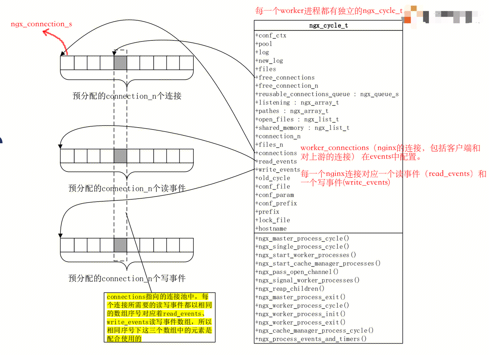
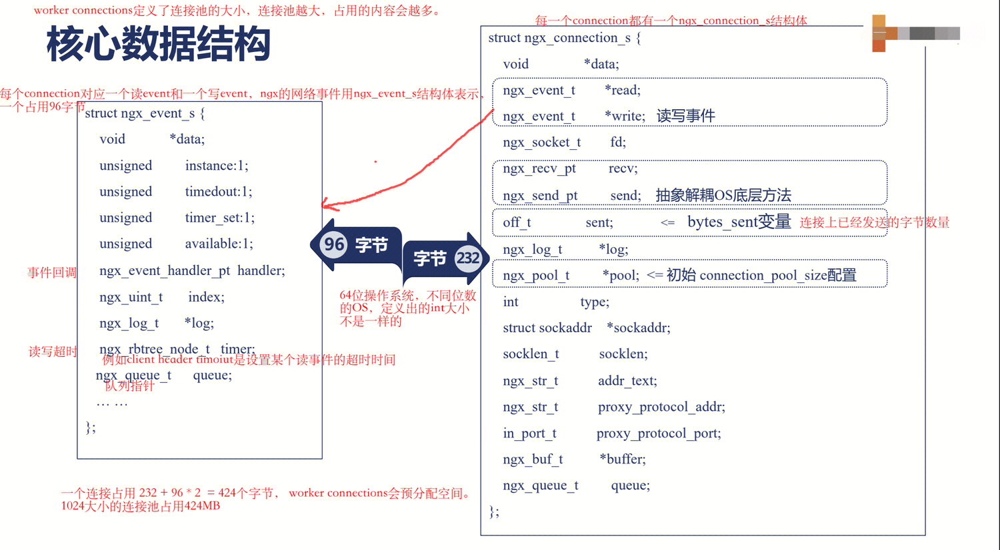
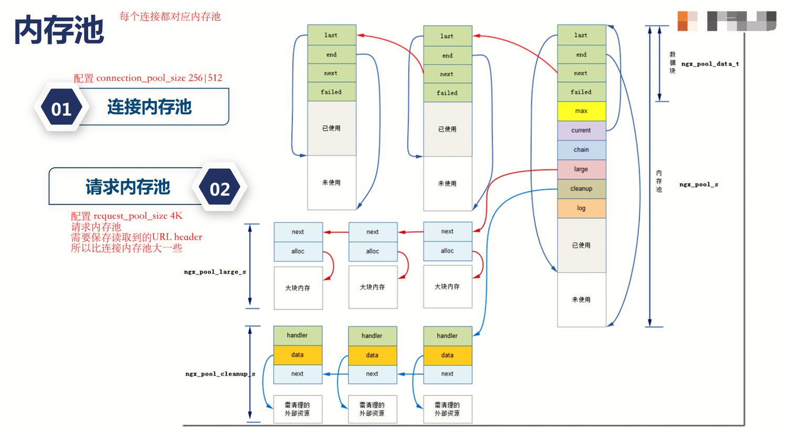

## nginx数据结构
#### ngx_cycle_t ： worker的结构体


#### nginx_connetion_s ： 单个连接的结构体



### nginx 内存池 ： nginx_pool_t


- 提前申请内存池可以减少向操作系统申请内存（alloc）的次数。但是内存池不够用的时候，仍然会继续向操作系统申请内存。
- nginx针对每个连接会提前分配内存池，内存池又分为连接内存池和请求内存池。连接内存池上的内存可以提供给该连接上所有的http连接使用（keepalive），等连接断开后再销毁内存。请求内存池针对单个http请求，单个请求处理完成之后就销毁。
- 连接内存池 connection_pool_size
- 请求内存池 request_pool_size


### GDB调试数据结构
- cycle


### workers 协同工作
- 通信：
```
	- 共享内存：数据共享，只能使用共享内存。
			- 共享内存读写存在竞争，nginx没有使用信号量来加锁，而是使用自旋锁来避免进程休眠。
			- 共享内存的数据结构主要是 红黑树 和 链表。
			- 共享内存的使用情况主要是所有worker都需要知道的信息，比如限流信息等
			- Ngx_http_lua_api也是共享内存的使用者。lua shared dict，存储内容使用红黑树，维护存储内容使用链表（lru算法，当超过定义大小的共享内存时，用于删除dict的中的数据）
			- 管理内存：slab内存管理器 
				- 内存分配：slot机制，best-fit方法
				- 需要安装slab第三方模块 
```
- 信号