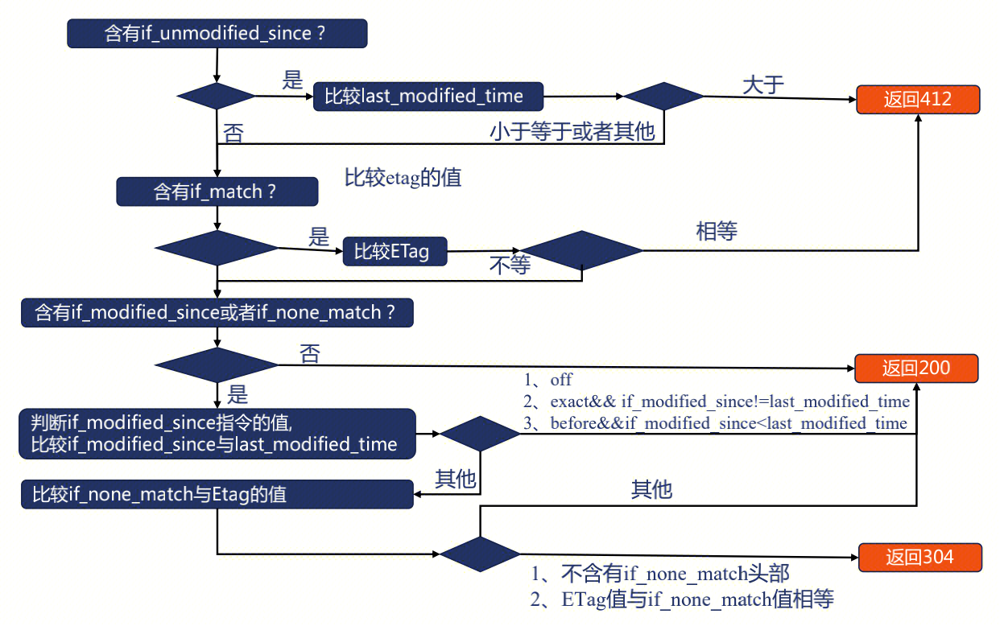
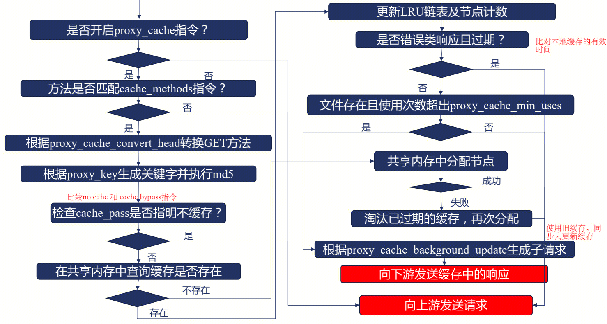
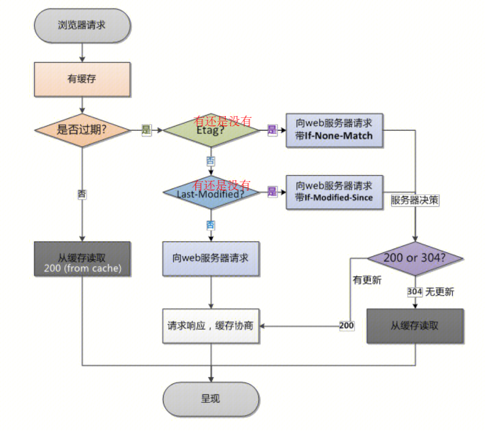
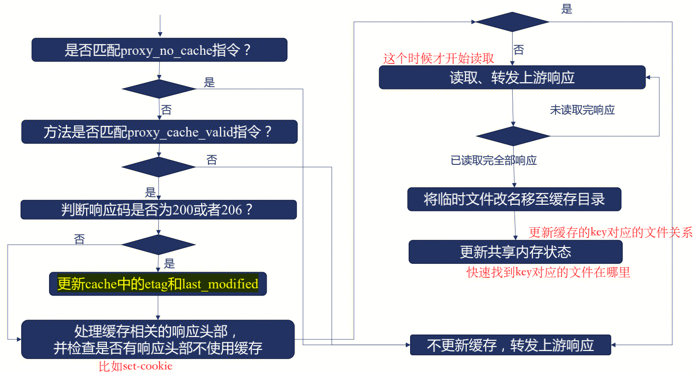

缓存是一个大型系统中非常重要的一个组成部分。在硬件层面，大部分的计算机硬件都会用缓存来提高速度，比如 CPU 会有多级缓存、RAID 卡也有读写缓存。在软件层面，数据库就是一个缓存设计非常好的例子，在 SQL 语句的优化、索引设计、磁盘读写的各个地方，都有缓存。

cache就近原则:

- **一是越靠近用户的请求越好**，比如能用本地缓存的就不要发送 HTTP 请求，能用 CDN 缓存的就不要打到 Web 服务器，能用 Nginx 缓存的就不要用数据库的缓存；

- **二是尽量使用本进程和本机的缓存解决**，因为跨了进程和机器甚至机房，缓存的网络开销就会非常大，在高并发的时候会非常明显。

## nginx cache

### 全局cache 

```lua
lua_shared_dict antitamper_cache 512m;
lua_shared_dict cc_limit 300m;
lua_shared_dict udr_time 300m;
lua_shared_dict deny_time 300m;
lua_shared_dict captcha_state 100m;
lua_shared_dict cloudwaf_status 32m;
lua_shared_dict cloudwaf_data 128m;
lua_shared_dict update_data 512m;
lua_shared_dict update_flag 128m;
lua_shared_dict update_domain_list 32m;
lua_shared_dict qps_data 256m;
lua_shared_dict attack_count 32m;
lua_shared_dict attack_detail 256m;
lua_shared_dict deny_count 32m;
lua_shared_dict bwlist_dict 512m;
lua_shared_dict bwlist_version_dict 128m;
```

优势：全局cache，所有进程共享，1.因此不会存在cache数据冗余的情况。2.进程间共享，便于交流。3.API多，get/set/delete/add/replace/incr/get_stale

劣势：共享内存并且每次操作都是全局锁，如果是高并发场景，不同worker之间容易引起竞争，所以单个shared.dict的体积不能过大。
 
### 进程cache
```lua
local lrucache = require "resty.lrucache"
local c = lrucache.new(200)
```

优势：1.预先分配好 key 的数量，而 shared dict 需要自己用 key 和 value 的大小和数量，来估算需要把内存设置为多少，进程cache内存更具有弹性。2.不会触发锁，因此效率高

劣势：容易多个worker存在多份冗余数据。
	
### 关于lua_shared_dict

- 基于红黑树实现 (非序列结构，在消费者生产者模式下，可能存在部分数据永远不被消费)
- lru淘汰方式


#### 红黑树
- 二叉树 最基本的树形结构 但是数据不具备规律 查找数据只能通过全局深度遍历或者广度便利店
- 二叉搜索树 左子节点数据 < 父节点数据 < 右子节点数据 数据具备一定的规律 查找时间在O(logN)级别 但是在特殊情况下可能退化成链表
- 二叉平衡树 通过算法在插入和删除数据时，调整树结构来保持树的平衡 因此插入时间将增加 但是查询时间将比较稳定在O(logN)
- AVL树 左右子树的深度相差不超过1 涉及单旋转和双旋转操作。
- 红黑树 1.节点是红色或者黑色 2.红色节点的父节点不能是红色节点 3.任意节点到树尾端的任意路径上经过的黑节点数量一致 4.根节点为黑 涉及颜色和树结构变化的操作。 左右子树深度相差可以超过1 但是查询性能和avl树相当。
- 红黑是用非严格的平衡来换取增删节点时候旋转次数的降低，任何不平衡都会在三次旋转之内解决，而AVL是严格平衡树，因此在增加或者删除节点的时候，根据不同情况，旋转的次数比红黑树要多。所以红黑树的插入效率更高


## nginx处理缓存过程
nginx缓存相关的模块可以分为三部分
### NGINX如何处理浏览器的条件请求

- If Match
- If UnModify since
- If none Match
- If Modify since

### NGINX如何处理浏览器的正常请求
#### 判断缓存是否有效流程

#### 向服务器发起请求的流程（可以和浏览器发起请求的过程类似）
``` 
proxy_cache_revalidate on 可以使用条件请求服务器  off 每次都是发送请求
```


### NGINX如何处理浏览器的响应


## 缓存穿透
### 问题：
缓存穿透是指，**NGINX和服务器都没有的数据**，被大量请求，比如订单号不可能为 `-1` ，但是用户请求了大量订单号为 `-1` 的数据，由于数据不存在，缓存就也不会存在该数据，所有的请求都会直接穿透到服务器。如果被恶意用户利用，疯狂请求不存在的数据，就会导致数据库压力过大，甚至垮掉。
### 方法：

- 严格的参数校验
- 布隆过滤器，过滤掉一定不存在的数据 https://zhuanlan.zhihu.com/p/43263751 （hash的方式，hash表中有值说明不一定存在，没有值一定不存在）

## 缓存击穿
### 问题：
缓存击穿是指缓存和服务器原本有的数据，但是缓存突然失效了。这时候如果有大量用户请求该数据，缓存没有则会去数据库请求，会引发服务器压力增大，可能会瞬间打垮。
### 方法一：
加互斥锁，第一个请求占有锁，直到释放锁，后续请求处于等待状态。
第一个请求发向服务器，更新缓存。使用缓存响应其他请求
``` 
proxy_cache_lock on
```
### 方法二：
第一个请求收到后，发起子请求更新缓存。在缓存更新之前都是用旧缓存响应请求
``` 
proxy_cache_use_stale
```


