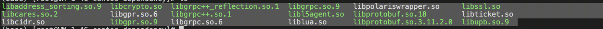
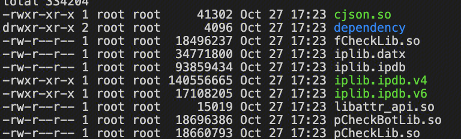
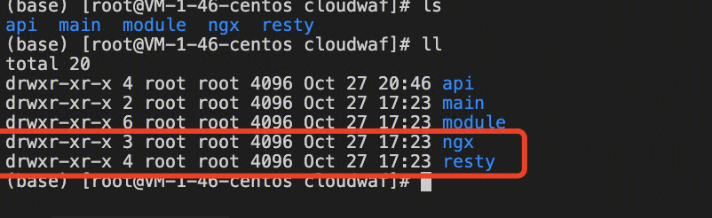

## 模块和configure
nginx编译第三方模块的时候，可以使用动态链接或者静态编译的方式。
例如，PCRE，ZLIB，OPENSSL可以使用系统提前安装的动态库来实现正则，压缩和加解密。
也可以在安装的时候，指定源码，一起编译进NGINX的二进制文件中。

## NGINX运行时依赖的的动态库
假如NGINX运行时有依赖的动态库，这个时候，需要将这些so文件假如到动态库的寻找路径。
例如：
``` 
export LD_LIBRARY_PATH=/usr/local/codeLucas/lucas-nginx/TencentCloudWAF_Engine/lib/dependency:$LD_LIBRARY_PATH
```
该目录下有以下so，虽然部分可能没有使用到：

其中libcryto.so和libssl.so都是openssl的动态库，但是如果nginx采用源码编译openssl的方式的话，就没有使用到这些动态库。

## lua-nginx-module
该模块通过--add-module的方式，加入到nginx的编译中。
该模块提供了init_by_lua_file / block等指令，从而引入lua代码。
当lua代码可以很方便的调用c函数，因此在运行中也可能需要动态库。
因此lua-nginx-module还有一个指令是：
``` 
lua_package_cpath   "/usr/local/codeLucas/lucas-nginx/TencentCloudWAF_Engine/lib/?.so;;";
```
该指令，提示应该去那里找这些so，该文件路径下有一下文件：

都是lua在运行中需要使用到的so。


## lua-resty-core
该模块是openresty提供的，lua通过ffi的方式调用c函数，提供了新的API使用方式，例如ngx.shared.DICT等。
使用该模块，需要两个核心的文件目录分别是 ngx 和 resty。并且在配置文件中指明去哪里寻找这个目录：

``` 
lua_package_path    "/usr/local/codeLucas/lucas-nginx/TencentCloudWAF_Engine/cloudwaf/?.lua;;";
```



