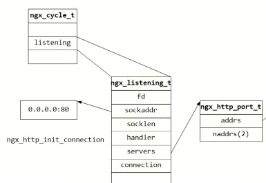

## 总览

## 流程
本流程主要的思路是理解转发规则如何下发
### 解析指令
#### 解析http（block）
创建ngx_http_conf_ctx_t
解析http块内和server块外的指令
并调用指令的回调函数，配置放在core_conf
#### 解析server（block）
创建ngx_http_conf_ctx_t
解析server块内和location块外的指令
并调用指令的回调函数，配置放在core_conf
#### 解析location（block）
创建ngx_http_conf_ctx_t
解析location块内的指令
并调用指令的回调函数，配置放在core_conf

#### 解析listen（command）
ngx_http_add_listen : 将当前cscf加入到cmcf的port中
ngx_http_add_address
ngx_http_add_addresses
ngx_http_add_server

#### 解析server_name（command）
ngx_http_core_server_name
图右

#### 解析upstream（block）
创建ngx_http_conf_ctx_t
解析http块内和server块外的指令
并调用指令的回调函数，配置放在upstream_conf
#### 解析server - upstream（command）

### merge配置
#### ngx_http_merge_servers
1.调用各个模块的merge_server函数，把http{}中的srv_conf和server{}中的srv_conf内的相同配置合并。
2.调用各个模块的merge_location函数，把http{}中的loc_conf和server{}中的loc_conf内的相同配置合并。
#### ngx_http_merge_locations
调用各个模块的merge_location函数，把server{}中的loc_conf和loc{}中的loc_conf内的相同配置合并。
#### 合并规则
由各个模块自定义
一般是如果内层没有配置，那么以外层为准，如果都没有配置，那么就用默认值；

### location优化
主要是为了加快location的查找
#### ngx_http_init_locations 
排序location双向链表
#### ngx_http_init_static_location_trees 
构建locaiton静态二叉树

### server优化
ngx_http_optimize_servers 创建listening结构，创建server_name hash表，创建端口到server配置的映射链路
#### ngx_http_server_names
创建server_name hash表

#### ngx_http_init_listening
- ngx_http_add_listening

- ngx_http_add_addrs

## 未完全理解的知识点

## 参考