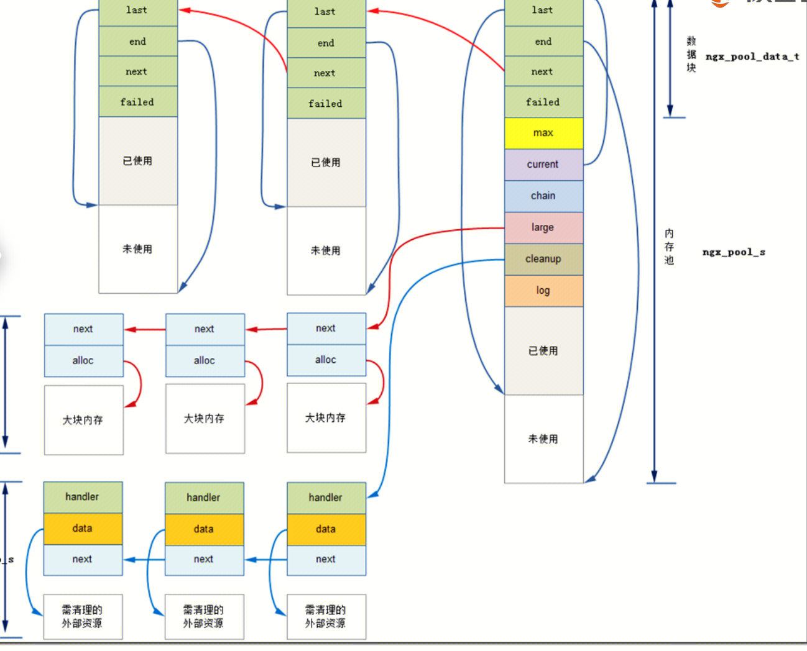

## 连接池
### 配置 worker_connections 
### 数据结构

``` 
//每个worker进程的数据结构
ngx_cycle_t
{
	free_connections    //指向空闲连接(链表元素)
	//worker_connections指定连接池最大的size，意味着nginx最大同时维护多少个连接。
	connections			//指向连接池(链表头)  
	read_events			//指向连接读事件(链表头)
	write_events		//指向连接写事件(链表头)
}
```

``` 
ngx_connection_s
{
	read				//指向读事件(链表元素)
	write				//指向写事件(链表元素)
	//bytes_sent变量数据源
	sent 				//该连接上已发送的字节。 
	ngx_pool_t pool	   //指向当前连接分配的内存池
}
```

```
ngx_event_s
{
	handler 			//事件回调，当event到来时调用这些方法。
	timer				//红黑树，event的多个定时器
}
```
## 内存池
### 背景

- nginx启动时，每个worker进程会分配到一片进程内存。
当有socket连接时，worker就会在当前的进程内存空间中申请一个内存池ngx_pool_t。这个内存池ngx_pool_t是给当前这个连接使用的。在连接数据结构中ngx_connection_s中pool成员指向了当前连接的内存池。
- ngx_pool_t长这样：
``` 
1. ngx_pool_t {  //内存池的管理分配模块 
2.      ngx_pool_data_t       d;         //内存池的数据块（上面已有描述），设为d 
3.   	size_t                max;       //数据块大小，小块内存的最大值 
4.      ngx_pool_t           *current;   //指向当前或本内存池 
5.      ngx_chain_t          *chain;     //该指针挂接一个ngx_chain_t结构 
6.      ngx_pool_large_t     *large;     //指向大块内存分配，nginx中，大块内存分配直接采用标准系统接口malloc 
7.      ngx_pool_cleanup_t   *cleanup;   //析构函数，挂载内存释放时需要清理资源的一些必要操作 
8.      ngx_log_t            *log;       //内存分配相关的日志记录 
9.  };
```
小空间使用ngx_pool_data_t，大空间使用ngx_pool_large_t

### 空间分配规则 
申请空间大于max的时候，走OS的allocate，使用ngx_pool_large_t。
申请空间小于max的时候，直接在内存池中取内存，使用ngx_pool_data_t。

## 内存池又分为连接内存池和请求内存池。
### 连接内存池配置 connection_pool_size
一个tcp上允许多个http请求，因此有些内存在一个连接上只需要申请一次就可以了，不需要每次有请求都申请。这些内存在连接内存池。
### 请求内存池配置 request_pool_size
为每个请求分配的内存，一般配置request_pool_size 4K ，需要保存读取到的URLheader 所以比连接内存池大一些。