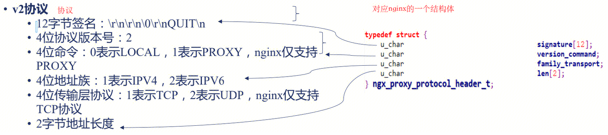

## proxy_protocol
### 必要性

- 四层代理情况下，往下传递client ip
- 前面有四层代理情况下，获取client ip

### 协议v1

### 协议v2

### NGINX四七层配置解析proxy_protocol

``` 
http {
    #...
    server {
        listen 80   proxy_protocol;
        listen 443  ssl proxy_protocol;
        #...
    }
}
或者
http {
    server {
        #...
        real_ip_header proxy_protocol;
      }
}

stream {
    #...
    server {
        listen 112233 proxy_protocol;
        #...
    }
}
```
### NGINX四七层配置发送proxy_protocol
```
http {
    proxy_set_header X-Real-IP       proxy_protocol_addr;
    proxy_set_header X-Forwarded-For proxy_protocol_addr;
}

stream {
    server {
        listen 12345;
        proxy_pass example.com:12345;
        proxy_protocol on;
    }
}
```


