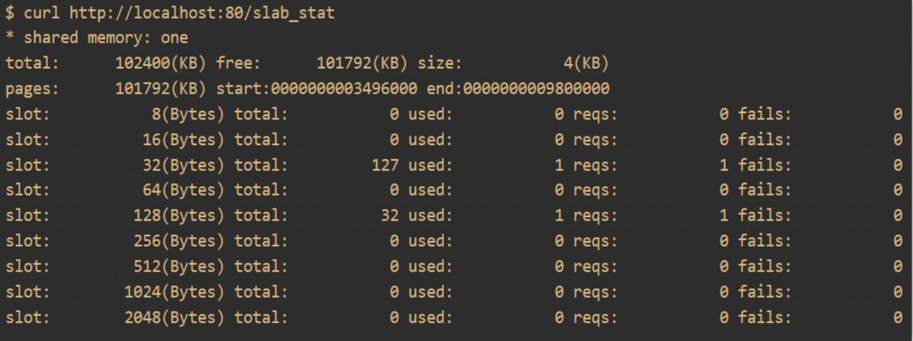

## Nginx共享内存
NGINX是一个多进程的架构模型，其中类似流量统计，流量控制，负载均衡等诸多功能需要在不同的worker进程之间共享数据，相互配合完成任务。这些功能都是通过共享内存的帮助来得以实现的。

NGINX共享内存的实现依赖于slab内存分配机制。为了更高效地使用内存空间，slab内存分配机制采用了经典的时间换空间的思想。而且在增加的计算时间中，绝大部分都采用了位移操作，尽可能地在提高内存使用率的同时节省CPU时间。

共享内存是众多进程间通信方式之一，通过把相同的一块物理内存映射到不同进程的虚拟地址空间，这样不同的进程之间可以相互看到某一个进程对内存的修改。采用这种方式，进程可以直接读写内存，不需要额外的数据copy，所以它是最快的进程间通信方式。

由于多个进程同享同一块内存区域，所以，需要某种同步机制比如NGINX使用的互斥锁进行同步。
https://www.nginx.org.cn/article/detail/368


## 如何保证共享内存的原子性？

### 申请共享内存 ngx_shmem.c
NGINX根据ngx_shm_t结构去申请和释放共享内存
``` 
typedef struct {
    u_char      *addr;
    size_t       size;
    ngx_str_t    name;
    ngx_log_t   *log;
    ngx_uint_t   exists;   /* unsigned  exists:1;  */
} ngx_shm_t;
```
申请共享内存过程：master执行系统调用申请共享内存，并将共享内存连接到自己的进程地址空间。mater fork worker进程的时候，所有的worker进程会自动继承master进程通过mmap和生成的虚拟地址空间。
根据系统申请共享内存的API不同，NGINX提供了多种申请共享内存的方式。分别是：
#### NGX_HAVE_MAP_ANON MMAP/MUNMAP
``` 
#if (NGX_HAVE_MAP_ANON)

ngx_int_t
ngx_shm_alloc(ngx_shm_t *shm)
{
    shm->addr = (u_char *) mmap(NULL, shm->size, PROT_READ|PROT_WRITE, MAP_ANON|MAP_SHARED, -1, 0);
    return NGX_OK;
}

void
ngx_shm_free(ngx_shm_t *shm)
{
    munmap((void *) shm->addr, shm->size);
}
```
#### NGX_HAVE_MAP_DEVZERO
```
#elif (NGX_HAVE_MAP_DEVZERO)

ngx_int_t
ngx_shm_alloc(ngx_shm_t *shm)
{
    ngx_fd_t  fd;
    fd = open("/dev/zero", O_RDWR);
    shm->addr = (u_char *) mmap(NULL, shm->size, PROT_READ|PROT_WRITE, MAP_SHARED, fd, 0);
    close(fd);
    return NGX_OK;
}


void
ngx_shm_free(ngx_shm_t *shm)
{
    munmap((void *) shm->addr, shm->size); 
}
```
#### 基于传统SYS V的共享内存
```
#elif (NGX_HAVE_SYSVSHM)

#include <sys/ipc.h>
#include <sys/shm.h>


ngx_int_t
ngx_shm_alloc(ngx_shm_t *shm)
{
    int id = shmget(IPC_PRIVATE, shm->size, (SHM_R|SHM_W|IPC_CREAT));
    shm->addr = shmat(id, NULL, 0);
    shmctl(id, IPC_RMID, NULL);
    return NGX_OK;
}


void
ngx_shm_free(ngx_shm_t *shm)
{
    shmdt(shm->addr)
}
#endif
```
### 虚拟地址空间VSZ和常驻地址空间RSS
通过ps aux |head -n1; ps aux | grep nginx可以看到nginx的虚拟地址空间大小VSZ和常驻地址空间大小RSS。
通过ngx_shm_alloc申请的共享内存，会完整的加入到nginx的进程虚拟地址空间，但是实际没有使用的时候是不会加入到常驻地址空间的。因此nginx可以申请远大于内存的共享内存大小，这是操作系统的虚拟内存实现的。

### slab共享内存管理
nginx slab对内存的基础管理就是页，对于申请大内存，nginx直接向上取整然后返回页空间；对于小内存，则是先返回一个页，然后通过slab机制在这个页上再次进行空间管理分配。因此，整个slab主要涉及到两个部分，和内存池差不多，一种是申请大内存的方式，一种是申请小内存的方式：

-  申请大内存的逻辑
申请大内存，也就是以页为单位进行空间申请。首先，这些页是连续排布的，他们的组织结构就是链表，使用过程中可能会出现数组拆解，在不连续的时候内存释放时他们就会以链表的形式组装在一起(初始情况下这个链表只有一个元素，就是整片连续的页空间数组)。在链表组织结构的前提下，申请大内存时，遍历链表上的页数组，如果页数组可以提供对应的页大小的话，那么就进行页数组拆分，拆分后将未使用的页数组继续保存在空闲页数组链表中。

- 申请小内存
申请小内存的逻辑是建立在大内存的基础之上的，首先他需要得到一个页空间，然后基于这个页空间进行slot管理，slot本质上就是一个内存页拆分为 2^n 大小的内存块然后进行管理的机制，nginx是通过位图进行管理的，通过位图信息就可以知道内存页拆分的小的内存块使用状态并进行分配与释放。

优势：
小对象内存分配友好 + 避免内存碎片 

### slab可视化
通过slab_stat能够查询到slot使用情况：



# 参考

- https://zhuanlan.zhihu.com/p/431649162
- https://blog.openresty.com.cn/cn/how-nginx-shm-consume-ram/#slab-%E4%B8%8E%E5%86%85%E5%AD%98%E9%A1%B5
- https://www.361shipin.com/blog/1546211276147916800