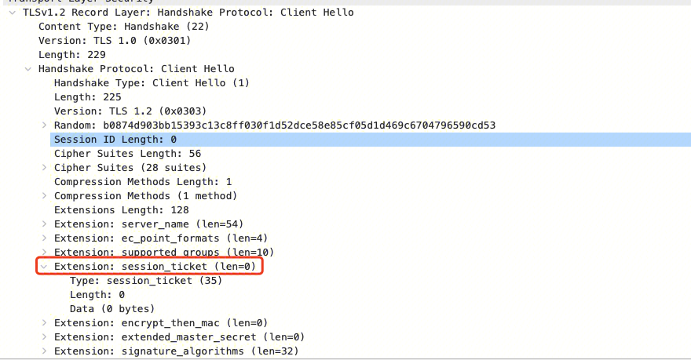
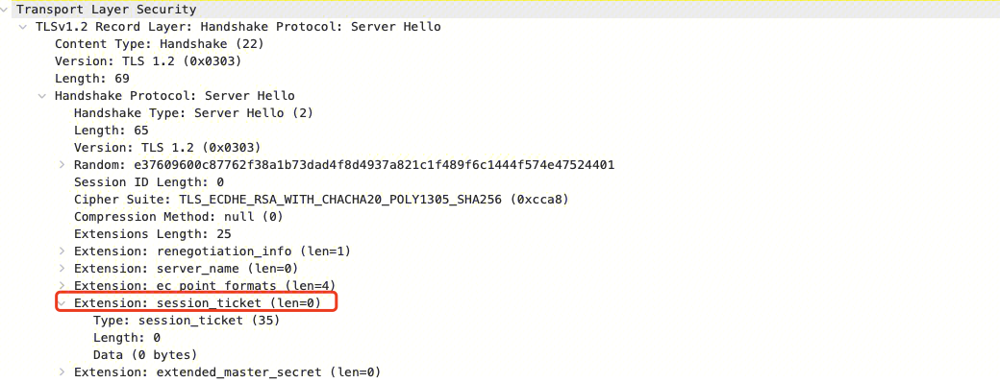
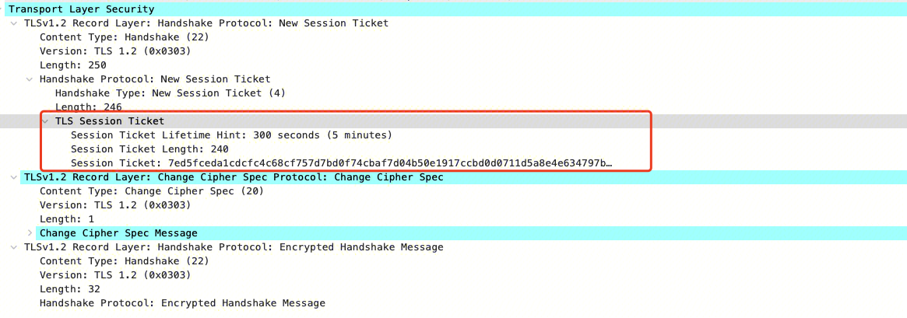

## 背景
TLS握手涉及计算开销和网络开销，可以利用Session复用来避免每次都需要TLS协商。
## 方式一 TLS Session ID
基于client和server在TLS握手中的SessionId比对，来确认是否复用的TLS Session。一致则复用，不一致则使用服务端发送的SessionID。
服务端存储session_id并存储与之对应的状态，如加密套件，master key等信息。如果服务端拿客户端传过来的session_id能拿到对应的信息，就表示此session_id有效，并尝试恢复会话。nginx配置为：
```
# 指定缓存大小为 30m
ssl_session_cache     shared:SSL:30m;
# 指定缓存时间为 1 天
ssl_session_timeout   1d;
# 这里需要关闭默认开启的 ssl_session_tickets
ssl_session_tickets   off;
```
由于session_id是存储在服务端，所以需要解决多台机器共享session_id的问题，一般来说在分布式系统中增加session_id的共享会带来一些麻烦。

缺点：服务端需要维护SessionID 和 Session信息的映射，且集群模式下需要lua上传和下载Session到redis等数据库。

解决方法： 
NGINX配置为：
```
ssl_session_fetch_by_lua_file   lua/session_fetch.lua;
ssl_session_store_by_lua_file   lua/session_store.lua;
ssl_session_timeout             1d;
ssl_session_tickets             off;   //此处tickets为OFF
```

## 方式二 TLS Session Ticket
### 第一次会话，生成session ticket

- 首先ClientHello会发送空的session_ticket插件来表示支持session_ticket。

- 服务端如果希望使用此机制，会在ServerHello中返回空的session_ticket扩展。

- 客户端在密钥协商完成之后在Change Cipher Spec包之前发送New Session Ticket包：

其中session ticket值为本次协商的结果状态(如加密套件，master secret等)，并使用只有服务端知道的密钥(nginx中的ssl_session_ticket_key配置)加密得到。

### 第二次会话，使用session ticket
下次发起请求时，会在ClientHello的session_ticket插件上带上此ticket，服务端尝试从中解析出对应主密钥，如果此ticket验证通过，则服务端就重用session状态，直接握手完成，开始发送Change cipher spec，

该方法由于使用了ssl ticket key，破坏了前向安全性。
但是集群模式下不需要数据中心。属于计算换存储。
NGINX配置为：
```
ssl_session_tickets on;  // 默认打开，可以不用配置
ssl_session_ticket_key session_tickert/current.ticket;
```
ssl_session_ticket_key后制定一个文件，nginx使用该文件内容加密TLS会话信息后形成ticket发送给客户端，该文件只有服务端知道，客户端也无法解密ticket内容。多个服务端共享ssl_session_ticket_key的文件，实现集群共享ticket。


# 参考资料：
- https://www.cnblogs.com/hugetong/p/12192587.html
- https://blog.lv5.moe/p/nginx-ssl-tls-configuration-optimization
- https://leeweir.github.io/posts/nginx-tls-session-reuse/
- https://xiaochai.github.io/2020/07/05/tls/#%E4%BD%BF%E7%94%A8session_id-%E5%92%8Csession_ticket-%E5%87%8F%E5%B0%91%E6%8F%A1%E6%89%8B%E6%AC%A1%E6%95%B0