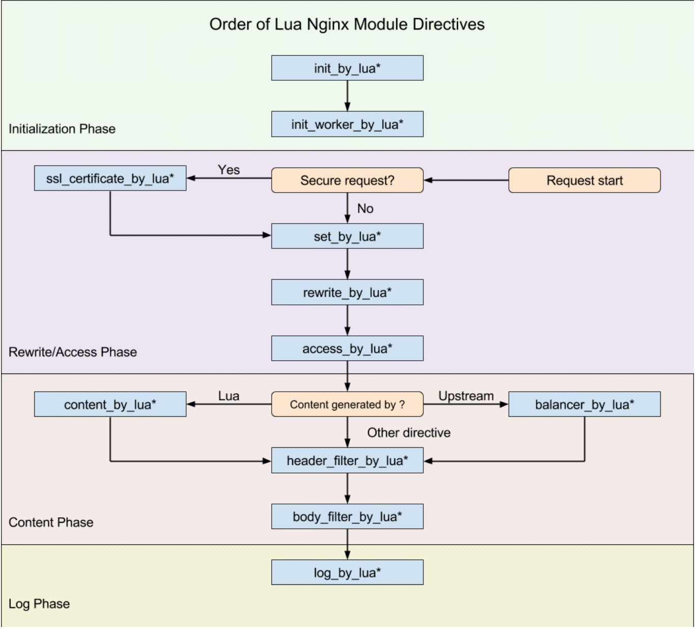
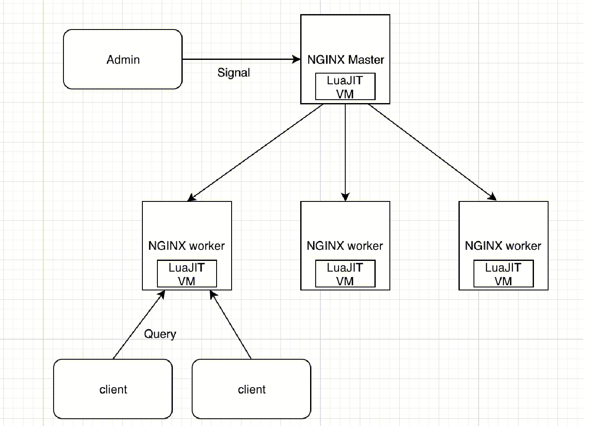

## NGINX 诞生于俄罗斯，Lua 诞生于巴西，OpenResty 诞生于中国
- 这三门同样精巧的开源技术都出自金砖国家
## Nginx注意事项
- 要尽可能少地配置 nginx.conf；
- 避免使用 if、set 、rewrite 等多个指令的配合；
- 能通过 Lua 代码解决的，就别用 NGINX 的配置、变量和模块来解决。

## Nginx官方支持使用js控制部分运行逻辑
- js性能不如luajit
- js生态好过luajit


## OpenResty中的Nginx
 - OpenResty并非Nginx + lua，而是一个完整的web服务器生态。OpenResty使用Nginx作为底层的网络转发库。
 因此在OpenResty中应该尽量少的使用Nginx.conf来满足需求，而是应该使用lua来解决问题。
 - OpenResty在Nginx master和worker进程外，增加了`特权进程`，该进程不监听端口，拥有master进程的权限，可以执行一些高权限任务，例如读写磁盘文件，甚至OpenResty的自我升级。
 - Nginx的11个执行阶段：
 	- POST READ
 	- SERVER REWRITE
 	- FIND CONFIG
 	- LOCATION REWRITE
 	- **POST REWRITE**
 	- PREACCESS
 	- ACCESS
 	- **POSTACCESS**
 	- PRECONTENT
 	- CONTENT
 	- LOG
 - OpenResty的11个指令
 	- init_by_lua : master进程创建时执行
 	- init_work_by_lua ：worker进程创建时执行
 	- ssl_certificate_by_lua
 	- set_by_lua
 	- rewrite_by_lua
 	- access_by_lua
 	- content_by_lua
 	- balancer_by_lua
 	- header_filter_by_lua
 	- body_filter_by_lua
 	- log_by_lua


## OpenResty中的Luajit
- lua可以方便的调用c库，例如nginx和openssl的c函数都可以方便的使用。
- luaJit并非和lua是一致的，OpenResty使用的luajit。LuaJIT 的语法兼容 Lua 5.1
- 基本数据类型 string("hello")，function(print)，boolean(true)，number(3.0)，table({xx:xx})， nil(nil)
- string : 
	- 在 Lua 中，字符串是不可变的值，如果你要修改某个字符串，就等于创建了一个新的字符串。这种做法显然有利有弊：好处是即使同一个字符串出现了很多次，在内存中也只有一份；但劣势也很明显，如果你想修改、拼接字符串，会额外地创建很多不必要的字符串。
	- 在 Lua 中，我们使用两个点号来表示字符串的相加。
	- 在 Lua 中，你有三种方式可以表达一个字符串：单引号、双引号，以及长括号（[[]]）(不转义)
- bool：
	-  在 Lua 中，只有 nil 和 false 为假，其他都为真，包括 0 和空字符串也为真
- 函数：
	- 函数可以作为变量，当作另一个函数的入参和出参 
- 和go一样，可以使用_来表示虚变量。

## luajit虚拟机
- OpenResty 的 worker 进程都是 fork master 进程而得到的，因此master 进程中的 LuaJIT 虚拟机也会一起 fork 过来。在同一个 worker 内的所有协程，都会共享这个 LuaJIT 虚拟机，Lua 代码的执行也是在这个虚拟机中完成的。


## lua标准库
- Lua 比较小巧，内置的标准库并不多。而且，在 OpenResty 的环境中，Lua 标准库的优先级是很低的。对于同一个功能，更推荐优先使用 OpenResty 的 API 来解决，然后是LuaJIT 的库函数，最后才是标准 Lua 的函数。OpenResty的API > LuaJIT的库函数 > 标准Lua的函数。
- 常见的lua标准库：string库 ， math库 ， table库

## lua和luajit的区别
- `标准 Lua 和 LuaJIT 是两回事，LuaJIT 只是兼容了 Lua 5.1 的语法。`
- Jit性能差异：Lua作为脚本语言，出于性能考虑，内置了虚拟机，所以 Lua 代码并不是直接被解释执行的，而是先由 Lua 编译器编译为字节码（Byte Code），然后再由 Lua 虚拟机执行。而 LuaJIT 的运行时环境，除了一个汇编实现的 Lua 解释器外，还有一个可以直接生成机器代码的 JIT 编译器。开始的时候，LuaJIT 和标准 Lua 一样，Lua 代码被编译为字节码，字节码被 LuaJIT 的解释器解释执行。但不同的是，LuaJIT 的解释器会在执行字节码的同时，记录一些运行时的统计信息，比如每个 Lua 函数调用入口的实际运行次数，还有每个 Lua 循环的实际执行次数。当这些次数超过某个随机的阈值时，便认为对应的 Lua 函数入口或者对应的 Lua 循环足够热，这时便会触发 JIT 编译器开始工作。JIT 编译器会从热函数的入口或者热循环的某个位置开始，尝试编译对应的 Lua 代码路径。
编译的过程，是把 LuaJIT 字节码先转换成 LuaJIT 自己定义的中间码（IR），然后再生成针对目标体系结构的机器码。所以，所谓 LuaJIT 的性能优化，本质上就是让尽可能多的 Lua 代码可以被 JIT 编译器生成机器码，而不是回退到 Lua 解释器的解释执行模式。
- c库函数调用差异：luajit使用ffi的方式调用c函数和数据结构，比传统的lua/c api性能更优。
- api差异：例如ngx.re之类的部分luaAPI，一开始基于lua/c api的lua-nginx-module，后来基于ffi的lua-resty-core。

## lua-nginx-module和lua-resty-core的区别
- lua-nginx-module中的API主要是利用ngx或ssl编写的c函数构造。c函数是无法把返回值传给 Lua 代码的，而是需要通过栈，来传递 Lua和 C 之间的调用参数和返回值。这些代码也不能被 JIT 跟踪到，所以对于 LuaJIT 而言，这些操作是处于黑盒中的，没法进行优化。
- lua-resty-core使用FFI调用c函数。FFI 的交互部分是用 Lua 实现的，这部分代码可以被 JIT 跟踪到，并进行优
化。
- CFunction 的实现方式已经被OpenResty 废弃，相关的实现也从代码库中移除了。现在新的 API，都通过 FFI 的方式，在 lua-resty-core 仓库中实现。
- lua-nginx-module作为nginx第三方模块，需要在编译nginx的时候编译。lua-resty-core是lua，需要在nginx中配置路径，例如：
    lua_package_path    "/usr/local/codeLucas/lucas-nginx/TencentCloudWAF_Engine/cloudwaf/?.lua;;";
    lua_package_cpath   "/usr/local/codeLucas/lucas-nginx/TencentCloudWAF_Engine/lib/?.so;;";


## 如何检测FFI中的内存泄漏？
- valgrind ： https://zhuanlan.zhihu.com/p/75416381

## NYI
- NYI：Not Yet Implemented，无法被jit编译的函数
- 检测NYI：init_by_lua 中，添加
```
local v = require "jit.v"
v.on("/tmp/jit.log")
```

## 关于table
- lua中存在table的函数。
- luajit对table的函数进行了扩展。
- OpenResty维护了自己的luajit分支，并对函数进行了进一步的扩展。
- table是hash ，array ， set的混合形式

## 元表
- 元表的作用与函数重载较类似
- 一般使用元表来模拟类
	- by_lua file中很少使用类，因为没有对象
	- mysql，redis等库中，基本使用元表来模拟类，因为存在对象，比如连接 

## lua-resty-luacache
- 看源码要首先看数据结构
- FFI，允许lua代码中调用c库函数