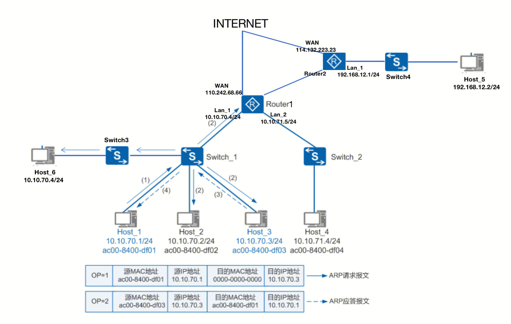
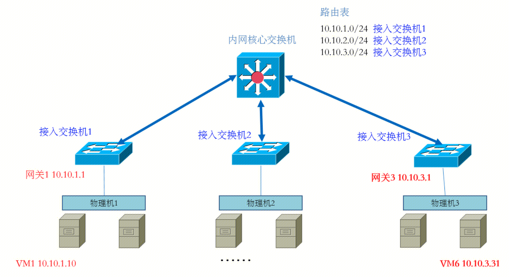
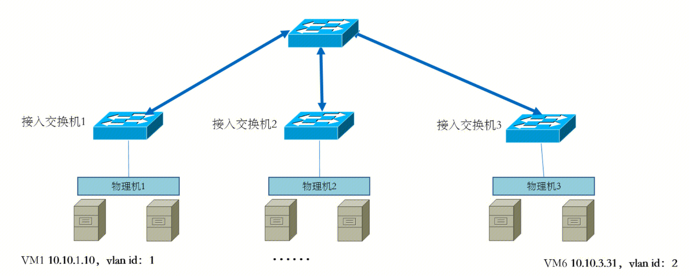
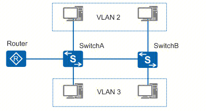
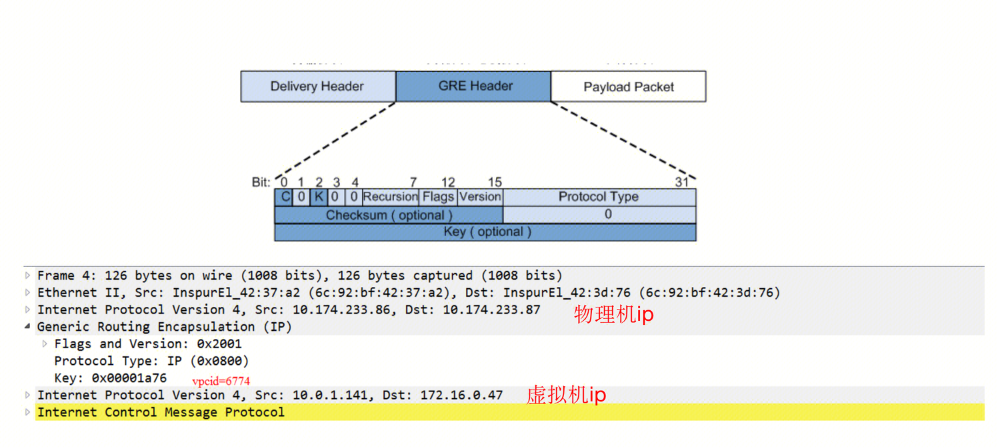
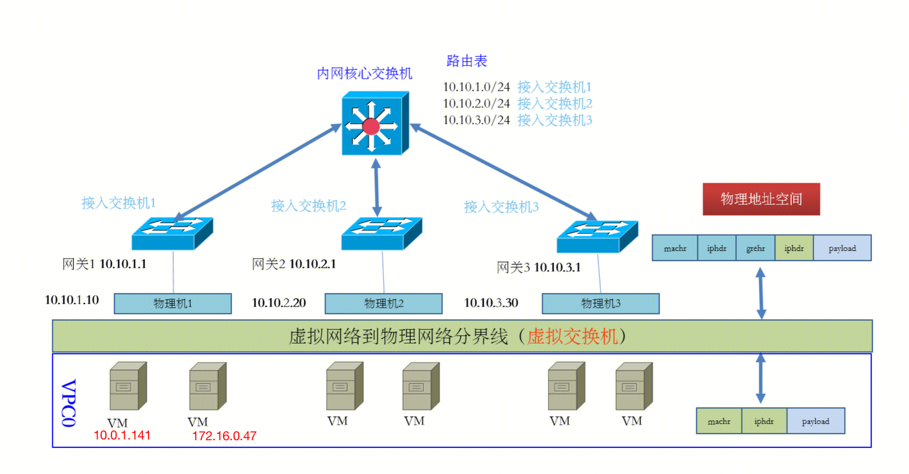
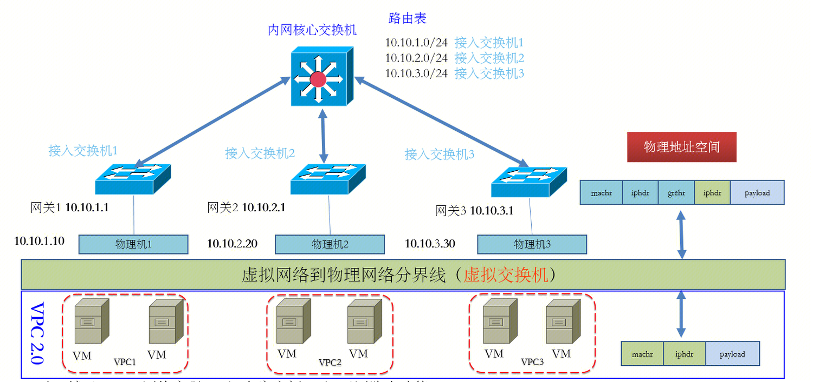
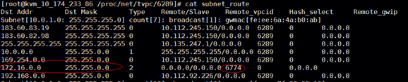

## 设备
搭建网络拓扑涉及到的角色：

- 虚拟机: rs
- 宿主机: host
- route_table
虚拟主机IP和宿主机IP的映射表
- neigh_table
虚拟主机IP和虚拟主机MAC的映射表
- subnet_route
VPC子网的路由策略。
同个VPC内的子网不需要配置subnet_route，因为通过route_table即可查找。
- 交换机
- 路由器

## 网络
### 普通物理网络

H:宿主机（宿主机内还可以再定义虚拟机VM，VM的IP需要在H同个网段） S:交换机 R:路由器
图中H1-4和H6，S1-3和R1组成了一个局域网，该局域网有2个子网（网段10.10.71.0/24和10.10.70.0/24）。
图中H2，S4和R2组成了一个局域网，该局域网有1个子网（网段192.168.12.0/24）。
子网由交换机+同个网段的宿主机构成，子网内机器（如H1到H3和H6）通过二层交换机通信。
### 子网内通信
#### H1要向H3发送数据
当需要通信的两台主机处于同一网段时（判断是否属于同一个网段是通过子网掩码计算的），如图中的H1和H3，H1要向H3发送数据。
1.H1查询本地ARP表，找H3 IP对应的MAC地址。
2.没找到，H1广播方式发送一个ARP请求报文（交换机所有端口转发），H3收到后单播回应H1，告知H1自己的MAC地址。这个过程中：交换机学习到了MAC和端口的对应关系，H3学到了H1的IP和MAC对应关系，H1学到了H3的IP和MAC对应关系
3.使用源和目的MAC地址，封装链路层帧，并发送给交换机。交换机基于目的MAC地址执行端口转发。
4.H3收到帧，目的MAC地址是自己则处理（基于linux网络协议栈），不是自己则丢弃。
### 局域网内跨子网通信
#### H1要向H4发送数据
前提：
a. H1，H4上已经配置缺省网关，没有缺省网关将无法跨子网通信。H1的网关指向R1的Lan1口（10.10.70.4），H5的网关指向R1的Lan2口（10.10.71.5）

步骤：
1. H1通过子网掩码比对，发现H4的ip地址和自己并非一个字网。首先，H1发送ARP请求报文，请求网关R1的IP地址对应的MAC地址。然后，H1收到ARP应答报文后，将数据报文封装并发给网关。（帧目的MAC为R1MAC，源MAC为H1 MAC）
2.R1收到帧，利用协议栈解析出目的ip。发现目的ip在自己的直连网络中，则直接将帧发送给H4.（帧目的MAC为H4的MAC，源MAC为R1的MAC）.
4.H4收到帧，目的MAC地址是自己则处理（基于linux网络协议栈），不是自己则丢弃。

### 局域网间跨子网通信
首先，子网内ip非公网ip，不能通过公网通信。即无法通过H1->R1->INTERNET->R2->H5链路通信。因为动态路由表中不可能存在内网IP的路由策略。
但是，局域网间跨子网（网段）通信，仍然需要借助路由器。
#### H1要向H5发送数据
前提：
a. H1和H5上已经配置缺省网关，没有缺省网关将无法跨子网通信。H1的网关指向R1的Lan1口（10.10.70.4），H5的网关指向R2的Lan1口（192.168.12.1）
b. 在R1上指定静态路由。使在192.168.12.0/24网段的目的ip，下一跳转发到R2。在R2上指定静态路由，使在10.10.70.0/24网段的目的ip，下一跳转发到R1。

步骤：
1. H1通过子网掩码比对，发现H5的ip地址和自己并非一个字网。首先，H1发送ARP请求报文，请求网关R1的IP地址对应的MAC地址。然后，H1收到ARP应答报文后，将数据报文封装并发给网关。（帧目的MAC为R1MAC，源MAC为H1 MAC）
2. 网关R1收到帧，利用协议栈解析出目的ip。查找路由表，转发给R2（帧目的MAC为R2的MAC，源MAC为R1的MAC）。
3. R2收到帧，利用协议栈解析出目的ip。发现目的ip在自己的直连网络中，则直接将帧发送给H5.（帧目的MAC为H5的MAC，源MAC为R2的MAC）.
4. H5收到帧，目的MAC地址是自己则处理（基于linux网络协议栈），不是自己则丢弃。

## 腾讯云物理网络
10.10.0.0/16网段。只有一个10.10.0.0/16网段局域网

`接入交换机1下所有的母机属于子网内通信。
接入交换机1和接入交换机2之间的母机属于局域网内跨子网通信，需要核心交换机根据路由表转发。`

物理机：或者成为宿主机，是一个机柜。可以构造很多的虚拟机。
### 特点：
1.在同个网段的宿主机通过一个交换机相连。
2.一个宿主机上的虚拟机的IP必须和宿主机在同个网段。
--->
虚拟机的IP和交换机有关。
### 缺陷：
`1.所有用户共享一个网络空间`
2.虚拟机IP提前规划且固定，用户无法自定义ip，不够灵活。
3.虚拟机在IP不变的情况下，仅能在同个网段内的宿主机间迁移。物理网络下，同个网段的宿主机，往往都是通过一个交换机连接的。**虚拟机IP地址和交换机是关联的**。虚拟机无法在机房内随意迁移。例如物理机1上的虚拟机在Ip不变的情况下被转移到物理机2中，由于二层交换机无法进行三层传递，虚拟机学习不到的mac地址。**背景**：虚拟机迁移是指将虚拟机从一个物理机迁移到另一个物理机。为了保证虚拟机迁移过程中业务不中断，则需要保证虚拟机的IP地址保持不变，这就要求虚拟机迁移必须发生在一个二层网络中。

## 腾讯云VLAN
不是特别重要
10.10.0.0/16网段。只有一个10.10.0.0/16网段局域网。该网段基于vlan隔离，因为vlanid12bit的限制。在10.10.0.0/16中，最多有4096个隔离的局域网。

### 特点：
1.在同个网段的宿主机不需要围绕同一个交换机相连。
2.一个宿主机上的虚拟机的IP必须和宿主机在同个网段。
--->
虚拟机的IP和交换机无关。

### 优势：
`1.VLAN间网络隔离`
2.因为vlan技术，**虚拟机IP地址与交换机无关**，虚拟机在同一个二层网络内迁移，不必局限于某一固定的物理范围。用户的网络构建和维护更方便灵活。

### 劣势：
1。VLAN作为当前主流的网络隔离技术，在标准定义中只有12比特，因此可用的VLAN数量仅4096个。对于公有云或其它大型虚拟化云计算服务这种动辄上万甚至更多租户的场景而言，VLAN的隔离能力无法满足。
2.虚拟机在IP不变的情况下，还是仅能在同个网段内（二层网络）的宿主机间迁移。

## GRE
`用于在ip层加入源母机和目的母机的ip，作用是让包在母机间通信，母机都通过物理网络连接，自然可达`
GRE是三层网络协议。GRE提供了将一种协议报文封装在另一种协议报文中的机制，是一种三层隧道封装技术，使报文可以通过GRE隧道透明的传输，解决异种网络的传输问题。

`通过GRE封装，虚拟机迁移不受网络架构限制`
在物理网络或者VLAN网络中，虚拟机(ip不变)都只能在一个二层网络（广播域）中迁移。
通过GRE封装，虚拟机ip可以和宿主机ip完全没有关系。
主要两个宿主机可达（普通物理网络中的所有Host，通过内网核心交换机连接的所有物理机），那么部署在宿主机上的虚拟机就可达。
如图所示，用户局域网10.174.233.0/24内的两台宿主机10.174.233.86和10.174.233.87（宿主机局域网可以通过物理网络或者VLAN构建）上的虚拟机IP不再需要局限在10.174.233.0/24内，而是可以在私用网段中任意选择IP地址。

## 腾讯云VPC0
10.10.0.0/16网段。宿主机处于10.10.0.0/16网段物理网络局域网。虚拟机可以超出10.10.0.0/16网段局域网。但是只有VPC0一个局域网。

`虚拟交换机`
### 特点：
一个宿主机上的虚拟机的IP和宿主机IP完全无关。（GRE特性）
--->
虚拟机的IP和交换机无关，虚拟机的IP和宿主机无关。

### 缺陷：
`1.所有用户共享一个网络空间` 
因为宿主机在同一个物理网络中。
只要宿主机之间的物理网络可达，那么宿主机上的虚拟机之间也可达。因为虚拟机IP和宿主机IP的对应关系route_table在整个网络中只有一个（没用通过VPCID再隔离一次），所以整个物理网络中也只能有一个vpc网络。这个VPC网络称作VPC0。
例如：

- 宿主机(10.10.1.9) route_table
虚拟机IP（172.16.0.47）: 宿主机IP(10.10.1.10) 
- 宿主机(10.10.1.10) neigh_table
虚拟机IP(172.16.0.47) :  虚拟机172.16.0.47的MAC地址

通信过程：10.0.1.141(vm) --> 172.16.0.47(vm)
1、  源虚拟主机10.0.1.141发ARP请求，源宿主机10.10.1.9的虚拟交换机会代答ARP请求，此时ARP请求不会出源宿主机。
2、  在源虚拟机获取到MAC地址后（代答的MAC地址，不是实际的目的虚拟机的MAC地址），开始发IP包，会在源虚拟交换机上查询目的虚拟主机IP172.16.0.47和宿主机IP的route_table，进行目的宿主机寻址，即找到目的虚拟主机所在的目的宿主机10.10.1.10；
3、  在源虚拟交换机上会进行Overlay封装，即封装GRE报文，然后通过物理网络将Overlay之后的包转给目的宿主机10.10.1.10，源宿主机和目的宿主机只需要三层IP可达就行（要求宿主机在同个子网，或者不同子网间具有路由策略）；
4、  目的宿主机上的虚拟交换机（即目的宿主机）进行Overlay解封，并查询虚拟主机IP和虚拟主机MAC的映射表(neigh_table)，得到虚拟机172.16.0.47的MAC地址，最终把包转给目的虚拟主机172.16.0.47；

### 优点：
通过overlay封装，使得虚拟机迁移可以跨二层网络。仅需更新虚拟机对应的宿主机地址，虚拟交换机自动学习到新地址。

## 腾讯云VPC>0
10.10.0.0/16网段。宿主机处于10.10.0.0/16网段局域网。虚拟机可以超出10.10.0.0/16网段局域网。虚拟机IP和宿主机IP的对应关系以VPCID隔离，因此有无线个VPC局域网。

### 特点：
1.一个宿主机上的虚拟机的IP和宿主机IP完全无关。（GRE特性）
--->
虚拟机的IP和交换机无关，虚拟机的IP和宿主机无关。

### 优点：
1.虚拟机迁移可以跨二层网络
2.用户局域网之间网络隔离（通过物理机子网隔离）。
一个VPC的所有宿主机处于一个子网。
两个VPC互通，需要实现子网间互通。

route_table和neight_table都以VPCID进行隔离，当前vpc发起的通信，只能找到当前VPC的子母机关系，也只能找到当前VPC的子机和MAC的地址映射表。

同VPC通信流程：
VM1发往VM2的目的MAC是根据子机内部的arp缓存表来获取的；如果子机内部没有arp缓存，子机会发起arp请求，母机截获子机发起arp请求，会回答一个“伪造”的mac，这个arp欺骗逻辑是母机上的vpcko组件实现的，为了能把子机的包转到对应的GRE设备上进行封包流程。
数据包到GRE设备后，母机的vpcko组件基于目的子机IP，查子母机关系表（以VPCID进行隔离），如果在同个VPC内，能找到目的端的母机IP地址，并进行GRE封装。
出母机的数据包是物理网络空间进行IP转发。
在目的端母机上，解封GRE头部，基于GRE中的目的子机IP和VPCID，查子机与MAC地址映射表（以VPCID进行隔离），找到VM2的MAC地址，进而把报文转发到VM2。

跨VPC通信流程：
**前提条件**：建立对等连接，对等连接相连是VPC子网，且对等连接两端不能处于同网段，同时也需要在两端的VPC子网路由表中添加到互通VPC对等连接的路由策略。
VPC之间的互通路由策略是保存在子网路由表（subnet_route）。
流程：
VM1子机10.0.1.141（vpcid=6289，母机为10.174.233.86） ping VM2子机172.16.0.47（vpcid=6774，母机 10.174.233.87）
VM1发往VM2的数据包到VM1母鸡GRE设备后，母机的vpcko组件基于目的子机IP（172.16.0.47），查子母机关系表route_table（以VPCID进行隔离）。如果在同个VPC内，能找到目的端的母机IP地址，并进行GRE封装。但是因为跨VPC，所以在route_table查不到之后，在subnet_route中继续找。
由于对等连接的双方都在子网路由表中添加到互通VPC对等连接的路由策略，路由策略是：

在subnet_route找到VM2子机172.16.0.47的下一跳vpcid为6744，GRE封装后的vpcid字段设置为6774。
