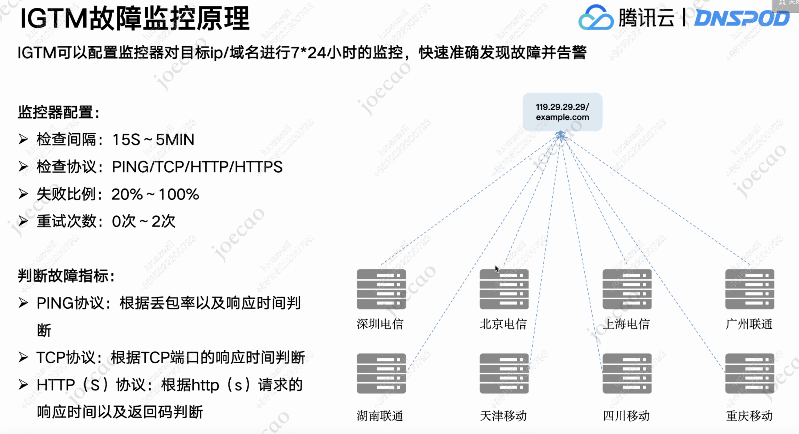

### waf网络环境：
以saas-waf接入www.baidu.com为例

- 1.用户接入www.baidu.com，waf侧将返回一个一级cname，例如f0d153d71d491e1c8dff19f573c360db.qcloudwaf.com。
- 2.用户拿到该一级cname，去自己的dns服务器上增加一项cname记录（www.baidu.com ---> f0d153d71d491e1c8dff19f573c360db.qcloudwaf.com）


### DNS解析过程
https://blog.csdn.net/a3192048/article/details/84715996
注意区分递归解析和迭代解析
递归解析又要区分递归查询和迭代查询
上图为递归解析的递归查询

### 本地DNS代理
https://zhuanlan.zhihu.com/p/55240680
可以自己指定resolver，比如nginx的resolver配置，这resolver是本地dns代理。这个resolver一般是自有DNS服务器或者公共DNS服务器。
如果不指定默认是运营商就近提供的。
local DNS 默认是运营商DNS服务器

### 智能DNS解析
传统的DNS解析，根据域名返回IP，当用户配置多个A记录时，随机返回IP。
智能DNS可以按照多种运营/地域等方式划分IP。例如，来自北京的LocalDNS请求，返回北京的IP，从而实现就近接入。


### 公共DNS服务器
如果用户指定了resolver，例如指定114.114.114.114：
```
 dig  ins-3si558ff.ias.tencent-cloud.net @114.114.114.114
```
那么114.114.114.114会作为localDns，去查询DNS。
在这种情况下，有可能会导致智能DNS解析失效。因为，localDNS不再是运营商DNS，可能发送查询请求的时候，带的运营商和地域信息和client的运营商和地域信息是不一致的。
这种问题，通过ecs协议解决。https://help.aliyun.com/document_detail/29730.html
https://www.sohu.com/a/292809721_495675
公共DNS服务器，基于clientip，来指定地域或者运营商。


### IGTM
DNS IP探测，智能调度



### DNS生效时间
DNS记录修改后，生效时间主要由本地DNS代理控制：
「腾讯DNSPod是权威DNS服务器，在DNSPod中变更解析记录是秒级生效的。但是因为本地DNS代理会缓存域名的解析结果，当用户访问域名时，如果本地DNS缓存未到期，是不会向DNSPod请求最新的解析记录，而是直接将之前缓存的解析结果返回给客户，所以修改/删除/暂停记录的解析生效时间需要等到客户端本地DNS的缓存过期」

如何缩短本地DNS代理缓存时间：
「修改DNS解析记录时，缩小记录的TTL。本地dns代理会基于该TTL决定缓存的过期时间。部分本地dns会忽略记录的TTL」


