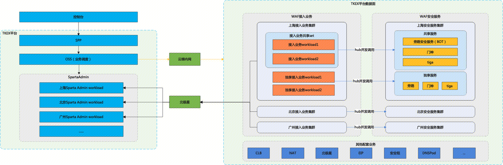

## 1、背景
目前，WAF的配置和业务组件部署环境不一，服务调度更多地是依赖内网IP通信。并且核心业务接入引擎部署在RS上，生产、部署和更新人工干预比较多，投入成本大。总结一下，主要存在以下痛点：

- 组件之间业务调用方式有些还是基于配置文件中的IP，在扩缩容的时候不易维护；

- 核心业务部署在母机RS上，需要手动按照标准文档进行RS生产和部署；需要手动对RS集群进行扩容和收缩，导致运营成本较高；

SAASWAF通过反向代理接入客户业务。

当前，WAF所有业务均部署在自研云上，CLB和WAF之间通过私有网络打通，客户访问业务流程如下图所示：

## 2、目标和计划
最终目标是通过TKE平台实现对WAF的运维和部署。实现自动扩缩容。

## 3、设想
SAASWAF的数据面组件从原有的CVM部署改造成容器部署在TKE平台，在OSS中开发接口进行资源的部署和调度。业务侧的改造涉及以下几点：

- 1、数据面组件容器化，根据业务进行拆分。
- 2、业务侧调用通过北极星打通，如SpartaAdmin，旁路，门神，Kafka等将自己的服务注册到北极星上，调用方通过北极星访问。

## 4、方案
### 4.1 业务架构现状梳理
目前，WAF的业务部分部署在CVM上，部分容器化部署在TKEx上，架构如下图所示：

以上架构主要涉及配置流、数据流和日志流。

配置流是指用户在控制台上配置业务接入到配置落到接入引擎的过程，数据流是指用户的流量从客户端发起到源站的过程，日志流是指WAF产生的日志传输的过程。

`现有架构存在的问题整理以及后续接入TKE后的解决办法。`

### 4.2 公有云WAF改造后整体架构

接入TKE平台后，WAF自身的业务在pod中以容器的方式运行，提供接口服务的业务模块将自身的接口注册到北极星上，接口调用方通过北极星调用接口。

#### 4.2.1 业务架构

业务控制面和数据面接入结构如下：

数据面接入架构:

单个集群角度看waf实例与workload、以及clb的绑定关系
1个vip对应tkex 1个Service:

CVM迁移到tkex方案
二级cname是实例维度，通过切换二级cname实现

TKE平台上的数据面workload如下：

完成了各组件容器化，并将RS功能解耦在不同容器。更新和迭代按容器进行。防止牵一发而动全身。

#### 4.2.2 业务部署和接入流程

接入TKE后，集群信息由运维和TKE平台协调进行调度，出口NAT网关由需要人工进行申请。（每个地域的出口NAT网关个数不定，每个NAT网关绑定32个EIP）

业务调度在OSS上完成，业务侧以workload为粒度进行调度，需关注和集群相关的只有NAT网关的出口IP（是否需要精准获取，不需要的话提供地域级别的EIP信息）。独享租户独享接入引擎workload，共享租户共享一组接入引擎workload。

WAF回源源站时需要提供源IP给客户，让客户能够根据源IP配置安全策略。目前WAF采用的有NAT网关和EIP两种方式。
EIP绑定RS，保证RS能够使用固定公网地址回源。但是EIP资源比较贵，这种使用方法比较浪费。
多台RS将流量转到NAT网关，由NAT网关统一出口，NAT网关绑定一个或一组EIP，由这些EIP进行回源
后续为了节省成本，将统一由NAT网关回源，但NAT网关本身有性能限制。

NAT本身的型号支持100w、300w、1000w并发连接数，但是这个连接数本身和EIP个数有关，也和目的IP端口有关。
访问同一IP的同一个端口，一个EIP提供最大的并发连接数是55000，N个EIP提供的最大并发连接数是55000 *N。
访问同一IP的M个端口，一个EIP提供的最大并发连接数是55000 * M，N个EIP提供的最大并发连接数是55000 *M *N。
访问不通IP的不通端口，按照EIP个数累乘55000。

按照SpartaAdmin的部署方案，每个地域的控制面使用一组SpartaAdmin，通过L5进行寻址。

整体流程如下：

1、TKE集群申请入库

开区或初始创建TKE业务前，需要提前和TKE对接。

业务按照工作负载级别进行分类，分为SAAS接入小微集群、SAAS接入高级版集群、SAAS接入企业版和旗舰版集群、SAAS接入独享版集群。

（1）TKE控制台新建业务，并绑定CMDB。确定好业务ID和命名空间；

（2）申请独享集群和NAT网关。并将集群信息入库，以便后续在集群上创建工作负载承接业务。

2、工作负载和VIP初始化

工作负载进行分级部署，分为小微共享workload、中小客户共享workload、大客户共享workload和独享workload。在进行地域开区时分别创建上述四种级别的workload。
每个workload初始绑定10个VIP作为VIP池。

弹性伸缩：

工作负载支持横向扩展和纵向扩展。

（1）横向扩展

横向扩展指根据业务的扩展，进行workload的扩展。只有高级版共享workload和企业版和旗舰版客户共享workload支持横向扩展，小微共享和独享workload不支持横向扩展。

扩展维度如下：

高级版客户共享workload接入租户实例200个后触发扩展。

企业版和旗舰版客户共享workload接入租户实例100个后触发扩展。

（2）纵向扩展

纵向扩展指的是根据工作负载的物理资源的压力进行pod级别的弹性伸缩。所有级别的工作负载均支持纵向扩展。

pod规格: TKEX团队建议pod控制在8核16G的粒度可以调度更多的资源。

弹性维度：
CPU使用率达到50% ； 内存使用率达到50%

3、实例购买

租户在控制台购买实例，独享版按照独享租户处理，高级版、企业版和旗舰版按照共享租户处理。

4、域名接入

workload分配过程：

（1）小微实例直接接入该地域的小微共享workload

（2）中小客户实例查找当前地域是否有接入实例个数少于200的共享workload，没有则接入备用的workload，并异步新建新的备用workload

（3）大客户实例查找当前地域是否有接入实例个数少于100的共享workload，没有则接入备用的workload，并异步新建新的备用workload

（4）独享客户实例查找当前地域是否有appid对应的独享workload，有则接入，没有则接入备用的workload，并异步新建新的备用workload

#### 4.2.3 业务访问流程

客户访问流量流程如下图所示：

1、客户通过域名访问CLB的公网VIP；

2、CLB将流量负载均衡到WAF的工作负载的入口内网IP，工作负载将流量转到pod的内网IP；

3、WAF流量出口到NAT网关，将出口IP映射为公网IP；

4、流量转发到源站。

