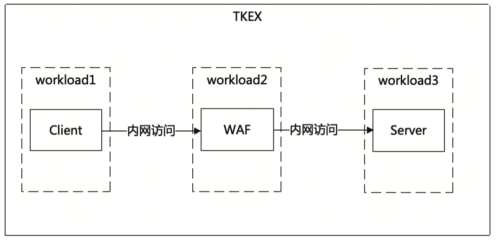
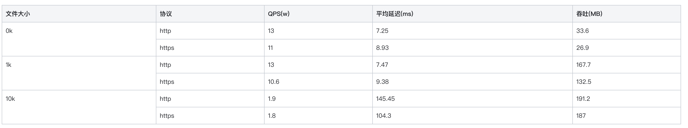
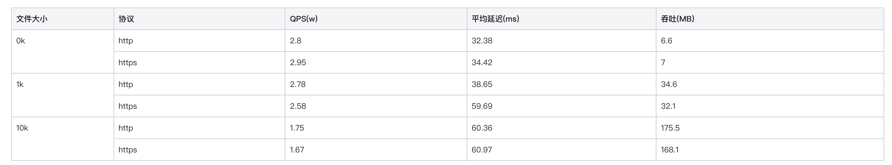
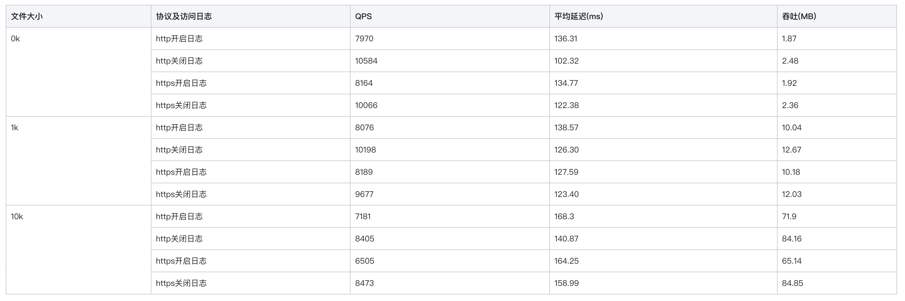
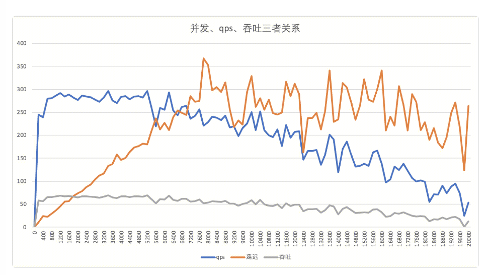
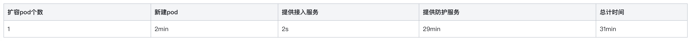
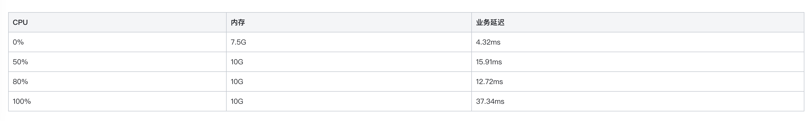
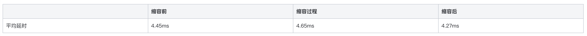
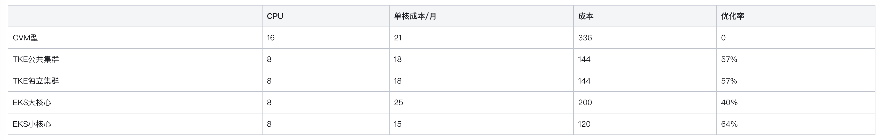

## 1.单个pod的性能摸底测试

### 1.1 pod规格

8核CPU，16G内存

### 1.2 测试环境

为了测试网关的最大性能，客户端和源站网络均为云梯内网，无入口CLB和出口NAT。

后续测试团队在测试性能时可以分场景测试，测试加上CLB和NAT后，对性能的影响。

网络拓扑图：

测试工具：
wrk

源站性能：
考虑单节点WAF的转发性能不是很高，因此源站的qps能够达到10W+就可以满足需求。

其中10k文件达到了带宽瓶颈200MB。

### 1.3 WAF转发测试数据

#### 1.3.1 关闭WAF引擎

QPS数据

在吞吐达到带宽瓶颈之前，http的qps在2.8w左右，https的qps在2.6w左右。

#### 1.3.2 开启WAF引擎

开启WAF后，开启日志qps在7000左右，关闭日志在9000左右。

#### 1.3.3 网关性能指标

最大并发连接数: http、关闭waf，关闭日志、0k文件

并发数达到2800后，出现较多socket错误，开始影响业务，业务延迟在100ms左右

并发数达到5500后，qps和吞吐开始下降，延迟200ms左右

## 2.pod伸缩时间

扩容pod创建时间及提供服务时间：

接入服务准备时间和防护服务时间与域名数相关，测试环境200域名

## 3.pod在资源使用率高时的业务影响

## 4.扩缩容时的业务影响

### 4.1 扩容

扩容过程中，业务抖动不明显，扩容后，负载下降后，业务延迟会下降

### 4.2 缩容

缩容导致的业务抖动不明显

### 5. 成本优化评估

3000QPS按照CPU计算成本

