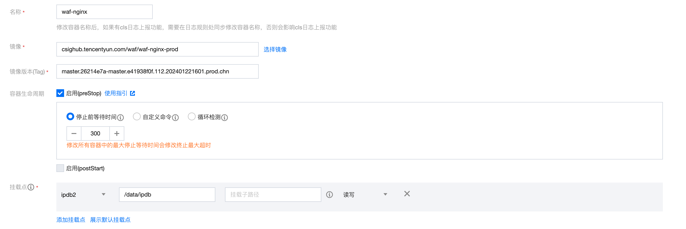
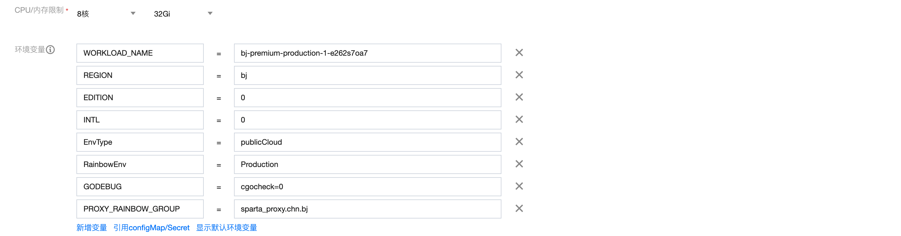
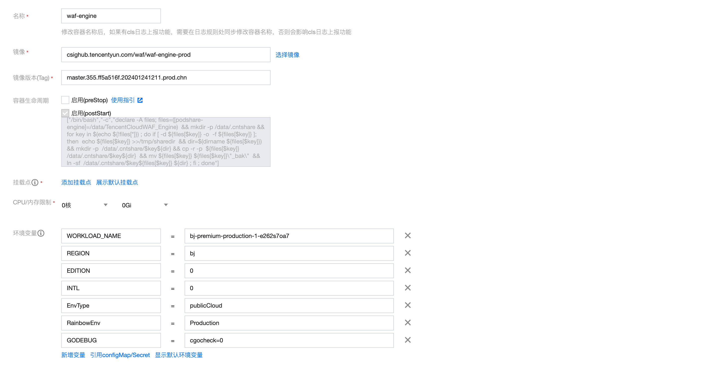
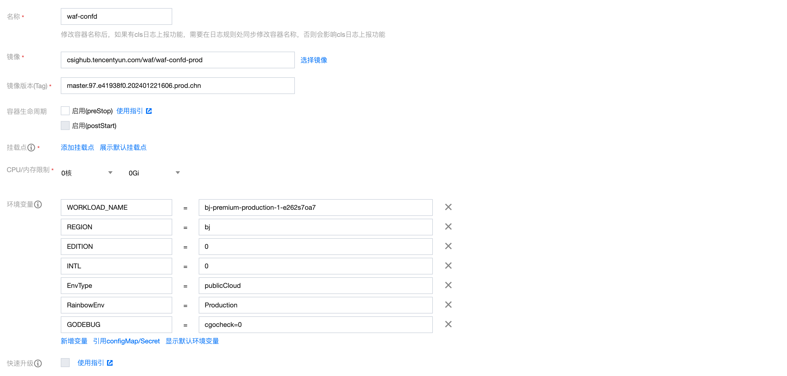
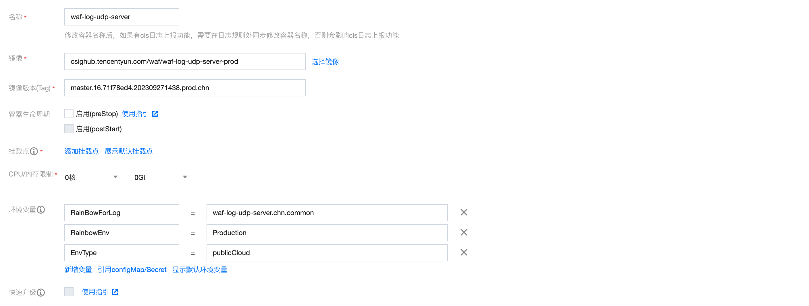
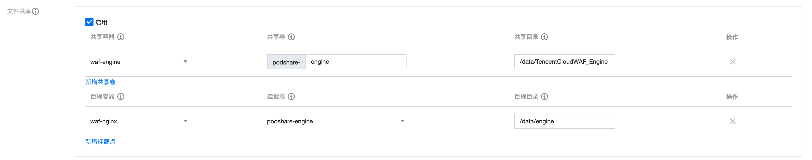
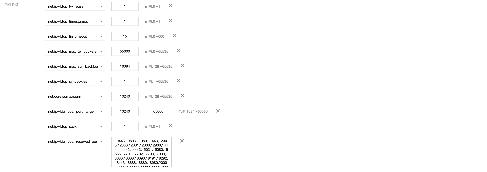

## 主要目标
完成saaswaf组件的容器化，接入引擎业务拆分，做成容器，更新和迭代按容器进行。

1、完成各组件容器化，将RS功能解耦在不同容器。

2、完成各组件的编译脚本和dockerfile。通过docker镜像统一在CSIG镜像仓库进行版本维护。

## 主要解决的问题：
1、将nginx包和Engine包进行了拆分，因为Engine的改动比较频繁，如果不拆开，需要同时发版nginx和engine，带来不稳定性。

2、waf-nginx waf-engine waf-filebeat共享存储卷 /data/share

## 设计

存储


POD:

- nginx




- engine


- confd


- log-server


IP:


文件共享：



内核参数



## 脚本

dockerfile:
```shell
FROM csighub.tencentyun.com/waf/waf-nginx-base:latest

MAINTAINER randyfang
ADD nginx_install-1.0.tar.gz /usr/local/services/
ADD SpartaProxyServer-1.0.tar.gz /usr/local/services/
COPY entrypoint.sh /etc/kickStart.d/
COPY update_engine.sh /usr/local/services/nginx_install-1.0/
```

entrypoint.sh
```shell
#!/bin/bash
INSTALL_PATH=/usr/local/services
NGINX_PATH=$INSTALL_PATH/nginx_install-1.0
WAF_ENGINE_PATH=$NGINX_PATH/TencentCloudWAF_Engine
SPARTA_PROXY_PATH=$INSTALL_PATH/SpartaProxyServer-1.0
LOG_FILE=/data/log/entrypoint.log

function install_engine()
{
    if [ ! -d "/data/engine/TencentCloudWAF_Engine" ]; then
        echo "/data/engine/TencentCloudWAF_Engine is not exist!">>$LOG_FILE
        exit 1
    fi
    rm -rf $WAF_ENGINE_PATH
    cp -arf /data/engine/TencentCloudWAF_Engine $NGINX_PATH
    sed -i "s/grep 'state UP'/grep 'state'/g" $NGINX_PATH/TencentCloudWAF_Engine/cloudwaf/module/core/common/cloudwaf_data.lua
    sed -i "s/grep 'state UP'/grep 'state'/g" $NGINX_PATH/TencentCloudWAF_Engine/cloudwaf/module/handler/init.lua

    #mkdir -p $WAF_ENGINE_PATH/lib
    #cp -arf $NGINX_PATH/lib $WAF_ENGINE_PATH/lib
    cp -arf $WAF_ENGINE_PATH/html/* $NGINX_PATH/html
    if [ ! -f "/data/config/waf-engine.json" ]; then
        echo "lua engine waf-engine.json is not exist,use default!!!">>$LOG_FILE
    else
        rm -f $WAF_ENGINE_PATH/conf/config.json
        ln -sf /data/config/waf-engine.json $WAF_ENGINE_PATH/conf/config.json
        echo "copy lua engine config success!">>$LOG_FILE
    fi
    if [ ! -f "/data/config/polaris.yaml" ]; then
        echo "lua engine polaris.yaml is not exist,use default!!!">>$LOG_FILE
    else
        rm -f $WAF_ENGINE_PATH/conf/polaris.yaml
        ln -sf /data/config/polaris.yaml $WAF_ENGINE_PATH/conf/polaris.yaml
        echo "copy lua engine polaris.yaml success!">>$LOG_FILE
    fi
    sed -i '/include tencentcloudwaf.conf;/d' $NGINX_PATH/conf/nginx.conf

    cd $WAF_ENGINE_PATH && chmod u+x ./install.sh && ./install.sh -c $NGINX_PATH/conf/nginx.conf
}

function install_nginx()
{
    cd $NGINX_PATH

    if [ ! -f "$NGINX_PATH/sbin/nginx_bin" ]; then
        # 创建一个指定动态库的启动脚本，原nginx可执行文件重命名
        mv ./sbin/nginx ./sbin/nginx_bin
        touch ./sbin/nginx
        cat >> ./sbin/nginx << EOF
        #!/bin/bash
        export LD_LIBRARY_PATH=/usr/local/services/nginx_install-1.0/luajit/lib:\$LD_LIBRARY_PATH
        export LD_LIBRARY_PATH=/usr/local/services/nginx_install-1.0/TencentCloudWAF_Engine/lib/dependency:\$LD_LIBRARY_PATH
        ./sbin/nginx_bin \$@

EOF
        chmod 766 ./sbin/nginx
    fi
}

function install_sparta_proxy()
{
    if [ ! -f "/data/config/SpartaProxyServer.conf" ]; then
        echo "SpartaProxyServer config is not exist,use default!!!">>$LOG_FILE
    else
        #rm /usr/local/services/SpartaProxyServer-1.0/running.conf
        #ln -s /data/config/running.conf /usr/local/services/SpartaProxyServer-1.0/running.conf
        rm -f $SPARTA_PROXY_PATH/SpartaProxyServer.conf
        #cp -f /data/config/SpartaProxyServer.conf $SPARTA_PROXY_PATH/SpartaProxyServer.conf
        ln -sf /data/config/SpartaProxyServer.conf $SPARTA_PROXY_PATH/SpartaProxyServer.conf
        echo "copy SpartaProxyServer config success!">>$LOG_FILE
    fi
    sed -i "s/#INSTALL_PATH/\/usr\/local\/services\/SpartaProxyServer-1.0/g" $SPARTA_PROXY_PATH/running.conf
    sed -i "s/#IP_INNER/$POD_IP/g" $SPARTA_PROXY_PATH/running.conf
    mkdir -p /data/log/SpartaProxyServer-1.0/
    rm -rf $SPARTA_PROXY_PATH/log
    ln -sf /data/log/SpartaProxyServer-1.0 $SPARTA_PROXY_PATH/log

}


for ((i=1; i<=30; i++))
do
    if [ ! -f /data/engine/TencentCloudWAF_Engine_Ready ]; then
        echo "TencentCloudWAF_Engine not ready, time: "`date`>>$LOG_FILE
        sleep 2
    else
        echo "TencentCloudWAF_Engine is ready, time: "`date`>>$LOG_FILE
        break
    fi
done

for ((i=1; i<=30; i++))
do
     if [ ! -d /data/config ]; then
         echo "/data/config directory not exist, time: "`date`>>$LOG_FILE
         sleep 2
     else
         echo "/data/config is ready, time: "`date`>>$LOG_FILE
         break
     fi
done

install_engine
install_nginx
install_sparta_proxy

echo "$WAF_ENGINE_PATH/lib" >> /etc/ld.so.conf.d/nginx.conf
echo "$WAF_ENGINE_PATH/lib/dependency" >> /etc/ld.so.conf.d/nginx.conf
ldconfig
# filebeat获取本地ip地址

sed -i "s/server_addr: .*\..*\..*\..*/server_addr: $POD_IP/g" /usr/local/services/waf-filebeat-1.0/filebeat.yml
sleep 1

echo "*/1 * * * * /usr/local/services/nginx_install-1.0/update_engine.sh &" >> /var/spool/cron/root
sh /usr/local/services/l5_for_qcloud-1.0/admin/restart.sh all
sh /usr/local/services/release_agent-1.0/admin/restart.sh all
sh /usr/local/services/waf-filebeat-1.0/admin/restart.sh all
sh /usr/local/services/w4f_webshell-1.0/admin/restart.sh all
sh /usr/local/services/monitor_agent/admin/restart.sh all
#sh /usr/local/services/AttaAgent-1.9/admin/restart.sh all
sh /usr/local/services/core_check-1.0/admin/restart.sh all
sh /usr/local/services/tencentcloud_cloudmonitor_agent-monitor-1.6/admin/restart.sh all
sh /usr/local/services/monitor-configd-1.0/admin/restart.sh all
cd $SPARTA_PROXY_PATH && ./start.sh>>$LOG_FILE 
#sleep 5
#echo "start nginx monitor"
#$SPARTA_PROXY_PATH/nginx_monitor/control start

```

build_package
```
#!/bin/bash
BUILD_PATH=`pwd`
PACKAGE_NAME="nginx_install-1.0"
INSTALL_PATH="$BUILD_PATH/$PACKAGE_NAME"
COMPILE_PATH="$BUILD_PATH/../ias-nginx"
function compile()
{
    cd $COMPILE_PATH
    ./make.sh
    cd -
}

function make_package()
{
    echo '--------start making package--------'
    cd $BUILD_PATH
    mkdir -p $INSTALL_PATH
    mkdir -p $INSTALL_PATH/conf
    mkdir -p $INSTALL_PATH/sbin
    mkdir -p $INSTALL_PATH/luajit
    mkdir -p $INSTALL_PATH/logs
    mkdir -p $INSTALL_PATH/html
    mkdir -p $INSTALL_PATH/lualib
    cp -arf $BUILD_PATH/../ias-nginx/build/l7_nginx/nginx $INSTALL_PATH/sbin/
    cp -arf $BUILD_PATH/../waf_engine_install.sh $INSTALL_PATH/
    cp -arf $BUILD_PATH/../scripts/* $INSTALL_PATH/
    cp -arf $BUILD_PATH/../conf/* $INSTALL_PATH/conf
    #cp -arf ./lib  $INSTALL_PATH/
    cp -arf $BUILD_PATH/../html $INSTALL_PATH
    cp -arf $BUILD_PATH/../lualib $INSTALL_PATH
    cp -arf $BUILD_PATH/../ias-nginx/third-lib/luajit2-2.1-20210510/ngx_lib/* $INSTALL_PATH/luajit
    tar -czf $PACKAGE_NAME.tar.gz $PACKAGE_NAME
    cp -arf $BUILD_PATH/../ias-nginx/build/l7_nginx/nginx $INSTALL_PATH/sbin/
}

function clean()
{
    echo '--------clean old package--------'
    rm -rf $BUILD_PATH/$PACKAGE_NAME*
}


clean
compile
make_package
```

基础镜像
