## TKE背景

### TKE、TKEx、TKEx-CSIG关系
1、**TKE** 是腾讯云容器服务（Tencent Kubernetes Engine），基于原生 Kubernetes 提供以容器为核心的、高度可扩展的高性能容器管理服务。TKE 完全兼容原生 Kubernetes API ，扩展了腾讯云的云硬盘、负载均衡等 Kubernetes 插件，为容器化的应用提供高效部署、资源调度、服务发现和动态伸缩等一系列完整功能。TKE 是腾讯云公有云服务，主要为用户解决 Kubernetes 集群管控问题。

2、**TKEx** 是 k8s oteam 下辖的工作组，主要目标是为容器业务上云提供统一入口和插件方案，提升业务上云体验和效率。
在统一入口方面，TKEx 覆盖各 BG 主要的容器平台，用户访问 TKEx 页面即可选择所需的容器平台：
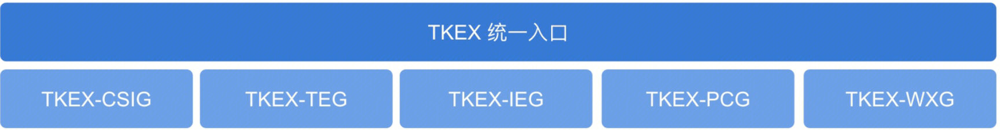
在统一插件方面，TKEx 制定标准云原生插件规范，按照此规范研发的插件均可运行在各 BG 容器平台中。
各容器平台标准入口如下：

- TKEx-CSIG（STKE）：csig.tkex.oa.com
- TKEx-TEG：teg.tkex.oa.com
- TKEx-IEG（蓝盾）：ieg.tkex.oa.com
- TKEx-PCG（123）：pcg.tkex.oa.com
- TKEx-WXG：wxg.tkex.oa.com

3、**TKEX-CSIG（原 STKE）** 是 CSIG 内部容器平台，底层调用腾讯云 TKE 服务创建和管理 Kubernetes 集群，为用户提供自研上云容器服务。此外平台实现了一系列业务插件和应用，打通了 CSIG 内部业务常用的 L5 / monitor / 蓝盾等系统，是 CSIG 内部上云业务首选容器平台。
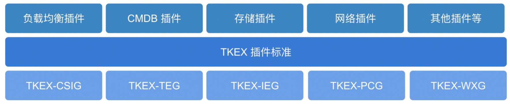

### TKEx-CSIG
1、[项目文档](http://wiki.k8s.oa.com/) 

2、**特点**，TKEx-CSIG在腾讯云公有云TKE的基础上，针对CSIG的业务特性，提供了部分具有特色的功能，如下：

- 对接了公司内部的 L5/CL5/CMLB/CLB/北极星进行服务路由的自动化管理；
- 支持固定EIP，支持通过外网IP进行鉴权
- 对接 CLS 平台上报容器日志
- 对接蓝盾/OCI/QCI/Coding 等 Devops 平台实现云原生发布

3、**概念**，使用 TKEx-CSIG 腾讯云容器服务，会涉及到以下基本概念：（从小到大的方式介绍）
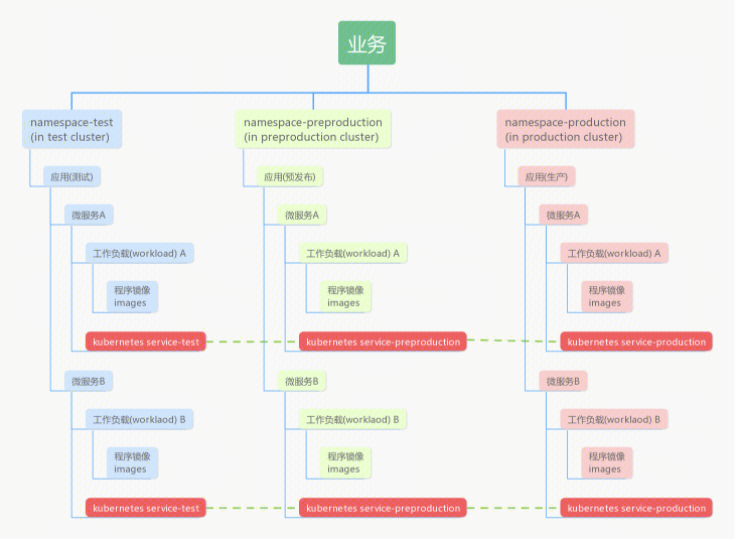

- **镜像**：Docker 镜像，用于部署容器服务。通常存放在镜像仓库。
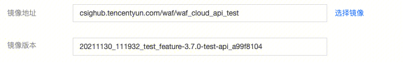
- **容器**：容器是一个操作系统的最小镜像，在上面可以运行应用程序。
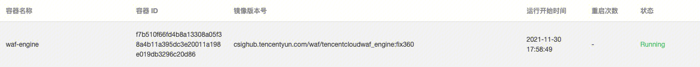
- **实例（Pod）**：由相关的一个或多个容器构成一个实例，这些容器共享相同的存储和网络空间，但是`不共享进程空间`。
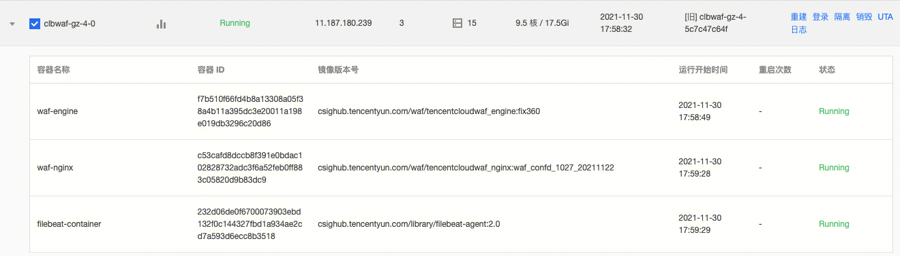
- **工作负载（workload）**：由多个配置相同的实例组成，可以用于管理 Pod 副本的创建、调度以及整个生命周期的自动控制。
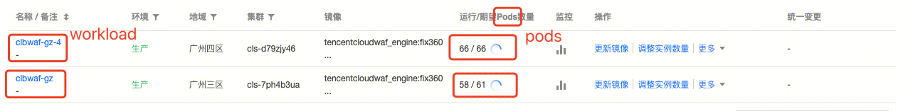
**访问规则（公网LB/内网LB/L5/CL5..）**：创建访问工作负载（workload）内实例（Pod）的规则（实例间的配置完全一致）。引用工作负载，将得到一个访问入口。
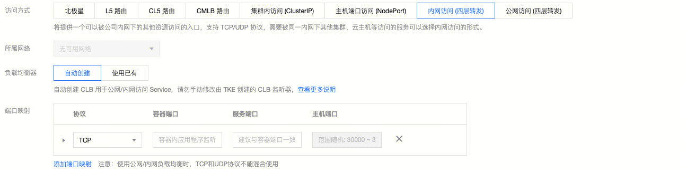
- **服务（service）**：由多个相同配置的实例组成的工作负载（workload）和访问这些实例（Pod）的访问规则组成的微服务。

- **应用**: 由一个或者多个服务组成的微服务集合。例如一个waf应用，包含了 rs服务、API服务、OSS服务等。
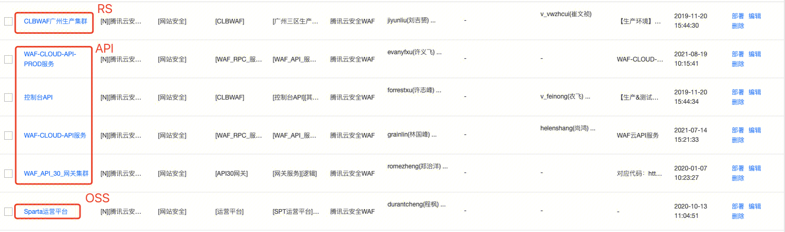

- **命名空间（Namespace）**：Namespace是对一组资源和对象的抽象集合，比如可以用来将系统内部的对象划分为不同的项目组或用户组。有测试命名空间和正式环境命名空间。
- **业务**：业务是管理namespace的集合，平台将会为用户提供两个namespace(测试环境，生产环境)，可能还有预发布环境，用于资源隔离
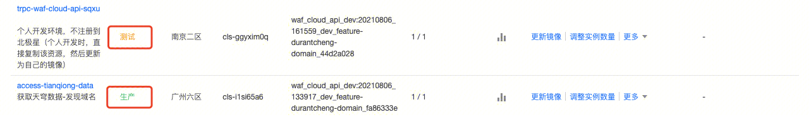
- **集群**：是指容器运行所需云资源的集合，包含了若干台云服务器、负载均衡器等云资源。构建工作负载的时候将指定集群。创建访问规则时，在引用工作负载后，会从工作负载所在的集群上索取clb等资源。
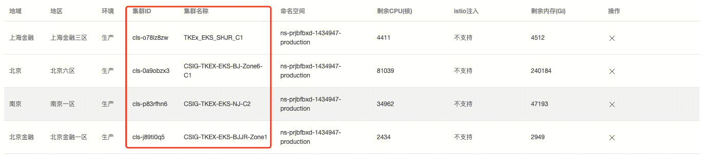
- **工作负载的多种类型**：
|类型 |描述 |
|:--|
|Deployment |声明了 Pod 的模板和控制 Pod 的运行策略，适用于部署无状态的应用程序。您可以根据业务需求，对 Deployment 中运行的 Pod 的副本数、调度策略、更新策略等进行声明。 |
|StatefulSet |主要用于管理有状态的应用，创建的 Pod 拥有根据规范创建的持久型标识符。Pod 迁移或销毁重启后，标识符仍会保留。在需要持久化存储时，您可以通过标识符对存储卷进行一一对应。如果应用程序不需要持久的标识符，建议您使用 Deployment 部署应用程序。 |
|StatefulSetPlus |StatefulSetPlus 是 TKEx-CSIG 平台自主研发的一种Kubernetes CRD，它继承了Kubernete内置的StatefulSet所有核心特性，并支持固定IP、原地升级、秒切、手动&amp;自动分批灰度升级、热升级等多种高级特性，目前已经占据了平台工作负载 90% 的使用量。 |
|DaemonSet |主要用于部署常驻集群内的后台程序，例如节点的日志采集。DaemonSet 保证在所有或部分节点上均运行指定的 Pod。新节点添加到集群内时，也会有自动部署 Pod。节点被移除集群后，Pod 将自动回收。 |
|Job |Job 控制器会创建一个或者多个 Pod，这些 Pod 按照运行规则运行，直至运行结束。 |
|CronJob |根据指定的预定计划周期性地运行一个 Job。 |
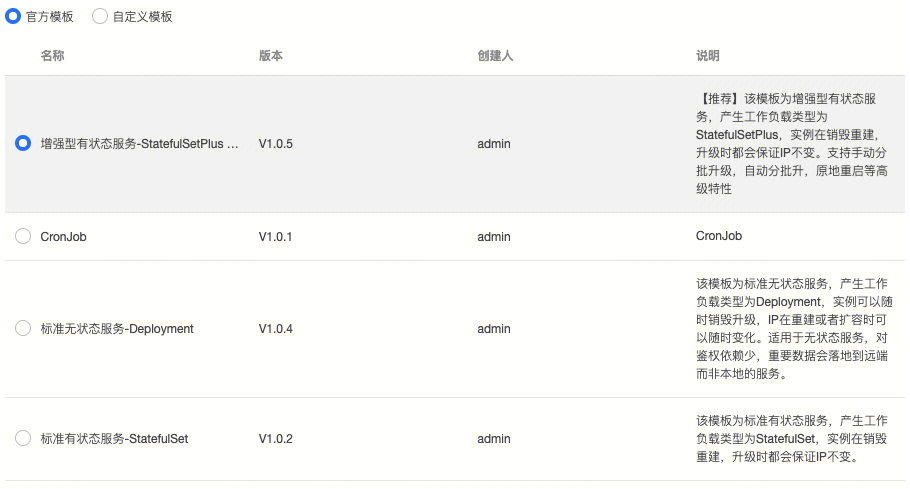

4、**网络管理**
- **基本概念**
 
 **EIP（elastic ip）弹性公网IP**：弹性公网 IP（Elastic IP，EIP）是可以独立购买和持有，且在某个地域下固定不变的公网 IP 地址，可以与 CVM、NAT 网关、弹性网卡和高可用虚拟 IP 等云资源绑定，提供访问公网和被公网访问能力 

- **集群网络与容器网络**
**集群网络**：为集群内的主机分配IP地址。
**容器网络** ：为集群内的容器分配IP地址。分为GlobalRouter和VPC-CNI两种模式。TKEx-CSIG使用VPC-CNI模式。VPC-CNI模式为容器分配与集群相同VPC子网的IP。

- **容器网络VPC-CNI模式**
**基本概念**：基于 CNI 和 VPC 弹性网卡实现的容器网络能力。容器IP为IPAMD组件分配的弹性网卡IP。VPC-CNI 模式分为共享网卡模式和独占网卡模式。 [共享网卡模式](https://cloud.tencent.com/document/product/457/50356)：Pod 共享一张弹性网卡，IPAMD 组件为弹性网卡申请多个 IP 给到不同的 Pod，可固定 Pod IP。[独占网卡模式](https://cloud.tencent.com/document/product/457/50357)：每个 Pod 有独立的弹性网卡，性能更高。

