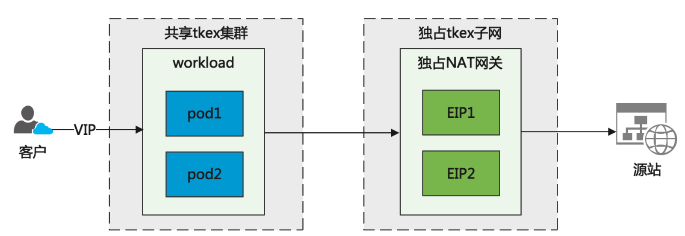

## WAF云原生实践之路：依托云原生，处置攻击流量更从容
简述：SAASWAF是云WAF的传统架构，在进行安全防护的同时，还需要承接流量接入的功能。针对传统的CVM部署架构存在环境不统一、扩缩容困难、配置管理难、运营成本高等问题，腾讯云WAF团队依托TKEx容器化平台，进行了容器化实践、HPA管理、服务发现升级、配置管理优化等一系列动作，解决了团队在长期运营SAASWAF中的痛点，并有力地支撑了团队业务降本增效的目标。

## 一、背景介绍
### 1、引言
腾讯云WAF是基于云端开发的专门针对web应用攻击的防护产品，目前已经承接了千万级qps的业务。在产品刚开始上线运营等时候，团队不过5个人，客户不超过十个，这种情况下，通过公司云支撑的CVM搭建WAF集群完全能够满足客户需求和运营需求。但随着业务的快速发展，业务量几何倍数的增加，通过堆积CVM支撑流量增长，搭建小集群隔离业务的方式暴露出了越来越多的问题。
### 2、业务背景
从整体架构来说，WAF功能可以流量接入和流量清洗两大块，目前主要有SAASWAF和CLBWAF两种形态。其中，SAASWAF通过反向代理的方式将客户流量统一接入到腾讯云上的WAF接入引擎进行安全处置。

图1 腾讯云WAF接入架构

接入引擎由于串行部署在客户业务链路中，客户业务对WAF功能异常敏感。而传统的CVM架构的缺点在于CVM的扩缩容周期长，集群资源碎片化且单个集群体量小。一些比较大的突发攻击流量，大多数情况下数秒内就打满了集群。运维人员根本没有反应时间进行扩容迁移，导致集群资源耗尽，客户业务中断。这是WAF业务上云前的最大痛点，也是推动业务坚持做云原生改造的最大动力。
### 3、问题与挑战
云原生改造前，WAF面临的困境主要有以下几个方面：

- 突发攻击流量频繁，应对效果差
WAF遇到的最多的流量突发就是CC攻击，也是造成生产事故最多的场景。由于CVM机器的申请和部署需要人工介入，客户正常提前提单进行扩容还能应付，但是面对突发CC流量需要扩容时，人工介入为时已晚。
- 规模大，维护问题多
WAF的接入引擎有1000多台，每台从申请、部署到使用的过程中大量人工介入，通常由于配置问题、缺少组件等导致各种现网问题。
- 成本高、裁撤难
大核心的CVM机器本身就贵，但为了应对突发流量，不得不堆机器保证稳定性，这也导致集群内的CVM平时资源利用率低还不敢裁撤。另外确认需要退还CVM机器时，往往需要一个月时间，这段时间造成成本浪费。

## 二、实践历程
### 1.问题原因分析
虽然WAF业务自身有一定的特殊性，但基于K8s的云原生平台其实能够解决传统架构遇到的问题。基于上面提到的WAF遇到的困境，总结问题原因和解决办法有以下几方面。
#### 扩缩容困难
突发流量难以应付和运营成本高的很大一部分原因在于传统的架构下，业务在进行集群扩缩容时难以快速完成。

运维同学在进行集群扩容时，从云梯平台下单CVM到可以交付使用前至少需要经历小时级别的周期，而这就要求有扩容需求时至少提前一天申请集群资源，更不用说依赖扩容机制来应对突发攻击流量。而机器的裁撤周期更长，面对WAF经常遇到的客户搞促销活动的场景时，不仅运维人员压力大，成本也扛不住。

如何快速扩缩容，给攻击流量处置预留充足的时间？只能做云原生改造，使用大集群和K8s的HPA机制来满足业务需求。
#### 状态不一致问题
规模大并不是导致运维难的根本原因，更多需要考虑的是在使用过程中如何保持CVM状态一致。K8s的pod管理比较好地解决了这一问题，主要体现在几点：

- 使用相同的容器镜像生成pod保证了引擎的生产不会“缺斤少两”；
- 统一的配置入口保证了配置的一致性；
- 由于状态始终一致，问题pod可以即时销毁
#### 集群多，配置管理复杂
WAF运营过程中出现了很多现网问题是由配置问题引起的，总结后发现主要原因有：

- 同地域不同集群配置需要自定义，没有完整的配置管理导致无法溯源
- 同集群内的CVM在使用过程中由于手工修改或未升级导致问题
- WAF组件众多，组件的配置管理平台有织云、七彩石、configmap等，难以统一
- 组件交互使用的配置很多写死IP端口的方式，IP一裁撤就出问题
为了解决以上问题，我们将所有的配置统一托管到七彩石上进行版本管理，组件间的服务调用统一采用北极星进行服务发现。
### 2.平台选型
面对业务遇到的困境，WAF团队在进行了充分的原因分析和解决方案探讨后，开始进行云原生平台的选型，并最终选择TKEx平台来作为WAF接入引擎的自研上云平台。
#### NFV平台探索
NFV平台是公司内提供的一个解决网关类业务的上云部署的平台，可以为业务网关提供类似underlay的体验，业务只需关心网关业务逻辑的实现。

初始探索NFV平台，是因为NFV平台能够为业务方提供全套的云上部署服务，业务方对具体的云上环境如何搭建可以不用投入太多精力。但是经过一番探索后，发现NFV平台并不适合云WAF的部署模式，总结主要有两点：

- NFV平台资源主要是公有云VPC内的资源，对于产品部署在客户VPC内的业务如API网关有比较好的匹配性。但是WAF提供的是公有云SAAS服务，产品并不部署在客户VPC，这与NFV服务的业务形态不符；
- WAF的控制面组件和日志服务都部署在自研云，如果使用NFV平台提供的资源部署WAF数据面组件，需要将NFV的VPC和自研云的网络通过privatelink的方式打通，增加了架构的复杂性，且打通流程复杂，有安全风险。

#### TKEx平台
TKEx平台是专门提供给业务做自研上云的容器平台，相较NFV平台，TKEx更适合做WAF的云原生改造：
- TKEx网络和支撑环境完全打通，并提供公网入口和公网回源的能力，业务完全不需要考虑网络问题；
- TKEx不仅有易用的控制台，还提供了丰富的API接口。WAF团队决定使用TKEx平台来部署业务，同时使用API接口来实现WAF的NFV模块，从而方便快捷地完成资源的调度和部署。
- 资源覆盖国内站和国际站多个地域，业务使用无需考虑资源问题；
- WAF大部分控制面业务和CLBWAF引擎都部署在TKEx平台，镜像统一管理和业务协作更方便。
## 3.集群架构优化
### EIP回源优化
老的架构下，每个CVM都绑定了一个EIP进行公网回源，不仅造成了EIP的浪费，而且即使集群计算资源足够，单个EIP被打满依然会造成业务影响。WAF也曾经因为EIP带宽被打满造成了严重事故。

TKEx默认会用NAT网关进行回源，这样解决了EIP的带宽瓶颈和资源浪费问题，但是对WAF来说，问题仍然没有结束。NAT网关及EIP是所有业务共用，而WAF业务需要独享的EIP地址来做安全风险隔离，如何才能实现EIP独享？

通过与TKEx同学交流，最终确定方案为通过添加子网路由的方式来实现计算资源的共享，回源网络通道独享的问题。具体步骤如下：

- 创建waf独占的子网，并添加子网路由；
- 创建waf独占的NAT网关，并添加EIP；
- tkex提供workload模板，保证创建的workload内流量走到独占子网内
- waf使用专用模板创建workload并接入业务流量
### 集群管理实践
以往的集群规划比较混乱，每个地域都部署了多个小集群来做客户业务的隔离。这样虽然一定程度上保证了部分客户业务的稳定性，但仍然不能从根本解决问题。有以下几个劣势：

- 切割出来的集群还是共享集群，集群受攻击只是缩小了客户影响面，集群内的其他客户仍然受影响；
- 集群规模变小则预留buffer跟着变小，进一步导致应对突发流量的能力更差
- 资源碎片严重，利用率低成本高
- 集群变多，配置维护成本高
在业务上TKEx后，WAF使用workload作为集群的承载形式。WAF业务根据TKEx暴露的API接口实现了自己的NFV模块，通过statefulSetPlus、service等接口，将业务与实例版本、个数等与workload进行关联，来实现集群的自动调度。总的调度原则是容量有保证、业务有隔离、规格有限制。

架构调整后，通过HPA的纵向扩容保证workload容量和资源利用率，同时通过业务自动横向扩展workload保证其规格始终一致。集群的规格和能力更加清晰，所需资源核心数更少，但是承接能力却提升了一大截。
## 4.容器化改造
### 容器功能解耦
容器化改造总会面临一个选择，富容器还是轻量级容器？综合考虑，WAF选择轻量级容器，原因有三：

- 富容器虽然能够在不改变任何业务的情况下快速迁移，但是会给以后业务解耦留坑，也不够云原生
- 进一步裁剪非必要组件，提升启动速度和资源利用
- 为部分功能组件的微服务化做好铺垫，如日志收集，安全策略分发等
### 启动时间优化
在WAF接入业务中，能否快速扩容是衡量业务稳定性的一个关键指标。在攻击流量打满集群buffer的时间内完成扩容，能够给运维人员留下充足的时间处置攻击流量。因此，需要在pod启动的各个阶段进行时间优化。

- 给镜像“瘦身”
容器的镜像大小会增加镜像拉取时间，除了按照dockfile最佳实践的进行各种优化，基础镜像的选择也十分关键。TKEx团队给出了多种基础镜像供选择。
WAF最终选择tlinux2.2-mini作为基础镜像，整个镜像200M左右，只包含简单的系统服务，系统完全由业务进行DIY组装，最终WAF最大的容器镜像大小不过1G，这与之前的容器镜像动辄5G的大小有了很大改善。
- 优化启动服务
WAF从系统服务和业务服务两块来减少pod就绪的准备时间。系统服务方面，裁剪掉不必要的启动服务来加快系统就绪。业务方面则通过细分集群配置，尽量拉取最小集的接入配置和安全策略，使pod的健康检查时间减少了80%。
通过优化后，pod的扩容时间（包括TKEx资源分配时间）基本能够保持在2分钟左右。

## 5.配置和服务发现优化
杂乱的配置管理和配置中大量固定IP的方式是业务运营过程中的一大痛点，WAF团队通过两大利器来解决这个问题。
### 使用北极星进行服务发现
具体做法是把所有服务改造成北极星访问，去掉配置文件中的固定IP，并利用北极星的规则路由来实现服务的分流。以WAF的旁路安全服务为例：

旁路服务上线新机器时需要在北极星上注册并打标签。接入引擎调用旁路服务时先通过北极星进行服务发现，然后根据北极星上配置的规则路由将流量引入到对应的旁路服务。这种方式也能够方便地进行旁路服务的灰度发布。
### 七彩石统一配置管理
下线织云怎么办？configmap找不到对应集群的配置和版本？织云配置和configmap哪个才是真正生效的？WAF通过将配置全部托管七彩石进行集中管理，将这些问题统统解决掉，从而降低配置的维护成本。

WAF业务将组件的配置分成两种，对应不同的处置方式：
- 只需要拉取一次不需要热加载的配置采取rainbow-agent-init初始容器拉取，这种方式无业务侵入实现比较方便，
- 需要热加载配置且支持SDK接入的组件则通过改造代码引入SDK解决。
## 6.HPA实践
### 深入理解最大扩容倍数
最大扩容倍数是指单次扩容最大可扩容到当前副本数的倍数，并不是每次扩容的倍数，默认设置为 2。该参数设置的越大，扩容的速度越快。

自动扩容在WAF业务中主要有两个应用场景，一种是业务流量正常的增长引起的扩容，这种场景流量增长比较平滑，默认的翻倍扩容能够满足需求。另一种是突发攻击流量引起的扩容，这种场景下流量在极端的时间特别高，必须调大最大扩容倍数减少整体扩容时间。
### 集群容量控制
WAF业务的workload的总体规格根据接入实例个数来限制，并据此来实现workload的纵向扩容。以上海高级版workload为例，初始规格为100个实例，最大承接100w qps，弹性空间20w qps，总大可扩容到120w qps。

实际场景中，每个客户实例的业务流量大小不一。为了实现同样规格workload的弹性能力一致，需要在workload接入实例个数稳定后修改HPA策略来调整workload的运行时水位。

## 三、效果和收益
### 1、线上事故明显减少
由于workload在预留buffer打满前完成自动扩容，运维人员在监控到突发攻击流量后，处置起来更加从容。
相较以往的线上事故动辄需要30分钟以上才能恢复，改造后迁移到TKEx上的WAF业务遭遇CC攻击达50余次，只有一次因迁移过程中workload基础容量未设置到规格限制导致小范围影响，其他均未发生线上事故。而运维人员完全有充足的时间来从容处置，选择将被打客户迁移到隔离集群甚至可以不迁移等待自动恢复。
以一次CC攻击为例，由于是灰度迁移过程中，workload只保留了10个pod。但是遭遇CC攻击后，10个pod的自动扩容速度也完全可以抗住突发的50k的攻击流量（5xx没有变化表示业务无影响，4xx为WAF返回的403）。

另外，新的业务的大流量接入，只需评估并提前调整当前workload的容量，然后依靠自动扩缩容达到正常水位，减少运维人员操作，降低出错概率。

### 2、成本降低
WAF业务部署的集群本就选择成本较低的EKS集群，另外自动扩缩容保证了集群的水位总是在合理的区间，避免了以往CVM闲置造成的成本浪费。以目前的SAASWAF业务容量测算，实际核心使用量将从12000核下降到6500核，相较原有计算资源，成本下降46%。
### 3、效率提升
云原生改造后极大地减少了人工介入，明显地体现在日常扩缩容、配置管理和版本发布中人力的释放。以发版为例，以往每个版本发版需要一个月左右时间，云原生改造后，最多只需一周时间即可完成一次全量发版。
### 4、云原生成熟度提升
根据腾讯云WAF产品的业务流量波动频繁、单位运营成本考核敏感等需求背景，在上云过程中对pod进行拆解、适配等优化改造，eks “小核心”的调度灵活、成本优势等能力，小核心得分提升并保持在99分；基于WAF客户业务的流量特性，充分利用TKEx智能HPA能力，业务利用率得分从36分提升到100分，HPA得分从23分提升到91分。

## 四、经验总结
WAF接入引擎业务在进行云原生改造的过程中，总结了一些接入业务上TKEx的经验。
### 1、存活检查与就绪检查
TKEx的存活检查和就绪检查分别对应k8s的Liveness Porbe和Readiness Probe，其中存活检查不通过会使pod重启。在一次业务扩容过程中，我们发现启动的pod在就绪后会不断重启，导致扩容后的workload整体很不稳定。

经过分析后，发现新扩容的pod虽然就绪检查已经通过达到running状态，但是由于pod接入流量过大，cpu基本被打满，这个过程中存活检查中的端口检查出现了超时的情况，被判定为不存活，从而又导致了pod重启。因此，存活检查必须考虑到pod扩容过程中的极端情况，采取更加灵活的检查策略。
### 2、service健康检查
在一次发版中，虽然是采用批量更新策略，但是workload更新过程中全部处于pending状态。

WAF业务需要给workload绑定大量的四层service作为公网流量入口，VIP开放的端口在企业版以上版本可以定制，增加端口会增量将VIP端口与pod绑定，增加非标端口后再取消掉如果不取消VIP的监听端口便会出现以上情况。这种情况下，要么始终保证VIP的端口始终在pod中监听，要么就需要取消VIP端口的健康检查，WAF根据业务需求选择了后者。
### 3、长连接与prestop
在TKEx上如何保证长连接在业务更新过程中不受影响，这是接入业务需要考虑的一个稳定性问题。通过给 Pod 中的 container 添加 preStop hook可以减缓这类问题的影响。

prestop使 Pod 真正销毁前先 sleep 等待一段时间，这段时间 Pod 处于 Terminating 状态，即便在转发规则更新完全之前有请求被转发到 Terminating 的 Pod，依然可以被正常处理。业务可以根据自己的业务特点来配置这个时间，比如使用nginx来做接入，则该时间的配置需要不少于keepalive_timeout参数。
### 4、会话保持
WAF接入客户的一些业务需要依赖会话保持功能来做一些状态保持，比如登录状态。业务接入TKEx后流量从入口到出口需要保证几个节点的会话保持。

- client->VIP：WAF给业务按实例分配VIP，同样的业务客户端只会访问一个VIP
- VIP->POD:开启service的会话保持功能。WAF的NFV模块通过接口开启，创建service时有两个API接口可以调用，一个是K8s的标准service创建参数接口，另一个是支持CLB参数的接口参见TKEx控制台，需要调整健康检查和会话保持的业务需调用这个。
- POD->NAT：这个由VPC内选择NAT网关的路由算法决定，TKEx默认不支持，经WAF提需求后，网络团队开发功能支持了ECMP算法来保证这段网路会话保持，需由业务调用VPC的OSS接口启用。
- NAT->EIP：这个是NAT网关自身的功能 ，默认支持
## 五、后续展望
本文从WAF业务面临的挑战出发，介绍了如何通过云原生实践来一一解决业务的痛点，并总结了接入业务在进行TKEx接入的一些经验，希望能够给其他业务在进行自研上云的过程中提供一些思路。总之，业务云原生的推广和实践无论对业务自身的演进还是对公司降本增效的提升都是十分有益的。
在完成文章中描述的云原生实践后，后续业务方和TKEx的结合仍有一些地方需要完善，部分功能还需在业务运行的过程中得到长时间的运营和完善。

- IPv6功能支持：很多业务中都有IPv6功能的需求，以WAF为例，需要支持公网接入和公网回源的IPv6能力，目前TKEx不支持此能力，导致部分客户的业务在上TKEx后如果需要开启IPv6又迁回老的CVM集群。
- 容灾能力建设：WAF的业务形态中，公网接入的流量通过公网VIP引流到workload中。但是同一VIP绑定的workload不支持跨可用区容灾，需要业务自身通过更复杂的架构来实现，增加了业务的复杂性和运维成本。
- 业务微服务改造：WAF的一些功能和组件仍可拆分改造成微服务，以进一步提升效率和稳定性。

