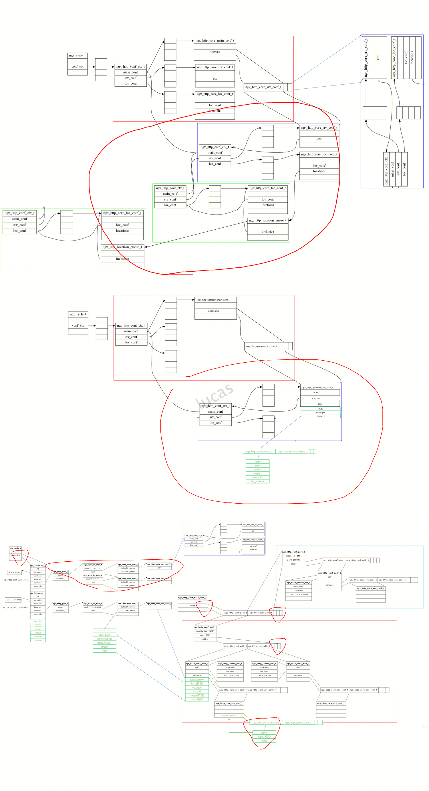

## proxy 日志
``` 
2022-07-27 14:44:11|dysvr_task_manager.cpp|65|read_from|read_from=/usr/local/services/nginx_install-1.0/conf/auto_vhost/lucas-sni-protection-domain-first.qcloudwzgj.com_80.conf
2022-07-27 14:44:11|ngx_conf.cpp|2321|read_conf|start=/usr/local/services/nginx_install-1.0/conf/auto_vhost/lucas-sni-protection-domain-first.qcloudwzgj.com_80.conf
2022-07-27 14:44:11|ngx_conf.cpp|2325|read_conf|rv=0,tokens.size()2
2022-07-27 14:44:11|ngx_conf.cpp|2327|read_conf|rv=0,tokens[0]include
2022-07-27 14:44:11|ngx_conf.cpp|2336|read_conf|read_from=/usr/local/services/nginx_install-1.0/conf/auto_upstream/lucas-sni-protection-domain-first.qcloudwzgj.com_80.1074728.upstream.conf
...
2022-07-27 14:44:11|ngx_conf.cpp|2365|read_conf|over=/usr/local/services/nginx_install-1.0/conf/auto_vhost/lucas-sni-protection-domain-first.qcloudwzgj.com_80.conf

2022-07-27 14:44:11|NGX_DYSVR_ADD_SERVER=/usr/local/services/nginx_install-1.0/conf/auto_vhost/lucas-sni-protection-domain-first.qcloudwzgj.com_80.conf
2022-07-27 14:44:11|dysvr_task_manager.cpp|194|isAllowSvrReload|add_ports: 0, add_servers: 1, mod_servers: 0, del_servers: 0
2022-07-27 14:44:11|dysvr_task_manager.cpp|166|dySvrReload|[dysvr_reload] dySvrReload start. dysvr_reload_update_file_path = /usr/local/services/nginx_install-1.0/l7_nginx/common/dy_update_server.conf
2022-07-27 14:44:11|dysvr_task_manager.cpp|303|createTask|createTask

2022-07-27 14:44:11|dysvr_task_manager.cpp|455|constructTask|[dysvr_reload]  task.conf_name : /usr/local/services/nginx_install-1.0/l7_nginx/common/dysvr_25208.conf
2022-07-27 14:44:11|dysvr_task_manager.cpp|843|writeDySvrConf|task_id dysvr data is: 25208,str=include /usr/local/services/nginx_install-1.0/conf/auto_vhost/lucas-sni-protection-domain-first.qcloudwzgj.com_80.conf;
,conf_file=/usr/local/services/nginx_install-1.0/l7_nginx/common/dysvr_25208.conf
2022-07-27 14:44:11|dysvr_task_manager.cpp|636|getFile|exec_shell ret 0,shell=mkdir -p /usr/local/services/nginx_install-1.0/l7_nginx/common/
2022-07-27 14:44:11|dysvr_task_manager.cpp|683|writeTaskLines|[dysvr_reload] write line :
type=0 conf=/usr/local/services/nginx_install-1.0/l7_nginx/common/dysvr_25208.conf vsvc_ids=131942 ups_ids=1074728 task_id=25208 status=I
2022-07-27 14:44:11|ngx_operations.cpp|71|DySvrReloadConf|exec_shell ret 0,shell=logdate=`date   +"%Y%m%d"`; sh -x /usr/local/services/SpartaProxyServer-1.0/scripts/l7_ngx_ops.sh dysvr_reload >> /usr/local/services/SpartaProxyServer-1.0/log/SPT/SpartaProxyServer/l7_ngx_opserr_${logdate}.log 2>&1
2022-07-27 14:44:11|dysvr_task_manager.cpp|636|getFile|exec_shell ret 0,shell=mkdir -p /usr/local/services/nginx_install-1.0/l7_nginx/common/
2022-07-27 14:44:11|dysvr_task_manager.cpp|665|readTaskLines|[dysvr_reload] get line :type=0 conf=/usr/local/services/nginx_install-1.0/l7_nginx/common/dysvr_25208.conf vsvc_ids=131942 ups_ids=1074728 task_id=25208 status=R
2022-07-27 14:44:11|dysvr_task_manager.cpp|636|getFile|exec_shell ret 0,shell=mkdir -p /usr/local/services/nginx_install-1.0/l7_nginx/common/
2022-07-27 14:44:11|dysvr_task_manager.cpp|665|readTaskLines|[dysvr_reload] get line :type=0 conf=/usr/local/services/nginx_install-1.0/l7_nginx/common/dysvr_25208.conf vsvc_ids=131942 ups_ids=1074728 task_id=25208 status=D
2022-07-27 14:44:11|dysvr_task_manager.cpp|604|waitTask|[dysvr_reload] dysvr_reload time  ms=56
2022-07-27 14:44:11|dysvr_task_manager.cpp|612|waitTask|[dysvr_reload] dysvr_reload success.
```

## l7_ngx_ops.sh 日志

``` 
+ ops=dysvr_reload
+ shift
+ case $ops in
++ ngx_dysvr_reload
++ local rv
++ rv=0
+++ date +%N
++ log_id=357594838
+++ get_memfree_rate 357594838
+++ log_id=357594838
++++ cat /proc/meminfo
++++ grep MemTotal
++++ awk '{print $2}'
+++ MemTotal=32412228
++++ cat /proc/meminfo
++++ grep MemFree
++++ awk '{print $2}'
+++ MemFree=8505484
++++ cat /proc/meminfo
++++ grep Buffers
++++ awk '{print $2}'
+++ Buffers=452804
++++ cat /proc/meminfo
++++ grep Cached
++++ grep -v SwapCached
++++ awk '{print $2}'
+++ Cached=12436184
++++ cat /proc/meminfo
++++ grep SReclaimable
++++ awk '{print $2}'
+++ RecycleSlab=1745544
++++ cat /proc/meminfo
++++ grep Shmem:
++++ awk '{print $2}'
+++ Shmem=370824
++++ date '+%Y/%m/%d %k:%M:%S'
+++ nowtime='2022/07/27  0:10:23'
+++ '[' 32412228 -eq 0 ']'
+++ rate=70
++++ date '+%Y/%m/%d %k:%M:%S'
+++ nowtime='2022/07/27  0:10:23'
+++ echo '[357594838] 2022/07/27  0:10:23 MemTotal: 32412228 MemFree: 8505484 Buffers: 452804 Cached: 12436184 RecycleSlab: 1745544 Shmem: 370824 Rate: 70%'
+++ echo 70
++ rate=70
++ '[' 70 -lt 20 ']'
++ '[' 0 -eq 0 ']'
+++ cat /usr/local/services/nginx_install-1.0/logs/nginx.pid
++ kill -43 7111
++ rv=0
++ echo 0
```

## TASK文件内容

- /usr/local/services/nginx_install-1.0/l7_nginx/common/dy_update_server.conf
``` 
type=0 conf=/usr/local/services/nginx_install-1.0/l7_nginx/common/dysvr_25208.conf vsvc_ids=131942 ups_ids=1074728 task_id=25208 status=I 
```
- /usr/local/services/nginx_install-1.0/l7_nginx/common/dysvr_25208.conf
``` 
include /usr/local/services/nginx_install-1.0/conf/auto_vhost/lucas-sni-protection-domain-first.qcloudwzgj.com_80.conf;
```
- lucas-sni-protection-domain-first.qcloudwzgj.com_80.conf
``` 
include auto_upstream/lucas-sni-protection-domain-first.qcloudwzgj.com_80.1074728.upstream.conf;

# HTTP server
server {
    vsvc_id 131942;
    listen       80;
    listen       [::]:80;
    server_name  lucas-sni-protection-domain-first.qcloudwzgj.com;

    location / {
        set $fetch_skip 1;
		set $store_skip 1;
		set $cache_md5_key "";
		srcache_fetch_skip $fetch_skip;
		srcache_store_skip $store_skip;
		srcache_fetch GET /cloudwaf_handle_cache key=$cache_md5_key;
		srcache_store PUT /cloudwaf_handle_cache key=$cache_md5_key;
        #proxy_http_version 1.1;
        #proxy_set_header Connection "";
        set $userheader $host;
        if ($http_host != '') {set $userheader $http_host;}
        proxy_set_header Host $userheader;
        set $userrealip $remote_addr;
        if ($http_x_forwarded_for != '') {set $userrealip $http_x_forwarded_for;}
        if ($userrealip ~ ^([^,]+) ){set $userrealip $1;}
        proxy_set_header X-Forwarded-For-Pound $userrealip;
        proxy_set_header X-Forwarded-For $proxy_add_x_forwarded_for;
        if ($http_x_real_ip != '') {set $userrealip $http_x_real_ip;}
        proxy_set_header X-Real-IP $userrealip;
        proxy_pass http://1074728;
        loc_id 1074728;
    }

    include common_location.conf;
    location /WafCaptcha {
        access_by_lua_file /usr/local/services/nginx_install-1.0/TencentCloudWAF_Engine/cloudwaf/api/external/cloudwaf_handle_captcha.lua;
    }

    location /cloudwaf_handle_cache {
        internal;
        content_by_lua_file /usr/local/services/nginx_install-1.0/TencentCloudWAF_Engine/cloudwaf/api/external/cloudwaf_handle_cache.lua;
    }
}
```

- lucas-sni-protection-domain-first.qcloudwzgj.com_80.1074728.upstream.conf;
``` 
upstream 1074728
{
        server 114.132.223.23:80 max_fails=3 fail_timeout=15s ;
        #keepalive 16;
}
```

## NGINX MASTER日志
``` 
2022/07/27 14:40:24:100 [error] 7111#0: signal 43 (SIGRTMIN+9) received, dysvr reconfiguring
2022/07/27 14:44:11:114 [error] 7111#0: [stgw_dysvr] get_segmentation str->len:6, token:794561888
2022/07/27 14:44:11:114 [error] 7111#0: [stgw_dysvr] get_segmentation64 out[0] = 131942
2022/07/27 14:44:11:114 [error] 7111#0: [stgw_dysvr] get_segmentation str->len:7, token:794561888
2022/07/27 14:44:11:114 [error] 7111#0: [stgw_dysvr] get_segmentation out[0] = 1074728
2022/07/27 14:44:11:114 [error] 7111#0: [stgw_dysvr] type=0 server_type=0 conf=/usr/local/services/nginx_install-1.0/l7_nginx/common/dysvr_25208.conf vsvc_ids=131942 ups_ids=1074728 task_id=25208 status=I
 vsvc_num=1 ups_num=1 port_num=0 task_id=25208 status=I
2022/07/27 14:44:11:114 [error] 7111#0: [stgw_dysvr] vsvc_ids [0] = 131942
2022/07/27 14:44:11:114 [error] 7111#0: [stgw_dysvr] ups_id [0] = 1074728
2022/07/27 14:44:11:114 [error] 7111#0: master ngx_stgw_dysvr_update begin 1658904251114ms
2022/07/27 14:44:11:114 [error] 7111#0: [stgw_dysvr] ngx_stgw_dysvr_update add_server: task_type[add_server]
2022/07/27 14:44:11:114 [error] 7111#0: ngx_conf_parse begin 1658904251114ms
2022/07/27 14:44:11:114 [error] 7111#0: ngx_conf_parse end 1658904251114ms
2022/07/27 14:44:11:114 [error] 7111#0: ngx_http_upstream_init_round_robin begin 1658904251114ms
2022/07/27 14:44:11:114 [error] 7111#0: ngx_http_upstream_init_round_robin end 1658904251114ms
2022/07/27 14:44:11:114 [error] 7111#0: ngx_stgw_dysvr_optimize_servers begin 1658904251117ms
2022/07/27 14:44:11:114 [error] 7111#0: [stgw_dysvr] ngx_http_merge_stgw_dynamic_http success cmcf:0000000007454F18
2022/07/27 14:44:11:114 [error] 7111#0: [stgw_dysvr] update listening port = 80, op_type:3, total:1216, invalid:64, vary_valid_vsvc:1
2022/07/27 14:44:11:114 [error] 7111#0: [stgw_dysvr] update listening port = 80, op_type:3, total:1216, invalid:64, vary_valid_vsvc:1
2022/07/27 14:44:11:114 [error] 7111#0: ngx_stgw_dysvr_optimize_servers end 1658904251124ms
2022/07/27 14:44:11:114 [error] 7111#0: master ngx_stgw_dysvr_update end 1658904251124ms cost 10ms
2022/07/27 14:44:11:114 [error] 7111#0: [stgw_dysvr] send msg task_id 25208 count 1 version: 40
```
## NGINX WORKE日志
``` 
2022/07/27 14:44:11:000 [error] 20301#0: ngx_stgw_dysvr_worker_dyreload_process begin 1658904251124ms
2022/07/27 14:44:11:000 [error] 20292#0: [stgw_dysvr] worker 20292 begin dysvr reload
2022/07/27 14:44:11:001 [error] 20267#0: ngx_conf_parse begin 1658904251124ms
2022/07/27 14:44:11:002 [error] 20329#0: ngx_conf_parse end 1658904251125ms
2022/07/27 14:44:11:002 [error] 20329#0: ngx_http_upstream_init_round_robin begin 1658904251125ms
2022/07/27 14:44:11:002 [error] 20329#0: ngx_http_upstream_init_round_robin end 1658904251125ms
ngx_stgw_dysvr_optimize_servers begin 1658904251127ms
2022/07/27 14:44:11:002 [error] 20329#0: [stgw_dysvr] ngx_http_merge_stgw_dynamic_http success cmcf:0000000007454F18
2022/07/27 14:44:11:002 [error] 20329#0: [stgw_dysvr] update listening port = 80, op_type:3, total:1216, invalid:64, vary_valid_vsvc:1
2022/07/27 14:44:11:001 [error] 20267#0: [stgw_dysvr] update listening port = 80, op_type:3, total:1216, invalid:64, vary_valid_vsvc:1
2022/07/27 14:44:11:000 [error] 20381#0: ngx_stgw_dysvr_worker_dyreload_process end 1658904251144ms cost 19ms
```


## 配置热加载需要变化的地方
以add一个server为例，红色圈



## NGINX流程
### ngx_http_stgw_dysvr.h

``` 
dsmcf: ----
typedef struct {
    ngx_flag_t                     enable;
    ngx_flag_t                     trylock;
    ngx_str_t                      shm_name;
    ngx_uint_t                     shm_size;
    ngx_msec_t                   task_timeout;
    ngx_str_t                       reload_conf_name;
    ngx_stgw_dysvr_update_task_t update_task;
    ngx_pool_t                     *pool;
} ngx_http_stgw_dysvr_main_conf_t;
```

``` 
update_task: -----
typedef struct {
    ngx_uint_t                      task_id; 
    ngx_uint_t                      task_type; 
    ngx_uint_t                      server_type; 
    uint64_t                        vsvc_id[NGX_STGW_DYSVR_MAX_SVR_NUM];
    ngx_uint_t                      ups_id[NGX_STGW_DYSVR_MAX_UPS_NUM];
    ngx_uint_t                      port[NGX_STGW_DYSVR_MAX_PORT_NUM];
    ngx_uint_t                      vsvc_num;
    ngx_uint_t                      ups_num;
    ngx_uint_t                      port_num;
    ngx_uint_t                      task_status;
    ngx_str_t                       conf_name;

} ngx_stgw_dysvr_update_task_t;
```

`status : {'I', 'R', 'L', 'F', 'D', 'U'}`
``` 
enum ngx_stgw_dysvr_reload_status
{
    NGX_DYSVR_TASK_INIT = 0,
    NGX_DYSVR_TASK_READY,
    NGX_DYSVR_TASK_LOADING,
    NGX_DYSVR_TASK_FAILED,
    NGX_DYSVR_TASK_DONE,
    NGX_DYSVR_TASK_END,
};

`type`
enum ngx_stgw_dysvr_type
{
    NGX_DYSVR_TASK_TYPE_ADD_SERVER = 0,
    NGX_DYSVR_TASK_TYPE_DEL_SERVER,
    NGX_DYSVR_TASK_TYPE_MOD_SERVER,
    NGX_DYSVR_TASK_TYPE_END,
};
```
### ngx_http_stgw_dysvr_create_main_conf
由http_block触发，创建ngx_http_stgw_dysvr_main_conf_t
### ngx_http_stgw_dysvr_commands
由http_block触发，读取DYSVR的模块配置到ngx_http_stgw_dysvr_main_conf_t中
### ngx_http_stgw_dysvr_init_main_conf
由http_block触发
1. 初始化ngx_http_stgw_dysvr_main_conf_t一些配置。比如 共享内存大小
2. 在ngx_http_stgw_dysvr_init_shm中，定义共享内存。
``` 
shm_zone->shm.addr = NULL;
shm_zone->shm.size = size;（由模块提供3 * 1024 * 1024）
shm_zone->shm.name = name;（由模块提供ngx_http_stgw_dysvr_module#1i）
shm_zone->init = ngx_http_stgw_dysvr_init_shm_zone;
```
3.在ngx_http_stgw_dysvr_init_shm_zone中，使用slab为ngx_stgw_dysvr_shctx_t结构分配共享内存，名字为sh。
并且设置全局变量，方便后续来使用共享内存上的ngx_stgw_dysvr_shctx_t结构：
ngx_stgw_dysvr_global_ctx.sh = sh;
ngx_stgw_dysvr_global_ctx.shpool = shpool; //共享内存的地址
``` 
----- ngx_stgw_dysvr_shctx_t
typedef struct ngx_stgw_dysvr_shctx_s {
    ngx_stgw_dysvr_msg_t dysvr_msg;
    ngx_uint_t version;
} ngx_stgw_dysvr_shctx_t;

---- ngx_stgw_dysvr_msg_t
typedef struct ngx_stgw_dysvr_msg_s {
    ngx_uint_t                            task_id;
    ngx_uint_t                            task_type;
    ngx_uint_t                            server_type;
    uint64_t                              vsvc_id[NGX_STGW_DYSVR_MAX_SVR_NUM];
    ngx_uint_t                            ups_id[NGX_STGW_DYSVR_MAX_UPS_NUM];
    ngx_uint_t                            port[NGX_STGW_DYSVR_MAX_PORT_NUM];
    ngx_uint_t                            vsvc_num;
    ngx_uint_t                            ups_num;
    ngx_uint_t                            port_num;
    ngx_uint_t                            task_status;
    ngx_msec_t                         start_time;
    ngx_uint_t                            count;
    ngx_str_t                             conf_name;
} ngx_stgw_dysvr_msg_t;
```
### main / ngx_stgw_dysvr_signal_init
初始化dysvr的sig和handler

- handler:
ngx_stgw_dysvr_signal_handler
- SIG: 
kill -SIGRTMIN+9 masterPid  / kill -43 masterPid
./sbin/nginx_bin -s dysvr
### ngx_stgw_dysvr_module.c / ngx_stgw_dysvr_signal_handler
设置全局 ngx_dysvr_reload 状态为1
ngx_dysvr_reload = 1
### ngx_process_cycle.c / ngx_master_process_cycle 
#### sigsuspend
接受信号并调用handler处理
- 信号： kill -43 7111
- handler： ngx_stgw_dysvr_signal_handler
- process：ngx_dysvr_reload = 1
#### 全局变量判断
``` 
if (NGX_STGW_DYSVR) and  (ngx_dysvr_reload) 
	ngx_stgw_dysvr_master_dyreload_process(cycle) //master开始dysvr逻辑
	ngx_signal_worker_processes(cycle, NGX_STGW_DYSVR_RELOAD_SIGNAL); //通知worker
```

### ADD SERVRE例子
#### master进程
`ngx_stgw_dysvr_master_dyreload_process`
##### ngx_stgw_dysvr_reflesh_task_status
dsmcf = ngx_http_cycle_get_module_main_conf( cycle, ngx_http_stgw_dysvr_module );
解析task文件，构建dsmcf->task
``` 
2022/07/27 14:40:24:100 [error] 7111#0: signal 43 (SIGRTMIN+9) received, dysvr reconfiguring
2022/07/27 14:44:11:114 [error] 7111#0: [stgw_dysvr] get_segmentation str->len:6, token:794561888
2022/07/27 14:44:11:114 [error] 7111#0: [stgw_dysvr] get_segmentation64 out[0] = 131942
2022/07/27 14:44:11:114 [error] 7111#0: [stgw_dysvr] get_segmentation str->len:7, token:794561888
2022/07/27 14:44:11:114 [error] 7111#0: [stgw_dysvr] get_segmentation out[0] = 1074728
2022/07/27 14:44:11:114 [error] 7111#0: [stgw_dysvr] type=0 server_type=0 conf=/usr/local/services/nginx_install-1.0/l7_nginx/common/dysvr_25208.conf vsvc_ids=131942 ups_ids=1074728 task_id=25208 status=I
 vsvc_num=1 ups_num=1 port_num=0 task_id=25208 status=I

2022/07/27 14:44:11:114 [error] 7111#0: [stgw_dysvr] vsvc_ids [0] = 131942
2022/07/27 14:44:11:114 [error] 7111#0: [stgw_dysvr] ups_id [0] = 1074728
```
##### ngx_stgw_dysvr_update/ngx_stgw_dysvr_add_server
###### ngx_conf_parse
1.解析增加的server配置，并把解析server{}生成的ngx_http_conf_ctx_t->server[http_core_module]加入到现在的conf_ctx[http module]->main_conf[http_core_module]->servers中
2.解析增加的upsteam配置，并把解析upstream{}生成的ngx_http_conf_ctx_t->server[http_upstream_module]加入到现在的conf_ctx[http module]->main_conf[http_upstream_module]->upstreams中
``` 
2022/07/27 14:44:11:114 [error] 7111#0: master ngx_stgw_dysvr_update begin 1658904251114ms
2022/07/27 14:44:11:114 [error] 7111#0: [stgw_dysvr] ngx_stgw_dysvr_update add_server: task_type[add_server]
2022/07/27 14:44:11:114 [error] 7111#0: ngx_conf_parse begin 1658904251114ms
2022/07/27 14:44:11:114 [error] 7111#0: ngx_conf_parse end 1658904251114ms
```
###### ngx_dysvr_http_upstream_init
做一些负载均衡算法的初始化（细节待补充）
``` 
2022/07/27 14:44:11:114 [error] 7111#0: ngx_http_upstream_init_round_robin begin 1658904251114ms
2022/07/27 14:44:11:114 [error] 7111#0: ngx_http_upstream_init_round_robin end 1658904251114ms
```
###### nginx_http.c / ngx_stgw_dysvr_merge_http
merge新加的几个server的配置
以及为新加的server创建 location tree
``` 
2022/07/27 14:44:11:114 [error] 7111#0: ngx_stgw_dysvr_optimize_servers begin 1658904251117ms
2022/07/27 14:44:11:114 [error] 7111#0: [stgw_dysvr] ngx_http_merge_stgw_dynamic_http success cmcf:0000000007454F18
```
###### nginx_http.c / ngx_stgw_dysvr_optimize_servers
1.找到添加的server加入到了哪个port->addrs下面了。找到了设置addr_vary = 1 和 port_vary = 1。
2.判断addr_vary后，调用ngx_http_server_names为该addr重新构建server_name hash表和regex列表等信息
3.判断port_vary后，判断op_type(本次添加server并且没有新增端口)，op_type=NGX_STGW_DYSVR_MOD_PORT(3)

- 3.1 ngx_sort为变动的port的addrs重新排序（精确在前，泛在后等等规则）
- 3.2 ngx_stgw_dysvr_update_listening
	- 3.2.1 根据重新构建之后的addr，重新设置对应的ngx_listening_t的例如keepalive等信息。并且，设置对应的socket属性。
	- 3.2.2 根据重新构建之后的addr，重新设置对应ngx_http_addr_conf_t的virtual_names等信息。以加入新的server的信息
``` 
2022/07/27 14:44:11:114 [error] 7111#0: [stgw_dysvr] update listening port = 80, op_type:3, total:1216, invalid:64, vary_valid_vsvc:1
2022/07/27 14:44:11:114 [error] 7111#0: [stgw_dysvr] update listening port = 80, op_type:3, total:1216, invalid:64, vary_valid_vsvc:1
2022/07/27 14:44:11:114 [error] 7111#0: ngx_stgw_dysvr_optimize_servers end 1658904251124ms
2022/07/27 14:44:11:114 [error] 7111#0: master ngx_stgw_dysvr_update end 1658904251124ms cost 10ms
```
###### ngx_stgw_dysvr_send_msg
1.找到共享内存中的ngx_stgw_dysvr_shctx_t：   
``` 
ngx_stgw_dysvr_shctx_t  *sh;
sh   	= ngx_stgw_dysvr_global_ctx.sh;
shpool = ngx_stgw_dysvr_global_ctx.shpool;
```
2.根据task填充sh->dysvr_msg(`ngx_stgw_dysvr_msg_t`)
``` 
2022/07/27 14:44:11:114 [error] 7111#0: [stgw_dysvr] send msg task_id 25208 count 1 version: 40
```

#### worker进程
##### ngx_signal_worker_processes(cycle, NGX_STGW_DYSVR_RELOAD_SIGNAL)
管道通知worker进程
ch.command = NGX_CMD_DYSVR; //管道信息
ngx_write_channel(ngx_processes[i].channel[0], &ch, sizeof(ngx_channel_t), cycle->log) //给每个worker的channel一端发送ngx_channel_t
``` 
---- ngx_channel_t
typedef struct {
    ngx_uint_t  command;
    ngx_pid_t   pid;
    ngx_int_t   slot;
    ngx_fd_t    fd;
} ngx_channel_t;
```
##### ngx_channel_handler
worker收到channel的信息时，事件触发，执行ngx_channel_handler。
设置全局变量ngx_dysvr_reload_worker = 1;

##### ngx_process_cycle.c / ngx_worker_process_cycle 
全局变量判断
``` 
if (NGX_STGW_DYSVR) and  (ngx_dysvr_reload_worker) 
	ngx_stgw_dysvr_worker_dyreload_process(cycle)
```
##### ngx_http_stgw_dyr_module.c / ngx_stgw_dysvr_worker_dyreload_process
- 1.找到共享内存中的ngx_stgw_dysvr_shctx_t：   
``` 
ngx_stgw_dysvr_shctx_t  *sh;
sh   	= ngx_stgw_dysvr_global_ctx.sh;
shpool = ngx_stgw_dysvr_global_ctx.shpool;
```
- 2.根据sh->dysvr_msg(`ngx_stgw_dysvr_msg_t`)，填充update_task
读写共享内存都有加锁操作
ngx_shmtx_lock(&shpool->mutex);
ngx_shmtx_unlock(&shpool->mutex);
- 3.执行ngx_stgw_dysvr_update(cycle, &update_task, &rv);
cycle是当前worker的cycle
update_task是2中构建的

##### ngx_stgw_dysvr_update/ngx_stgw_dysvr_add_server
这里就执行和master一样的流程了。
区别处：
nginx_http.c / ngx_stgw_dysvr_optimize_servers
- ngx_stgw_dysvr_update_listening， master只需要更新ngx_listening_t的成员。但是worker需要设置对应的socket属性。


