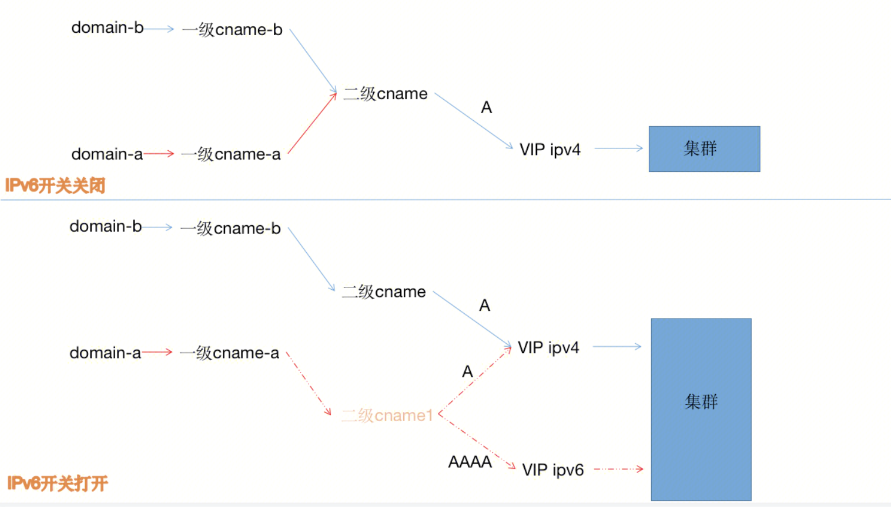

#### 背景：
- **问题**：随着网络规模的爆炸增长，接入互联网的主机越来越多。然而32bit的IPv4地址，仅能支持约43亿个地址。并且地球人数已经来到了41亿大关。互联网无可避免的需要面对IPv4地址数目耗尽的风险。为了规避ipv4地址枯竭的问题，互联网组织起草了ipv6协议。
- **方案**：ipv6协议采用了128bit的地址位数，地址使用冒分十六进制八段组织形式，而非ipv4的32位点分十进制四段组织形式。因此ipv6可以编码更多的地址，号称可以为地球上每一粒沙子编码，从根本上解决了地址不足的问题。
- **WAF需求**
	- 1.用户拥有ipv6服务器，WAF回源时需要支持IPV6协议回源。
	- 2.用户没有ipv6服务器，需要WAF对外提供IPV6协议访问，然后使用IPv4协议回源。
- **WAF方案**
	- 打通ipv6网络，对外提供二级cname到A记录和AAAA记录的DNS解析。 

- 设计

打开ipv6：一级cname-a先关联新的二级canme1，然后一级cname-a断掉二级cname。

关闭ipv6： 一级cname-a先重新关联二级cname，然后一级cname-a断掉二级cname1。