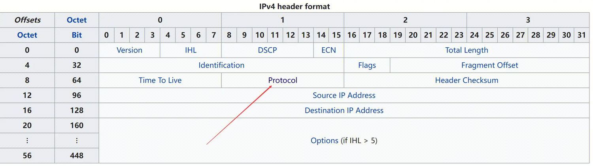

## IP TUN
IP隧道（IP tunnel）是一种将一个IP数据包封装在另一个IP数据包中进行传输的技术。它可以将一个IP数据包从一个网络传输到另一个网络，同时保持原始IP数据包的完整性和可达性。

IP隧道通常用于连接两个不同的网络，例如连接ipv6网络和ipv4网络。在这种情况下，IP隧道可以将一个IP数据包从一个网络传输到另一个网络，同时保持原始IP数据包的完整性和可达性。

IP隧道的实现方式有多种，其中比较常见的是使用IPIP协议或GRE协议进行封装。在使用IPIP协议或GRE协议进行封装时，原始的IP数据包会被添加一个新的IP头部或GRE头部，从而形成一个新的IP数据包或GRE数据包。这个新的IP数据包或GRE数据包会被传输到目标网络，然后被解封装成原始的IP数据包进行处理。

总的来说，IP隧道是一种将一个IP数据包封装在另一个IP数据包中进行传输的技术，它可以连接两个不同的网络，同时保持原始IP数据包的完整性和可达性。


## IPIP
### 是什么
IPIP隧道是一种在IP层上进行封装的隧道技术，它可以将一个IP数据包封装在另一个IP数据包中进行传输。在Linux中，IPIP隧道可以通过以下步骤来实现：
https://www.coderdocument.com/docs/2022/11/9/linux_ipip_tunnel.html

### 怎么做
IPIP协议的代码实现主要在Linux内核中，下面是IPIP协议的代码解析：
1. IPIP协议的注册
IPIP协议的注册是在内核初始化时进行的，通过调用ipip_init函数来注册IPIP协议。ipip_init函数会调用inet_add_protocol函数来注册IPIP协议到网络协议栈中。
2. IPIP协议的封装
IPIP协议的封装是在ipip_xmit函数中实现的。ipip_xmit函数会将原始的IP数据包封装在一个新的IP数据包中，并将新的IP数据包发送到物理网络接口进行传输。具体实现过程如下：
	- 创建一个新的skb数据包，用于存放封装后的IP数据包。
	- 在skb数据包的头部添加一个新的IP头部，从而形成一个新的IP数据包。
	- 将原始的IP数据包复制到新的IP数据包中，并更新新的IP头部的源地址和目标地址。
	- 调用dev_queue_xmit函数将新的IP数据包发送到物理网络接口进行传输。
3. IPIP协议的解封
IPIP协议的解封是在ipip_rcv函数中实现的。ipip_rcv函数会将封装在IPIP数据包中的IP数据包解封装成原始的IP数据包，并将其传递给上层协议栈进行处理。具体实现过程如下：
	- 解析IPIP头部，获取原始的IP数据包。
	- 将原始的IP数据包传递给上层协议栈进行处理。
4. IPIP协议的路由选择
IPIP协议的路由选择是在ip_route_input函数中实现的。ip_route_input函数会根据路由表中的路由规则，选择一个最佳的路径进行转发。具体实现过程如下：
	- 根据目标地址查找路由表，获取匹配的路由规则。
	- 根据路由规则选择一个最佳的路径进行转发。

总的来说，IPIP协议的代码实现主要涉及到协议的注册、封装、解封和路由选择等方面。在Linux内核中，IPIP协议的代码实现比较简单，主要是通过调用内核提供的函数来实现协议的功能。

### 源码解析
https://www.kancloud.cn/pshizhsysu/network/3028383
### IPIP配置
要使用IPIP协议，我们首先会创建一个虚拟网卡。例如：
`ip tunnel add tun0 mode gre remote 192.168.122.90 local 192.168.122.80 ttl 64`
然后要配置路由，让目的IP地址的包，发往这个虚拟网卡：
`ip route add 192.168.2.0/24 dev tun0`

### IPTunnel协议栈注册

#### 网卡驱动
IPIP协议是Linux虚拟网卡的。网卡都有网卡驱动程序。IPIP虚拟网卡的驱动程序如下
```
static const struct net_device_ops ipip_netdev_ops = {
	.ndo_init       = ipip_tunnel_init,
	.ndo_uninit     = ip_tunnel_uninit,
	.ndo_start_xmit	= ipip_tunnel_xmit,    # ipip tunnel设备的ndo_start_xmit为 ipip_tunnel_xmit
	.ndo_do_ioctl	= ipip_tunnel_ioctl,
	.ndo_change_mtu = ip_tunnel_change_mtu,
	.ndo_get_stats64 = ip_tunnel_get_stats64,
	.ndo_get_iflink = ip_tunnel_get_iflink,
};
```
驱动程序会在Linux启动时，会进行注册。


#### 协议栈
IPIP是tunnel协议的一种，tunnel和tcp等协议一样要在Linux的协议栈中进行注册。
注册tunnel协议，可以直接把tunnel4.c和linux源码一起编译，最终执行module_init

也可以通过tunnel4.ko的内核扩展方式，加入linux中。

```
inet_add_protocol(&tunnel4_protocol, IPPROTO_IPIP)

static const struct net_protocol tunnel4_protocol = {
	.handler	=	tunnel4_rcv,        # handler函数为 tunnel4_rcv
	.err_handler	=	tunnel4_err,
	.no_policy	=	1,
	.netns_ok	=	1,
};
```
最终，收到IPIP协议的包之后，是通过tunnel4_rcv函数来处理。
tunnel4_rcv中有个对象是`*xfrm_tunnel tunnel4_handlers`，这是一个链表，所有的tunnel处理方法按照优先级挂在这个链表上。例如IPIP的handler：
```
static struct xfrm_tunnel ipip_handler __read_mostly = {
	.handler	=	ipip_rcv, //处理方法
	.err_handler	=	ipip_err,
	.priority	=	1, //第一优先级
};

static int __init ipip_init(void)
{
	int err;

	...
	err = xfrm4_tunnel_register(&ipip_handler, AF_INET);    # 注册到xfrm_tunnel
	...
}
```


### IPIP发包
传输层  --> ip_local_out --> ip_finish_out2  【常规流程】


#### ip_queue_xmit

ip_queue_xmit会在路由表中，可以查到某个⽬的⽹络应该通过哪个 Iface（⽹卡），哪个 Gateway（网关）
发送出去。查找出来以后缓存到 socket 上。
由于IPIP创建的时候配置了路由，因此路由匹配的时候，包发往Iface及gw(即tunl0及192.168.92.122)
#### ip_finish_out2
本来该函数中会进行arp查询，并封装mac地址。

但是对于IPIP协议来说，tunl0设备的header_ops等指针的值，会让函数进入其他逻辑。
ipip是直接调用了`dev_queue_xmit(skb);` 没有封装mac地址。 因此IPIP报文的内层是不带MAC地址的。

#### dev_queue_xmit

dev_queue_xmit会判断网络设备是否有队列（RX TX）。
隧道和回环都是没有队列的。因此不走加入队列并发送的逻辑。而是：
`dev_queue_xmit` --> `dev_hard_start_xmit` --> `xmit_one` --> `netdev_start_xmit`
netdev_start_xmit调用了网络设备真正的发送函数。即上文中，IPIP设备注册的 `net_device_ops ipip_netdev_ops`
```
static const struct net_device_ops ipip_netdev_ops = {
	.ndo_init       = ipip_tunnel_init,
	.ndo_uninit     = ip_tunnel_uninit,
	.ndo_start_xmit	= ipip_tunnel_xmit,    # ipip tunnel设备的ndo_start_xmit为 ipip_tunnel_xmit
	.ndo_do_ioctl	= ipip_tunnel_ioctl,
	.ndo_change_mtu = ip_tunnel_change_mtu,
	.ndo_get_stats64 = ip_tunnel_get_stats64,
	.ndo_get_iflink = ip_tunnel_get_iflink,
};
```
#### ipip_tunnel_xmit
```
void ip_tunnel_xmit(struct sk_buff *skb, struct net_device *dev,
		    const struct iphdr *tnl_params, u8 protocol)
{
	...

	dst = tnl_params->daddr;        # 获取tunnel的daddr，即remote address
	if (dst == 0) {            # 如果remote address为0，说明不是点对点tunnel
		/* NBMA tunnel */            # 为Non-Blocking-Multi-Address tunnel

		...
		tun_info = skb_tunnel_info(skb);
		if (tun_info && (tun_info->mode & IP_TUNNEL_INFO_TX) &&
		    ip_tunnel_info_af(tun_info) == AF_INET &&
		    tun_info->key.u.ipv4.dst) {
			...
		}
		else if (skb->protocol == htons(ETH_P_IP)) {
			rt = skb_rtable(skb);        # 获取路由表 
			dst = rt_nexthop(rt, inner_iph->daddr);    # 根据内部IP头的daddr，在路由表中查找路由然后得到下一跳地址
		}
        ...
	}
	// 隧道分为两种，一种是point-to-point隧道，也就是设置了非通配remote的隧道；还有一种是NBMA (Non-Broadcast Multi-Access)隧道，没有设置remote。fb设备 `tunl0` 是NBMA的。NBMA隧道，需要根据inner IP的目的地址，查找next_hop地址（路由器或者直连的host），并设置为destination地址。

	...

	iptunnel_xmit(NULL, rt, skb, fl4.saddr, fl4.daddr, protocol, tos, ttl,
		      df, !net_eq(tunnel->net, dev_net(dev)));
	return;

...
}
```

#### iptunnel_xmit
```
void iptunnel_xmit(struct sock *sk, struct rtable *rt, struct sk_buff *skb,
		   __be32 src, __be32 dst, __u8 proto,
		   __u8 tos, __u8 ttl, __be16 df, bool xnet)
{
	...
	/* Push down and install the IP header. */
	skb_push(skb, sizeof(struct iphdr));    # 对数据包进行位置调整，让出位置给外部的header
	skb_reset_network_header(skb);

	iph = ip_hdr(skb);    # 获取数据包外部header的位置

	iph->version	=	4;    # 从这里开始，设置外部的IP header
	iph->ihl	=	sizeof(struct iphdr) >> 2;
	iph->frag_off	=	ip_mtu_locked(&rt->dst) ? 0 : df;
	iph->protocol	=	proto;
	iph->tos	=	tos;
	iph->daddr	=	dst; // 封装外部IPheader Dst
	iph->saddr	=	src; // 封装外部IPheader Src
	iph->ttl	=	ttl;
	__ip_select_ident(net, iph, skb_shinfo(skb)->gso_segs ?: 1);

	err = ip_local_out(net, sk, skb);    # 最终绕到网络层

	...
}
```
ip_local_out(net, sk, skb);    最终绕到网络层，根据外部的IPheader进行正常的转发。（路由 、封装mac ...）


### IPIP收包
ip_rcv() --> ip_rcv_finish() --> ip_local_deliver_finish()
#### ip_local_deliver_finish
```
static int ip_local_deliver_finish(struct net *net, struct sock *sk, struct sk_buff *skb)
{
	__skb_pull(skb, skb_network_header_len(skb));    

	rcu_read_lock();
	ip_protocol_deliver_rcu(net, skb, ip_hdr(skb)->protocol);    # 从外部IP头中获取上层协议
	rcu_read_unlock();

	return 0;
}
```


从IP头部的protocol中取出上层协议，包括TCP UDP IPIP ICMP GRE ...
然后调用对应的处理函数tunnel4_rcv

#### tunnel4_rcv --> ipip_rcv --> ipip_tunnel_rcv
```
static int ipip_tunnel_rcv(struct sk_buff *skb, u8 ipproto)
{
	...
	tunnel = ip_tunnel_lookup(itn, skb->dev->ifindex, TUNNEL_NO_KEY,
			iph->saddr, iph->daddr, 0);    # 查询tunnel，因为可能有很多tunnel，比如创建了有local和remote很的tunnel
	if (tunnel) {
		...
		return ip_tunnel_rcv(tunnel, skb, tpi, tun_dst, log_ecn_error); //执行处理函数
	}
	
	// 收到ipip协议包，但是没有匹配到tunnel
	return -1;
}
```
### ip_tunnel_rcv
```
int ip_tunnel_rcv(struct ip_tunnel *tunnel, struct sk_buff *skb,
		  const struct tnl_ptk_info *tpi, struct metadata_dst *tun_dst,
		  bool log_ecn_error)
{
	...

	skb_set_network_header(skb, (tunnel->dev->type == ARPHRD_ETHER) ? ETH_HLEN : 0);    # 重新设置network header，即去掉外层IP Header

	...

	gro_cells_receive(&tunnel->gro_cells, skb);    # 重新投递到内核协议栈，从tunnel对应的网卡接收
	...
}
```
- skb_set_network_header简单的去掉了一个IP层HEADER（将header指针往skb data后挪动一个header的大小）
- gro_cells_receive中，触发了软中断`__raise_softirq_irqoff(NET_RX_SOFTIRQ);`
接着就由ksoftirq线程，去处理软中断。进入正常的linux收包过程。


# GRE
IPIP和GRE都是在IP层上进行封装的隧道协议，它们的主要区别如下：
1. 头部格式：IPIP隧道协议在封装IP数据包时，会在原始IP数据包的头部添加一个新的IP头部，从而形成一个新的IP数据包。而GRE隧道协议在封装IP数据包时，会在原始IP数据包的头部添加一个GRE头部，从而形成一个新的GRE数据包。因此，IPIP隧道协议的头部格式比GRE隧道协议更简单。（例如VPCID和RSIP）
2. 协议支持：IPIP隧道协议是Linux内核自带的协议，可以在任何Linux系统上使用。而GRE隧道协议是一种标准协议，可以在不同的操作系统和设备上使用。GRE 和 IPIP 都是隧道协议，但它们之间有一些区别。GRE 是最初由 CISCO 开发出来的隧道协议，能够做一些 IP-in-IP 隧道做不到的事情。比如，你可以使用 GRE 隧道传输多播数据包和 IPv6 数据包。而 IPIP 是一种简单的隧道协议，它只能连接两个一般情况下无法直接通讯的 IPv4 网络，不能通过 IP-in-IP 隧道转发广播或者 IPv6 数据包。

