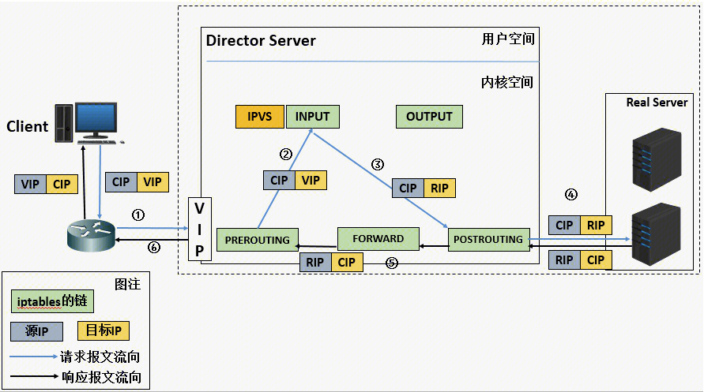

## LVS
### 介绍
Linux Virtual Server。基于IP地址的虚拟化应用，为基于 IP 地址负载均衡提出了高效的解决方法。LVS通过负载均衡技术和 Linux 操作系统实现一个高性能高可用的 Linux 服务器集群，具有良好的可靠性、可扩展性和可操作性。从而以低廉的成本实现最优的性能。
### 对比优势
#### 硬件负载均衡
硬件负载均衡是通过专门的硬件设备从而来实现负载均衡功能，比如：交换机、路由器就是一个负载均衡专用的网络设备。目前典型的硬件负载均衡设备有两款：**F5** 和 **A10**。

- 优势：性能强大，且自带防火墙和防DDOS的安全能力。
- 劣势：昂贵，扩展性查，难以维护调试
#### 软件负载均衡
简单、灵活、便宜
##### 基于名字服务的负载均衡集群（DNS/北极星）

- 因为本地缓存的存在，导致服务器的负载不够均衡。
客户端的请求会使用DNS本地缓存，在指定的名称解析生存时间（TTL）中发送到同一服务器。
若TTL太小，每次请求都重新获取ip，DNS服务器将成为瓶颈。
若TTL太大，很容易导致服务器之间的负载不均衡。
- 后端服务宕机了，比较难以感知。
#### 基于分派器的负载均衡集群（NGINX/LVS）
与基于名字服务的负载平衡相比

- 调度程序可以按精细的粒度（例如每个连接）调度请求，以实现服务器之间的更好负载平衡。
- 服务器管理变得越来越容易，管理员可以随时使一台或多台服务器投入使用或退出服务，而这不会中断最终用户的服务。一台或多台服务器发生故障时，可以主动剔除服务。
基于分派器的负载均衡可以分为两个级别，即应用程序级别和IP级别。例如NGINX的七层负载是基于应用程序级别，NGINX的七层负载或者LVS都是IP级别。
- Nginx ：支持 4 层 / 7 层负载均衡，支持 HTTP、E-mail 协议；
- LVS ：纯 4 层负载均衡，运行在内核态，性能是软件负载均衡中最高的；
- HAproxy ：是 7 层负载均衡软件，支持 7 层规则的设置，性能也不错；

### LVS基本原理
#### NetFilter和IPtables背景
LVS 是基于 Linux 内核中 netfilter 框架实现的负载均衡系统。

- iptables 位于用户空间，是用户层的工具，提供命令行接口，能够向 Netfilter 中添加规则策略，从而实现报文`过滤，修改`等功能。iptables 是用户空间编写和传递规则的工具，真正工作的是netfilter。
- Netfilter 位于内核空间。是内核态的 Linux 防火墙机制，它作为一个通用、抽象的框架，提供了一整套的 hook 函数管理机制，提供`数据包过滤、网络地址转换、基于协议类型的连接跟踪`的功能，可在数据包流经过程中，根据规则设置若干个hook 函数来执行相关操作，共设置了 5 个点，包括：`PREROUTING、INPUT、FORWARD、OUTPUT、POSTROUTING`。

**prerouting：** 在对数据包做路由选择之前，将应用此链中的规则；

**input：** 当收到访问本机地址的数据包时，将应用此链中的规则；

**forward：** 当收到需要转发给其他地址的数据包时，将应用此链中的规则；

**output：** 当本机向外发送数据包时，将应用此链中的规则；

**postrouting：** 在对数据包做路由选择之后，将应用此链中的规则；

当数据包通过网络接口进入时，经过链路层之后进入网络层到达 `PREROUTING` ，然后根据目标 IP 地址进行路由查找。`如目标 IP 是本机`，数据包会传到 `INPUT` 上，经过协议栈后根据端口将数据送到相应的应用程序；应用程序将请求处理后把响应数据包发送至 `OUTPUT` 里，最终通过 `POSTROUTING` 后发送出网络接口。
`如目标 IP 不是本机`，并且服务器开启了 `FORWARD` 参数，这时会将数据包递送给  `FORWARD` ，最后通过 `POSTROUTING` 后发送出网络接口。
### LVS工作原理

LVS 基于 netfilter 框架，工作在 INPUT 链上，在 INPUT 链上注册 ip_vs_in HOOK 函数，进行 IPVS 相关主流程，详细原理概述如下：

**1、** 当客户端用户访问 www.baidu.com 网站时，用户访问请求通过层层网络，最终通过交换机进入 LVS 服务器网卡进入内核空间层。

**2、** 进入 `PREROUTING` 后通过查找路由，确定访问目的 VIP 是本机 IP 地址的话，数据包将进入 `INPUT` 链中。

**3、** 因为 IPVS 工作在 INPUT 链上，会根据访问的 `VIP` 和 `端口` 判断请求是否为 IPVS 服务，是的情况下，则调用注册的 `IPVS HOOK 函数` ，进行 `IPVS` 相关流程，并`强制修改数据包的相关数据`，并将数据包发往 `POSTROUTING` 链中。

**4、**  `POSTROUTING` 链收到数据包后，将根据目标 IP 地址服务器，通过路由选路，将数据包最终发送至后端真实服务器中。

### 工作模式
当上述第三步`IPVS` 流程不同时，LVS将拥有不同的工作模式。常见的有地址转换（NAT/FULLNAT）、IP 隧道（TUN）和直接路由（DR）三种工作模式。详细细节见参考连接。性能比较：DR>TUN>NAT>FULLNAT
#### NAT
修改ip和port转发，一次tcp连接


- 优势：
```
	- 支持端口映射，LVS可以修改目的 IP 地址和 PORT 以支持端口映射。
	- 可以透传客户端ip地址，rs收到的包是客户端ip，与rs建立tcp连接的是client。此时rs的remoteaddr为CIP，Client拿到的tcp对端地址是VIP。rs上抓包，srcip为CIP.
```
- 劣势：
```
	- RS需要配置网关，将包转到LVS服务器。要求LVS服务器和RS位于一个[VLAN](https://cloud.tencent.com/developer/article/1412795) 中。
	- NAT需要承载双向流量，压力大
```
#### FULLNAT	
修改ip和port转发，整个过程一个tcp连接，NAT纯转发。


- 优势：
RS需要不需要配置网关，接入内网即可。或者DIP和RIP都是公网IP。此时rs的remoteaddr为DIP，Client拿到的tcp对端地址是VIP
- 劣势：
```
	- 无法透传clientip，rs收到的包是LVS的出口ip，与rs建立tcp连接的是client。此时rs的remoteaddr为DIP，Client拿到的tcp对端地址是VIP。rs上抓包，srcip为DIP。
	- NAT需要承载双向流量，压力大
```
#### DR
修改MAC地址进行转发


- 劣势：
```
	- 由于需要MAC地址转发到正确的RS，要求LVS服务器和RS位于一个VLAN中。
	- 为了让RS接受并处理目的地址为VIP的报文，配置RS的本地网卡lo ip地址为VIP
```
- 优势
响应报文不经过也必须不能经过LVS服务器。LVS服务器压力较小。
#### IP Tunnel
封装原来的ip报文，在外层再加入DIP和RIP。发送到网络之后，路由器根据RIP寻址。只要RIP是公网地址，那么报文就可以到达RS。
用户请求LVS，LVS通过IP-TUN加密技术将请求报文的包封装到一个新的IP包里面，将报文发送到RS，`RS基于IP-TUN解密`(对rs有要求)，然后解析出来包的目的为VIP。RS检测lo网卡是否绑定了VIP，绑定了就处理这个包，如果没有绑定VIP就直接丢掉这个包。响应的时候，如果CIP在同一个网段，将请求直接返回给用户。否则通过网关路由返回给用户；


- 优势：
后端服务可以散落在互联网的任意地方。
- 劣势：
  为了让RS接受并处理目的地址为VIP的报文，配置RS的本地网卡lo ip地址为VIP
- rs收到报文之后，解密包，拿到的srcip为cip，目的ip为vip。remoteaddr为cIP，Client拿到的tcp对端地址是VIP。rs上抓包，srcip为DIP。

## 参考：

- https://cloud.tencent.com/developer/article/1657962
- https://blog.csdn.net/lcl_xiaowugui/article/details/81701949
- https://www.cnblogs.com/wjoyxt/p/8477213.html