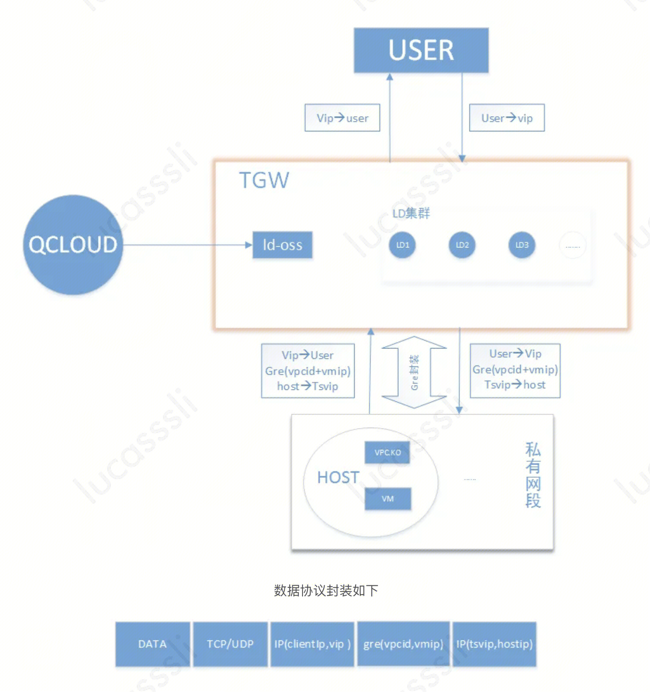
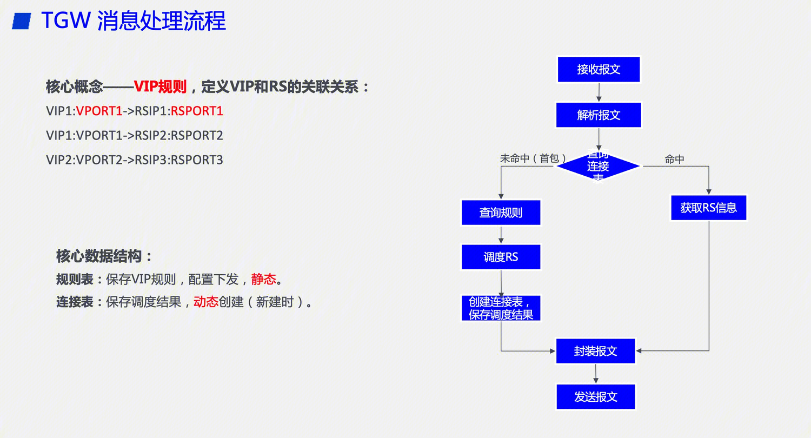

## TGW与LVS
### 转发模式
TGW 主要是IP隧道模式，LVS考虑到泛用性，支持四种转发模式（NAT、FULLNAT、DR、IPTunnal）。
TGW 入流量出流量均经过TGW转发，而LVS，入流量经过LVS到后端服务器RS，出流量可以直接从RS发到客户端。
https://iwiki.woa.com/pages/viewpage.action?pageId=1893854571
### 代码维护
TGW底层基于linux网络协议栈，且私有化有专业团队维护。
LVS基于开源协议。

## ko
Linux内核模块（Kernel Module）是一种动态加载到Linux内核中的可执行代码，也称为Linux内核驱动程序。内核模块可以在运行时动态地添加到内核中，从而扩展内核的功能或添加新的设备驱动程序。
Linux内核模块通常以.ko为扩展名，是一种二进制文件，可以通过insmod命令或modprobe命令加载到内核中。内核模块可以在运行时动态地加载和卸载，从而避免了重新编译整个内核的麻烦。
内核模块通常用于添加新的设备驱动程序、文件系统、网络协议栈等功能。内核模块的编写需要遵循一定的规范和接口，以便与内核进行交互和通信。
总的来说，Linux内核模块是一种动态加载到Linux内核中的可执行代码，可以扩展内核的功能或添加新的设备驱动程序。内核模块通常以.ko为扩展名，可以通过insmod命令或modprobe命令加载到内核中。

## LD
公网CLB底层主要功能实现在TGW。用户在控制台操作CLB之后，操作流最终会下发到TGW提供的oss组件模块。

ld-oss模块主要负责提供接口（比分配vip，创建监听器，创建域名和规则等）供控制台调用。

LD（load dispatcher）集群中的每个LD上都会存在admin组件，此组件会和oss模块之间通过PB（protocol buffer）格式进行数据交换，然后admin会下发这些规则到LD内核中（LD上主要有tvs.ko主要负责负载均衡转发功能）。

## tvs.ko 
和IPVS.KO是类比关系

### 流程
ip_rev -- > input [处理] --> ip_output
处理过程如上图。
获取RS信息后，转向IPIP协议封装报文。

### 转发规则
1. 转发的核心对象和概念。TGW 负载均衡的核心对象是VIP规则，VIP+VPORT便是路由规则的主键，后端可以挂载多个服务器RS，用于负载均衡；TGW 中有两个关键的查询表，规则表用于保存VIP规则，通过控制台/接口进行配置下发，对转发平面来讲是静态配置，连接表保存负载均衡调度结果，是在新建连接时动态创建。
2. 整体报文转发流程如上图，当一个请求到达时，解析报文后，查询连接表，如果是首包（未命中连接表），则查询规则表，进行调度和创建连接表，并转发报文，如果命中连接表，则根据已有的连接表信息转发报文。（用于会话保持）

### IPIP封包
tgw的linux内核在解析“客户端请求包”的时候，首先解析ip头，解析出源ip：cip，目的ip:vip。
**tgw上面配置了IPTunnal，发现目的地为VIP，于是使用ipip隧道。**
于是在客户端请求包前面加上新的ip头，这个ip头指明了新的源ip为tgwip（local IP），目的ip为svrip（remote ip）。
local ip可以配置，remote ip则是根据转发规则，得到一个RSIP。

### tgw.ko / vpc.ko
部署在RS上面

