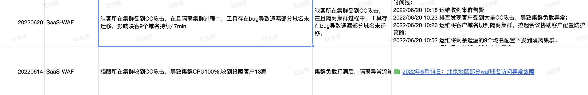
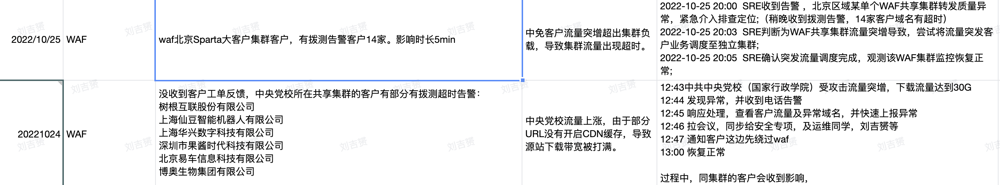
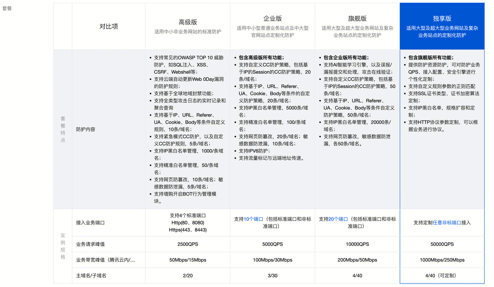
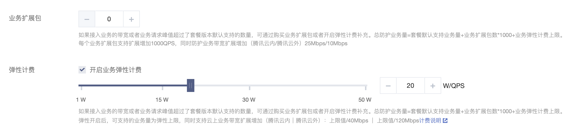
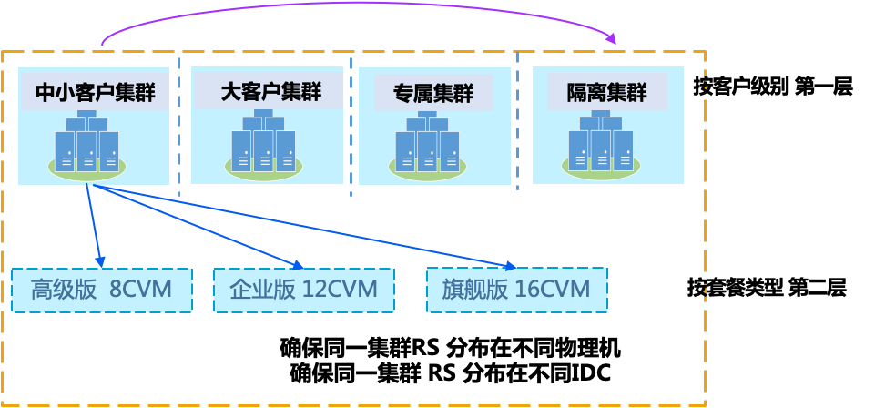
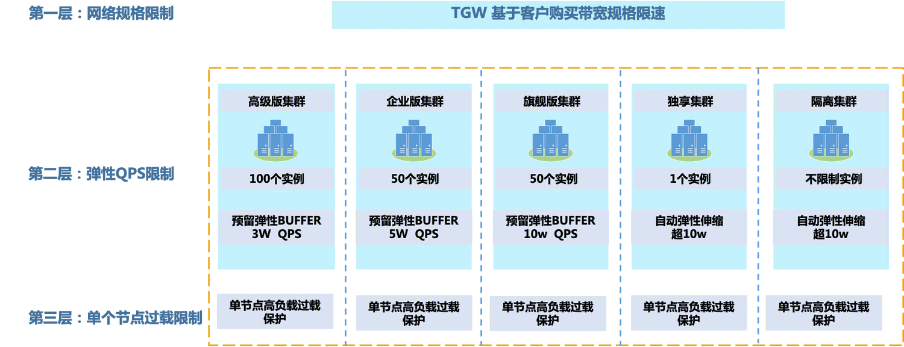
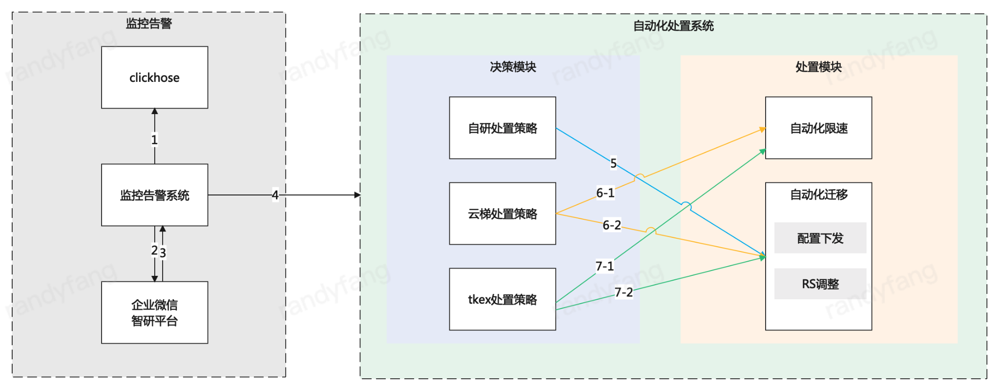

## 背景
当前面对集群流量突发，受制于资源和成本原因，我们当前会出现一定的稳定性问题：

经过第一阶段的优化和改进，目前已经做到1分钟发现（监控），5分钟内处置（VIP迁移），但是依然会对客户有影响，影响客户服务，产品口碑受到影响。
    
## 当前问题分析
### 一、产品 （产品售卖规格）
#### 现状

与`QPS`相关的售卖项是基础套餐 + 增值项：
总业务承载量（QPS）= 套餐默认支持业务量 + 业务扩展包数 x 1000 + 业务弹性计费上限。

与`带宽`相关的售卖项是基础套餐 + 增值项：（云内流量不限制带宽，云外（流出和流入）才限制带宽）
总业务承载量（Mbps）= 套餐默认支持带宽量 + 业务扩展包数 x 10 + 业务弹性计费上限 / 120。

#### 存在的问题：
1、客户购买的qps、带宽规格未做限制。理论上，用户可以无限叠加带宽和QPS

### 二、技术 （并发限制）
#### 现状
Nginx未配置限速机制
VIP默认设置带宽1Gbps

#### 问题
**QPS**：无任何并发请求限制，高QPS随时导致集群负载飙升。
**带宽**：VIP带宽上限远远超过用户实际购买带宽，纵容QPS飙升，并增加了带宽成本。

### 三、运维 （集群容量运维）
#### 现状

CVM部署，集群资源固定，不具备自动弹性扩展的能力。集群容量与用户实际购买流量不挂钩。

#### 存在的问题：
0、客户增购扩展包，或者开启弹性，调高峰值，我们并未对集群容量进行相应的调整
1、CVM资源扩容调度时间周期较长，30min级别
2、资源成本较高，弹性能力差，需要预留buffer，这部分空闲buffer会计成本
3、集群容量未与实际售卖规格关联，依靠人工巡检负载
4、当前集群实际资源利用率不高，集群个数较多，存在一定的资源未能合理利用的问题
5、当前并行三种架构： 支撑自研环境，云梯自研环境，Tke自研上云环境

## 改进措施
### 产品层面
针对售卖规格，进一步明确化：

1、对各个版本实例的QPS最大值进行限制，对于超出版本QPS限制的需求，推动客户购买独享版本。

2、独享版实例的QPS不作限制。（独享集群不会影响其他客户，本身集群可以弹性伸缩，所以弹性能力可以提供较高）

### 技术层面

针对带宽：
1.一个实例对应一个VIP，并限制该VIP的带宽上限。

针对QPS：
2.基于STGW GUARD模块，在集群高负载时触发对单个server的qps 的限制。 

在集群负载较低的时候，单域名的QPS限制不会生效。此时，通过实例的VIP带宽，约束用户的并发请求量。
当集群负载较高的时候，一般是当个域名流量突增。为了保证集群的稳定性，通过触发server的qps限制，约束所有用户的并发请求量。

CC自动封禁：
因为很多情况下，用户域名流量飙升都是因为被CC攻击了。所以，WAF推出来基于集群负载和请求状态码的实时计算引擎来自动化迁移用户流量到cc隔离集群，并通过ipset对IP进行封禁的AutoCC功能。

### 运维层面
1.各个版本的集群预留buffer ，使其至少能够支撑一个客户的最大弹性容量（合理假设：多个客户同时弹性突发的概率极低）           
2.尽快推动原有云梯、支撑自研等环境迁移到Tke
3.集群实现SET化部署，每个SET 严格限制接入的实例数量

### 过渡以及兜底策略
如果经过产品层面，技术层面，运维层面的改进措施。我们已经能够防止集群流量突发，出现稳定性问题的情况。但是改进过程中，或者改进措施如果不生效，我们仍然需要一个过渡或者兜底的策略。该策略如图所示：
 
主要分为监控告警和自动化处置两个部分。
第一部分 监控告警模块主要负责拉业务数据，并告警到企业微信，接收是否自动化处置，调用自动化处置接口。
第二部分 自动化处置模块根据业务所在集群类型，决策处置策略，并调用处置接口。

### 监控告警
#### 1. 业务数据查询统计 
监控告警系统每隔10秒拉取一次最近30秒的数据，统计平均qps。域名qps超过1w，并且域名所在集群的节点平均qps超过3000视为致命状态。（多域名导致集群QPS高，不考虑）

#### 2. 告警
监控告警系统向企业微信和智研同时告警。企业微信发送告警信息，智研平台打告警电话。 

### 自动化处置
1.下发配置到隔离集群
2.VIP限速
3.迁移流量到隔离集群

