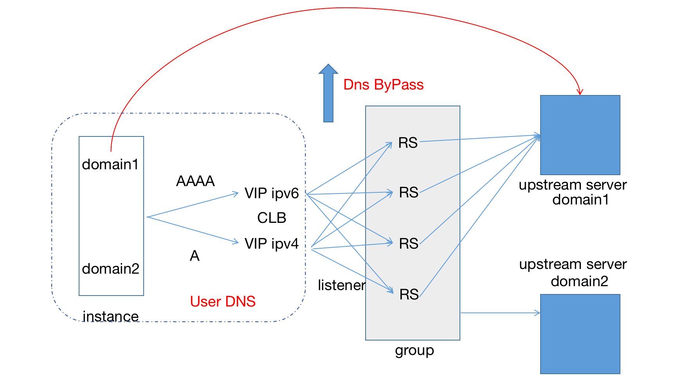
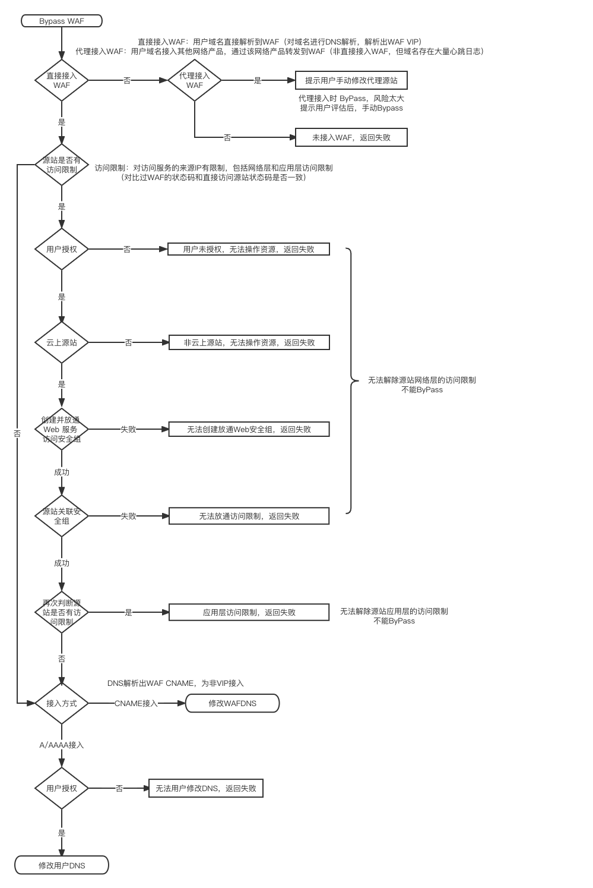

## 一键ByPass技术方案评审

### 一、概览
SaasWaf作为网络产品，串行在用户网络架构中。即使SassWAF产品出现单点故障，也可能导致整个用户服务不可用。因此，在SaasWaf出现故障时，如何减少整个用户服务不可用的风险是急需解决的问题。
Bypass Waf通常用于解决这个问题。Bypass Waf指，在不影响用户服务的前提下，把SaasWaf从用户网络架构中剔除。该方法可以有效减少因SaasWaf故障导致的整个用户服务不可用风险。
针对目前SaasWaf的接入架构，Bypass Waf有多种实现方式。例如，LVS负载均衡方式、DNS域名解析切换方式、Nginx只转发方式。综合对比，我们选择DNS域名解析切换的技术方案。

### 二、背景

标准的SaasWaf接入架构概览

接入技术分层

SaasWaf接入架构中，主要涉及三部分网络组件。分别是DNS域名解析，LVS负载均衡，NGINX反向代理。针对这三部分网络组件，我们可以分别实现ByPass Waf方案。三种ByPass方案各有优劣，分析如下：

#### 2.1 NGINX ByPass
ByPass Waf 安全检测过程，仅保留Waf转发功能。
缺陷：无法满足需求。即使关闭安全检测，Waf仍然在串行在网络架构中，无法规避因Waf故障导致的服务不可用风险。

#### 2.2 LVS ByPass
改变TGW转发规则，将VIP转发的流量在Waf的集群间迁移，实现ByPass。
优势：

●135项目‘VIP迁移’已实现该功能。并已经作为集群紧急故障时的应急方案。

●规则实时生效

缺陷：
●VIP是实例维度的资源。迁移VIP，无法精细到域名级别的流量
●不完全满足需求。即使切换了集群，流量仍然过Waf。只是起到主备集群的作用
●风险较大，无法产品化。

#### 2.3 DNS ByPass
改变DNS解析，将DNS解析到源站。实现ByPass
优势：
●灵活，可以实现域名级别Bypass。
●完全满足需求，可以实现将Waf从用户网络架构中剔除。
缺陷：
●无法精准控制，DNS切换后生效时延。

经过综合评估，目前选择DNS ByPass方案。

### 三、技术方案
#### 3.1 用户接入场景
用户接入WAF的方式大致可以分为三种：
1.使用WAF的CNAME接入  
2.使用WAF的VIP接入 
3.使用其他代理转发接入WAF
三种接入方式，对症下药。

3.1.1 CNAME 接入

●操作范围完全在WAF DNS之内，非腾讯云DNS用户同样适用，且无需额外权限
●Bypass 用户无感知（无访问日志）

3.1.2 A/AAAA 接入

●在用户DNS中进行操作，需要用户使用腾讯云DNS，且授权WAF操作DNS（腾讯云DNS用户占比）
●Bypass 用户有感知

3.1.3 代理接入

●在用户DNS中进行操作，需要用户使用腾讯云DNS，且授权WAF操作DNS
●Bypass 用户有感知
●无法做到仅仅剔除WAF，同时剔除了用户的其他转发或代理网络产品
（梳理代理产品形态）

#### 3.2 Bypass 程序设计
https://docs.qq.com/flowchart/DWW5WQXlVQ3RyaVJp

#### 3.3 Access 程序设计
https://docs.qq.com/flowchart/DWVlnRmZwZHNvWlRi

### 四、接口
4.1 开启Bypass（运营平台）
BypassSpartaProtection 详细信息见云API

4.2 关闭Bypass（运营平台）
AccessSpartaProtection 详细信息见云API

4.3 FetchDomainSaas 新增字段（运营平台）
新增字段 BypassState 
0 -- 未Bypass （展示开启ByPass）
1 -- 已Bypass （展示关闭Bypass）

4.3 查询Bypass信息（公有云）
DescribeBypassSpartaProtection 详细信息见云API

### 五、DNS 生效时间

DNS解析过程
●DNS记录修改后，生效时间主要由本地DNS代理控制：
「腾讯DNSPod是权威DNS服务器，在DNSPod中变更解析记录是秒级生效的。但是因为本地DNS代理会缓存域名的解析结果，当用户访问域名时，如果本地DNS缓存未到期，是不会向DNSPod请求最新的解析记录，而是直接将之前缓存的解析结果返回给客户，所以修改/删除/暂停记录的解析生效时间需要等到客户端本地DNS的缓存过期」

●如何缩短本地DNS代理缓存时间：
「修改DNS解析记录时，缩小记录的TTL。本地dns代理会基于该TTL决定缓存的过期时间。部分本地dns会忽略记录的TTL」

遗留问题
●用户客户端出口ip有限制
●以前通过WAF做了一些代理功能的，bypass都会不支持
●ACL判断，拨测方式
●一定确保bypass，对用户业务无中断。

