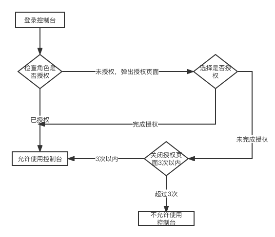
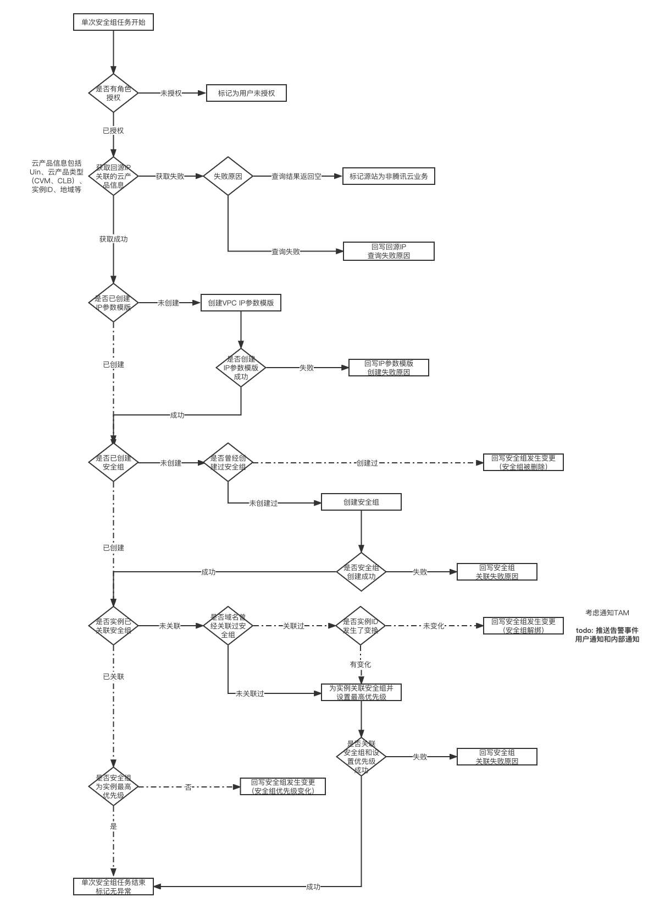
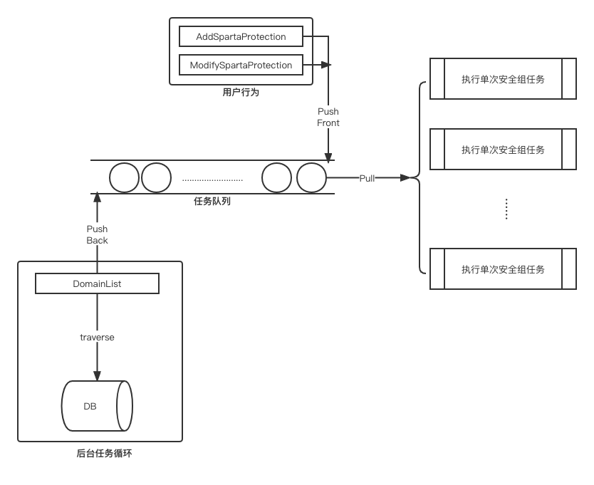
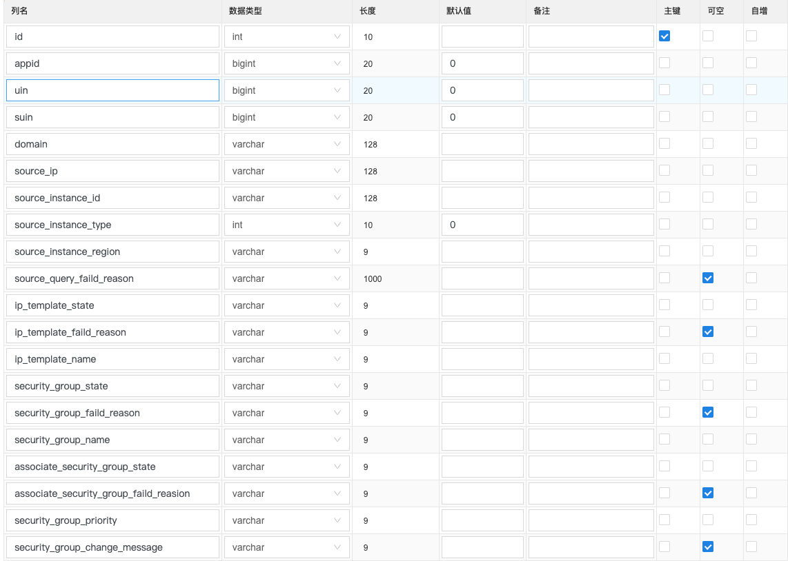
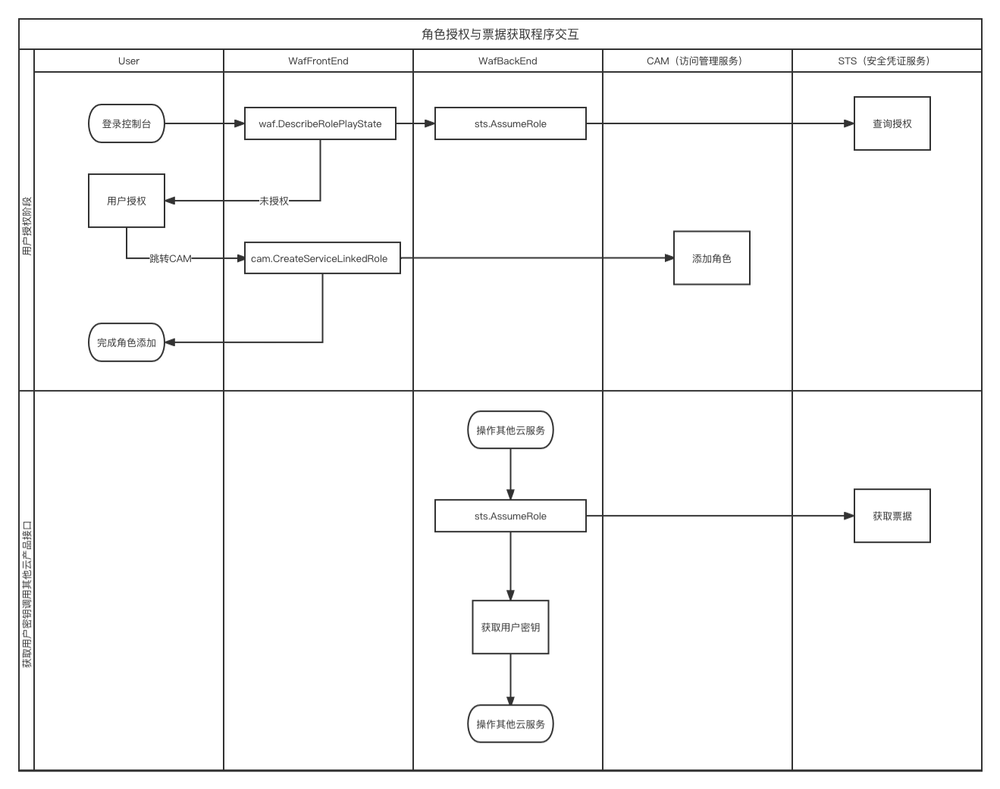
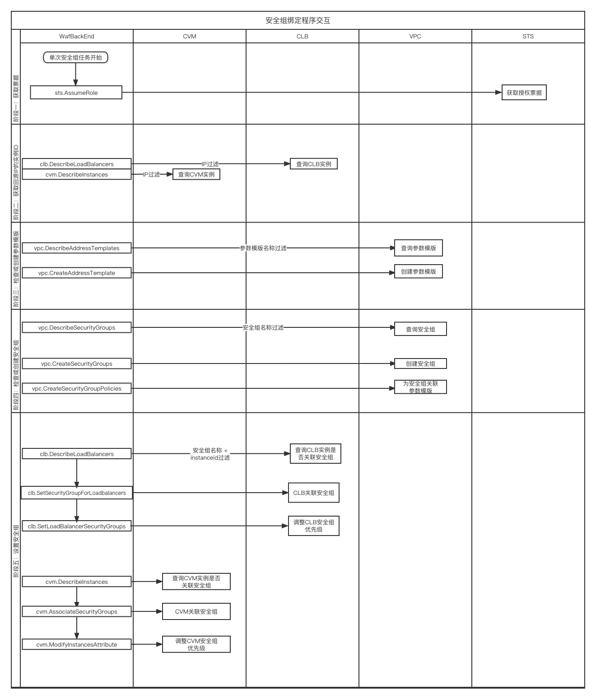

## 1. 需求信息
### 1.1 需求背景
背景：
SAASWAF接入，需要用户自行将WAF回源IP加入源站的安全组。
问题：
导致产品侧变更回源IP时，必须联系用户配合改变安全组策略。给产品底层集群升级、流量调度等场景带来巨大不便。
目的：
本需求旨在在产品层面为用户自动放通和维护WAF回源IP的安全组，从而省去依赖用户操作的步骤，让产品流量接入更加灵活高效。

### 2. 业务分析 （概要设计）
#### 2.1 角色授权
用户控制台授权WAF角色。
通过WAF角色，可以调用用户其他云产品API。
##### 2.1.1 授权逻辑

https://docs.qq.com/flowchart/DWWhsVmVnWkZ1cEtE

#### 2.2 安全组绑定
单个域名的安全组绑定逻辑
##### 2.2.1 安全组绑定逻辑

https://docs.qq.com/flowchart/DWWNrYmptT0VaVmhZ

#### 2.3 安全组维护
全量域名的安全组状态维护
##### 2.3.1 安全组维护逻辑

https://docs.qq.com/flowchart/DWVRZaFRMR1RaSXl5

#### 3. 技术设计（详细设计）
##### 3.1 开发组件
waf-backend https://git.woa.com/waf/waf-backend
##### 3.2 数据库表设计

##### 3.3 模块一 角色授权

https://docs.qq.com/flowchart/DWXZya1hQdWZRRVF0

##### 3.4 模块二 安全组绑定

https://docs.qq.com/flowchart/DWVBIYXJTTGpYRGNE
##### 3.5 模块三 安全组维护
1.基于CSP并发执行模型，保证10分钟完成一次全量域名安全组检测
2.编辑和添加域名时抢占调度

https://docs.qq.com/flowchart/DWVRZaFRMR1RaSXl5
