## 腾讯云安全组
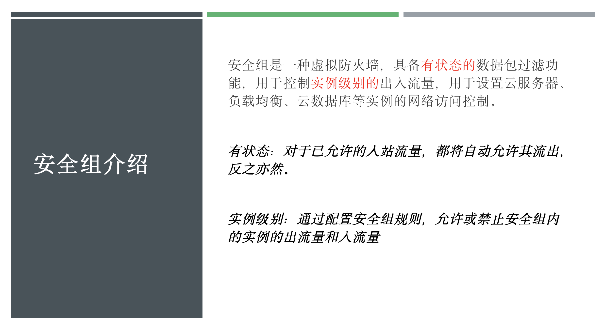
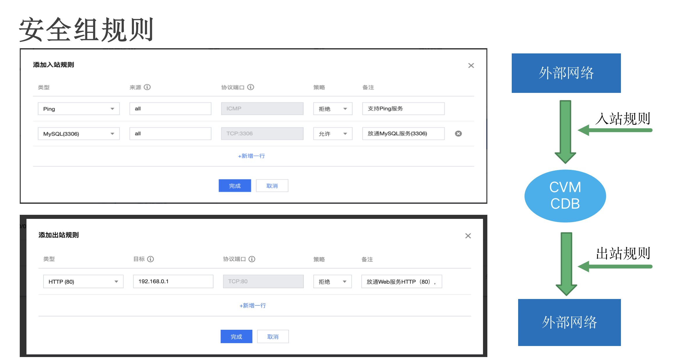
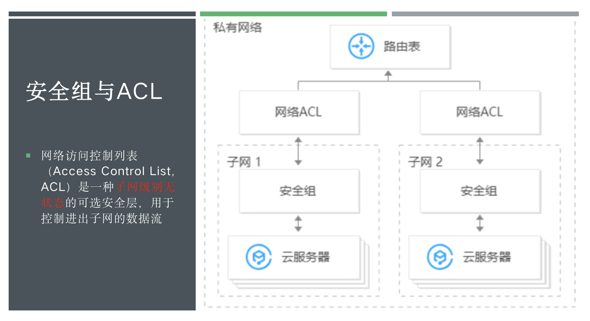
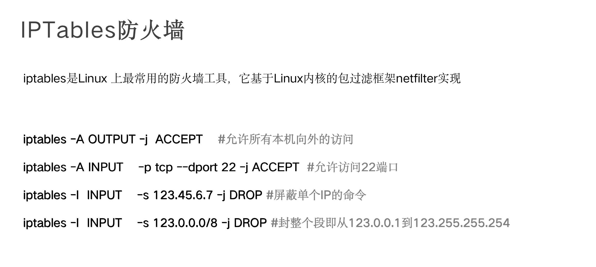
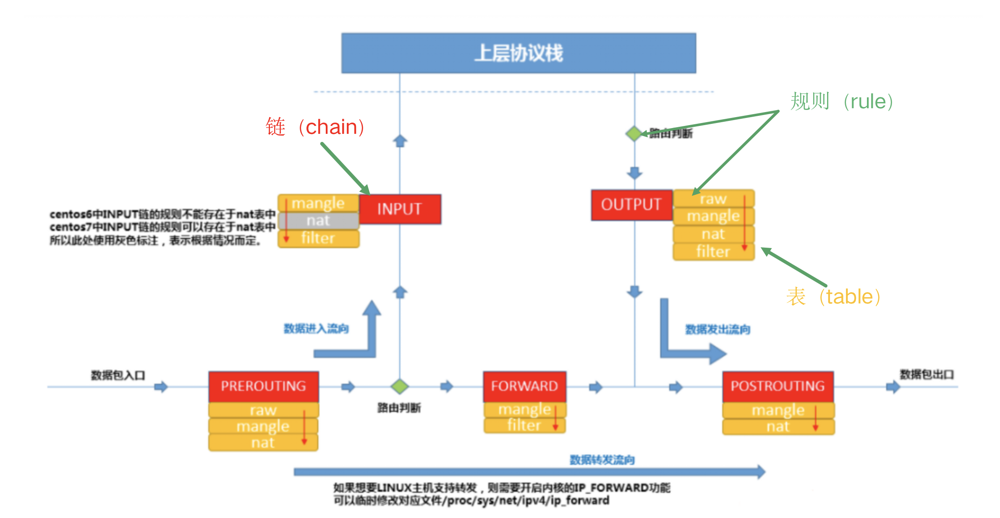
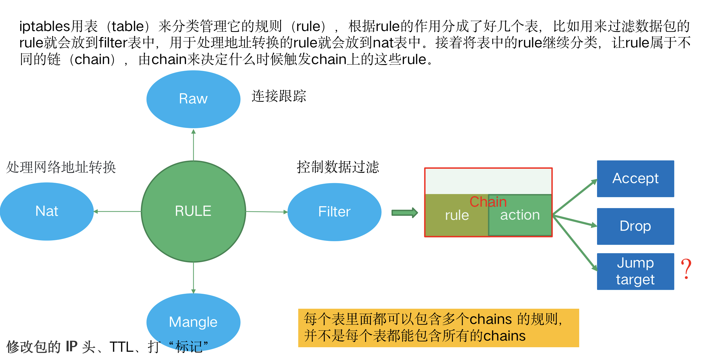
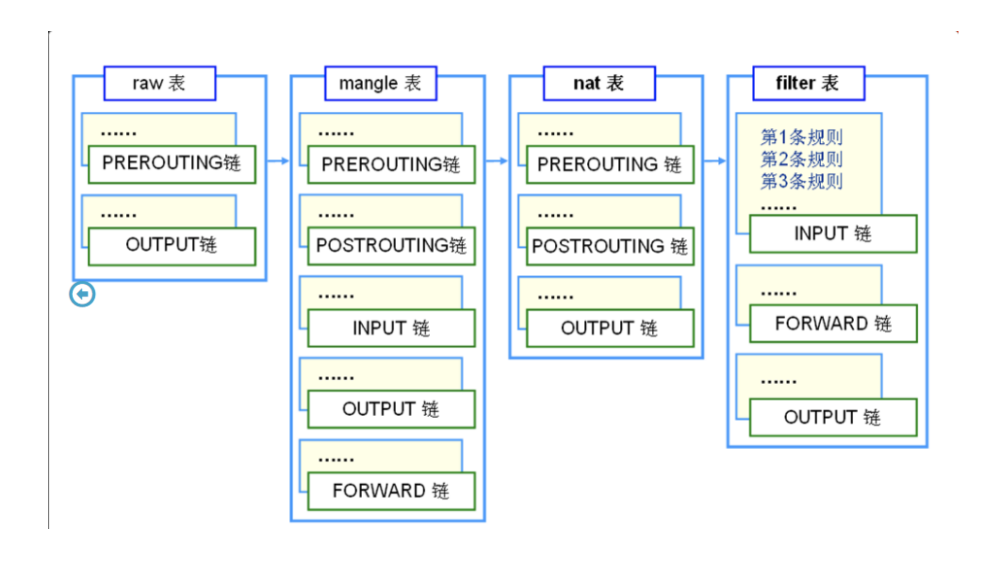
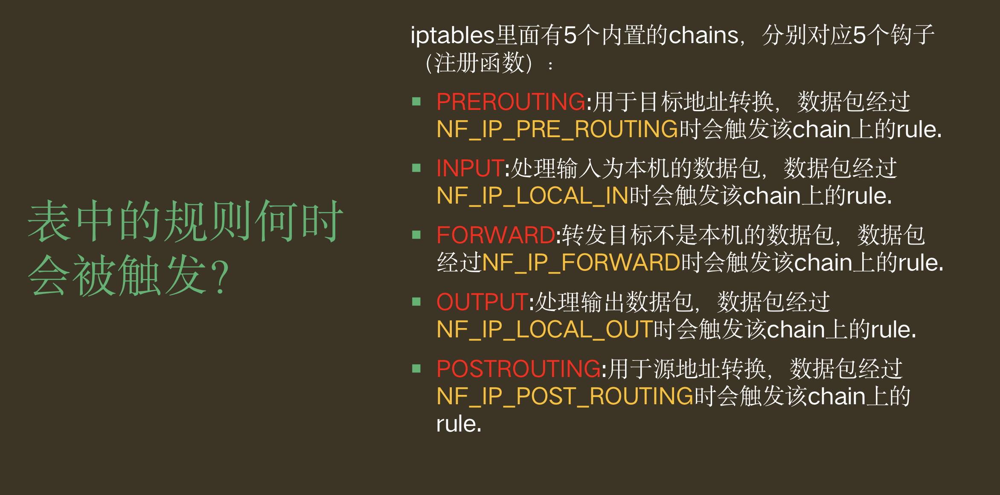
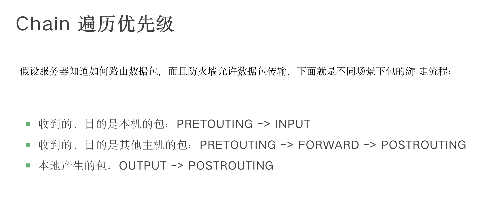
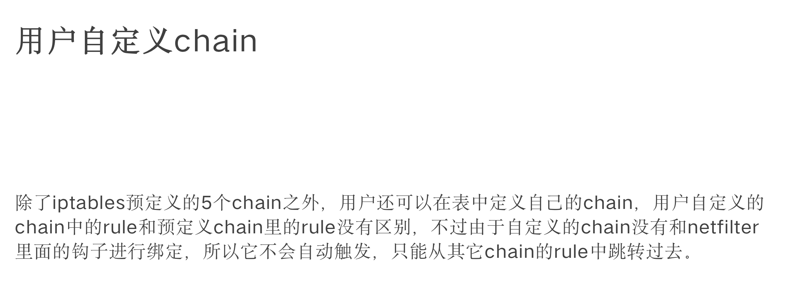
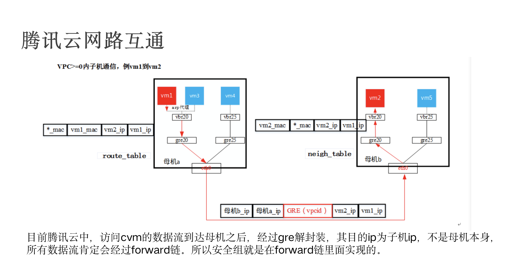
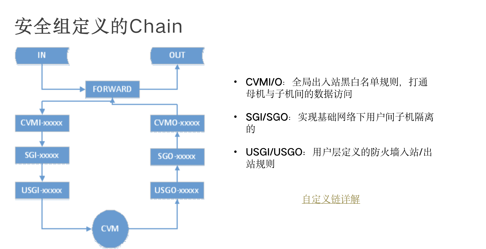

## linux内核IP层主路径

存在三条路径
### 入向
ip_rcv --> [IP_PRE_ROUTING] -->  ip_local_deliver  --> [IP_LOCAL_INPUT] --> ip_local_deliver_finsh
### 出向
ip_local_out --> [IP_LOCAL_OUT] -->  ip_output --> [IP_POST_ROUTING] --> ip_finish_output2
### 转发
ip_rcv --> [IP_PRE_ROUTING]  --> ip_forward --> [IP_FORWARD] --> ip_output --> ip_finish_output2
### LVS
ip_rcv --> [IP_LOCAL_INPUT] --> [修改报文] --> [IP_POST_ROUTING] --> ip_finish_output2

## NetFilter 技术概览
https://xie.infoq.cn/article/b0cfe588251d024d9114c84f3