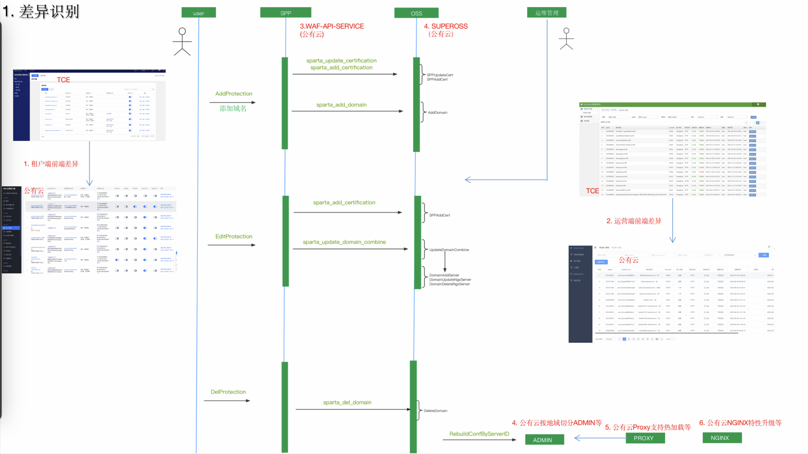
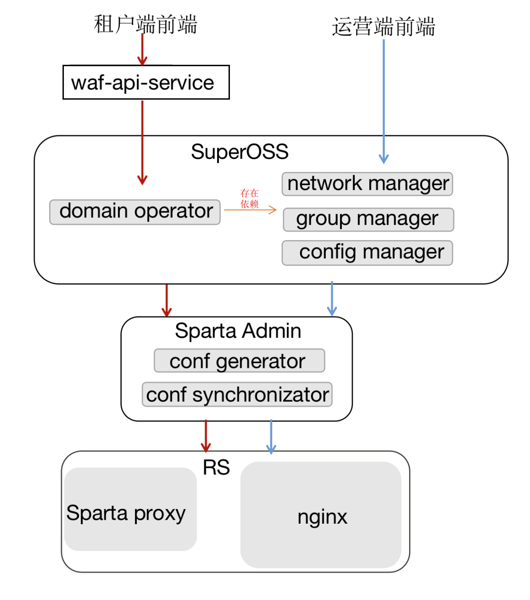
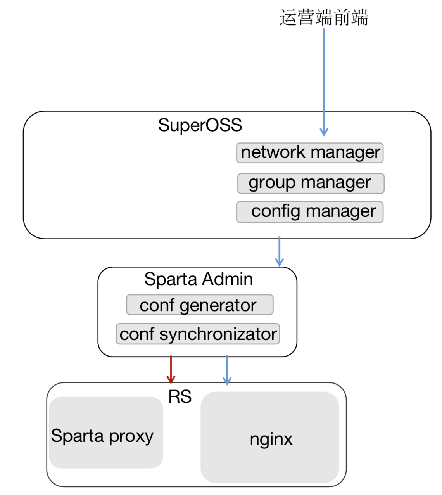
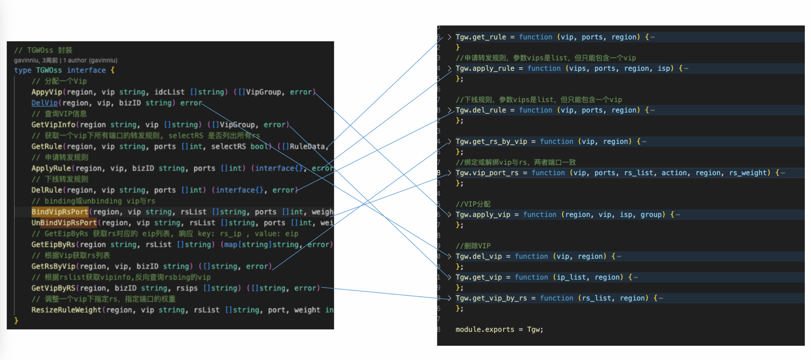
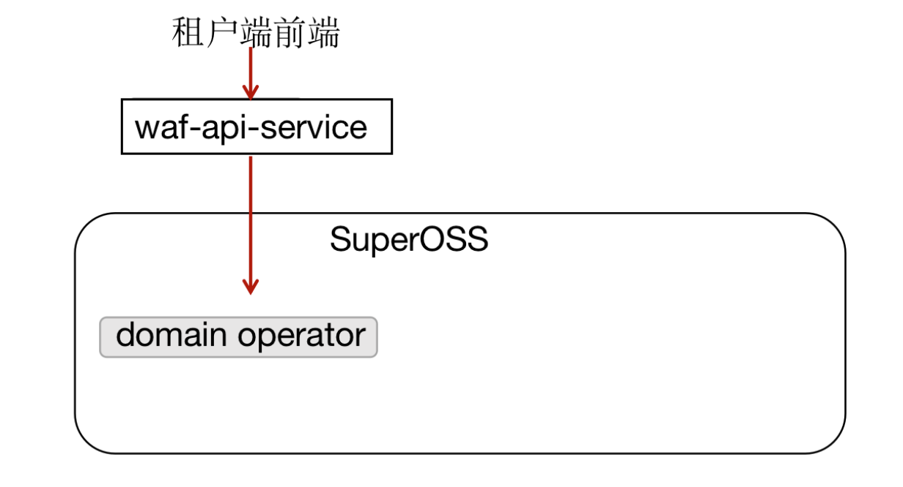

## SAASWAF 公有云代码 TCE适配
### 1 背景和目标
SAASWAF TCE和公有云 一码多平台，主要实现以下目标：

- 1.抹平版本差异： 统一公有云和TCE代码版本
- 2.组件透明替换：废弃TCE下老旧的组件，替换成公有云组件
- 3.重大特性升级：将公有云的SAASWAF接入能力，赋予到TCE。例如IPV6、TLS等


### 2 适配
#### 2.0 差异

- 前端：1、租户端界面存在版本差异  2. 运营端界面需要重构
- 后端：1、公有云组件重构（SPP->API-SERVICE、SPTOSS->SUPEROSS 2、TCE组件代码落后较大版本（ADMIN、PROXY、NGINX）

https://drive.weixin.qq.com/s?k=AJEAIQdfAAoVIYPNJAAPUArAbTADs

#### 2.1 预期
期望的抹平了差异点之后的SAASWAF TCE接入全貌
租户端： 租户前端 --> API_SERVICE --> SUPEROSS --> ADMIN --> PROXY --> NGINX

运营端： 运营前端 --> SUPEROSS --> ADMIN --> PROXY --> NGINX
租户端SUPEROSS功能依赖于运营端SUPEROSS功能



#### 2.2 节奏
基调 : 先运营端 后租户端  （租户端能力依赖运营端）

流水 : 

运营端组件TCE部署(8.11) --> 运营端组件TCE适配（8.11） --> 运营端功能测试
租户端组件TCE部署（8.12） --> 租户端组件TCE适配（8.22） --> 租户端功能测试

#### 2.3 运营端
适配内容 ： 运营前端 --> SUPEROSS --> ADMIN --> PROXY --> NGINX


##### 2.3.1 运营端前端重构
目标：
将SPATAOSS替换为SUPEROSS并重构到TCE运营平台

##### 2.3.2 运营端后端适配
目标：

- SPARTAOSS 重构为 SUPEROSS 
涉及：配置库、路由库改造，tce环境差异化适配。 TGW、CMDB联动逻辑改造 - ADMIN组件升级
涉及：配置库改造，TCE打包流程，TCE逻辑适配 
- NGINX + Proxy组件升级
涉及：配置库改造，TCE打包流程 ，TCE逻辑适配 

方案设计
SUPEROSS TGW逻辑适配

```golang
// TCE TGWOss 封装 
type TGWOss interface {
	// 分配一个Vip
	AppyVip(region, vip string, idcList []string) ([]VipGroup, error)
	DelVip(region, vip, bizID string) error
	// 查询VIP信息
	GetVipInfo(region string, vip []string) ([]VipGroup, error)
	// 获取一个vip下所有端口的转发规则, selectRS 是否列出所有rs
	GetRule(region, vip string, ports []int, selectRS bool) ([]RuleData, error)
	// 申请转发规则
	ApplyRule(region, vip, bizID string, ports []int) (interface{}, error)
	// 下线转发规则
	DelRule(region, vip string, ports []int) (interface{}, error)
	// binding或unbinding vip与rs
	BindVipRsPort(region, vip string, rsList []string, ports []int, weight int) (interface{}, error)
	UnBindVipRsPort(region, vip string, rsList []string, ports []int, weight int) (interface{}, error)
	// GetEipByRs 获取rs对应的 eip列表, 响应 key: rs_ip , value: eip
	GetEipByRs(region string, rsList []string) (map[string]string, error)
	// 根据Vip获取rs列表
	GetRsByVip(region, vip, bizID string) ([]string, error)
	// 根据rslist获取vipinfo,反向查询rsbing的vip
	GetVipByRS(region, bizID string, rsips []string) ([]string, error)
	// 调整一个vip下指定rs，指定端口的权重
	ResizeRuleWeight(region, vip string, rsList []string, port, weight int) (interface{}, error)
}
```

热加载逻辑适配：

nginx升级  +  proxy升级


#### 2.4 租户端适配
适配内容： 租户前端 --> API_SERVICE --> SUPEROSS


##### 2.4.1 租户端前端升级
版本升级 : 升级到公有云版本代码				       

##### 2.4.2 租户端后端适配后端兼容
目标
- SPP 重构为 WAF-API-SERVICE
涉及：API调用切换，WAF-API-SERVICE TCE逻辑适配（包括：DNSPod、SSLPod等）
- SPARTAOSS 重构为 SUPEROSS 
涉及：多实例特性改造、IPV6改造

方案设计
- 域名添加
屏蔽SSL关联证书 
屏蔽CNAME

- 域名IPV6接入
tgw ipv6 ip 申请

- 多实例
计费实例

风险:
运营端底层引擎存在delay的情况，先进行控制面测试。 
