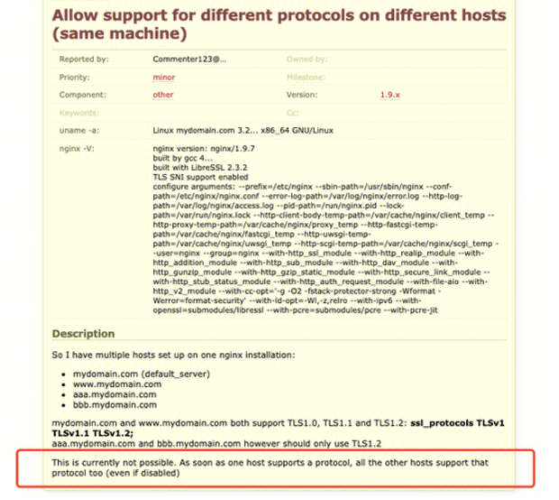

## 需求来源：

- 1.客户需求：海外用户对TLS版本和加密套件定制需求比较多，国内用户也不断存在TLS版本定制的工单。
- 2.产品需求：阿里等友商支持针对域名级别的TLS版本和加密套件定制

## 需求分析：

- 1.整体需求分析：TLS版本定制需求，最终理想的实现是在控制台上支持用户自己选择TLS版本。例如：

默认情况下，TLS 1.0/1.1/1.2为开启状态，TLS 1.3为关闭状态。只可开启连续或单个版本号。例如，不可仅开启1.0和1.2而关闭1.1。不可关闭全部版本。
	
- 2.接入需求分析：添加域名和编辑域名需要接受前端的tls版本参数，通过设置nginx配置文件中server块的ssl_protocols等方式使特定的TLS版本生效。 例如，对域名qdkyo.qcloudwaf.com定制支持TLS1.2：

通过设置nginx配置文件中server块的ssl_ciphers  EECDH+CHACHA20:EECDH+AES128:RSA+AES128:RSA+AES256:EECDH+3DES:RSA+3DES:!MD5;等方式使特定的加密套件生效。

## 开发前验证

**网络链路** qdkyo.qcloudwaf.com ----> cname ----> vip ----> rs ---->upstream(不可达)

**nginx版本** nginx version: TencentWAF/1.4.2_1.17.3 (STGW)

1.当前NGINX对TLS版本的支持情况

- 1.1验证方法：sslscan -tlsall qdkyo.qcloudwaf.com:443。sslscan通过创建多个https的连接来试探服务器支持的TLS版本方式；
- 1.2验证结果：STWG TLS支持**1.0  1.1   1.2   1.3**

2.当前NGINX对ssl_ciphers 配置的支持

- 1.1验证方法：server块中去掉或者增加部分加密套件。
- 1.2验证结果：ssl_ciphers在server中生效，可以满足多租户定制的需求。

3.当前NGINX对ssl_protocols 配置的支持

- 1.1验证方法：在nginx配置文件的http块和server块配置不同的tls版本，使用sslscan查看最终生效的TLS版本。**组合验证了多种情况**（http 配置ssl_protocols TLSv1 TLSv1.1 TLSv1.2 TLSv1.3等不同的版本或者不配置， server配置ssl_protocols TLSv1 TLSv1.1 TLSv1.2 TLSv1.3等不同的版本或者不配置，default_server配置ssl_protocols TLSv1 TLSv1.1 TLSv1.2 TLSv1.3等不同的版本或者不配置）
- 1.2验证结果：ssl_protocols只在**default_server和http**，且default_server优先于http生效。不满足多租户定制的需求
- 1.3补充材料：
	- 1) 问了ias-nginx开发人员，答案是普通server中配置ssl_protocols不生效。
	- 2）交流邮件

	- 3）nginx官方report



##当前问题
`ssl_protocols在当前nginx中作为全局的配置，在default_server和http（server优先于http）中生效。在不同的server块中配置ssl_protocols，是无法满足域名维度定制TLS版本的。`

## 解决方案
1.运维方案（`不推荐`）：

- 方案：将ssl_protocols配置在http块作为全局配置，并提前准备好各种TLS版本的集群。例如：

将对TLS版本有定制需求的域名，迁移到对应的集群上。
- 缺陷：1）需要迁移集群，操作风险高。 2）用户同一个实例的域名被分散到多个集群，不便于维护。3）比较死板，需要配置多达`9`种TLS集群。

2.修改nginx：

- 问题定位：nginx在实现上先协商ssl_protocols，再处理SNI 回调。因为在协商ssl_protocols之前无法通过SNI拿到server_name，所以在不同server中配置ssl_protocols并不生效。
- 解决方案：注册SSL_CTX_set_client_hello_cb回调，在收到clienthello后，ssl_protocols协议选择前，根据SNI查server_name，设置ssl_protocols。
- 补充材料
``` 
#define NGX_SSL_SSLv2    0x0002 //十六进制  2  0000010
#define NGX_SSL_SSLv3    0x0004  //4          0000100
#define NGX_SSL_TLSv1    0x0008   //8         0001000 
#define NGX_SSL_TLSv1_1  0x0010   //16        0010000
#define NGX_SSL_TLSv1_2  0x0020   //32        0100000
#define NGX_SSL_TLSv1_3  0x0040 //TLS1.3      1000000
最终的TLS版本为或运算 TLS1 + 1.1 = 0001000 ｜ 0010000 = 0011000 每个版本占一位
```
