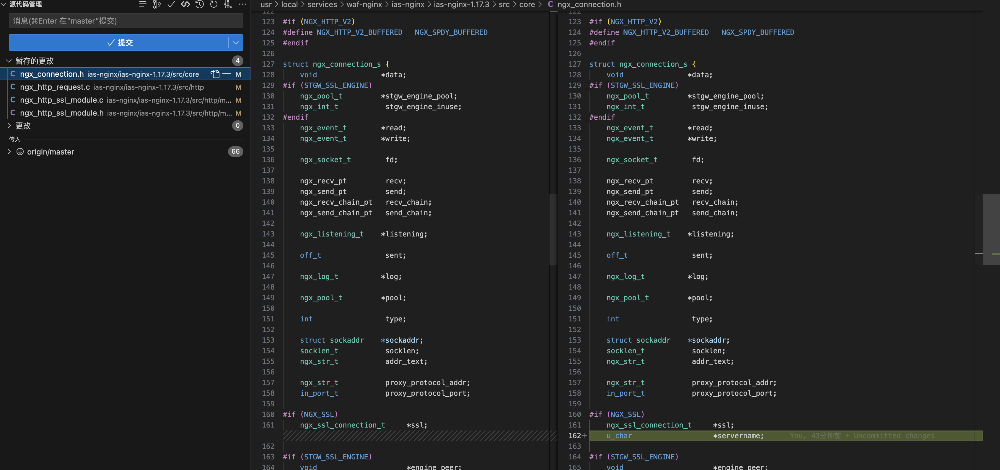
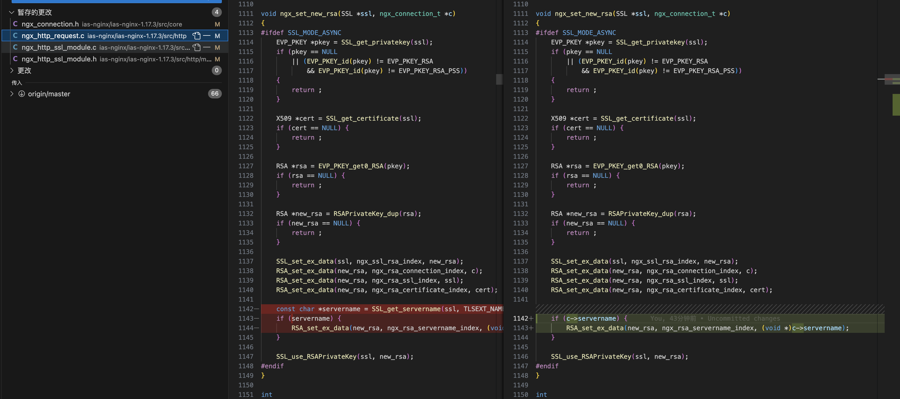
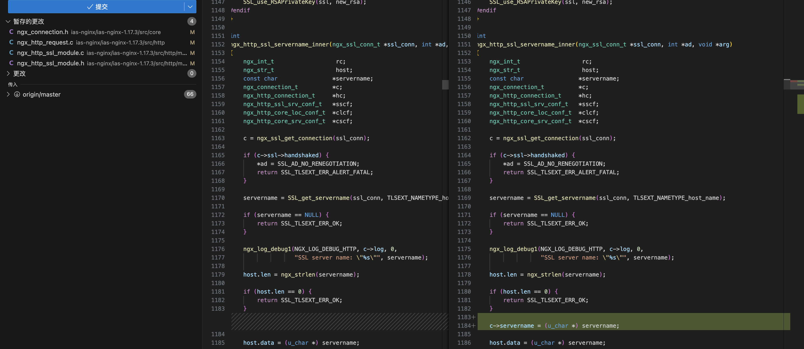
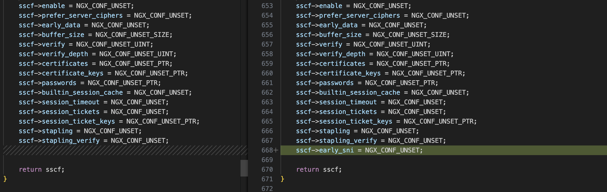
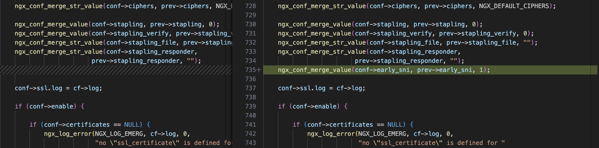
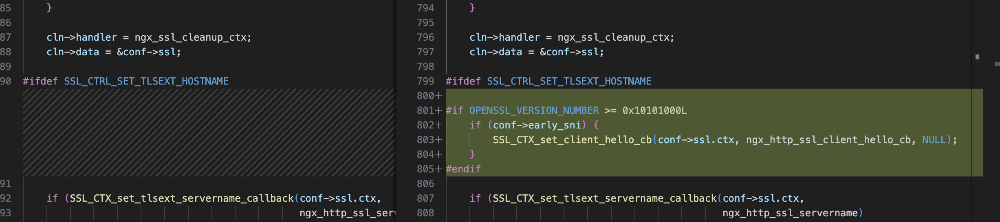
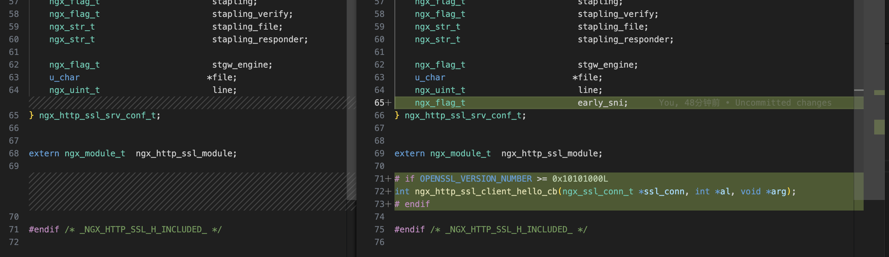

## NGINX SSL模块
### NGINX如何解析配置
#### SSL配置解读

#### 读取当前连接或者当前虚拟主机的SSL配置
##### 当前连接
##### 虚拟主机

#### NGINX 
### NGINX如何建立一个SSL连接
### NGINX SSL模块与OPENSSL如何配合
ngx_connection_t->ssl->connection 和 SSL ssl_st

## OPENSSL TLS和加密套件协商
### server端接收和解析ClientHello
### server端生成和发送ServerHello

## OPENSSL Client Hello CALLBACK与NGINX协同工作
### 获取Client Hello报文的Extension SNI
### 获取NGINX Virtual Server的SSL配置
### 根据SSL配置设置OPENSSL握手参数


## 代码
### src/core/ngx_connection.h



### src/http/ngx_http_request.c



```c
#if OPENSSL_VERSION_NUMBER >= 0x10101000L
int
ngx_http_ssl_sni(ngx_ssl_conn_t *ssl_conn, const char * servername)
{
    ngx_str_t                  host;
    ngx_connection_t          *c;
    ngx_http_connection_t     *hc;
    ngx_http_ssl_srv_conf_t   *sscf;
    ngx_http_core_loc_conf_t  *clcf;
    ngx_http_core_srv_conf_t  *cscf;

    if (servername == NULL) {
        return SSL_TLSEXT_ERR_NOACK;
    }

    c = ngx_ssl_get_connection(ssl_conn);

    if (c->ssl->renegotiation) {
        return SSL_TLSEXT_ERR_NOACK;
    }

    ngx_log_debug1(NGX_LOG_DEBUG_HTTP, c->log, 0,
                   "SSL server name: \"%s\"", servername);

    host.len = ngx_strlen(servername);

    if (host.len == 0) {
        return SSL_TLSEXT_ERR_NOACK;
    }

    c->servername = ngx_palloc(c->pool, host.len + 1);
    if (c->servername == NULL) {
        return SSL_TLSEXT_ERR_NOACK;
    }
    ngx_memcpy(c->servername, servername, host.len);
    c->servername[host.len] = 0;

    host.data = (u_char *) c->servername;

    if (ngx_http_validate_host(&host, c->pool, 1) != NGX_OK) {
        return SSL_TLSEXT_ERR_NOACK;
    }

    hc = c->data;

    if (ngx_http_find_virtual_server(c, hc->addr_conf->virtual_names, &host,
                                     NULL, &cscf)
        != NGX_OK)
    {
        return SSL_TLSEXT_ERR_NOACK;
    }

    hc->ssl_servername = ngx_palloc(c->pool, sizeof(ngx_str_t));
    if (hc->ssl_servername == NULL) {
        return SSL_TLSEXT_ERR_NOACK;
    }

    *hc->ssl_servername = host;

    hc->conf_ctx = cscf->ctx;

    clcf = ngx_http_get_module_loc_conf(hc->conf_ctx, ngx_http_core_module);

    ngx_set_connection_log(c, clcf->error_log);

    sscf = ngx_http_get_module_srv_conf(hc->conf_ctx, ngx_http_ssl_module);

    c->ssl->buffer_size = sscf->buffer_size;

    if (sscf->ssl.ctx) {
        SSL_set_SSL_CTX(ssl_conn, sscf->ssl.ctx);

        /*
         * SSL_set_SSL_CTX() only changes certs as of 1.0.0d
         * adjust other things we care about
         */

        SSL_set_verify(ssl_conn, SSL_CTX_get_verify_mode(sscf->ssl.ctx),
                       SSL_CTX_get_verify_callback(sscf->ssl.ctx));

        SSL_set_verify_depth(ssl_conn, SSL_CTX_get_verify_depth(sscf->ssl.ctx));

#ifdef SSL_CTRL_CLEAR_OPTIONS
        /* only in 0.9.8m+ */
        SSL_clear_options(ssl_conn, SSL_get_options(ssl_conn) &
                                    ~SSL_CTX_get_options(sscf->ssl.ctx));
#endif

        SSL_set_options(ssl_conn, SSL_CTX_get_options(sscf->ssl.ctx));

        if (sscf->protocols & NGX_SSL_SSLv2) {
            SSL_clear_options(ssl_conn, SSL_OP_NO_SSLv2);
        }
        if (sscf->protocols & NGX_SSL_SSLv3) {
            SSL_clear_options(ssl_conn, SSL_OP_NO_SSLv3);
        }
        if (sscf->protocols & NGX_SSL_TLSv1) {
            SSL_clear_options(ssl_conn, SSL_OP_NO_TLSv1);
        }

#ifdef SSL_OP_NO_TLSv1_1
        if (sscf->protocols & NGX_SSL_TLSv1_1) {
            SSL_clear_options(ssl_conn, SSL_OP_NO_TLSv1_1);
        }
#endif

#ifdef SSL_OP_NO_TLSv1_2
        if (sscf->protocols & NGX_SSL_TLSv1_2) {
            SSL_clear_options(ssl_conn, SSL_OP_NO_TLSv1_2);
        }
#endif

#ifdef SSL_OP_NO_TLSv1_3
        if (sscf->protocols & NGX_SSL_TLSv1_3) {
            SSL_clear_options(ssl_conn, SSL_OP_NO_TLSv1_3);
        }
#endif

#ifdef SSL_OP_NO_NTLS
    if (sscf->protocols & NGX_SSL_TLCP) {
        SSL_clear_options(ssl_conn, SSL_OP_NO_NTLS);
        SSL_enable_ntls(ssl_conn);
    }
#endif
    }

    return SSL_TLSEXT_ERR_OK;
}

/** returns a pointer which points to the
 * servername string in the SSL structure
 */
static const char *
ngx_early_get_client_hello_servername(SSL *s) {
    static u_char          sn[256];

    size_t                  len, remaining;
    const unsigned char    *p;

    /*
     * The server_name extension was given too much extensibility when it
     * was written, so parsing the normal case is a bit complex.
     */
    if (!SSL_client_hello_get0_ext(s, TLSEXT_TYPE_server_name, &p, &remaining)
        || remaining <= 2)
    {
        return NULL;
    }

    /* Extract the length of the supplied list of names. */
    len = (*(p++) << 8);
    len += *(p++);
    if (len + 2 != remaining) {
        return NULL;
    }
    remaining = len;

    /*
     * The list in practice only has a single element, so we only consider
     * the first one.
     */
    if (remaining == 0 || *p++ != TLSEXT_NAMETYPE_host_name) {
        return NULL;
    }
    remaining--;

    /* Now we can finally pull out the byte array with the actual hostname. */
    if (remaining <= 2) {
        return NULL;
    }

    len = (*(p++) << 8);
    len += *(p++);

    if (len + 2 > remaining) {
        return 0;
    }

    remaining = len;

    if (remaining > 255) {
        return 0;
    }

    ngx_memcpy(sn, p, remaining);

    sn[remaining] = 0;

    return (const char *)sn;
}


int
ngx_http_ssl_client_hello_cb(ngx_ssl_conn_t *ssl_conn, int *al, void *arg)
{
    unsigned int v;
    const char *servername;

    v = SSL_client_hello_get0_legacy_version(ssl_conn);

    if (v > TLS_MAX_VERSION || v < SSL3_VERSION) {
        *al = SSL_AD_PROTOCOL_VERSION;
        return SSL_CLIENT_HELLO_ERROR;
    }
    servername = ngx_early_get_client_hello_servername(ssl_conn);
    ngx_http_ssl_sni(ssl_conn, servername);

#if STGW_SSL_ENGINE
    ngx_connection_t *c = ngx_ssl_get_connection(ssl_conn);
    ngx_set_new_rsa(ssl_conn, c);
#endif

    return SSL_CLIENT_HELLO_SUCCESS;
}

#endif // OPENSSL_VERSION_NUMBER >= 0x10101000L
```


### src/http/modules/ngx_http_ssl_module.c




```c
/*
 * Copyright (C) Igor Sysoev
 * Copyright (C) Nginx, Inc.
 */


#include <ngx_config.h>
#include <ngx_core.h>
#include <ngx_http.h>

#if NGX_HTTP_SPDY
#include <ngx_http_spdy_module.h>
#else
#define NGX_SPDY_NPN_ADVERTISE        "\x08spdy/3.1"
#endif
#if (NGX_HTTP_V2)
#include <v2/ngx_http_v2_module.h>
#else
#define NGX_HTTP_V2_ALPN_ADVERTISE       "\x02h2"
#endif

typedef ngx_int_t (*ngx_ssl_variable_handler_pt)(ngx_connection_t *c,
    ngx_pool_t *pool, ngx_str_t *s);


#define NGX_DEFAULT_CIPHERS     "HIGH:!aNULL:!MD5"
#define NGX_DEFAULT_ECDH_CURVE  "auto"

#define NGX_HTTP_NPN_ADVERTISE  "\x08http/1.1"


#ifdef TLSEXT_TYPE_application_layer_protocol_negotiation
static int ngx_http_ssl_alpn_select(ngx_ssl_conn_t *ssl_conn,
    const unsigned char **out, unsigned char *outlen,
    const unsigned char *in, unsigned int inlen, void *arg);
#endif

#ifdef TLSEXT_TYPE_next_proto_neg
static int ngx_http_ssl_npn_advertised(ngx_ssl_conn_t *ssl_conn,
    const unsigned char **out, unsigned int *outlen, void *arg);
#endif

static ngx_int_t ngx_http_ssl_static_variable(ngx_http_request_t *r,
    ngx_http_variable_value_t *v, uintptr_t data);
static ngx_int_t ngx_http_ssl_variable(ngx_http_request_t *r,
    ngx_http_variable_value_t *v, uintptr_t data);

static ngx_int_t ngx_http_ssl_add_variables(ngx_conf_t *cf);
static void *ngx_http_ssl_create_srv_conf(ngx_conf_t *cf);
static char *ngx_http_ssl_merge_srv_conf(ngx_conf_t *cf,
    void *parent, void *child);

static ngx_int_t ngx_http_ssl_compile_certificates(ngx_conf_t *cf,
    ngx_http_ssl_srv_conf_t *conf);

static char *ngx_http_ssl_enable(ngx_conf_t *cf, ngx_command_t *cmd,
    void *conf);
static char *ngx_http_ssl_password_file(ngx_conf_t *cf, ngx_command_t *cmd,
    void *conf);
static char *ngx_http_ssl_session_cache(ngx_conf_t *cf, ngx_command_t *cmd,
    void *conf);

static ngx_int_t ngx_http_ssl_init(ngx_conf_t *cf);

extern ngx_int_t ngx_http_find_virtual_server(ngx_connection_t *c,
    ngx_http_virtual_names_t *virtual_names, ngx_str_t *host,
    ngx_http_request_t *r, ngx_http_core_srv_conf_t **cscfp);

static ngx_conf_bitmask_t  ngx_http_ssl_protocols[] = {
    { ngx_string("SSLv2"), NGX_SSL_SSLv2 },
    { ngx_string("SSLv3"), NGX_SSL_SSLv3 },
    { ngx_string("TLSv1"), NGX_SSL_TLSv1 },
    { ngx_string("TLSv1.1"), NGX_SSL_TLSv1_1 },
    { ngx_string("TLSv1.2"), NGX_SSL_TLSv1_2 },
    { ngx_string("TLSv1.3"), NGX_SSL_TLSv1_3 },
    { ngx_null_string, 0 }
};


static ngx_conf_enum_t  ngx_http_ssl_verify[] = {
    { ngx_string("off"), 0 },
    { ngx_string("on"), 1 },
    { ngx_string("optional"), 2 },
    { ngx_string("optional_no_ca"), 3 },
    { ngx_null_string, 0 }
};

static ngx_str_t ngx_http_ssl_advertise[] = {
    ngx_string(NGX_HTTP_NPN_ADVERTISE),
    ngx_string(NGX_HTTP_V2_ALPN_ADVERTISE NGX_HTTP_NPN_ADVERTISE),
    ngx_string(NGX_SPDY_NPN_ADVERTISE NGX_HTTP_NPN_ADVERTISE),
    ngx_string(NGX_HTTP_V2_ALPN_ADVERTISE NGX_SPDY_NPN_ADVERTISE
               NGX_HTTP_NPN_ADVERTISE)
};

static ngx_command_t  ngx_http_ssl_commands[] = {

    { ngx_string("ssl"),
      NGX_HTTP_MAIN_CONF|NGX_HTTP_SRV_CONF|NGX_CONF_FLAG,
      ngx_http_ssl_enable,
      NGX_HTTP_SRV_CONF_OFFSET,
      offsetof(ngx_http_ssl_srv_conf_t, enable),
      NULL },

    { ngx_string("ssl_certificate"),
      NGX_HTTP_MAIN_CONF|NGX_HTTP_SRV_CONF|NGX_CONF_TAKE1,
      ngx_conf_set_str_array_slot,
      NGX_HTTP_SRV_CONF_OFFSET,
      offsetof(ngx_http_ssl_srv_conf_t, certificates),
      NULL },

    { ngx_string("ssl_certificate_key"),
      NGX_HTTP_MAIN_CONF|NGX_HTTP_SRV_CONF|NGX_CONF_TAKE1,
      ngx_conf_set_str_array_slot,
      NGX_HTTP_SRV_CONF_OFFSET,
      offsetof(ngx_http_ssl_srv_conf_t, certificate_keys),
      NULL },

    { ngx_string("ssl_password_file"),
      NGX_HTTP_MAIN_CONF|NGX_HTTP_SRV_CONF|NGX_CONF_TAKE1,
      ngx_http_ssl_password_file,
      NGX_HTTP_SRV_CONF_OFFSET,
      0,
      NULL },

    { ngx_string("ssl_dhparam"),
      NGX_HTTP_MAIN_CONF|NGX_HTTP_SRV_CONF|NGX_CONF_TAKE1,
      ngx_conf_set_str_slot,
      NGX_HTTP_SRV_CONF_OFFSET,
      offsetof(ngx_http_ssl_srv_conf_t, dhparam),
      NULL },

    { ngx_string("ssl_ecdh_curve"),
      NGX_HTTP_MAIN_CONF|NGX_HTTP_SRV_CONF|NGX_CONF_TAKE1,
      ngx_conf_set_str_slot,
      NGX_HTTP_SRV_CONF_OFFSET,
      offsetof(ngx_http_ssl_srv_conf_t, ecdh_curve),
      NULL },

    { ngx_string("ssl_protocols"),
      NGX_HTTP_MAIN_CONF|NGX_HTTP_SRV_CONF|NGX_CONF_1MORE,
      ngx_conf_set_bitmask_slot,
      NGX_HTTP_SRV_CONF_OFFSET,
      offsetof(ngx_http_ssl_srv_conf_t, protocols),
      &ngx_http_ssl_protocols },

    { ngx_string("ssl_ciphers"),
      NGX_HTTP_MAIN_CONF|NGX_HTTP_SRV_CONF|NGX_CONF_TAKE1,
      ngx_conf_set_str_slot,
      NGX_HTTP_SRV_CONF_OFFSET,
      offsetof(ngx_http_ssl_srv_conf_t, ciphers),
      NULL },

    { ngx_string("ssl_buffer_size"),
      NGX_HTTP_MAIN_CONF|NGX_HTTP_SRV_CONF|NGX_CONF_TAKE1,
      ngx_conf_set_size_slot,
      NGX_HTTP_SRV_CONF_OFFSET,
      offsetof(ngx_http_ssl_srv_conf_t, buffer_size),
      NULL },

    { ngx_string("ssl_verify_client"),
      NGX_HTTP_MAIN_CONF|NGX_HTTP_SRV_CONF|NGX_CONF_TAKE1,
      ngx_conf_set_enum_slot,
      NGX_HTTP_SRV_CONF_OFFSET,
      offsetof(ngx_http_ssl_srv_conf_t, verify),
      &ngx_http_ssl_verify },

    { ngx_string("ssl_verify_depth"),
      NGX_HTTP_MAIN_CONF|NGX_HTTP_SRV_CONF|NGX_CONF_TAKE1,
      ngx_conf_set_num_slot,
      NGX_HTTP_SRV_CONF_OFFSET,
      offsetof(ngx_http_ssl_srv_conf_t, verify_depth),
      NULL },

    { ngx_string("ssl_client_certificate"),
      NGX_HTTP_MAIN_CONF|NGX_HTTP_SRV_CONF|NGX_CONF_TAKE1,
      ngx_conf_set_str_slot,
      NGX_HTTP_SRV_CONF_OFFSET,
      offsetof(ngx_http_ssl_srv_conf_t, client_certificate),
      NULL },

    { ngx_string("ssl_trusted_certificate"),
      NGX_HTTP_MAIN_CONF|NGX_HTTP_SRV_CONF|NGX_CONF_TAKE1,
      ngx_conf_set_str_slot,
      NGX_HTTP_SRV_CONF_OFFSET,
      offsetof(ngx_http_ssl_srv_conf_t, trusted_certificate),
      NULL },

    { ngx_string("ssl_prefer_server_ciphers"),
      NGX_HTTP_MAIN_CONF|NGX_HTTP_SRV_CONF|NGX_CONF_FLAG,
      ngx_conf_set_flag_slot,
      NGX_HTTP_SRV_CONF_OFFSET,
      offsetof(ngx_http_ssl_srv_conf_t, prefer_server_ciphers),
      NULL },

    { ngx_string("ssl_session_cache"),
      NGX_HTTP_MAIN_CONF|NGX_HTTP_SRV_CONF|NGX_CONF_TAKE12,
      ngx_http_ssl_session_cache,
      NGX_HTTP_SRV_CONF_OFFSET,
      0,
      NULL },

    { ngx_string("ssl_session_tickets"),
      NGX_HTTP_MAIN_CONF|NGX_HTTP_SRV_CONF|NGX_CONF_FLAG,
      ngx_conf_set_flag_slot,
      NGX_HTTP_SRV_CONF_OFFSET,
      offsetof(ngx_http_ssl_srv_conf_t, session_tickets),
      NULL },

    { ngx_string("ssl_session_ticket_key"),
      NGX_HTTP_MAIN_CONF|NGX_HTTP_SRV_CONF|NGX_CONF_TAKE1,
      ngx_conf_set_str_array_slot,
      NGX_HTTP_SRV_CONF_OFFSET,
      offsetof(ngx_http_ssl_srv_conf_t, session_ticket_keys),
      NULL },

    { ngx_string("ssl_session_timeout"),
      NGX_HTTP_MAIN_CONF|NGX_HTTP_SRV_CONF|NGX_CONF_TAKE1,
      ngx_conf_set_sec_slot,
      NGX_HTTP_SRV_CONF_OFFSET,
      offsetof(ngx_http_ssl_srv_conf_t, session_timeout),
      NULL },

    { ngx_string("ssl_crl"),
      NGX_HTTP_MAIN_CONF|NGX_HTTP_SRV_CONF|NGX_CONF_TAKE1,
      ngx_conf_set_str_slot,
      NGX_HTTP_SRV_CONF_OFFSET,
      offsetof(ngx_http_ssl_srv_conf_t, crl),
      NULL },

    { ngx_string("ssl_stapling"),
      NGX_HTTP_MAIN_CONF|NGX_HTTP_SRV_CONF|NGX_CONF_FLAG,
      ngx_conf_set_flag_slot,
      NGX_HTTP_SRV_CONF_OFFSET,
      offsetof(ngx_http_ssl_srv_conf_t, stapling),
      NULL },

    { ngx_string("ssl_stapling_file"),
      NGX_HTTP_MAIN_CONF|NGX_HTTP_SRV_CONF|NGX_CONF_TAKE1,
      ngx_conf_set_str_slot,
      NGX_HTTP_SRV_CONF_OFFSET,
      offsetof(ngx_http_ssl_srv_conf_t, stapling_file),
      NULL },

    { ngx_string("ssl_stapling_responder"),
      NGX_HTTP_MAIN_CONF|NGX_HTTP_SRV_CONF|NGX_CONF_TAKE1,
      ngx_conf_set_str_slot,
      NGX_HTTP_SRV_CONF_OFFSET,
      offsetof(ngx_http_ssl_srv_conf_t, stapling_responder),
      NULL },

    { ngx_string("ssl_stapling_verify"),
      NGX_HTTP_MAIN_CONF|NGX_HTTP_SRV_CONF|NGX_CONF_FLAG,
      ngx_conf_set_flag_slot,
      NGX_HTTP_SRV_CONF_OFFSET,
      offsetof(ngx_http_ssl_srv_conf_t, stapling_verify),
      NULL },

    { ngx_string("ssl_early_data"),
      NGX_HTTP_MAIN_CONF|NGX_HTTP_SRV_CONF|NGX_CONF_FLAG,
      ngx_conf_set_flag_slot,
      NGX_HTTP_SRV_CONF_OFFSET,
      offsetof(ngx_http_ssl_srv_conf_t, early_data),
      NULL },

    { ngx_string("ssl_early_sni"),
      NGX_HTTP_MAIN_CONF|NGX_HTTP_SRV_CONF|NGX_CONF_FLAG,
      ngx_conf_set_flag_slot,
      NGX_HTTP_SRV_CONF_OFFSET,
      offsetof(ngx_http_ssl_srv_conf_t, early_sni),
      NULL },

      ngx_null_command
};


static ngx_http_module_t  ngx_http_ssl_module_ctx = {
    ngx_http_ssl_add_variables,            /* preconfiguration */
    ngx_http_ssl_init,                     /* postconfiguration */

    NULL,                                  /* create main configuration */
    NULL,                                  /* init main configuration */

    ngx_http_ssl_create_srv_conf,          /* create server configuration */
    ngx_http_ssl_merge_srv_conf,           /* merge server configuration */

    NULL,                                  /* create location configuration */
    NULL                                   /* merge location configuration */
};


ngx_module_t  ngx_http_ssl_module = {
    NGX_MODULE_V1,
    &ngx_http_ssl_module_ctx,              /* module context */
    ngx_http_ssl_commands,                 /* module directives */
    NGX_HTTP_MODULE,                       /* module type */
    NULL,                                  /* init master */
    NULL,                                  /* init module */
    NULL,                                  /* init process */
    NULL,                                  /* init thread */
    NULL,                                  /* exit thread */
    NULL,                                  /* exit process */
    NULL,                                  /* exit master */
    NGX_MODULE_V1_PADDING
};


static ngx_http_variable_t  ngx_http_ssl_vars[] = {

    { ngx_string("ssl_protocol"), NULL, ngx_http_ssl_static_variable,
      (uintptr_t) ngx_ssl_get_protocol, NGX_HTTP_VAR_CHANGEABLE, 0 },

    { ngx_string("ssl_cipher"), NULL, ngx_http_ssl_static_variable,
      (uintptr_t) ngx_ssl_get_cipher_name, NGX_HTTP_VAR_CHANGEABLE, 0 },

    { ngx_string("ssl_ciphers"), NULL, ngx_http_ssl_variable,
      (uintptr_t) ngx_ssl_get_ciphers, NGX_HTTP_VAR_CHANGEABLE, 0 },

    { ngx_string("ssl_curves"), NULL, ngx_http_ssl_variable,
      (uintptr_t) ngx_ssl_get_curves, NGX_HTTP_VAR_CHANGEABLE, 0 },

    { ngx_string("ssl_session_id"), NULL, ngx_http_ssl_variable,
      (uintptr_t) ngx_ssl_get_session_id, NGX_HTTP_VAR_CHANGEABLE, 0 },

    { ngx_string("ssl_session_reused"), NULL, ngx_http_ssl_variable,
      (uintptr_t) ngx_ssl_get_session_reused, NGX_HTTP_VAR_CHANGEABLE, 0 },

    { ngx_string("ssl_early_data"), NULL, ngx_http_ssl_variable,
      (uintptr_t) ngx_ssl_get_early_data,
      NGX_HTTP_VAR_CHANGEABLE|NGX_HTTP_VAR_NOCACHEABLE, 0 },

    { ngx_string("ssl_server_name"), NULL, ngx_http_ssl_variable,
      (uintptr_t) ngx_ssl_get_server_name, NGX_HTTP_VAR_CHANGEABLE, 0 },

    { ngx_string("ssl_client_cert"), NULL, ngx_http_ssl_variable,
      (uintptr_t) ngx_ssl_get_certificate, NGX_HTTP_VAR_CHANGEABLE, 0 },

    { ngx_string("ssl_client_raw_cert"), NULL, ngx_http_ssl_variable,
      (uintptr_t) ngx_ssl_get_raw_certificate,
      NGX_HTTP_VAR_CHANGEABLE, 0 },

    { ngx_string("ssl_client_escaped_cert"), NULL, ngx_http_ssl_variable,
      (uintptr_t) ngx_ssl_get_escaped_certificate,
      NGX_HTTP_VAR_CHANGEABLE, 0 },

    { ngx_string("ssl_client_s_dn"), NULL, ngx_http_ssl_variable,
      (uintptr_t) ngx_ssl_get_subject_dn, NGX_HTTP_VAR_CHANGEABLE, 0 },

    { ngx_string("ssl_client_i_dn"), NULL, ngx_http_ssl_variable,
      (uintptr_t) ngx_ssl_get_issuer_dn, NGX_HTTP_VAR_CHANGEABLE, 0 },

    { ngx_string("ssl_client_s_dn_legacy"), NULL, ngx_http_ssl_variable,
      (uintptr_t) ngx_ssl_get_subject_dn_legacy, NGX_HTTP_VAR_CHANGEABLE, 0 },

    { ngx_string("ssl_client_i_dn_legacy"), NULL, ngx_http_ssl_variable,
      (uintptr_t) ngx_ssl_get_issuer_dn_legacy, NGX_HTTP_VAR_CHANGEABLE, 0 },

    { ngx_string("ssl_client_serial"), NULL, ngx_http_ssl_variable,
      (uintptr_t) ngx_ssl_get_serial_number, NGX_HTTP_VAR_CHANGEABLE, 0 },

    { ngx_string("ssl_client_fingerprint"), NULL, ngx_http_ssl_variable,
      (uintptr_t) ngx_ssl_get_fingerprint, NGX_HTTP_VAR_CHANGEABLE, 0 },

    { ngx_string("ssl_client_verify"), NULL, ngx_http_ssl_variable,
      (uintptr_t) ngx_ssl_get_client_verify, NGX_HTTP_VAR_CHANGEABLE, 0 },

    { ngx_string("ssl_client_v_start"), NULL, ngx_http_ssl_variable,
      (uintptr_t) ngx_ssl_get_client_v_start, NGX_HTTP_VAR_CHANGEABLE, 0 },

    { ngx_string("ssl_client_v_end"), NULL, ngx_http_ssl_variable,
      (uintptr_t) ngx_ssl_get_client_v_end, NGX_HTTP_VAR_CHANGEABLE, 0 },

    { ngx_string("ssl_client_v_remain"), NULL, ngx_http_ssl_variable,
      (uintptr_t) ngx_ssl_get_client_v_remain, NGX_HTTP_VAR_CHANGEABLE, 0 },
    { ngx_string("ssl_handshake_time"), NULL, ngx_http_ssl_variable,
      (uintptr_t) ngx_ssl_get_handshake_time, NGX_HTTP_VAR_CHANGEABLE, 0 },

    { ngx_string("via_stgw_engine"), NULL, ngx_http_ssl_variable,
      (uintptr_t) ngx_ssl_via_stgw_engine, NGX_HTTP_VAR_CHANGEABLE, 0 },
/*
    { ngx_string("stgw_engine_connect_time"), NULL, ngx_http_ssl_variable,
      (uintptr_t) ngx_ssl_stgw_engine_connect_time, NGX_HTTP_VAR_CHANGEABLE, 0 },

    { ngx_string("stgw_engine_response_time"), NULL, ngx_http_ssl_variable,
      (uintptr_t) ngx_ssl_stgw_engine_response_time, NGX_HTTP_VAR_CHANGEABLE, 0 },
*/
    { ngx_string("ssl_ocsp_status"), NULL, ngx_http_ssl_variable,
      (uintptr_t) ngx_ssl_get_ocsp_status, NGX_HTTP_VAR_CHANGEABLE, 0 },

      ngx_http_null_variable
};


static ngx_str_t ngx_http_ssl_sess_id_ctx = ngx_string("HTTP");


#ifdef TLSEXT_TYPE_application_layer_protocol_negotiation

static int
ngx_http_ssl_alpn_select(ngx_ssl_conn_t *ssl_conn, const unsigned char **out,
    unsigned char *outlen, const unsigned char *in, unsigned int inlen,
    void *arg)
{
    unsigned int            srvlen;
    unsigned char          *srv;
	unsigned int            i;
    ngx_str_t                   host;
    ngx_http_core_srv_conf_t   *cscf = NULL;
    const char                 *servername;
#if (NGX_HTTP_SPDY || NGX_HTTP_V2)
    ngx_http_connection_t  *hc;
#endif
#if (NGX_HTTP_SPDY || NGX_HTTP_V2 || NGX_DEBUG)
    ngx_connection_t       *c;

    c = ngx_ssl_get_connection(ssl_conn);
#endif

#if (NGX_DEBUG)
    for (i = 0; i < inlen; i += in[i] + 1) {
        ngx_log_debug2(NGX_LOG_DEBUG_HTTP, c->log, 0,
                       "SSL ALPN supported by client: %*s",
                       (size_t) in[i], &in[i + 1]);
    }
#endif

#if (NGX_HTTP_SPDY || NGX_HTTP_V2)
    hc = c->data;
#endif

    i = 0;
#if (NGX_HTTP_SPDY)
    i = (hc->addr_conf->spdy) ? 2 : 0;
#endif

#if (NGX_HTTP_V2)
    i = (hc->addr_conf->http2) ? i + 1 : i;
#endif
    servername = SSL_get_servername(ssl_conn, TLSEXT_NAMETYPE_host_name);
    if (servername && ngx_strlen(servername) > 0) {
        host.len = ngx_strlen(servername);
        host.data = (u_char *)servername; 

        if (hc->addr_conf->virtual_names == NULL) {
            cscf = hc->addr_conf->default_server;
        } else if (ngx_http_find_virtual_server(c, hc->addr_conf->virtual_names, &host, NULL, &cscf) != NGX_OK) {
            cscf = NULL;
        }

        if (cscf) {
            i = 0;
#if (NGX_HTTP_SPDY)
            i = (cscf->spdy) ? 2 : 0;
#endif
#if (NGX_HTTP_V2)
            i = (cscf->http2) ? i + 1 : i;
#endif
        }
    }
    srv = ngx_http_ssl_advertise[i].data;
    srvlen = ngx_http_ssl_advertise[i].len;

    if (SSL_select_next_proto((unsigned char **) out, outlen, srv, srvlen,
                              in, inlen)
        != OPENSSL_NPN_NEGOTIATED)
    {
        return SSL_TLSEXT_ERR_NOACK;
    }

    ngx_log_debug2(NGX_LOG_DEBUG_HTTP, c->log, 0,
                   "SSL ALPN selected: %*s", (size_t) *outlen, *out);

    return SSL_TLSEXT_ERR_OK;
}

#endif


#ifdef TLSEXT_TYPE_next_proto_neg

static int
ngx_http_ssl_npn_advertised(ngx_ssl_conn_t *ssl_conn,
    const unsigned char **out, unsigned int *outlen, void *arg)
{
    ngx_uint_t   i = 0;
    ngx_str_t                   host;
    ngx_http_core_srv_conf_t   *cscf = NULL;
    const char                 *servername;

#if (NGX_HTTP_SPDY || NGX_HTTP_V2 || NGX_DEBUG)
    ngx_connection_t  *c;

    c = ngx_ssl_get_connection(ssl_conn);
    ngx_log_debug0(NGX_LOG_DEBUG_HTTP, c->log, 0, "SSL NPN advertised");
#endif

#if (NGX_HTTP_SPDY || NGX_HTTP_V2)
    ngx_http_connection_t  *hc;

    hc = c->data;
#endif

#if (NGX_HTTP_SPDY)
    i = (hc->addr_conf->spdy) ? 2 : 0;
#endif

#if (NGX_HTTP_V2)
    i = (hc->addr_conf->http2) ? i + 1 : i;
#endif

#if (NGX_HTTP_SPDY || NGX_HTTP_V2)
    servername = SSL_get_servername(ssl_conn, TLSEXT_NAMETYPE_host_name);
    if (servername && ngx_strlen(servername) > 0) {
        host.len = ngx_strlen(servername);
        host.data = (u_char *)servername; 

        if (hc->addr_conf->virtual_names == NULL) {
            cscf = hc->addr_conf->default_server;
        } else if (ngx_http_find_virtual_server(c, hc->addr_conf->virtual_names, &host, NULL, &cscf) != NGX_OK) {
            cscf = NULL;
        }

        if (cscf) {
            i = 0;
#if (NGX_HTTP_SPDY)
            i = (cscf->spdy) ? 2 : 0;
#endif
#if (NGX_HTTP_V2)
            i = (cscf->http2) ? i + 1 : i;
#endif
        }
    }
#endif

    *out = ngx_http_ssl_advertise[i].data;
    *outlen = ngx_http_ssl_advertise[i].len;

    return SSL_TLSEXT_ERR_OK;
}

#endif


static ngx_int_t
ngx_http_ssl_static_variable(ngx_http_request_t *r,
    ngx_http_variable_value_t *v, uintptr_t data)
{
    ngx_ssl_variable_handler_pt  handler = (ngx_ssl_variable_handler_pt) data;

    size_t     len;
    ngx_str_t  s;

    if (r->connection->ssl) {

        (void) handler(r->connection, NULL, &s);

        v->data = s.data;

        for (len = 0; v->data[len]; len++) { /* void */ }

        v->len = len;
        v->valid = 1;
        v->no_cacheable = 0;
        v->not_found = 0;

        return NGX_OK;
    }

    v->not_found = 1;

    return NGX_OK;
}


static ngx_int_t
ngx_http_ssl_variable(ngx_http_request_t *r, ngx_http_variable_value_t *v,
    uintptr_t data)
{
    ngx_ssl_variable_handler_pt  handler = (ngx_ssl_variable_handler_pt) data;

    ngx_str_t  s;

    if (r->connection->ssl) {

        if (handler(r->connection, r->pool, &s) != NGX_OK) {
            return NGX_ERROR;
        }

        v->len = s.len;
        v->data = s.data;

        if (v->len) {
            v->valid = 1;
            v->no_cacheable = 0;
            v->not_found = 0;

            return NGX_OK;
        }
    }

    v->not_found = 1;

    return NGX_OK;
}


static ngx_int_t
ngx_http_ssl_add_variables(ngx_conf_t *cf)
{
    ngx_http_variable_t  *var, *v;

    for (v = ngx_http_ssl_vars; v->name.len; v++) {
        var = ngx_http_add_variable(cf, &v->name, v->flags);
        if (var == NULL) {
            return NGX_ERROR;
        }

        var->get_handler = v->get_handler;
        var->data = v->data;
    }

    return NGX_OK;
}


static void *
ngx_http_ssl_create_srv_conf(ngx_conf_t *cf)
{
    ngx_http_ssl_srv_conf_t  *sscf;

    sscf = ngx_pcalloc(cf->pool, sizeof(ngx_http_ssl_srv_conf_t));
    if (sscf == NULL) {
        return NULL;
    }

    /*
     * set by ngx_pcalloc():
     *
     *     sscf->protocols = 0;
     *     sscf->certificate_values = NULL;
     *     sscf->dhparam = { 0, NULL };
     *     sscf->ecdh_curve = { 0, NULL };
     *     sscf->client_certificate = { 0, NULL };
     *     sscf->trusted_certificate = { 0, NULL };
     *     sscf->crl = { 0, NULL };
     *     sscf->ciphers = { 0, NULL };
     *     sscf->shm_zone = NULL;
     *     sscf->stapling_file = { 0, NULL };
     *     sscf->stapling_responder = { 0, NULL };
     */

    sscf->enable = NGX_CONF_UNSET;
    sscf->prefer_server_ciphers = NGX_CONF_UNSET;
    sscf->early_data = NGX_CONF_UNSET;
    sscf->buffer_size = NGX_CONF_UNSET_SIZE;
    sscf->verify = NGX_CONF_UNSET_UINT;
    sscf->verify_depth = NGX_CONF_UNSET_UINT;
    sscf->certificates = NGX_CONF_UNSET_PTR;
    sscf->certificate_keys = NGX_CONF_UNSET_PTR;
    sscf->passwords = NGX_CONF_UNSET_PTR;
    sscf->builtin_session_cache = NGX_CONF_UNSET;
    sscf->session_timeout = NGX_CONF_UNSET;
    sscf->session_tickets = NGX_CONF_UNSET;
    sscf->session_ticket_keys = NGX_CONF_UNSET_PTR;
    sscf->stapling = NGX_CONF_UNSET;
    sscf->stapling_verify = NGX_CONF_UNSET;
    sscf->early_sni = NGX_CONF_UNSET;

    return sscf;
}


static char *
ngx_http_ssl_merge_srv_conf(ngx_conf_t *cf, void *parent, void *child)
{
    ngx_http_ssl_srv_conf_t *prev = parent;
    ngx_http_ssl_srv_conf_t *conf = child;

    ngx_pool_cleanup_t  *cln;

    if (conf->enable == NGX_CONF_UNSET) {
        if (prev->enable == NGX_CONF_UNSET) {
            conf->enable = 0;

        } else {
            conf->enable = prev->enable;
            conf->file = prev->file;
            conf->line = prev->line;
        }
    }

    ngx_conf_merge_value(conf->session_timeout,
                         prev->session_timeout, 300);

    ngx_conf_merge_value(conf->prefer_server_ciphers,
                         prev->prefer_server_ciphers, 0);

    ngx_conf_merge_value(conf->early_data, prev->early_data, 0);

    ngx_conf_merge_bitmask_value(conf->protocols, prev->protocols,
                         (NGX_CONF_BITMASK_SET|NGX_SSL_TLSv1
                          |NGX_SSL_TLSv1_1|NGX_SSL_TLSv1_2));

    ngx_conf_merge_size_value(conf->buffer_size, prev->buffer_size,
                         NGX_SSL_BUFSIZE);

    ngx_conf_merge_uint_value(conf->verify, prev->verify, 0);
    ngx_conf_merge_uint_value(conf->verify_depth, prev->verify_depth, 1);

    ngx_conf_merge_ptr_value(conf->certificates, prev->certificates, NULL);
    ngx_conf_merge_ptr_value(conf->certificate_keys, prev->certificate_keys,
                         NULL);

    ngx_conf_merge_ptr_value(conf->passwords, prev->passwords, NULL);

    ngx_conf_merge_str_value(conf->dhparam, prev->dhparam, "");

    ngx_conf_merge_str_value(conf->client_certificate, prev->client_certificate,
                         "");
    ngx_conf_merge_str_value(conf->trusted_certificate,
                         prev->trusted_certificate, "");
    ngx_conf_merge_str_value(conf->crl, prev->crl, "");

    ngx_conf_merge_str_value(conf->ecdh_curve, prev->ecdh_curve,
                         NGX_DEFAULT_ECDH_CURVE);

    ngx_conf_merge_str_value(conf->ciphers, prev->ciphers, NGX_DEFAULT_CIPHERS);

    ngx_conf_merge_value(conf->stapling, prev->stapling, 0);
    ngx_conf_merge_value(conf->stapling_verify, prev->stapling_verify, 0);
    ngx_conf_merge_str_value(conf->stapling_file, prev->stapling_file, "");
    ngx_conf_merge_str_value(conf->stapling_responder,
                         prev->stapling_responder, "");
    ngx_conf_merge_value(conf->early_sni, prev->early_sni, 1);

    conf->ssl.log = cf->log;

    if (conf->enable) {

        if (conf->certificates == NULL) {
            ngx_log_error(NGX_LOG_EMERG, cf->log, 0,
                          "no \"ssl_certificate\" is defined for "
                          "the \"ssl\" directive in %s:%ui",
                          conf->file, conf->line);
            return NGX_CONF_ERROR;
        }

        if (conf->certificate_keys == NULL) {
            ngx_log_error(NGX_LOG_EMERG, cf->log, 0,
                          "no \"ssl_certificate_key\" is defined for "
                          "the \"ssl\" directive in %s:%ui",
                          conf->file, conf->line);
            return NGX_CONF_ERROR;
        }

        if (conf->certificate_keys->nelts < conf->certificates->nelts) {
            ngx_log_error(NGX_LOG_EMERG, cf->log, 0,
                          "no \"ssl_certificate_key\" is defined "
                          "for certificate \"%V\" and "
                          "the \"ssl\" directive in %s:%ui",
                          ((ngx_str_t *) conf->certificates->elts)
                          + conf->certificates->nelts - 1,
                          conf->file, conf->line);
            return NGX_CONF_ERROR;
        }

    } else {

        if (conf->certificates == NULL) {
            return NGX_CONF_OK;
        }

        if (conf->certificate_keys == NULL
            || conf->certificate_keys->nelts < conf->certificates->nelts)
        {
            ngx_log_error(NGX_LOG_EMERG, cf->log, 0,
                          "no \"ssl_certificate_key\" is defined "
                          "for certificate \"%V\"",
                          ((ngx_str_t *) conf->certificates->elts)
                          + conf->certificates->nelts - 1);
            return NGX_CONF_ERROR;
        }
    }

    if (ngx_ssl_create(&conf->ssl, conf->protocols, conf) != NGX_OK) {
        return NGX_CONF_ERROR;
    }

    cln = ngx_pool_cleanup_add(cf->pool, 0);
    if (cln == NULL) {
        ngx_ssl_cleanup_ctx(&conf->ssl);
        return NGX_CONF_ERROR;
    }

    cln->handler = ngx_ssl_cleanup_ctx;
    cln->data = &conf->ssl;

#ifdef SSL_CTRL_SET_TLSEXT_HOSTNAME

#if OPENSSL_VERSION_NUMBER >= 0x10101000L
    if (conf->early_sni) {
        SSL_CTX_set_client_hello_cb(conf->ssl.ctx, ngx_http_ssl_client_hello_cb, NULL);
    }
#endif

    if (SSL_CTX_set_tlsext_servername_callback(conf->ssl.ctx,
                                               ngx_http_ssl_servername)
        == 0)
    {
        ngx_log_error(NGX_LOG_WARN, cf->log, 0,
            "nginx was built with SNI support, however, now it is linked "
            "dynamically to an OpenSSL library which has no tlsext support, "
            "therefore SNI is not available");
    }

#endif

#ifdef TLSEXT_TYPE_application_layer_protocol_negotiation
    SSL_CTX_set_alpn_select_cb(conf->ssl.ctx, ngx_http_ssl_alpn_select, NULL);
#endif

#ifdef TLSEXT_TYPE_next_proto_neg
    SSL_CTX_set_next_protos_advertised_cb(conf->ssl.ctx,
                                          ngx_http_ssl_npn_advertised, NULL);
#endif

    if (ngx_http_ssl_compile_certificates(cf, conf) != NGX_OK) {
        return NGX_CONF_ERROR;
    }

    if (conf->certificate_values) {

#ifdef SSL_R_CERT_CB_ERROR

        /* install callback to lookup certificates */

        SSL_CTX_set_cert_cb(conf->ssl.ctx, ngx_http_ssl_certificate, conf);

#else
        ngx_log_error(NGX_LOG_EMERG, cf->log, 0,
                      "variables in "
                      "\"ssl_certificate\" and \"ssl_certificate_key\" "
                      "directives are not supported on this platform");
        return NGX_CONF_ERROR;
#endif

    } else {

        /* configure certificates */

        if (ngx_ssl_certificates(cf, &conf->ssl, conf->certificates,
                                 conf->certificate_keys, conf->passwords)
            != NGX_OK)
        {
            return NGX_CONF_ERROR;
        }
    }

    if (ngx_ssl_ciphers(cf, &conf->ssl, &conf->ciphers,
                        conf->prefer_server_ciphers)
        != NGX_OK)
    {
        return NGX_CONF_ERROR;
    }

    conf->ssl.buffer_size = conf->buffer_size;

    if (conf->verify) {

        if (conf->client_certificate.len == 0 && conf->verify != 3) {
            ngx_log_error(NGX_LOG_EMERG, cf->log, 0,
                          "no ssl_client_certificate for ssl_client_verify");
            return NGX_CONF_ERROR;
        }

        if (ngx_ssl_client_certificate(cf, &conf->ssl,
                                       &conf->client_certificate,
                                       conf->verify_depth)
            != NGX_OK)
        {
            return NGX_CONF_ERROR;
        }
    }

    if (ngx_ssl_trusted_certificate(cf, &conf->ssl,
                                    &conf->trusted_certificate,
                                    conf->verify_depth)
        != NGX_OK)
    {
        return NGX_CONF_ERROR;
    }

    if (ngx_ssl_crl(cf, &conf->ssl, &conf->crl) != NGX_OK) {
        return NGX_CONF_ERROR;
    }

    if (ngx_ssl_dhparam(cf, &conf->ssl, &conf->dhparam) != NGX_OK) {
        return NGX_CONF_ERROR;
    }

    if (ngx_ssl_ecdh_curve(cf, &conf->ssl, &conf->ecdh_curve) != NGX_OK) {
        return NGX_CONF_ERROR;
    }

    ngx_conf_merge_value(conf->builtin_session_cache,
                         prev->builtin_session_cache, NGX_SSL_NONE_SCACHE);

    if (conf->shm_zone == NULL) {
        conf->shm_zone = prev->shm_zone;
    }

    if (ngx_ssl_session_cache(&conf->ssl, &ngx_http_ssl_sess_id_ctx,
                              conf->certificates, conf->builtin_session_cache,
                              conf->shm_zone, conf->session_timeout)
        != NGX_OK)
    {
        return NGX_CONF_ERROR;
    }

    ngx_conf_merge_value(conf->session_tickets, prev->session_tickets, 1);

#ifdef SSL_OP_NO_TICKET
    if (!conf->session_tickets) {
        SSL_CTX_set_options(conf->ssl.ctx, SSL_OP_NO_TICKET);
    }
#endif

    ngx_conf_merge_ptr_value(conf->session_ticket_keys,
                         prev->session_ticket_keys, NULL);

    if (ngx_ssl_session_ticket_keys(cf, &conf->ssl, conf->session_ticket_keys)
        != NGX_OK)
    {
        return NGX_CONF_ERROR;
    }

    if (conf->stapling) {

        if (ngx_ssl_stapling(cf, &conf->ssl, &conf->stapling_file,
                             &conf->stapling_responder, conf->stapling_verify)
            != NGX_OK)
        {
            return NGX_CONF_ERROR;
        }

    }

    if (ngx_ssl_early_data(cf, &conf->ssl, conf->early_data) != NGX_OK) {
        return NGX_CONF_ERROR;
    }

    return NGX_CONF_OK;
}


static ngx_int_t
ngx_http_ssl_compile_certificates(ngx_conf_t *cf,
    ngx_http_ssl_srv_conf_t *conf)
{
    ngx_str_t                         *cert, *key;
    ngx_uint_t                         i, nelts;
    ngx_http_complex_value_t          *cv;
    ngx_http_compile_complex_value_t   ccv;

    cert = conf->certificates->elts;
    key = conf->certificate_keys->elts;
    nelts = conf->certificates->nelts;

    for (i = 0; i < nelts; i++) {

        if (ngx_http_script_variables_count(&cert[i])) {
            goto found;
        }

        if (ngx_http_script_variables_count(&key[i])) {
            goto found;
        }
    }

    return NGX_OK;

found:

    conf->certificate_values = ngx_array_create(cf->pool, nelts,
                                             sizeof(ngx_http_complex_value_t));
    if (conf->certificate_values == NULL) {
        return NGX_ERROR;
    }

    conf->certificate_key_values = ngx_array_create(cf->pool, nelts,
                                             sizeof(ngx_http_complex_value_t));
    if (conf->certificate_key_values == NULL) {
        return NGX_ERROR;
    }

    for (i = 0; i < nelts; i++) {

        cv = ngx_array_push(conf->certificate_values);
        if (cv == NULL) {
            return NGX_ERROR;
        }

        ngx_memzero(&ccv, sizeof(ngx_http_compile_complex_value_t));

        ccv.cf = cf;
        ccv.value = &cert[i];
        ccv.complex_value = cv;
        ccv.zero = 1;

        if (ngx_http_compile_complex_value(&ccv) != NGX_OK) {
            return NGX_ERROR;
        }

        cv = ngx_array_push(conf->certificate_key_values);
        if (cv == NULL) {
            return NGX_ERROR;
        }

        ngx_memzero(&ccv, sizeof(ngx_http_compile_complex_value_t));

        ccv.cf = cf;
        ccv.value = &key[i];
        ccv.complex_value = cv;
        ccv.zero = 1;

        if (ngx_http_compile_complex_value(&ccv) != NGX_OK) {
            return NGX_ERROR;
        }
    }

    conf->passwords = ngx_ssl_preserve_passwords(cf, conf->passwords);
    if (conf->passwords == NULL) {
        return NGX_ERROR;
    }

    return NGX_OK;
}


static char *
ngx_http_ssl_enable(ngx_conf_t *cf, ngx_command_t *cmd, void *conf)
{
    ngx_http_ssl_srv_conf_t *sscf = conf;

    char  *rv;

    rv = ngx_conf_set_flag_slot(cf, cmd, conf);

    if (rv != NGX_CONF_OK) {
        return rv;
    }

    sscf->file = cf->conf_file->file.name.data;
    sscf->line = cf->conf_file->line;

    return NGX_CONF_OK;
}


static char *
ngx_http_ssl_password_file(ngx_conf_t *cf, ngx_command_t *cmd, void *conf)
{
    ngx_http_ssl_srv_conf_t *sscf = conf;

    ngx_str_t  *value;

    if (sscf->passwords != NGX_CONF_UNSET_PTR) {
        return "is duplicate";
    }

    value = cf->args->elts;

    sscf->passwords = ngx_ssl_read_password_file(cf, &value[1]);

    if (sscf->passwords == NULL) {
        return NGX_CONF_ERROR;
    }

    return NGX_CONF_OK;
}


static char *
ngx_http_ssl_session_cache(ngx_conf_t *cf, ngx_command_t *cmd, void *conf)
{
    ngx_http_ssl_srv_conf_t *sscf = conf;

    size_t       len;
    ngx_str_t   *value, name, size;
    ngx_int_t    n;
    ngx_uint_t   i, j;

    value = cf->args->elts;

    for (i = 1; i < cf->args->nelts; i++) {

        if (ngx_strcmp(value[i].data, "off") == 0) {
            sscf->builtin_session_cache = NGX_SSL_NO_SCACHE;
            continue;
        }

        if (ngx_strcmp(value[i].data, "none") == 0) {
            sscf->builtin_session_cache = NGX_SSL_NONE_SCACHE;
            continue;
        }

        if (ngx_strcmp(value[i].data, "builtin") == 0) {
            sscf->builtin_session_cache = NGX_SSL_DFLT_BUILTIN_SCACHE;
            continue;
        }

        if (value[i].len > sizeof("builtin:") - 1
            && ngx_strncmp(value[i].data, "builtin:", sizeof("builtin:") - 1)
               == 0)
        {
            n = ngx_atoi(value[i].data + sizeof("builtin:") - 1,
                         value[i].len - (sizeof("builtin:") - 1));

            if (n == NGX_ERROR) {
                goto invalid;
            }

            sscf->builtin_session_cache = n;

            continue;
        }

        if (value[i].len > sizeof("shared:") - 1
            && ngx_strncmp(value[i].data, "shared:", sizeof("shared:") - 1)
               == 0)
        {
            len = 0;

            for (j = sizeof("shared:") - 1; j < value[i].len; j++) {
                if (value[i].data[j] == ':') {
                    break;
                }

                len++;
            }

            if (len == 0) {
                goto invalid;
            }

            name.len = len;
            name.data = value[i].data + sizeof("shared:") - 1;

            size.len = value[i].len - j - 1;
            size.data = name.data + len + 1;

            n = ngx_parse_size(&size);

            if (n == NGX_ERROR) {
                goto invalid;
            }

            if (n < (ngx_int_t) (8 * ngx_pagesize)) {
                ngx_conf_log_error(NGX_LOG_EMERG, cf, 0,
                                   "session cache \"%V\" is too small",
                                   &value[i]);

                return NGX_CONF_ERROR;
            }

            sscf->shm_zone = ngx_shared_memory_add(cf, &name, n,
                                                   &ngx_http_ssl_module);
            if (sscf->shm_zone == NULL) {
                return NGX_CONF_ERROR;
            }

            sscf->shm_zone->init = ngx_ssl_session_cache_init;

            continue;
        }

        goto invalid;
    }

    if (sscf->shm_zone && sscf->builtin_session_cache == NGX_CONF_UNSET) {
        sscf->builtin_session_cache = NGX_SSL_NO_BUILTIN_SCACHE;
    }

    return NGX_CONF_OK;

invalid:

    ngx_conf_log_error(NGX_LOG_EMERG, cf, 0,
                       "invalid session cache \"%V\"", &value[i]);

    return NGX_CONF_ERROR;
}


static ngx_int_t
ngx_http_ssl_init(ngx_conf_t *cf)
{
    ngx_uint_t                   a, p, s;
    ngx_http_conf_addr_t        *addr;
    ngx_http_conf_port_t        *port;
    ngx_http_ssl_srv_conf_t     *sscf;
    ngx_http_core_loc_conf_t    *clcf;
    ngx_http_core_srv_conf_t   **cscfp, *cscf;
    ngx_http_core_main_conf_t   *cmcf;

    cmcf = ngx_http_conf_get_module_main_conf(cf, ngx_http_core_module);
    cscfp = cmcf->servers.elts;

    for (s = 0; s < cmcf->servers.nelts; s++) {

        sscf = cscfp[s]->ctx->srv_conf[ngx_http_ssl_module.ctx_index];

        if (sscf->ssl.ctx == NULL || !sscf->stapling) {
            continue;
        }

        clcf = cscfp[s]->ctx->loc_conf[ngx_http_core_module.ctx_index];

        if (ngx_ssl_stapling_resolver(cf, &sscf->ssl, clcf->resolver,
                                      clcf->resolver_timeout)
            != NGX_OK)
        {
            return NGX_ERROR;
        }
    }

    if (cmcf->ports == NULL) {
        return NGX_OK;
    }

    port = cmcf->ports->elts;
    for (p = 0; p < cmcf->ports->nelts; p++) {

        addr = port[p].addrs.elts;
        for (a = 0; a < port[p].addrs.nelts; a++) {

            if (!addr[a].opt.ssl) {
                continue;
            }

            cscf = addr[a].default_server;
            sscf = cscf->ctx->srv_conf[ngx_http_ssl_module.ctx_index];

            if (sscf->certificates == NULL) {
                ngx_log_error(NGX_LOG_EMERG, cf->log, 0,
                              "no \"ssl_certificate\" is defined for "
                              "the \"listen ... ssl\" directive in %s:%ui",
                              cscf->file_name, cscf->line);
                return NGX_ERROR;
            }
        }
    }

    return NGX_OK;
}

```
### src/http/modules/ngx_http_ssl_module.h

