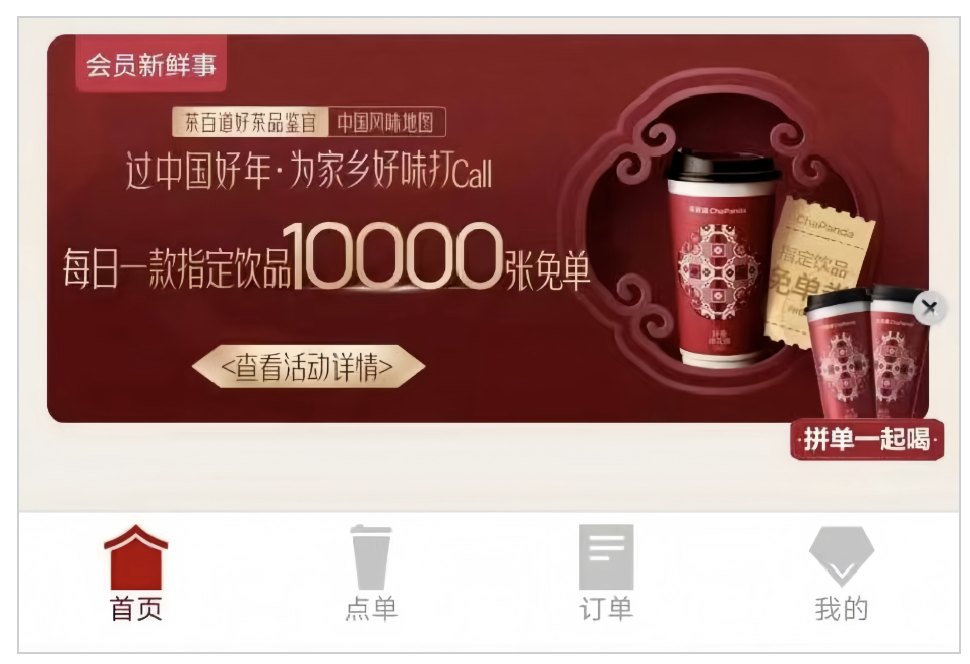
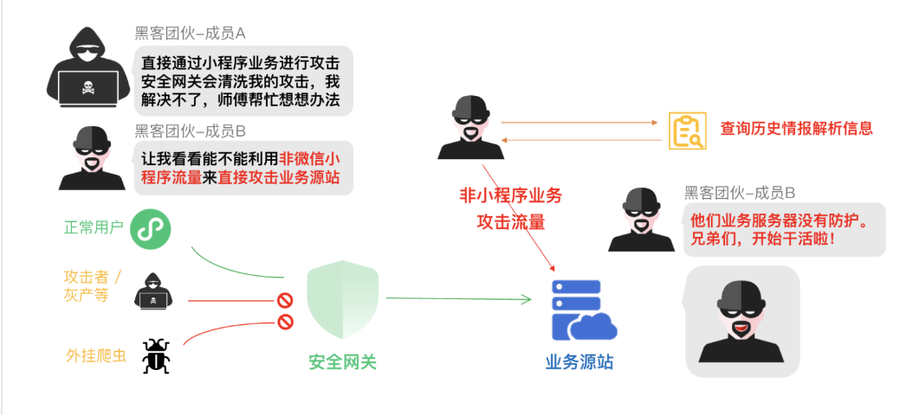
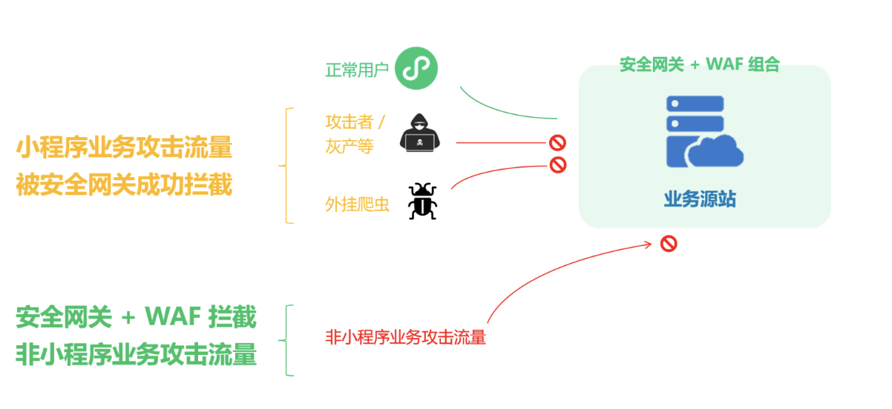
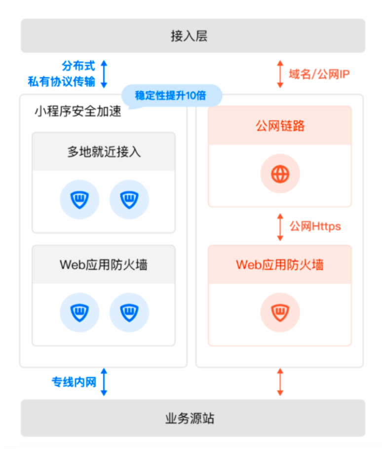

## 网络黑灰产的4000万次攻击，我们和茶百道防住了！

一年卖出近8亿杯，全国门店数超7000家（2022年），近几年茶百道一路狂奔成为国内头部新茶饮品牌。

除了遍布全国的门店，茶百道还不断完善线上销售和营销体系。早在2021年初，茶百道就推出微信小程序“茶百道点餐+”，不到两年注册会员超过了6600万（截至2023年6月30日）。
随着轻量便捷的小程序成为商家营销裂变的主阵地，围绕小程序的黑灰产活动也愈发活跃，刷券攻击、刷流量等恶意攻击层出不穷。

为了保障真实用户的权益，茶百道在2023年底接入腾讯云WAF+小程序安全加速解决方案，重拳出击网络黑灰产。在今年1月30日开启的茶百道“中国风味地图第一季”活动中，一举防住了网络黑灰产的4000万次攻击，保障每天10000杯免费奶茶不被薅走。

## 营销更安全
拦截4000万次攻击，100%狙击协议挂

小程序作为一种内嵌于高流量平台的轻量级应用，具有开发成本低、迭代快、使用便捷的优势。但许多企业在搭建小程序时更多考虑如何更快引流，而忽视了安全建设问题，在面临营销作弊、薅羊毛时，防御能力相对薄弱。

2023年11月，腾讯云WAF推出小程序安全加速解决方案，提供包括小程序加速、数据私有协议加密，DDoS防护、Web应用防护等多种能力的一站式解决方案，支持微信/企业微信小程序、 APP、H5等多种接入方式，无需改造代码，可分钟级快速接入。

茶百道接入小程序安全加速方案后，风险防御能力大幅提升。1月30日上午11点，茶百道“中国风味地图第一季”活动正式开启，大量攻击蜂拥而入，当日抢券流量一度高达16万QPS，对小程序的稳定和用户访问体验造成了极大的威胁。

茶百道与腾讯安全通力合作，快速分析羊毛党攻击手段，及时调整防护策略和完善方案细节。活动期间，成功拦截了超10万QPS的异常请求，不仅保障了小程序的平稳运行，还实现了对协议挂攻击的100%拦截。

实际上，小程序安全加速方案基于微信自研私有协议，为商家构建了一条安全、可信、加密的业务数据通信通道。同时通过后端流量特征分析，高效识别并清洗非小程序端的恶意请求，为商家提供更加真实的安全防护。在5天活动期间，总计为茶百道拦截超过4000万次攻击请求。

## 网络更快速
网络稳定性提升10倍，访问成功率提升至99%以上

许多零售品牌的门店网络遍布全国，部分县域或偏远城市网络质量欠佳，用户经常遇到小程序无法打开、支付不成功等问题。腾讯小程序安全解决方案可以提供就近接入、弱网加速等能力，以最优的链路将访问传递给服务器，大幅提升访问成功率。

简单来说，在地铁、电梯这些信号不好的地方，只要用户的微信能打开，就能用小程序在线下单，有效避免网络环境差导致用户无法下单、用户流失的问题。

接入方案后，茶百道小程序网络优化效果明显，网络稳定性提升了10倍，弱网环境传输加速3倍，请求的平均耗时降低了22%，访问成功率提升至99%以上。茶百道表示，2024年将不断加大在小程序安全风控方面的投入，与腾讯深入合作。

腾讯小程序安全解决方案还提供真实账号的全链路模拟压测工具，帮助小程序商家真实还原业务的海量高并发等复杂场景，及时发现服务问题和瓶颈，安全护航购物节、春节等大型营销活动。

小程序时代，安全已然成为商家数字化营销的底座工程，只有构建全面的小程序安全防线，才能实现营销费用的精准投放。目前，腾讯小程序安全解决方案已经助力零售、金融支付、泛互联网等多个行业企业的数字化升级。

