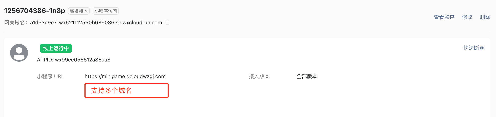
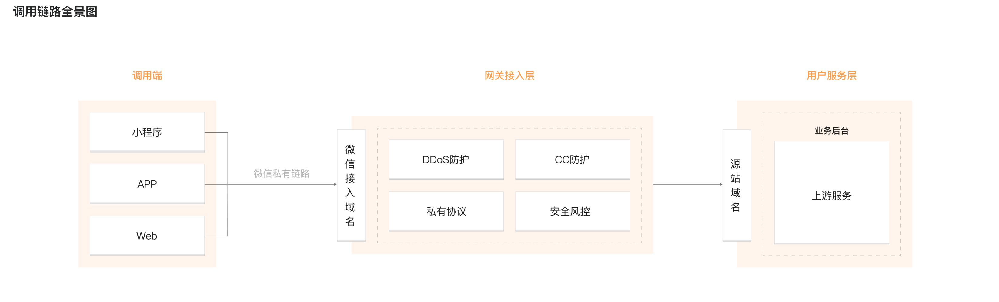

# 角色介绍
## 小程序/小游戏
在微信开发者工具上可以开发小程序/小游戏。
基于js开发前端逻辑，通过内置的wx.request发起网络请求，与后端进行交互。
在wx.request中指定要交互的域名。
该域名称为合法域名。

## Donut安全网关
Dount安全网关将截取小程序的外部访问流量，进行安全检测之后进行回源。
即截取小程序访问合法域名的流量。
除了提供安全能力，Donut还提供网络优化等能力https://dev.weixin.qq.com/docs/gateway/
劫持手段是内部域名映射，在微信内部，将合法域名映射到微信接入域名（网关域名）。此时，所有访问合法域名的流量将被截取到Donut安全网关。

Donut网关提供基础的DDos防护、CC防护等能力，通过安全检测的请求才能回到源站。

## WAF
Donut安全网关虽然能够提供基本的安全防护，但是WAF能够提供更加深刻的安全防护能力。
比如在抗CC攻击的时候，公有云WAF具有更多的集群容量，可以抵抗更好峰值的CC攻击。
又比如WAF基于20年沉淀的防护规则，能够提供更加全面的防护范围。
最重要的是Donut不支持用户根据业务自定义防护规则，而WAF支持细粒度的自定义防护规则。
总的来说，基于专业的WAF进行攻击防护是更好的选择。
因此，WAF积极与Donut网关进行合作。
一方面，WAF将获取到微信小程序客户资源。另一方面，Donut网关对外提供更加全面的安全能力。