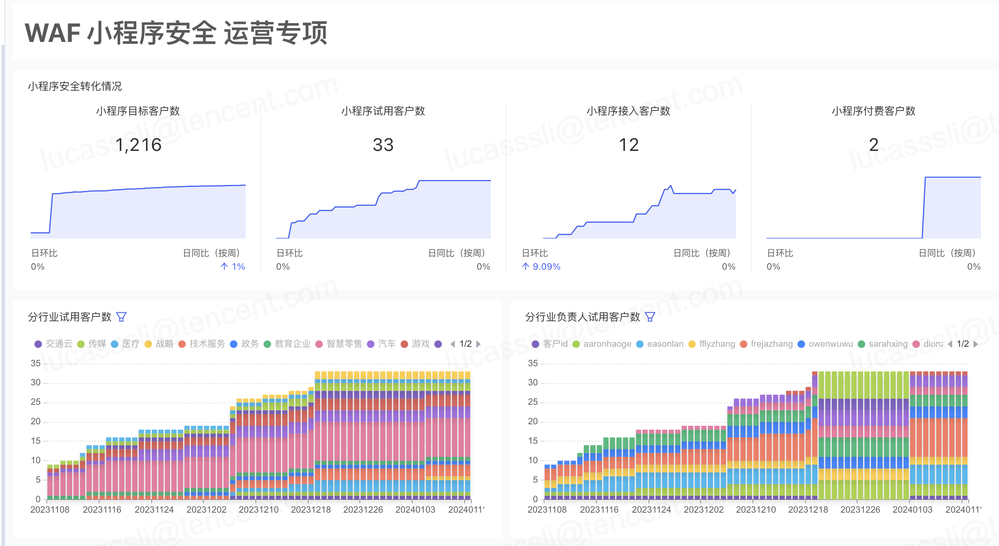
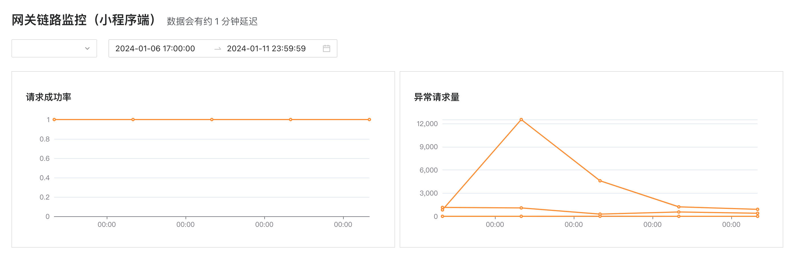
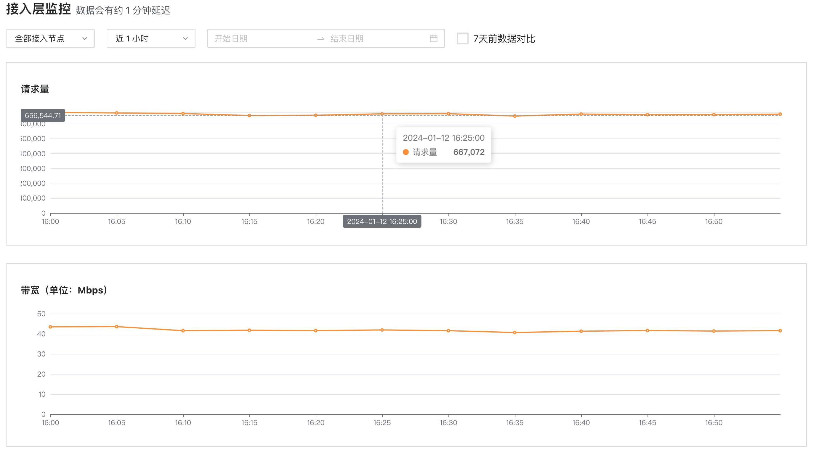
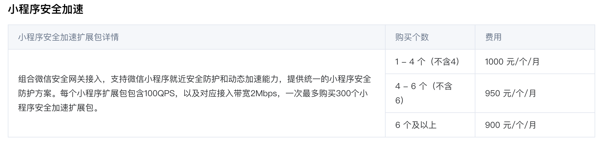

## 项目目标和结果

* 目标: WAF通过和微信小程序Donut网关合作，提供小程序一键防护能力。
一方面建立腾讯云WAF独有的生态优势，一键防护微信小程序流量，打造差异化优势。
另一方面，拓展了WAF的售卖市场，增加了小程序小游戏目标用户，看到了巨大的商机。

* 结果: 通过和小程序项目方的合作，我们成功提供了Donut到WAF一键接入的能力。
在产品竞争力上面，我们成功打造了差异化能力，让竞品感受到了压力。
在营收方面，从有小程序WAF的想法到落地并开始客户试用和付费使用，我们花了一个季度的时间。
达成了：

> 接入客户数12个:
四川省宜宾普拉斯包装材料有限公司
北京软通旭天科技发展有限公司
快狗打车（天津）信息服务有限公司
深圳鹏智瑞数字营销有限公司
内蒙古蒙牛乳业（集团）股份有限公司
贵州乐云科技有限公司
上海巨闲网络科技有限公司
合肥钮顺商贸有限公司
北京仁科互动网络技术有限公司
天津凤羽麟趾科技发展有限公司
泰康保险集团股份有限公司
奥乐齐（中国）投资有限公司

### 运营数据

## 技术和工具
列出在项目中使用的所有技术和工具，并对每个技术和工具的使用体验进行评估。这可以帮助你在面试中详细地解释你的技术栈。

### 知识层面
微信小程序、小游戏、安全、第三方平台生态的文档
### 技能层面
* mysql
* trpc

## 挑战和解决方案
本项目的挑战点并不在技术层面，因为在技术上，我们主要的工作的是构建API，调用微信小程序、Donut网关的接口和用mysql维护用户操作数据。
本项目的挑战点在于**如何紧急，设计、开发、联调、上线、运营一个不被合作方重视的新功能**

* 问题1： 虽然我方极其重视该项目，但是微信方一开始并不重视，导致功能设计、开发、联调过程效率低下。
> 及时与上级沟通项目进展和卡点，推动上级和微信方上级沟通，阐明项目对WAF的重要程度，以及一起合作能够产生什么样的收益，拉近和微信项目方的关系，推动功能开发工程。突出项目管理能力

* 问题2： 不熟悉微信方内部实现的逻辑，测试不充分，导致客户接入踩坑。
例如, 茶百道接入实战记录
四川蜀道云茶科技有限公司（茶百道）
https://docs.qq.com/doc/DWUNrYnlDSGpNQ3hW?u=4301e595957e4f30b3fa82153570ec19
> 及时安抚客情，及时和微信沟通实现细节然后向客户阐明原因，争取下次灰度发布机会。突出项目运营能力。

## 团队协作
作为项目负责人，在本次项目中，再次认识到了团队协作的重要性，尤其是在节奏快，时间紧的开发任务中，大家充分沟通和协作才能够及时完成任务。

重要角色： 
* 测试 ： 负责小程序测试环境的搭建和小程序接入WAF能力的验证。
* 前后端开发 ： 后端负责梳理逻辑，和微信对齐接口，和前端讲解逻辑，一起设计交互接口。
* 产品： 负责设计功能呈现形式。

## 改进和学习
在茶百道时间中，我们反思了问题的原因。认为新功能踩坑是一个必然并且良性的行为，但是不应该让大客户来踩坑，所以即使在紧迫的情况下，我们也应该首先推小客户试用。以及大客户重点保障的流程。

## 项目反馈
微信小程序一键接入安全防护能力，提供了方便快捷并且全面的一键防护能力。

* 客户层面收到了大量的好评和付费。
* 产品层面打造了独有的差异化能力。
* 合作方层面建立了良好的合作关系。