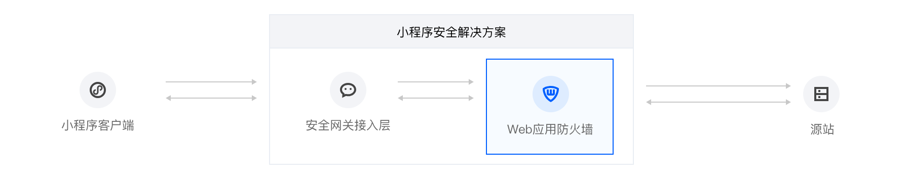
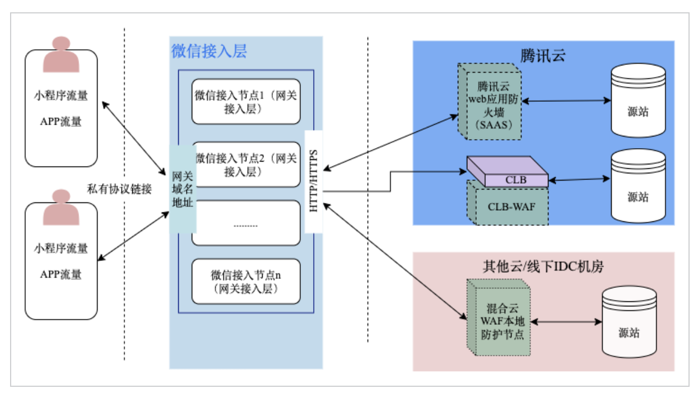
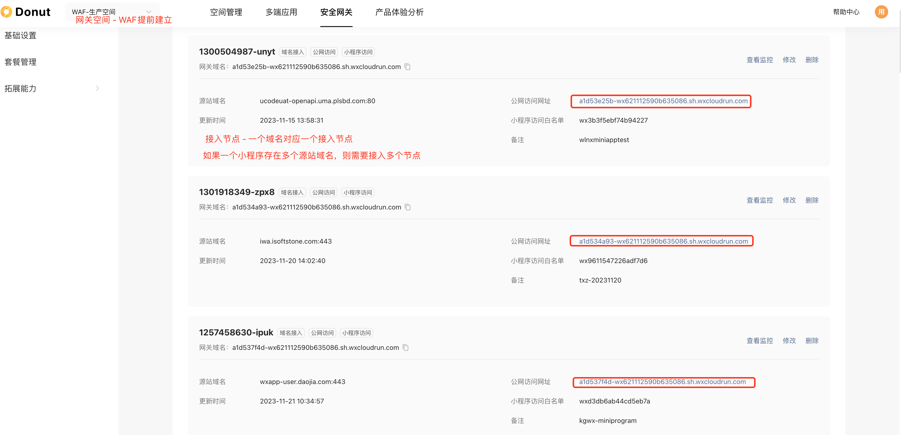
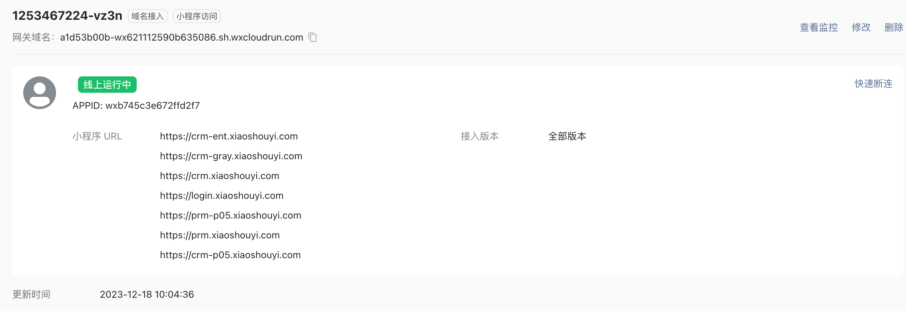

# Dount接入WAF

## 链路

将WAF串在Dount后面，流量先进入微信接入层，然后从微信接入层回源到合法域名。
此时合法域名再接入WAF，进入WAF检测集群。
WAF集群拦截异常流量后，放行正常流量回源到合法域名源站。

## 手动接入
上述流程，是可以手动完成的。

* 在Dount新建网关空间（gateway-id）。该网关空间为WAF提起建好，所有WAF的小程序用户都使用该网关空间。
* 在网关新建接入节点接入小程序域名（access-id），会分配一个公网域名。通过修改客户端调用为公网域名，将小程序的网络访问托管到Dount网关。经Dount检测后回源。
* 将小程序域名接入CLB-WAF或者SAAS-WAF。CLB-WAF:Dount回源到CLB，再经过WAF旁路检测后回源到源站。SAAS-WAF:Dount回源到WAF，由WAF检测后回源。

手动接入需要用户修改客户端源码，并且接入流程长而复杂。
通过一键接入解决该问题。

## 一键接入
为了省去用户修改客户端代码的步骤。WAF和Donut提供了一键接入Donut网关的能力。
https://dev.weixin.qq.com/docs/gateway/quickstart.html

* 首先Donut实现了小程序接入Donut之后自动接管小程序源站域名流量，不再需要用户修改客户端代码去访问公网域名。（实现方式暂时未知，猜测是基于内部DNS解析。所有请求都是从微信小程序平台发出，因此微信有能力将配置了Donut的小程度流量通过内部DNS重定向到对应的Donut集群，然后再从Donut集群回源到源域名）

* 然后WAF实现了第三方平台，用户授权后，帮助用户将小程序自动接入到Donut网关和WAF中。

