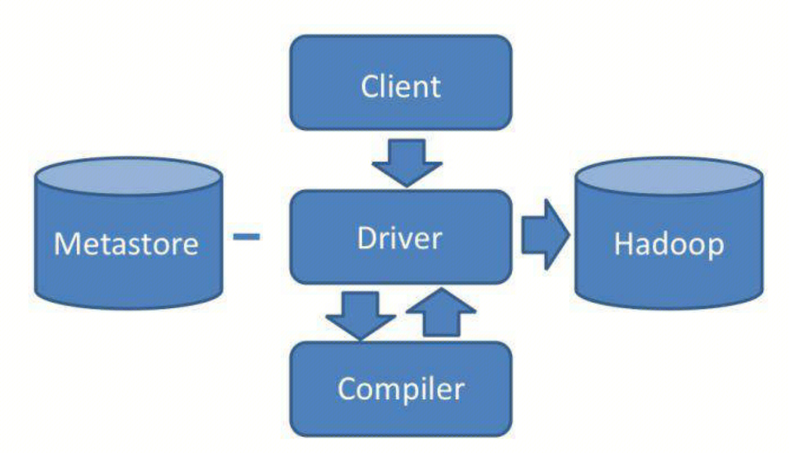

## Hive
背景，MapReduce极大的简化了大数据开发的编程步骤。但是对于不懂编程的BI人员等，也希望使用MapReduce来得到自己想要的大数据计算结果。Hive应运而生。
Hive是一个可以基于SQL语言，调用MapReduce计算框架完成数据分析的平台。
## 架构

通过Hive的Client向Hive提交SQL命令。Driver会将该语句提交给编译器进行语法分析等操作，最后生成一个MapReduce执行计划。根据MapReduce执行计划生成一个MapReduce作业，提交给Hadoop MapReduce计算框架处理。