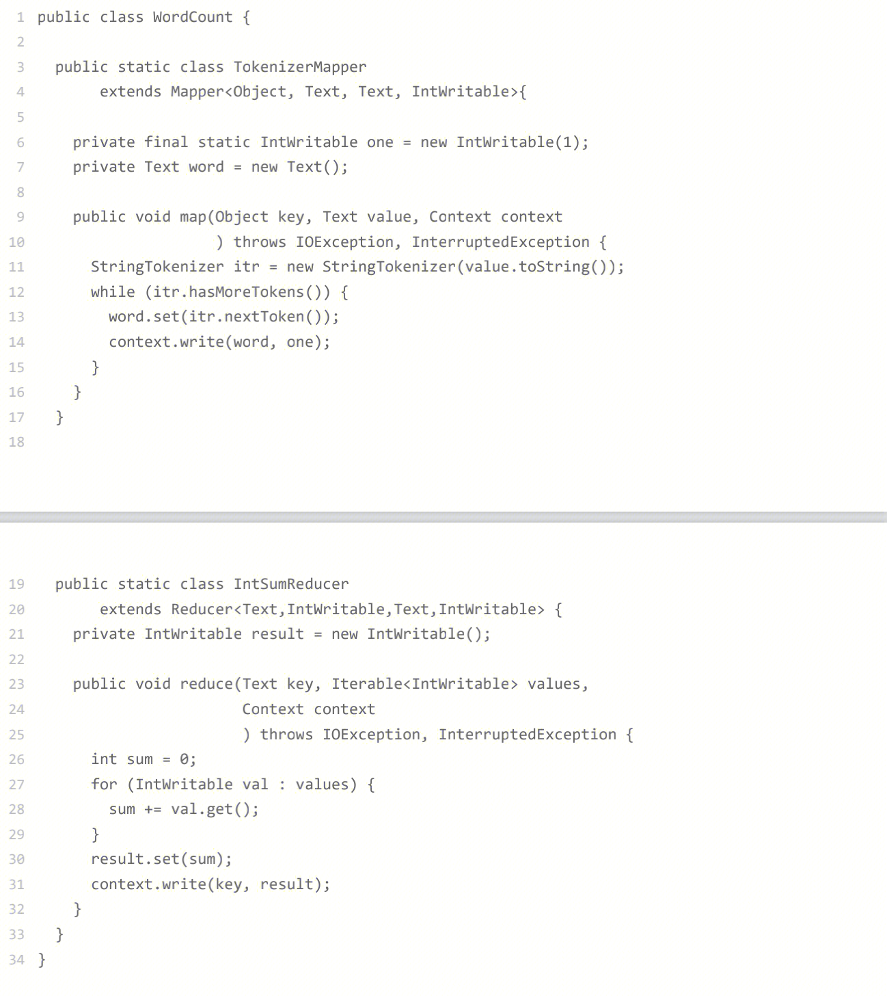
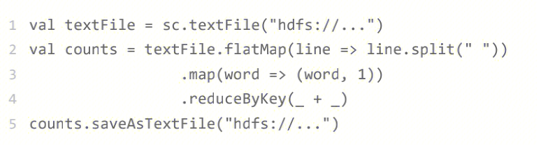
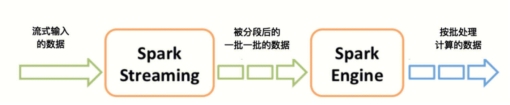

## Spark
Spark和MapReduce一样是大数据计算引擎。但是Spark比MapReduce执行更加快速，编程模型更加简单。
Spark支持Yarn资源调度框架 和 HDFS数据存储。因此，从MapReduce迁移到Spark是比较容易的。

## 为什么更快
### RDD编程模型：
用户面向RDD编程，代码比MapReduec更加简洁。
- MapReduce WordCount

- Spark WordCount

## Spark Stream

- 大数据批处理计算，数据是以批为单位，数据通常存储在HDFS上面。一个MapReduce或者Spark任务通常需要执行几分钟到几个小时。
- 大数据流计算，数据是实时传输的，并且实时传输过来的数据非常大量。需要利用大数据计算才能处理完毕。

Spark Stream将实时传输进来的数据按照时间进行分段，把一段时间传输 的数据合并在一起，当作一批数据，在交给Spark去处理。

Spark Stream主要负责将流数据转换为小的批数据，剩下的交给Spark去执行。