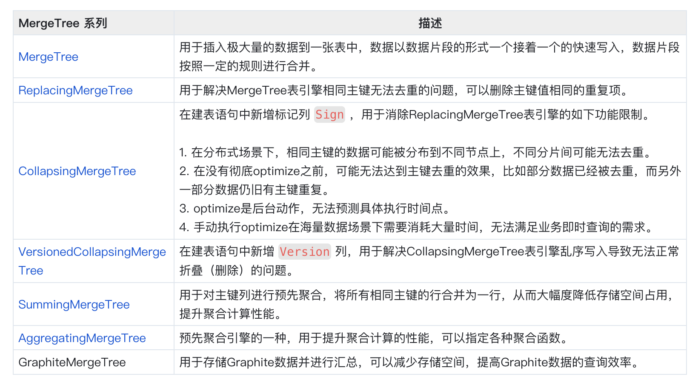
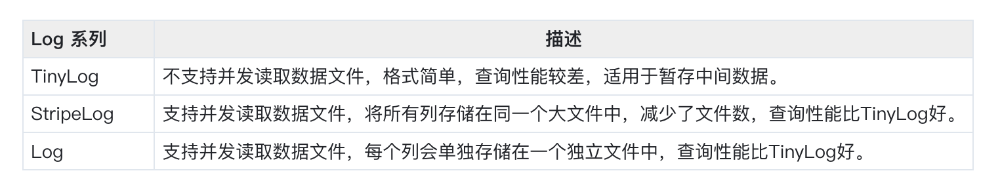
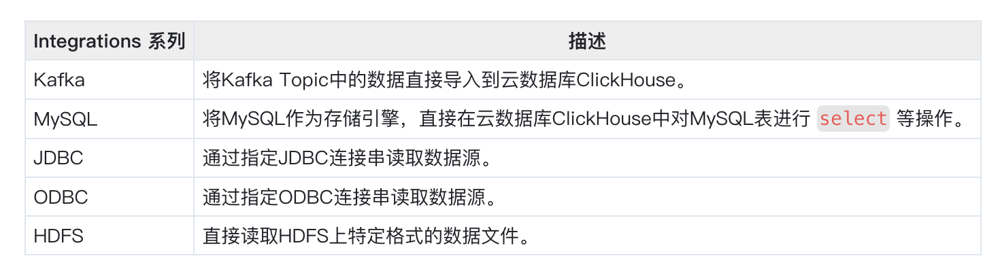
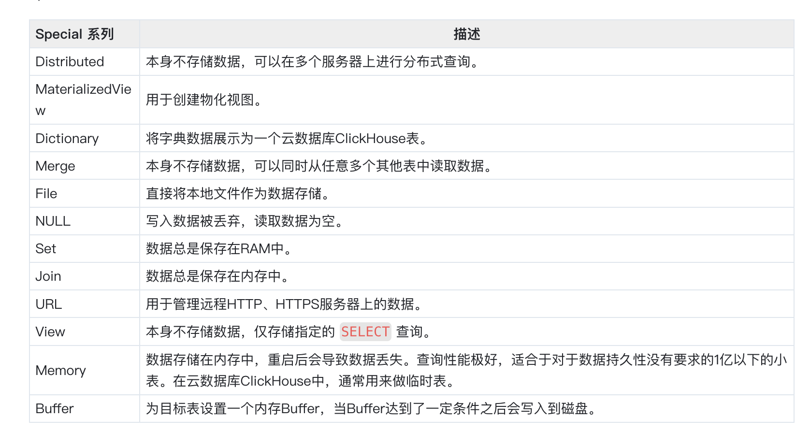
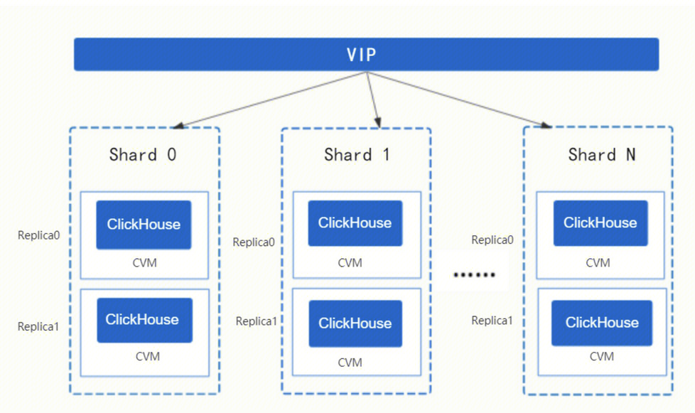
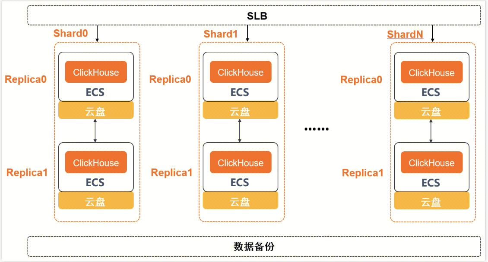

## 基本概念
https://clickhouse.com/docs/zh/
### 列式存储和行式存储数据库
行式数据库：处于同一行中的数据被物理的存储在一起。
列式数据库：处于同一列中的数据被物理的存储在一起。
不同的数据存储方式适用不同的业务场景，数据访问的场景包括：

- 进行了何种查询
- 多久查询一次以及各类查询的比例；
- 每种类型的查询(行、列和字节)读取多少数据；
- 读取数据和更新之间的关系；
- 使用的数据集大小以及如何使用本地的数据集；
- 是否使用事务,以及它们是如何进行隔离的；
- 数据的复制机制与数据的完整性要求；
- 每种类型的查询要求的延迟与吞吐量等等。
系统负载越高，依据使用场景进行定制化就越重要，并且定制将会变的越精细。没有一个系统能够同时适用所有不同的业务场景。如果系统适用于广泛的场景，在负载高的情况下，要兼顾所有的场景，那么将不得不做出选择。是要平衡还是要效率？

## 关系型数据库（OLAP ， OLTP） ， K/V数据库
常见的KV数据库 Redis 、MongoDB。
常见的OLTP数据库 MySQL 、 Postgres 和 MS SQL Server 。
常见的OLAP数据库 Clickhouse 、Hive 、 Kylin。
### OLTP(联机事务处理)和OLAP(联机分析处理)
#### 差异

- 基本概念
OLTP是传统的关系型数据库的主要应用，主要是基本的、日常的事务处理，记录即时的增、删、改、查，比如在银行存取一笔款，就是一个事务交易。
OLAP即联机分析处理，是数据仓库的核心部心，支持复杂的分析操作，侧重决策支持，并且提供直观易懂的查询结果。典型的应用就是复杂的动态报表系统。

- 事务支持
OLTP例如MYSQL，是支持事务的。
OLAP例如Clickhouse，是不支持事务的。

- 数据量
OLTP数据量不是很大，一般只读/写数十条记录，处理简单的事务。OLTP实时性要求高。
OLAP数据量大，因为OLAP支持的是动态查询，所以用户也许要通过将很多数据的统计后才能得到想要知道的信息。OLAP的实时性要求不是很高

- 更新
OLTP 使事务应用程序仅写入所需的数据，以便尽快处理单个事务。
OLAP 数据以相当大的批次(> 1000行)更新，而不是单行更新。 或者根本没有更新。绝大多数是读请求

#### OLAP 特点

-  宽表，即每个表包含着大量的列。读取时，从数据库中提取相当多的行，但只提取列的一小部分
- 查询并发度不高(通常每台服务器每秒查询数百次或更少)
- 对于简单查询，也允许延迟大约50毫秒
- 列中的数据相对较小：数字和短字符串(例如，每个URL 60个字节)
- 处理单个查询时需要高吞吐量(每台服务器每秒可达数十亿行)
- 事务不是必须的
- 对数据一致性要求低
- 查询结果明显小于源数据。换句话说，数据经过过滤或聚合，因此结果适合于单个服务器的RAM中

### K/V数据库特点
key-value分布式存储系统查询速度快、存放数据量大、支持高并发，非常适合通过主键进行查询，但不能进行复杂的条件查询。**它不能像关系型数据库一样通过使用带where的SQL语句来过滤并查询所存数据的部分内容**。如果你不知道该从哪查询，你需要遍历所有的key值，找到对应的value，对其进行过滤，最终只保留你想要的那部分数据。这样以来计算量会非常大，同时也意味着**只有在key已知的情况下，K-V数据库才能保证高性能**，否则其性能明显不足。

### 列式数据库更加适合OLAP场景
#### 输入/输出
1. 针对分析类查询，通常只需要读取表的一小部分列。在列式数据库中你可以只读取你需要的数据。例如，如果只需要读取100列中的5列，这将帮助你最少减少20倍的I/O消耗。
2. 由于数据总是打包成批量读取的，所以压缩是非常容易的。同时数据按列分别存储这也更容易压缩。这进一步降低了I/O的体积。
3. 由于I/O的降低，这将帮助更多的数据被系统缓存。
#### CPU
由于执行一个查询需要处理大量的行，因此在整个列向量上执行所有操作将比在每一行上执行所有操作更加高效。同时这将有助于实现一个几乎没有调用成本的查询引擎。如果你不这样做，使用任何一个机械硬盘，查询引擎都不可避免的停止CPU进行等待。所以，在数据按列存储并且按列执行是很有意义的。
向量引擎可以支持向量化执行：所有的操作都是为向量而不是为单个值编写的。这意味着多个操作之间的不再需要频繁的调用，并且调用的成本基本可以忽略不计。（类似于神经网络中的向量矩阵计算）

## 小结

- 1. OLAP场景与其他通常业务场景，例如OLTP（MYSQL），K/V（Redis，Mysql）有很大的不同， 因此想要使用OLTP或Key-Value数据库去高效的处理分析查询场景，并不是非常完美的适用方案。
例如，使用OLAP数据库去处理分析请求通常要优于使用MongoDB或Redis或MYSQL去处理分析请求。
- 2. 列式数据库更加适合OLAP场景（对于大多数查询而言，处理速度至少提高了100倍）

## ClickHouse用户指南
列式存储的OLAP数据库系统。
### 应用场景
### 交互式报表
**基于ClickHouse和BI工具构建实时运营监控报表**
利用ClickHouse构建实时交互式报表，实时分析订单、收入、用户数等核心业务指标；构建用户来源分析系统，跟踪各渠道PV、UV来源。
**海量数据实时多维查询**
在数亿至数百亿记录规模大宽表，数百以上维度自由查询，响应时间通常在100毫秒以内。让业务人员能持续探索式查询分析，无需中断分析思路，便于深挖业务价值，具有非常好的查询体验。

### 用户画像分析
随着数据时代的发展，各行各业数据平台的体量越来越大，用户个性化运营的诉求也越来越突出，用户标签系统，做为个性化千人千面运营的基础服务，应运而生。如今，几乎所有行业（如互联网、游戏、教育等）都有实时精准营销的需求。通过系统生成用户画像，在营销时通过条件组合筛选用户，快速提取目标群体。
**基于ClickHouse构建用户特征行为分析系统**
利用ClickHouse对人群标签数据进行实时筛选并进行群体画像统计；自定义条件对海量明细日志记录进行过滤，分析用户行为。
**用户分群统计**
构建用户特征大宽表，任意选择用户属性标签数据和筛选条件，进行人群特征统计分析。

### 数据库引擎

- MaterializedMySQL，ClickHouse服务器作为MySQL副本同步工作。它读取binlog并执行DDL和DML查询。https://help.aliyun.com/document_detail/209912.html
- MaterializedPostgreSQL，ClickHouse服务器作为PostgreSQL副本工作。使用PostgreSQL数据库表的初始数据转储创建ClickHouse数据库，并启动复制过程，即执行后台作业，以便在远程PostgreSQL数据库中的PostgreSQL数据库表上发生新更改时应用这些更改。
- ClickHouse引擎，主要指ClickHouse数据库自身的引擎。该引擎提供**可配置的表引擎**和所有支持的SQL语法。

## ClickHouse引擎（待重点补充）
主要指ClickHouse数据库的各种表引擎。
表引擎即表的类型，在云数据库ClickHouse中决定了如何存储和读取数据、是否支持索引、是否支持主备复制等。云数据库ClickHouse支持的表引擎，请参见下表。
### MergeTree系列引擎
https://clickhouse.com/docs/zh/engines/table-engines/mergetree-family/mergetree
适用于高负载任务，支持大数据量的快速写入并进行后续的数据处理，通用程度高且功能强大。该系列引擎的共同特点是支持数据副本、分区、数据采样等特性。 | 用于插入极大量的数据到一张表中，数据以数据片段的形式一个接着一个的快速写入，数据片段按照一定的规则进行合并。

### Log系列引擎
Log系列引擎适用于快速写入小表（1百万行左右的表）并读取全部数据的场景。该系列引擎的共同特点如下。

- 数据被追加写入磁盘中。
- 不支持 `delete` 、 `update` 。
- 不支持索引。
- 不支持原子性写。
-  `insert` 会阻塞 `select` 操作。

### Integrations系列引擎
Integrations系列引擎适用于将外部数据导入到云数据库ClickHouse中，或者在云数据库ClickHouse中直接使用外部数据源。

### Special系列引擎
Special系列引擎适用于特定的功能场景。例如 **MaterializedView** 和 **View**

## Clickhouse技术原理
### 集群架构
云数据仓库 ClickHouse 是由多个 ClickHouse 节点组成的分布式集群。这些 ClickHouse 节点根据购买规格的不同而可能包含一个或两个副本（Replica）。一个云数据仓库 ClickHouse 集群可能包含一个或多个分片（Shard）。

### shard
云数据仓库 ClickHouse 将海量数据分散存储到多个节点，每个节点只存储和处理海量数据的一部分。单副本时，一个分片对应一个节点，双副本时，一个分片对应两个节点。
### replica
为了在异常情况下保证数据的安全性和服务的高可用性，云数据仓库 ClickHouse 将数据冗余存储在两个节点上，两个节点的数据互为副本。

## Clickhouse性能
[ClickHouse](https://cloud.tencent.com/product/cdwch?from=10680)在计算层做了非常细致的工作，竭尽所能榨干硬件能力，提升查询速度。它实现了单机多核并行、分布式计算、向量化执行与SIMD指令、代码生成等多种重要技术。
**1. 多核并行**
ClickHouse将数据划分为多个partition，每个partition再进一步划分为多个index granularity，然后通过多个CPU核心分别处理其中的一部分来实现并行数据处理。
在这种设计下，单条Query就能利用整机所有CPU。极致的并行处理能力，极大的降低了查询延时。
**2. 分布式计算**
除了优秀的单机并行处理能力，ClickHouse还提供了可线性拓展的分布式计算能力。ClickHouse会自动将查询拆解为多个task下发到集群中，然后进行多机并行处理，最后把结果汇聚到一起。
**3. 向量化执行**
ClickHouse不仅将数据按列存储，而且按列进行计算。传统OLTP[数据库](https://cloud.tencent.com/solution/database?from=10680)通常采用按行计算，原因是事务处理中以点查为主，SQL计算量小，实现这些技术的收益不够明显。但是在分析场景下，单个SQL所涉及计算量可能极大，将每行作为一个基本单元进行处理会带来严重的性能损耗：

- 对每一行数据都要调用相应的函数，函数调用开销占比高；
- 计算层按行处理，无法充分利用CPU cache的预读能力，造成CPU Cache miss严重；
- 按行处理，无法利用高效的SIMD指令；

ClickHouse实现了向量执行引擎（Vectorized execution engine），对内存中的列式数据，一个batch调用一次SIMD指令（而非每一行调用一次），不仅减少了函数调用次数、降低了cache miss，而且可以充分发挥SIMD指令的并行能力，大幅缩短了计算耗时。向量执行引擎，通常能够带来数倍的性能提升。

向量化计算是一种特殊的并行计算方式，相比于一般程序在同一时间只执行一个操作的方式，它可以在同一时间执行多次操作，通常是对不同的数据执行同样的一个或一批指令，或者说把指令应用于一个数组/向量，通过数据并行提高性能，即SIMD