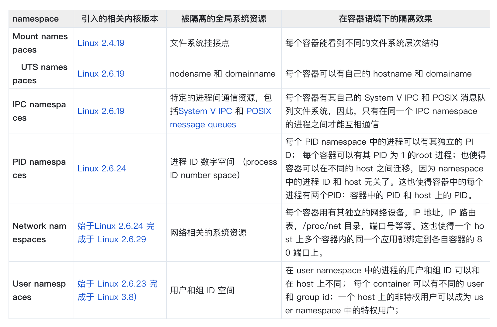

## 容器
容器其实是一种沙盒技术，沙盒提供两个能力：

- 隔离与限制：沙盒就像集装箱，将应用装起来。应用与应用之间相互隔离，应用占用的资源大小也有所限制。
- 打包和部署：被装进集装箱的应用，可以方便的搬来搬去。
## 隔离与限制
### namespace 隔离
#### 介绍
NameSpace是linux中用来修改进程视图的主要方法。

例如，当我们在宿主机上运行一个进程的时候，可以为该进程分配一个全新的进程空间。在这个进程空间中，新创建的进程看到自己的PID是1。但是，在宿主机上，该进程的PID并不是1，而是按照实际情况分配PID。在进程空间中的进程，只能看到同个进程空间内的进程，无法看到其他进程空间内的进程，也无法看到宿主机上的进程。除了进程空间（PID NameSpace），Linux还提供了Mount, UTS, IPC, NetWork, User等NameSpace。

容器的隔离，其实就是指在创建进程的时候，指定该进程需要启动的一组NameSpace参数，这样容器就只能看到当前NameSpace所限定的资源、文件、设备、状态、配置。而对于宿主机以及其他不相关的程序，他就完全看不到了。
#### 应用

上图描述了Docker Engine在系统中的一个位置的转化。

左图，Docker Engine是在进程和Host OS之间的，类似于虚拟机的位置，意味帮助进程在宿主机上运行。
右图，Docker Engine和进程属于并列关系。类似于旁路式的辅助和管理工作。

右图更贴切的描述的Docker Engine的角色和位置。在使用Docker Engine的时候，并没有真正的启动一个Docker容器运行在宿主机。Docker Engine帮助用户启动的还是原来的进程，只不过在创建这些进程的时候，Docker Engine为他们加上了各种各样的NameSpace参数。

各种各样的NamceSpace参数和其作用如下表所示：


#### 与Linux虚拟化的区别

Linux虚拟化技术，基于Hypervisor创建了一个真实存在的虚拟机。在虚拟机中运行了一个完整的Guest OS，才能在虚拟机内执行用户的应用进程。**虚拟化技术将带来更多的资源占用和性能消耗**。具体体现在：

- 资源占用：虚拟机操作系统 自身就要占用约100-200MB的内存。
- 性能消耗：用户应用运行在虚拟机里面，它对宿主机的系统调用会不可避免的会经过虚拟化软件的拦截和处理，这个过程将带来一层性能损耗，尤其是对计算资源，网络和磁盘I/O的损耗。

而Docker Engine，1.进程运行在Host OS上，这意味着因为容器化带来的性能损耗是不存在的。2.没有单独的Guest OS，容器不需要占用额外的资源。

当然，因为容器化因为没有模拟出一个完成的操作系统。所以，容器化也存在一些不足：

- 内核限制：容器只是运行在宿主机上的进程，因此无法脱离宿主机的内核限制。经过可以通过Mount NameSpace去挂载出其他版本的操作系统的文件系统，比如Ubantu或者CentOS。但是无法改变宿主机的内核，因此在Windows宿主机上运行Linux容器或者在低版本linux宿主机上运行高版本的Linux容器，都是行不通的。
- 隔离不彻底：上文谈到，Docker仅仅是利用了六种不同的NameSpace，因此还有很多的资源是无法被隔离的。最典型的例子就是时间。如果在一个容器内部通过系统调用设置了宿主机的时间，那么宿主机上的所有容器都会感知到这个修改。所以，容器内用户能够做什么，什么不能做是一个非常严肃的问题。另一个问题是/proc文件系统。/proc目录存储的是记录当前内核运行状态的一系列特殊文件，用户可以通过访问这些文件来查看系统当前正在运行的进程信息，比如CPU使用率，内存占用率。这些是top指令的数据来源。但是即使在容器中执行top，也将看到宿主机的数据信息。

而拥有硬件虚拟化技术和独立Guest OS的虚拟机，1.没有宿主机的操作系统内核限制，可以在windows上建立linux宿主机。2.拥有超高自由度，可以随意修改系统。


## Cgroup 限制
Linux Cgroup全称control group。主要作用是限制一个进程组能够使用的资源上限，包括cpu，内存，磁盘，网络带宽等等。
### 介绍
Cgroup在linux中，通过文件的方式对外暴露设置方法。修改文件内容就可以设置资源限制。

### 应用
1. 指定docker命令，启动一个ubuntu容器，并设置cpu占用时间不能超过20%。
``` 
docker run -itd --cpu-period=100000 --cpu-quota=20000 ubuntu:18.04 /bin/bash
```
得到容器ID：bae8521ae6d489f603a2c25594d9108171b8ed5f82e3e0e4213dfac90a456401

2. 通过`mount -t cgroup`可以将cgroup可以限制的资源展示出来：
``` 
cgroup on /sys/fs/cgroup/systemd type cgroup (rw,nosuid,nodev,noexec,relatime,xattr,release_agent=/usr/lib/systemd/systemd-cgroups-agent,name=systemd)
cgroup on /sys/fs/cgroup/cpu,cpuacct type cgroup (rw,nosuid,nodev,noexec,relatime,cpu,cpuacct)
cgroup on /sys/fs/cgroup/pids type cgroup (rw,nosuid,nodev,noexec,relatime,pids)
cgroup on /sys/fs/cgroup/devices type cgroup (rw,nosuid,nodev,noexec,relatime,devices)
cgroup on /sys/fs/cgroup/memory type cgroup (rw,nosuid,nodev,noexec,relatime,memory)
cgroup on /sys/fs/cgroup/cpuset type cgroup (rw,nosuid,nodev,noexec,relatime,cpuset)
							.......
```
3.进入cgroup的设置目录，发现有一个docker目录。进入docker目录，发现有以容器ID为名字的目录。进入该目录：
``` 
cd /sys/fs/cgroup/cpu/docker/bae8521ae6d489f603a2c25594d9108171b8ed5f82e3e0e4213dfac90a456401
```

其中 cpu.cfs_period_us 和 cpu.cfs_quota_us即在启动容器的时候设置的值，分别是100000和20000。而tasks里面则记录了一些需要限制的进程PID，这些PID是容器运行的进程PID。当前有`1434617`。这是容器进程的PID。

1. 进入容器，并执行
``` 
while : ; do : ; done &
```
如果没有限制的情况下，该命令将100%占用CPU。

1. 退出容器，查看CPU占用率，只有20%。（容器中top，也将看到宿主机信息）
2. 查看
`/sys/fs/cgroup/cpu/docker/bae8521ae6d489f603a2c25594d9108171b8ed5f82e3e0e4213dfac90a456401/tasks`文件，看到PID新增了1434777，这是刚才在容器内启动的/bin/bash进程。
因此容器进程和在容器内启动的进程（容器进程的子进程），都会受到cgroup的资源使用限制。

# 打包和部署
容器技术背景文中讲到，Docker镜像含了一个完整操作系统的所有目录和文件。所以这个压缩包内的内容和本地的测试环境是完全一致的。无论在哪里解压这个压缩包，都可以运行你的程序。

对于开发者来说，往往关心的依赖是编程语言层面的，但是实际上，**操作系统本身才是程序运行的最完整的依赖库**。Docker镜像，拥有打包整个操作系统的所有目录和文件的能力。因此最完整的依赖环境也变成了应用沙盒的一部分，这就赋予了容器的一致性。无论在本地、云端，还是任何一台其他的机器，只有用户解压打包好的容器镜像，那么应用运行的所有完整依赖环境就被重现出来了。

## 容器启动 部署
为了重现操作系统所有的目录和文件，容器启动的时候，需要把镜像内包含的完整操作系统文件和目录作为进程运行的环境。最简单的方法是将镜像内操作系统文件系统作为当前进程运行的根目录。

Docker引擎在启动容器的时候，会为容器进程新建一个Mount NameSpace。并在容器进程启动之前，使用镜像内的操作系统文件目录，为容器进程重新挂载整个根目录"/"

## 容器镜像 打包
那么镜像内部的操作系统文件目录是如何打包的呢？
为了避免每次都要从头到尾打包一个完整的操作系统文件目录。
Docker的镜像采用增量叠加的打包方式。用户打包镜像过程中每一次涉及文件变动的步骤，都会生成一个新的layer。最终的镜像是这些所有的layer叠加在一起构成的。

例如： 

``` 
docker pull ubuntu
```

下载下来的镜像通过

``` 
docker image inspect ubuntu
```
查看结构，可以看到：
``` 
 "RootFS": {
            "Type": "layers",
            "Layers": [ "sha256:17f623af01e277c5ffe6779af8164907de02d9af7a0e161662fc735dd64f117b"
            ]
        },
```
该镜像是最基础的镜像，因此只有一层。
接着我们运行ubuntu容器，并在里面添加一个文件后通过commit，新建一个镜像，名字为ubuntu-lucasssli，同样inspect该镜像，可以看到：
``` 
 },
        "RootFS": {
            "Type": "layers",
            "Layers": [      "sha256:17f623af01e277c5ffe6779af8164907de02d9af7a0e161662fc735dd64f117b",  "sha256:e806cc4a806fc0c99cfa79056aaf130cae5837e70d934641b14859689c032f64"
            ]
        },
```
此时镜像已经有两层了。
第一层还是ubuntu，第二层是我对文件系统的变动。

这两层的内容可以在/var/lib/docker/overlay2目录下去查看（可能layerid和目录名字不太一样），但是容器在运行的时候是如何把这两层不同目录的文件系统组合成一个完整的经过修改的ubuntu文件系统呢？

是通过联合文件系统实现的。这种联合文件系统，把各个层的文件组合起来，并挂载到另一个目录，该目录下就是镜像的文件内容。
联合文件系统有aufs overlay等，目前docker使用的是overlay2。查看挂载目录的方法如下：
首先运行容器，ps找到containerID为c5c37459511d，然后
``` 
docker inspect c5c37459511d
```
查看GraphDriver：
``` 
        },
        "GraphDriver": {
            "Data": {
                "LowerDir": "/var/lib/docker/overlay2/6d69276516866dcffe05f668d682864c7a6daf0c06accc70e1854d1852872446-init/diff:/var/lib/docker/overlay2/f6fd212b879f33eabbe6e2430a8640a29633e1ee6ddfd6e98489e1acf5e3c324/diff:/var/lib/docker/overlay2/8d8cc34a13e4e9469eea40377d79897d1d00f073a0d7d35f3018d376816f3b08/diff",
                "MergedDir": "/var/lib/docker/overlay2/6d69276516866dcffe05f668d682864c7a6daf0c06accc70e1854d1852872446/merged",
                "UpperDir": "/var/lib/docker/overlay2/6d69276516866dcffe05f668d682864c7a6daf0c06accc70e1854d1852872446/diff",
                "WorkDir": "/var/lib/docker/overlay2/6d69276516866dcffe05f668d682864c7a6daf0c06accc70e1854d1852872446/work"
            },
            "Name": "overlay2"
        },
```
其中MergedDir为多层联合挂载的目录。进入该目录，将看到一个完整的操作系统。


容器启动时，会将该merge目录挂载到容器的根目录，作为容器进程的RootFs。容器进程内对文件系统的任何修改都将在merge目录同步修改。

## 镜像结构
merge目录分为三个部分，分别是只读层、init层和可读可写层。
- 只读层（image层）是ubuntu-lucasssli包含的两层layers，这是不可以修改的。只读层的挂载方式是readonly+whiteout。
- init层，该层专门用于存放/etc/hosts, /ets/resolv.conf等用户个性化信息。该层目录为MergedDir+ “-init”。执行docker commit的时候，只会提交可读可写层，不会提交这一层。
- 可读可写层（container层），专门存放对只读层的增量修改。
**删除文件操作是通过whiteout的方式实现的，whiteout会创建.wh.xxx文件把只读层中的xxx文件遮挡起来，相当于删除了。新增即增加文件。修改是基于copy-on-write的方式。**
 	- 1.添加文件，在容器中创建文件时，新文件被添加到容器层中
	- 2.读取文件，在容器中读取某个文件时，docker会从上往下依次在各个镜像层中查找到此文件，一旦找到，打开并读入内存
	- 3.修改文件，在容器中修改已经存在的文件时，docker会从上往下依次在各个镜像层中查找到此文件，一旦找到，立即将其复制到容器层，然后修改。只有当修改的时候才复制一份数据，这种特性被称作copy-on-write
	- 4.删除文件，在容器中删除文件时，docker也是从上往下依次在镜像层中查找此文件，找到后，会在容器层中记录下此删除操作
	
	
使用docker commit的时候，将提交这一层，并将该层上传到dockerhub，供其他人使用。而原先的只读层，例如ubuntu或者ubuntu-lucasssli都是不会发生改变的。这就是Docker的增量打包。