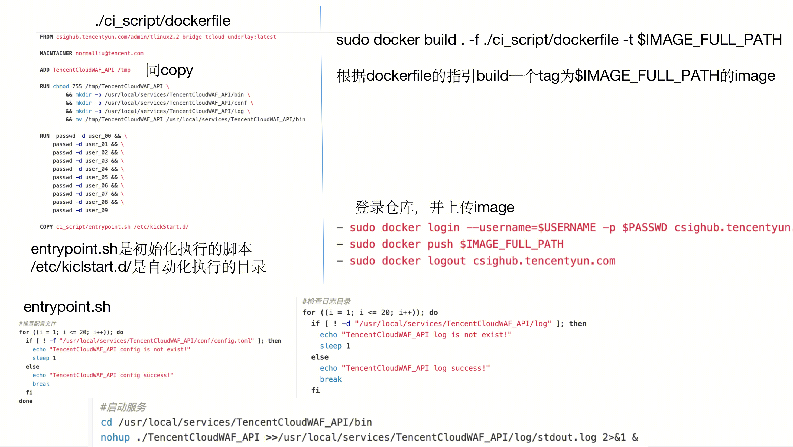

## example

## 知识点
Dockerfile 中每一个指令都会建立一层， RUN 也不例外。每一个 RUN 的行为，就和刚才我们手工建立镜像的过程一样：新建立一层，在其上执行这些命令，执行结束后， commit 这一层的修改，构成新的镜像。
而上面的这种写法，创建了 7 层镜像。这是完全没有意义的，而且很多运行时不需要的东西，都被装进了镜像里，比如编译环境、更新的软件包等等。结果就是产生非常臃肿、非常多层的镜像，不仅仅增加了构建部署的时间，也很容易出错。 这是很多初学 Docker 的人常犯的一个错误。