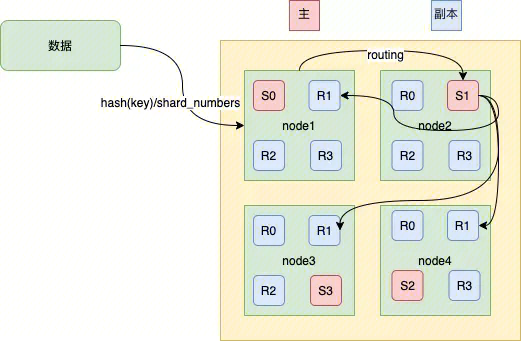

## ElasticSearch
开源Elasticsearch是一个**基于Lucene的实时分布式的搜索与分析引擎**，是遵从Apache开源条款的一款开源产品，是当前主流的**企业级搜索引擎**。作为一款基于RESTful API的分布式服务，Elasticsearch可以快速地、近乎于**准实时地存储、查询和分析超大数据集**，**通常被用来作为构建复杂查询特性和需求强大应用的基础引擎或技术。**


## 应用场景
### 信息检索
面向海量数据的信息检索服务，使得生活在移动互联网中的用户查询各种各样的信息，例如查询账单、电子发票、附近的餐厅酒店、媒体咨询、物流订单等，如何处理多种数据类型，提供高效检索服务，帮助用户高效获取信息。

### 运维监控
利用ELK生态，对各类日志、指标、Tracing数据进行统一收集、存储和实时监控分析，从而快速定位问题，提升企业运维和经营效率。


### 与ClickHouse的区别
ElasticSearch和ClickHouse在许多场景下都可以使用。例如数据分析（统计报表，统计排行...）
Clickhouse是一个OLAP数据库系统，可以用于数据查询，分析等场景。
Elasticsearch是搜索与分析引擎，可以用于数据搜索，分析等场景。
二者虽然应用场景部分相同，但是本质上是两个不同领域的系统。因此，二者只能在具体场景下的对比。例如，查询性能，存储性能等。


## 名词解释
https://zhuanlan.zhihu.com/p/141447196
### 全文检索
全文检索是指计算机索引程序通过扫描文章中的每一个词，对每一个词建立一个索引，**指明该词在文章中出现的次数和位置**，当用户查询时，检索程序就**根据事先建立的索引进行查找**，并将查找的结果反馈给用户的检索方式。
### 倒排索引
索引表中的每一项都包括一个属性值和具有该属性值的各记录的地址。由于不是由记录来确定属性值，而是由属性值来确定记录的位置，因而称为倒排索引(inverted index)。
### Document (文档)
文档指的是用户提交给 ES 的一条数据。在 ES 中文档指的是一条 JSON 数据。
JSON 数据中可以包含多个字段，这些字段可以类比为 MySQL 中每个表的字段。
例如:
```
{
  "message": "this is my blog",
  "author": "cyhone"
}
```
这样我们后期进行搜索和查询的时候，也可以分别针对  `message`  字段和  `author`  字段进行搜索。

### Index (索引)
Index(索引) 是文档的集合，同在一个索引index中的文档共同建立倒排索引。
提交给同一个索引中的文档，最好拥有相同的结构。这样对于 ES 来说，不管是存储还是查询，都更容易优化。
性质完全不同的数据（比如 products 和 logs）应该存成两个 Index。
### Type
Document 可以分组，比如employee这个 Index 里面，可以按部门分组，也可以按职级分组。这种分组就叫做 Type，它是虚拟的逻辑分组，用来过滤 Document。 因为处于一个index中，不同的 Type 也应该有相似的结构。

### 文档元数据（Document metadata）
文档元数据为_index, _type, _id, 这三者可以唯一表示一个文档，_index表示文档在哪存放，_type表示文档的对象类别，_id为文档的唯一标识。

### 字段（Fields）
每个Document都类似一个JSON结构，它包含了许多字段，每个字段都有其对应的值，多个字段组成了一个 Document，可以类比关系型数据库数据表中的字段。

### mapping
映射是定义文档及其包含的字段的存储和索引方式的过程。
字段类型 （type）https://cloud.tencent.com/developer/article/1443630 区分keyword 和 text（分词存储）
配置项 （_all ， doc_values， index等）https://blog.csdn.net/a745233700/article/details/117915118
- index : false 该字段不建立倒排索引，无法对该字段进行搜索。例如，无法使用该字段作为kibana的Discover条件
- doc_values：false 。打开会占用额外存储空间，与 source 独立，同时开启 doc_values 和 _source 则会将该字段原始内容保存两份。doc_values 数据在磁盘上采用列式存储，关闭后无法使用排序和聚合。例如无法在kibana的Visualize中使用该字段的聚合。


### X-Pack
X-Pack高级特性是Elasticsearch基于原X-Pack商业版插件开发的官方商业版特性，包含了安全、SQL、机器学习、告警、监控等多个高级特性，从应用开发和运维管理等方面增强了Elasticsearch的服务能力

## 集群架构
同一个index下所有文章的分布：

node为一个节点，s0为primary shard,  R0为S0的replica shard。
### 数据读写过程

**数据写：**
（1）数据写请求发送到 node1 节点，通过路由计算得到值为1，那么对应的数据会应该在主分片S1上。
（2）node1节点将请求转发到 S1 主分片所在的节点node2，node2 接受请求并写入到磁盘。
（3）并发将数据复制到三个副本分片R1上，其中通过乐观并发控制数据的冲突。一旦所有的副本分片都报告成功，则节点 node2将向node1节点报告成功，然后node1节点向客户端报告成功。
**数据读：**
在处理读取请求时，协调结点在每次请求的时候都会通过轮询所有的副本分片来达到负载均衡。
https://zhuanlan.zhihu.com/p/334348919


## 实战
### 查看所有索引
``` 
curl -XGET -u xxxx:xxxx http://11.177.104.206:9200/_cat/indices
```
### 查看所有别名
``` 
curl -XGET -u xxxx:xxxx http://11.177.104.206:9200/_alias
```
### 创建索引
- 索引别名
- 索引滚动（日期 + 限制（大小、记录数））
https://doc.codingdict.com/elasticsearch/191/

### 条件查询
``` 
curl -XGET -u xxxx:xxxx "http://11.177.104.206:9200/waf-access-log-*/_search?pretty" -d '{"query":{"match":{"uuid":"15601859393568577746"}}}' -H "Content-Type:application/json"
## waf-access-log-* 表示所有waf-access-log-开头的索引
```

### Kibana
Dev Tool

``` 
GET _template    //查看索引模版

GET _cat/indices //查看索引

DELETE block-page-feedback //删除索引

GET _alias //查看别名

GET block-page-feedback-write //查看指定索引

GET block-page-feedback-2023.01.10-000001/_search //查询索引数据

GET block_page_feedback_read_alias/_search 

GET block-page-feedback-*/_search //查询block-page-feedback-开头的索引数据

PUT /%3Cblock-page-feedback-%7Bnow%2Fd%7D-000001%3E //创建索引，并创建别名
{
  "aliases": {
    "block-page-feedback_write_alias": {
      "is_write_index": true
    }
  }
}
```